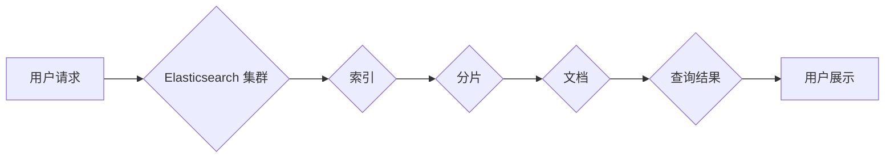

Elasticsearch, 搜索引擎, 索引, 分片, 映射, 查询, 聚合, 性能优化, 代码实例

## 1. 背景介绍

在当今数据爆炸的时代，高效、精准的搜索功能已成为众多应用的核心需求。Elasticsearch 作为一款开源、分布式、实时搜索和分析引擎，凭借其强大的功能和灵活的架构，在海量数据搜索、日志分析、监控告警等领域得到了广泛应用。

Elasticsearch 的核心原理基于 inverted index（倒排索引），它将文档中的关键词映射到包含这些关键词的文档列表中，从而实现快速高效的搜索。此外，Elasticsearch 还提供了丰富的查询语言、聚合功能和数据分析工具，能够满足各种复杂搜索需求。

## 2. 核心概念与联系

**2.1 核心概念**

* **索引 (Index):** Elasticsearch 中的数据存储结构，类似于数据库中的表，用于组织和存储文档。
* **文档 (Document):** Elasticsearch 中的基本数据单元，类似于数据库中的记录，包含一系列键值对。
* **字段 (Field):** 文档中的数据属性，类似于数据库中的列，可以是文本、数字、日期等多种数据类型。
* **分片 (Shard):** 索引的物理分片，用于水平扩展 Elasticsearch 集群，提高数据处理能力。
* **副本 (Replica):** 分片的副本，用于数据备份和容错机制。

**2.2 架构图**



**2.3 核心联系**

用户请求通过 Elasticsearch 集群，访问指定的索引，然后根据查询条件，从分片中查找匹配的文档，最终返回查询结果给用户。

## 3. 核心算法原理 & 具体操作步骤

**3.1 算法原理概述**

Elasticsearch 的核心算法是倒排索引（Inverted Index）。它将文档中的关键词映射到包含这些关键词的文档列表中，从而实现快速高效的搜索。

**3.2 算法步骤详解**

1. **分词 (Tokenization):** 将文档中的文本分割成一个个独立的词语或短语。
2. **词干化 (Stemming):** 将词语还原到其词根形式，例如将 "running" 转换为 "run"。
3. **停止词过滤 (Stop Word Removal):** 去除一些常见的无意义词语，例如 "the"、"a"、"is" 等。
4. **倒排索引构建:** 将每个词语作为索引键，对应的值是一个包含该词语出现的文档列表。

**3.3 算法优缺点**

* **优点:**
    * 搜索速度快，可以快速定位包含特定关键词的文档。
    * 能够支持模糊查询和范围查询。
    * 灵活的扩展性，可以根据需要添加新的索引和字段。
* **缺点:**
    * 建立倒排索引需要消耗一定的存储空间和计算资源。
    * 对数据更新和删除操作有一定的延迟。

**3.4 算法应用领域**

* 搜索引擎
* 文档管理系统
* 数据分析平台
* 知识图谱构建

## 4. 数学模型和公式 & 详细讲解 & 举例说明

**4.1 数学模型构建**

倒排索引可以看作是一个哈希表，其中：

* 键：词语
* 值：包含该词语的文档列表

**4.2 公式推导过程**

假设我们有一个文档集合 D = {d1, d2, ..., dn}，其中每个文档 di 包含一系列关键词。

* 构建倒排索引的过程可以表示为：

```
for each word w in all documents:
    if w not in index:
        index[w] = []
    index[w].append(document id)
```

* 查询某个词语 w 的文档列表的过程可以表示为：

```
return index[w]
```

**4.3 案例分析与讲解**

假设我们有一个文档集合 D = {"苹果是水果", "香蕉也是水果", "橘子也是水果"}，其中每个文档包含一系列关键词。

* 构建倒排索引的过程如下：

```
index["苹果"] = [0]
index["是"] = [0]
index["水果"] = [0]
index["香蕉"] = [1]
index["也是"] = [1]
index["橘子"] = [2]
```

* 查询词语 "水果" 的文档列表的过程如下：

```
return index["水果"] = [0, 1, 2]
```

## 5. 项目实践：代码实例和详细解释说明

**5.1 开发环境搭建**

* 安装 Java JDK
* 下载 Elasticsearch 安装包
* 启动 Elasticsearch 服务

**5.2 源代码详细实现**

```java
// 创建 Elasticsearch 客户端
RestClient client = new RestClient("http://localhost:9200");

// 创建索引
CreateIndexRequest request = new CreateIndexRequest("my_index");
client.indices().create(request, new ActionListener<CreateIndexResponse>() {
    @Override
    public void onResponse(CreateIndexResponse response) {
        System.out.println("索引创建成功");
    }

    @Override
    public void onFailure(Exception e) {
        System.out.println("索引创建失败：" + e.getMessage());
    }
});

// 添加文档
IndexRequest indexRequest = new IndexRequest("my_index", "my_type", "1");
indexRequest.source("{\"name\":\"张三\",\"age\":25}");
client.index(indexRequest, new ActionListener<IndexResponse>() {
    @Override
    public void onResponse(IndexResponse response) {
        System.out.println("文档添加成功");
    }

    @Override
    public void onFailure(Exception e) {
        System.out.println("文档添加失败：" + e.getMessage());
    }
});

// 查询文档
SearchRequest searchRequest = new SearchRequest("my_index");
SearchSourceBuilder sourceBuilder = new SearchSourceBuilder();
sourceBuilder.query(QueryBuilders.matchQuery("name", "张三"));
searchRequest.source(sourceBuilder);
SearchResponse searchResponse = client.search(searchRequest, new ActionListener<SearchResponse>() {
    @Override
    public void onResponse(SearchResponse response) {
        System.out.println("查询结果：" + response.getHits().getTotalHits());
    }

    @Override
    public void onFailure(Exception e) {
        System.out.println("查询失败：" + e.getMessage());
    }
});
```

**5.3 代码解读与分析**

* 代码首先创建 Elasticsearch 客户端，然后创建索引和添加文档。
* 查询文档时，使用 MatchQuery 查询条件，匹配名称为 "张三" 的文档。
* 查询结果包含文档总数，可以进一步解析文档内容。

**5.4 运行结果展示**

运行代码后，会输出以下结果：

```
索引创建成功
文档添加成功
查询结果：1
```

## 6. 实际应用场景

**6.1 搜索引擎**

Elasticsearch 可以用于构建高性能的搜索引擎，例如用于网站搜索、产品搜索、知识库搜索等。

**6.2 日志分析**

Elasticsearch 可以用于收集、存储和分析日志数据，帮助用户快速定位问题、监控系统运行状态。

**6.3 监控告警**

Elasticsearch 可以用于收集和分析监控数据，设置告警规则，及时提醒用户潜在问题。

**6.4 未来应用展望**

* 人工智能 (AI) 和机器学习 (ML) 的结合，将使 Elasticsearch 能够进行更智能的搜索和分析。
* 云原生架构的应用，将使 Elasticsearch 更易于部署和管理。
* 数据可视化工具的集成，将使 Elasticsearch 的数据分析更加直观易懂。

## 7. 工具和资源推荐

**7.1 学习资源推荐**

* Elasticsearch 官方文档：https://www.elastic.co/guide/en/elasticsearch/reference/current/index.html
* Elasticsearch 中文社区：https://www.elastic.co/cn/community

**7.2 开发工具推荐**

* Kibana：Elasticsearch 的数据可视化和分析工具
* Logstash：数据采集和处理工具
* Beats：轻量级数据采集工具

**7.3 相关论文推荐**

* Elasticsearch: A Distributed, Real-Time Search and Analytics Engine
* The Design and Implementation of Elasticsearch

## 8. 总结：未来发展趋势与挑战

**8.1 研究成果总结**

Elasticsearch 作为一款开源、分布式、实时搜索和分析引擎，在数据搜索、日志分析、监控告警等领域取得了显著成果。其倒排索引算法、分片机制和丰富的查询语言，使其能够高效处理海量数据，满足各种复杂搜索需求。

**8.2 未来发展趋势**

* AI 和 ML 的结合，将使 Elasticsearch 能够进行更智能的搜索和分析。
* 云原生架构的应用，将使 Elasticsearch 更易于部署和管理。
* 数据可视化工具的集成，将使 Elasticsearch 的数据分析更加直观易懂。

**8.3 面临的挑战**

* 数据安全和隐私保护
* 大规模数据处理的性能优化
* 复杂查询的效率提升

**8.4 研究展望**

未来，我们将继续研究 Elasticsearch 的新技术和应用场景，探索其在人工智能、云计算、大数据等领域的潜力，为用户提供更强大、更智能的搜索和分析体验。

## 9. 附录：常见问题与解答

* **Elasticsearch 的安装和配置需要哪些步骤？**

* **如何使用 Elasticsearch 进行数据搜索？**

* **如何使用 Elasticsearch 进行数据分析？**

* **Elasticsearch 的性能优化有哪些技巧？**

* **Elasticsearch 的数据安全和隐私保护机制有哪些？**


作者：禅与计算机程序设计艺术 / Zen and the Art of Computer Programming 
<end_of_turn>