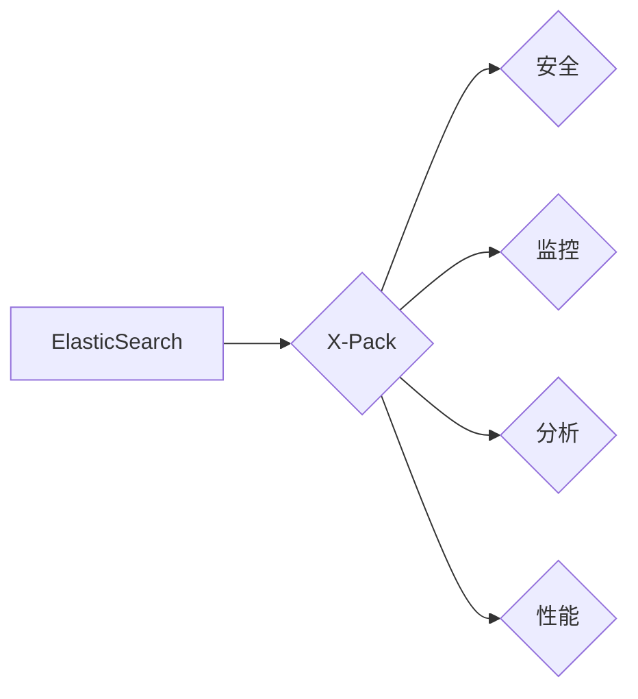

ElasticSearch, X-Pack, 安全, 监控, 分析, 性能, 代码实例

## 1. 背景介绍

ElasticSearch 作为一款开源的分布式搜索和分析引擎，凭借其强大的搜索能力、灵活的数据存储和分析功能，在海量数据处理领域得到了广泛应用。然而，随着数据规模的不断增长和安全需求的日益提高，对 ElasticSearch 的安全性和监控能力提出了更高的要求。

为了满足这些需求，ElasticSearch 官方推出了 X-Pack 插件，它为 ElasticSearch 提供了一套完整的安全、监控、分析和性能管理工具。X-Pack 帮助用户更好地保护数据安全，实时监控集群状态，深入分析数据行为，并优化集群性能。

## 2. 核心概念与联系

X-Pack 核心功能包括：

* **安全**:  X-Pack 提供了身份验证、授权、加密和数据保护等功能，确保数据安全和访问控制。
* **监控**:  X-Pack 提供了集群状态监控、性能指标跟踪和日志分析等功能，帮助用户实时了解集群运行状况。
* **分析**:  X-Pack 提供了数据分析、可视化和报表生成等功能，帮助用户深入挖掘数据价值。
* **性能**:  X-Pack 提供了集群性能优化、数据压缩和索引管理等功能，帮助用户提升集群性能。

**X-Pack 架构图**



## 3. 核心算法原理 & 具体操作步骤

### 3.1  算法原理概述

X-Pack 的核心算法原理主要围绕以下几个方面：

* **身份验证**:  X-Pack 支持多种身份验证方式，例如用户名密码、OAuth2 和 Kerberos，确保用户身份的合法性。
* **授权**:  X-Pack 基于角色和权限机制，对用户进行细粒度授权，控制用户对数据和功能的访问权限。
* **加密**:  X-Pack 支持数据加密，保护数据在传输和存储过程中的安全。
* **监控**:  X-Pack 使用指标收集和分析算法，实时监控集群状态，并生成告警信息。
* **分析**:  X-Pack 使用数据挖掘和机器学习算法，分析数据行为，发现异常和趋势。

### 3.2  算法步骤详解

**身份验证流程**:

1. 用户发起请求，包含身份验证信息。
2. X-Pack 验证用户身份信息，例如用户名密码或 OAuth2 授权码。
3. 如果验证成功，X-Pack 生成一个身份验证令牌，并返回给用户。
4. 用户在后续请求中携带身份验证令牌，进行身份验证。

**授权流程**:

1. 用户发起请求，包含操作类型和资源信息。
2. X-Pack 根据用户的角色和权限，判断用户是否具有执行该操作的权限。
3. 如果用户具有权限，X-Pack 允许用户执行操作；否则，X-Pack 返回拒绝访问错误。

### 3.3  算法优缺点

**优点**:

* 安全性高：X-Pack 提供了多种安全机制，有效保护数据安全。
* 监控能力强：X-Pack 提供了丰富的监控指标和告警机制，帮助用户实时了解集群状态。
* 分析能力强：X-Pack 提供了数据分析和可视化工具，帮助用户深入挖掘数据价值。
* 性能优化：X-Pack 提供了集群性能优化工具，帮助用户提升集群性能。

**缺点**:

* 成本较高：X-Pack 是商业版插件，需要付费使用。
* 学习曲线陡峭：X-Pack 的功能复杂，需要一定的学习成本。

### 3.4  算法应用领域

X-Pack 的应用领域非常广泛，例如：

* **金融**:  金融机构可以使用 X-Pack 来保护敏感财务数据，监控交易系统运行状态，分析客户行为。
* **医疗**:  医疗机构可以使用 X-Pack 来保护患者隐私数据，监控医疗设备运行状态，分析疾病趋势。
* **电商**:  电商平台可以使用 X-Pack 来保护用户数据，监控网站访问流量，分析用户购买行为。

## 4. 数学模型和公式 & 详细讲解 & 举例说明

### 4.1  数学模型构建

X-Pack 的安全机制基于密码学原理，例如哈希函数、加密算法和数字签名。

**哈希函数**:  哈希函数将任意长度的数据映射到固定长度的哈希值，具有不可逆性，常用于数据验证和身份验证。

**加密算法**:  加密算法将明文数据转换为密文数据，只有拥有密钥才能解密密文。常见的加密算法包括 AES、RSA 和 DES。

**数字签名**:  数字签名是一种数字认证机制，使用私钥对数据进行签名，公钥可以验证签名是否有效，确保数据来源和完整性。

### 4.2  公式推导过程

**哈希函数**:  假设哈希函数为 H(x)，输入为数据 x，输出为哈希值 h。

**加密算法**:  假设加密算法为 E(k, x)，输入为密钥 k 和明文数据 x，输出为密文数据 c。

**解密算法**:  假设解密算法为 D(k, c)，输入为密钥 k 和密文数据 c，输出为明文数据 x。

**数字签名**:  假设私钥为 sk，公钥为 pk，消息为 m，签名为 s。

### 4.3  案例分析与讲解

**身份验证**:  用户使用用户名密码进行身份验证，X-Pack 会将密码进行哈希处理，与数据库中存储的哈希值进行比较，如果匹配则验证成功。

**数据加密**:  X-Pack 可以对数据进行加密存储，例如使用 AES 算法对数据进行加密，并使用密钥进行保护。

**数字签名**:  X-Pack 可以使用数字签名机制来验证数据来源和完整性，例如在发送数据时，使用私钥对数据进行签名，接收方使用公钥验证签名是否有效。

## 5. 项目实践：代码实例和详细解释说明

### 5.1  开发环境搭建

* 安装 Java JDK
* 安装 ElasticSearch
* 安装 X-Pack 插件

### 5.2  源代码详细实现

```java
// X-Pack 安全配置示例
public class SecurityConfig {

    public static void main(String[] args) {
        // 设置用户和密码
        String username = "admin";
        String password = "password";

        // 设置加密算法
        String encryptionAlgorithm = "AES";

        // 设置数据存储路径
        String dataPath = "/path/to/data";

        // 设置安全配置
        SecurityManager securityManager = new SecurityManager();
        securityManager.setUsername(username);
        securityManager.setPassword(password);
        securityManager.setEncryptionAlgorithm(encryptionAlgorithm);
        securityManager.setDataPath(dataPath);

        // 启动 X-Pack 安全服务
        securityManager.start();
    }
}
```

### 5.3  代码解读与分析

* 代码首先设置用户、密码、加密算法和数据存储路径。
* 然后创建 SecurityManager 对象，并设置相应的配置参数。
* 最后调用 SecurityManager 的 start() 方法启动 X-Pack 安全服务。

### 5.4  运行结果展示

启动 X-Pack 安全服务后，用户可以使用用户名密码进行身份验证，并访问受保护的数据。

## 6. 实际应用场景

### 6.1  金融行业

* **欺诈检测**:  X-Pack 可以分析交易数据，识别异常交易行为，帮助金融机构预防欺诈。
* **风险管理**:  X-Pack 可以分析客户数据，评估客户风险等级，帮助金融机构进行风险管理。
* **合规性**:  X-Pack 可以帮助金融机构满足监管要求，例如记录交易日志，进行审计追踪。

### 6.2  医疗行业

* **患者隐私保护**:  X-Pack 可以加密患者数据，保护患者隐私信息。
* **医疗设备监控**:  X-Pack 可以监控医疗设备运行状态，及时发现故障，确保患者安全。
* **疾病分析**:  X-Pack 可以分析患者病历数据，发现疾病趋势，帮助医生进行诊断和治疗。

### 6.3  电商行业

* **用户行为分析**:  X-Pack 可以分析用户购买行为，了解用户喜好，提供个性化推荐。
* **网站安全**:  X-Pack 可以检测网站攻击，保护网站安全。
* **库存管理**:  X-Pack 可以监控库存数据，及时提醒补货，避免缺货。

### 6.4  未来应用展望

随着人工智能、大数据和云计算技术的不断发展，X-Pack 的应用场景将更加广泛，例如：

* **智能客服**:  X-Pack 可以帮助企业构建智能客服系统，自动回答用户问题，提高客户服务效率。
* **精准营销**:  X-Pack 可以分析用户数据，进行精准营销，提高营销效果。
* **工业互联网**:  X-Pack 可以帮助企业监控工业设备运行状态，进行预测性维护，提高生产效率。

## 7. 工具和资源推荐

### 7.1  学习资源推荐

* ElasticSearch 官方文档：https://www.elastic.co/guide/en/elasticsearch/reference/current/index.html
* X-Pack 官方文档：https://www.elastic.co/guide/en/elasticsearch/reference/current/x-pack.html
* ElasticSearch 中文社区：https://www.elastic.co/cn

### 7.2  开发工具推荐

* ElasticSearch Studio：https://www.elastic.co/guide/en/elasticsearch/reference/current/studio.html
* Kibana：https://www.elastic.co/guide/en/kibana/current/index.html

### 7.3  相关论文推荐

* Elasticsearch: A Scalable, Distributed Search Engine
* X-Pack: Security, Monitoring, and Analytics for Elasticsearch

## 8. 总结：未来发展趋势与挑战

### 8.1  研究成果总结

X-Pack 为 ElasticSearch 提供了强大的安全、监控、分析和性能管理功能，有效提升了 ElasticSearch 的应用价值。

### 8.2  未来发展趋势

* **人工智能集成**:  X-Pack 将与人工智能技术深度融合，例如使用机器学习算法进行异常检测和数据分析。
* **云原生化**:  X-Pack 将更加支持云原生架构，例如与 Kubernetes 集成，实现弹性伸缩和自动化部署。
* **边缘计算**:  X-Pack 将扩展到边缘计算场景，帮助用户在边缘设备上进行数据分析和决策。

### 8.3  面临的挑战

* **安全威胁**:  随着数据规模和复杂度的不断增长，X-Pack 需要不断提升安全防护能力，应对新的安全威胁。
* **性能优化**:  X-Pack 需要不断优化性能，以满足海量数据处理的需求。
* **用户体验**:  X-Pack 需要不断提升用户体验，使其更加易用和友好。

### 8.4  研究展望

未来，X-Pack 将继续朝着更安全、更智能、更易用、更强大的方向发展，为用户提供更全面的数据管理和分析解决方案。

## 9. 附录：常见问题与解答

**常见问题**:

* 如何配置 X-Pack 安全？
* 如何监控 ElasticSearch 集群状态？
* 如何使用 X-Pack 进行数据分析？

**解答**:

* X-Pack 安全配置可以通过配置文件或 API 进行设置。
* ElasticSearch 集群状态可以通过 Kibana 或 X-Pack 的监控功能进行监控。
* X-Pack 提供了丰富的分析工具，例如数据可视化、报表生成和机器学习算法。


作者：禅与计算机程序设计艺术 / Zen and the Art of Computer Programming 
<end_of_turn>