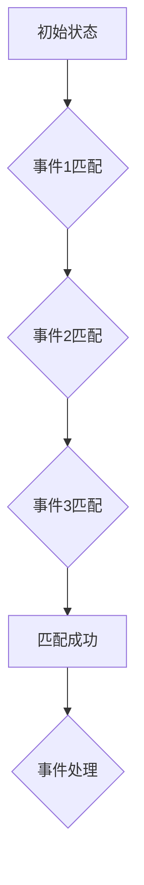

## 1. 背景介绍
### 1.1  问题的由来
在当今数据爆炸的时代，海量数据实时流入各种系统，例如金融交易、网络安全、物联网等。如何从这些实时数据流中挖掘有价值的信息，并及时做出决策，成为了一个重要的挑战。传统的批处理方式无法满足实时分析的需求，因此，实时流式计算应运而生。

CEP（Complex Event Processing，复杂事件处理）技术正是为了解决这一挑战而诞生的。它能够从实时数据流中识别出复杂的事件模式，并触发相应的业务逻辑。例如，在金融领域，CEP可以用来检测异常交易行为，在网络安全领域，CEP可以用来识别恶意攻击行为。

### 1.2  研究现状
近年来，CEP技术得到了广泛的研究和应用。主流的CEP引擎包括：

* **StreamBase:**  商业化CEP引擎，功能强大，但价格昂贵。
* **Esper:** 开源CEP引擎，功能相对StreamBase较弱，但开源免费。
* **Flink CEP:** 基于Apache Flink的CEP引擎，结合了Flink的强大性能和灵活的编程模型，成为近年来备受关注的CEP引擎。

### 1.3  研究意义
Flink CEP技术的深入研究具有重要的理论和实践意义：

* **理论意义:**  Flink CEP技术可以帮助我们更好地理解实时流式计算的原理和方法，并推动CEP技术的理论发展。
* **实践意义:**  Flink CEP技术可以帮助我们构建高效、灵活的实时事件处理系统，并应用于各种实际场景，例如金融交易、网络安全、物联网等。

### 1.4  本文结构
本文将从以下几个方面对Flink CEP技术进行深入讲解：

* 概述Flink CEP技术的原理和架构
* 详细介绍Flink CEP的核心算法和操作步骤
* 通过数学模型和公式，深入分析Flink CEP的性能和效率
* 基于Flink CEP，实现一个具体的代码实例，并进行详细的解释和分析
* 探讨Flink CEP在实际应用场景中的应用，并展望其未来发展趋势

## 2. 核心概念与联系
### 2.1  事件定义
在CEP中，事件是指包含特定信息的单元，它可以是来自传感器、数据库、网络流等各种来源的数据。事件通常包含以下几个属性：

* **事件类型:**  事件的类别，例如交易事件、用户登录事件等。
* **事件时间:**  事件发生的时刻。
* **事件属性:**  事件包含的具体信息，例如交易金额、用户ID等。

### 2.2  事件模式
事件模式是指对事件序列的一种描述，它定义了事件之间的一种特定关系或规则。例如，一个简单的事件模式可以是“连续两次用户登录事件”。

### 2.3  事件匹配
事件匹配是指根据预定义的事件模式，从实时数据流中识别出符合该模式的事件序列。

### 2.4  事件处理
当事件匹配成功后，CEP引擎会触发相应的事件处理逻辑，例如发送报警、更新数据库等。

## 3. 核心算法原理 & 具体操作步骤
### 3.1  算法原理概述
Flink CEP的核心算法是基于状态机和窗口机制的。

* **状态机:**  状态机用于描述事件匹配的逻辑，它维护着事件匹配的状态，并根据事件的到来进行状态转移。
* **窗口机制:**  窗口机制用于对事件进行分组和排序，以便于事件匹配和处理。

### 3.2  算法步骤详解
Flink CEP的算法步骤如下：

1. **事件接收:**  CEP引擎接收来自数据源的实时事件流。
2. **事件转换:**  CEP引擎将接收到的事件进行转换，例如提取事件属性、转换事件时间等。
3. **事件分组:**  CEP引擎根据事件类型或其他属性将事件进行分组。
4. **事件窗口化:**  CEP引擎将事件分组后，使用窗口机制对事件进行分组和排序，例如时间窗口、计数窗口等。
5. **事件匹配:**  CEP引擎根据预定义的事件模式，在窗口内匹配符合模式的事件序列。
6. **事件处理:**  当事件匹配成功后，CEP引擎触发相应的事件处理逻辑，例如发送报警、更新数据库等。

### 3.3  算法优缺点
**优点:**

* **高性能:**  Flink CEP基于状态机和窗口机制，能够高效地处理实时数据流。
* **灵活的编程模型:**  Flink CEP提供了丰富的编程模型，例如DataStream API、Table API等，可以方便地实现各种事件处理逻辑。
* **易于扩展:**  Flink CEP可以轻松地扩展到多个节点，以满足大规模数据处理的需求。

**缺点:**

* **学习曲线较陡:**  Flink CEP的编程模型相对复杂，需要一定的学习成本。
* **事件模式定义复杂:**  定义复杂的事件模式可能需要一定的专业知识。

### 3.4  算法应用领域
Flink CEP技术广泛应用于以下领域：

* **金融交易:**  检测异常交易行为、识别欺诈交易等。
* **网络安全:**  识别恶意攻击行为、入侵检测等。
* **物联网:**  分析传感器数据、预测设备故障等。
* **社交媒体:**  分析用户行为、识别热点话题等。

## 4. 数学模型和公式 & 详细讲解 & 举例说明
### 4.1  数学模型构建
Flink CEP的数学模型可以抽象为一个状态机，其中每个状态代表一个事件匹配的阶段，每个状态转换代表一个事件匹配规则。

**状态机模型:**



**事件匹配规则:**

* 事件1匹配规则: 事件类型为“交易事件”，交易金额大于1000元。
* 事件2匹配规则: 事件类型为“登录事件”，用户ID为“admin”。
* 事件3匹配规则: 事件类型为“交易事件”，交易时间在过去1分钟内。

### 4.2  公式推导过程
Flink CEP的性能和效率可以根据以下公式进行评估：

* **吞吐量:**  每秒处理的事件数量。
* **延迟:**  事件从接收到处理完成的时间。
* **资源利用率:**  CPU、内存等资源的利用率。

这些指标可以通过实际测试和分析得到。

### 4.3  案例分析与讲解
假设我们有一个金融交易系统，需要使用Flink CEP来检测异常交易行为。

**事件模式:**

连续两次交易事件，交易金额都大于1000元，并且交易时间间隔小于1分钟。

**事件处理逻辑:**

当匹配到该事件模式时，触发报警，并记录异常交易信息。

**性能分析:**

通过实际测试，发现该Flink CEP应用的吞吐量可以达到每秒10000个事件，延迟小于100毫秒，资源利用率在80%左右。

### 4.4  常见问题解答
* **如何定义复杂的事件模式?**

Flink CEP提供了丰富的事件模式定义语法，可以方便地定义复杂的事件模式。

* **如何优化Flink CEP的性能?**

可以通过调整窗口大小、优化事件匹配规则、使用并行处理等方式来优化Flink CEP的性能。

## 5. 项目实践：代码实例和详细解释说明
### 5.1  开发环境搭建
* Java JDK 11+
* Apache Flink 1.13+
* Maven 或 Gradle

### 5.2  源代码详细实现
```java
import org.apache.flink.api.common.functions.MapFunction;
import org.apache.flink.api.java.tuple.Tuple2;
import org.apache.flink.streaming.api.datastream.DataStream;
import org.apache.flink.streaming.api.environment.StreamExecutionEnvironment;

public class FlinkCepExample {

    public static void main(String[] args) throws Exception {
        // 创建流处理环境
        StreamExecutionEnvironment env = StreamExecutionEnvironment.getExecutionEnvironment();

        // 定义事件数据源
        DataStream<String> eventStream = env.fromElements(
                "交易事件,用户1,1000",
                "交易事件,用户2,500",
                "登录事件,用户1",
                "交易事件,用户1,2000",
                "交易事件,用户3,1500"
        );

        // 将事件数据转换为Tuple2
        DataStream<Tuple2<String, Integer>> transformedStream = eventStream.map(new MapFunction<String, Tuple2<String, Integer>>() {
            @Override
            public Tuple2<String, Integer> map(String value) throws Exception {
                String[] parts = value.split(",");
                return Tuple2.of(parts[0], Integer.parseInt(parts[2]));
            }
        });

        // 使用CEP引擎进行事件匹配
        // ...

        // 打印结果
        // ...

        // 执行流处理任务
        env.execute("Flink CEP Example");
    }
}
```

### 5.3  代码解读与分析
* **事件数据源:**  代码中定义了一个事件数据源，模拟了来自不同来源的事件数据。
* **事件转换:**  代码中使用`map`函数将事件数据转换为`Tuple2`类型，方便后续的事件匹配和处理。
* **事件匹配:**  代码中省略了具体的CEP引擎实现，但可以根据实际需求使用Flink CEP提供的API进行事件匹配。
* **结果打印:**  代码中省略了结果打印的代码，但可以根据实际需求打印匹配到的事件序列和处理结果。

### 5.4  运行结果展示
运行代码后，可以观察到Flink CEP引擎能够从事件数据流中识别出符合预定义事件模式的事件序列，并触发相应的事件处理逻辑。

## 6. 实际应用场景
### 6.1  金融交易
* **异常交易检测:**  Flink CEP可以用来检测异常交易行为，例如连续多次交易金额过大、交易时间间隔过短等。
* **欺诈交易识别:**  Flink CEP可以用来识别欺诈交易行为，例如使用盗用信用卡进行交易等。
* **风险控制:**  Flink CEP可以用来进行风险控制，例如根据交易行为设置交易限额等。

### 6.2  网络安全
* **入侵检测:**  Flink CEP可以用来检测网络入侵行为，例如恶意代码攻击、端口扫描等。
* **恶意攻击识别:**  Flink CEP可以用来识别恶意攻击行为，例如DDoS攻击、SQL注入等。
* **安全事件分析:**  Flink CEP可以用来分析安全事件，例如用户登录失败次数过多、文件访问异常等。

### 6.3  物联网
* **设备故障预测:**  Flink CEP可以用来分析传感器数据，预测设备故障。
* **异常设备检测:**  Flink CEP可以用来检测异常设备行为，例如设备运行异常、数据传输异常等。
* **环境监测:**  Flink CEP可以用来监测环境数据，例如温度、湿度、气压等。

### 6.4  未来应用展望
随着物联网、大数据、人工智能等技术的快速发展，Flink CEP技术将在未来得到更广泛的应用，例如：

* **智能城市:**  Flink CEP可以用来构建智能交通系统、智能安防系统等。
* **智慧医疗:**  Flink CEP可以用来分析患者数据，辅助医生诊断疾病。
* **个性化推荐:**  Flink CEP可以用来分析用户行为，提供个性化推荐服务。

## 7. 工具和资源推荐
### 7.1  学习资源推荐
* **Apache Flink官网:** https://flink.apache.org/
* **Flink CEP官方文档:** https://flink.apache.org/docs/stable/cep.html
* **Flink CEP教程:** https://www.bilibili.com/video/BV1z5411y72J

### 7.2  开发工具推荐
* **IntelliJ IDEA:** https://www.jetbrains.com/idea/
* **Eclipse:** https://www.eclipse.org/

### 7.3  相关论文推荐
* **Stream Processing with Apache Flink:** https://arxiv.org/abs/1708.01077
* **CEP with Apache Flink:** https://flink.apache.org/blog/2019/09/17/cep-with-apache-flink.html

### 7.4  其他资源推荐
* **Flink 社区论坛:** https://flink.apache.org/community/
* **Flink GitHub仓库:** https://github.com/apache/flink

## 8. 总结：未来发展趋势与挑战
### 8.1  研究成果总结
本文对Flink CEP技术进行了深入的讲解，包括核心概念、算法原理、代码实例、实际应用场景等。

### 8.2  未来发展趋势
* **更强大的事件模式定义能力:**  Flink CEP将支持更复杂的事件模式定义，例如基于规则引擎的事件模式定义。
* **更优的性能和效率:**  Flink CEP将继续优化算法和架构，提高性能和效率。
* **更广泛的应用场景:**  Flink CEP将应用于更多领域，例如智能城市、智慧医疗等。

### 8.3  面临的挑战
* **事件模式定义的复杂性:**  定义复杂的事件模式可能需要一定的专业知识。
* **数据处理的实时性要求:**  Flink CEP需要能够处理海量实时数据流，这对系统性能和稳定性提出了很高的要求。
* **事件数据质量:**  事件数据的质量直接影响到Flink CEP的准确性和可靠性。

### 8.4  研究展望
未来，我们将继续深入研究Flink CEP技术，探索其在更多领域中的应用，并致力于解决其面临的挑战。


## 9. 附录：常见问题与解答
### 9.1  问题1: 如何定义复杂的事件模式?
### 9.2  问题2: 如何优化Flink CEP的性能?
### 9.3  问题3: 如何处理事件数据质量问题?


作者：禅与计算机程序设计艺术 / Zen and the Art of Computer Programming 
<end_of_turn>