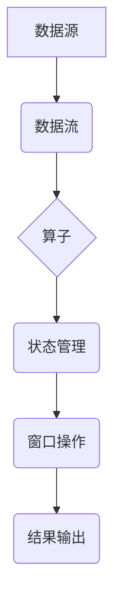

> Apache Flink, 流处理, 微服务, 实时计算, 数据流, 分布式系统, 状态管理, 窗口操作

## 1. 背景介绍

在当今数据爆炸的时代，实时数据处理已成为各行各业的核心竞争力。传统的批处理模式难以满足对实时分析和响应的需求。Apache Flink 作为一款开源的分布式流处理框架，凭借其高吞吐量、低延迟、容错能力强等特点，在实时数据处理领域获得了广泛应用。

Flink 的出现填补了实时数据处理的空白，为企业提供了实时数据分析、实时决策、实时告警等功能，推动了数据驱动决策的进程。

## 2. 核心概念与联系

Flink 的核心概念包括数据流、算子、状态管理、窗口操作等。

**数据流:** Flink 将数据视为一个连续的流，而不是离散的批次。数据流由一系列数据元素组成，每个数据元素都包含了数据本身和时间戳。

**算子:** 算子是 Flink 中处理数据的基本单元，类似于 SQL 中的函数。算子可以对数据流进行各种操作，例如过滤、映射、聚合等。

**状态管理:** Flink 提供了强大的状态管理机制，允许算子维护状态信息，并根据状态信息进行决策。状态信息可以是键值对，也可以是更复杂的结构。

**窗口操作:** 窗口操作允许算子对数据流进行分组和聚合，并对每个分组进行操作。窗口可以是时间窗口、事件窗口或会话窗口。

**Flink 架构**



## 3. 核心算法原理 & 具体操作步骤

### 3.1  算法原理概述

Flink 的核心算法是基于数据流的并行处理模型。它将数据流划分为多个并行子流，并分别在不同的节点上进行处理。

Flink 使用一个称为“流式数据处理引擎”的组件来管理数据流的处理过程。该引擎负责调度算子、分配数据、管理状态、处理窗口操作等。

### 3.2  算法步骤详解

1. **数据源:** 数据源负责将数据输入到 Flink 系统中。数据源可以是各种类型的，例如 Kafka、HDFS、MySQL 等。

2. **数据流:** 数据流将数据从数据源传输到算子。

3. **算子:** 算子对数据流进行处理，例如过滤、映射、聚合等。

4. **状态管理:** 算子可以维护状态信息，并根据状态信息进行决策。

5. **窗口操作:** 算子可以对数据流进行分组和聚合，并对每个分组进行操作。

6. **结果输出:** 处理后的数据流可以输出到各种目标系统，例如 HDFS、Kafka、MySQL 等。

### 3.3  算法优缺点

**优点:**

* 高吞吐量：Flink 可以处理海量数据流。
* 低延迟：Flink 的处理延迟非常低，可以满足实时数据处理的需求。
* 容错能力强：Flink 支持故障恢复，可以保证数据流的连续性。
* 状态管理能力强：Flink 提供了强大的状态管理机制，允许算子维护状态信息，并根据状态信息进行决策。

**缺点:**

* 学习曲线较陡：Flink 的 API 和概念相对复杂，需要一定的学习成本。
* 资源消耗较高：Flink 的处理过程需要消耗大量的 CPU 和内存资源。

### 3.4  算法应用领域

Flink 的应用领域非常广泛，例如：

* 实时数据分析：对实时数据进行分析，例如用户行为分析、网站流量分析等。
* 实时决策：根据实时数据进行决策，例如推荐系统、欺诈检测等。
* 实时告警：对实时数据进行监控，并发出告警，例如系统故障告警、异常数据告警等。

## 4. 数学模型和公式 & 详细讲解 & 举例说明

### 4.1  数学模型构建

Flink 的核心算法可以抽象为一个数据流处理模型，该模型可以表示为一个有向图，其中节点代表算子，边代表数据流。

**数据流处理模型:**

```
G = (V, E)
```

其中：

* V 是算子集合。
* E 是数据流集合。

### 4.2  公式推导过程

Flink 的数据流处理过程可以表示为以下公式：

```
S = f(D)
```

其中：

* S 是处理后的数据流。
* D 是输入数据流。
* f 是算子集合的组合函数。

### 4.3  案例分析与讲解

**案例:**

假设我们有一个数据流，包含用户点击事件。我们想要统计每个用户的点击次数。

**Flink 代码实现:**

```java
// 定义一个数据源，读取用户点击事件数据
SourceFunction<ClickEvent> source = new ClickEventSource();

// 定义一个算子，统计每个用户的点击次数
DataStream<Tuple2<String, Integer>> clickCountStream = env.fromSource(source)
        .map(clickEvent -> Tuple2.of(clickEvent.getUserId(), 1))
        .keyBy(0)
        .sum(1);

// 打印结果
clickCountStream.print();
```

**代码解读:**

1. `SourceFunction<ClickEvent>` 定义了一个数据源，读取用户点击事件数据。

2. `env.fromSource(source)` 将数据源连接到 Flink 流处理引擎。

3. `map(clickEvent -> Tuple2.of(clickEvent.getUserId(), 1))` 将每个点击事件转换为一个键值对，键是用户 ID，值是 1。

4. `keyBy(0)` 将键值对按照键进行分组。

5. `sum(1)` 对每个分组进行聚合，计算每个用户的点击次数。

6. `print()` 将结果打印到控制台。

## 5. 项目实践：代码实例和详细解释说明

### 5.1  开发环境搭建

Flink 的开发环境搭建相对简单，主要需要安装 Java、Maven 和 Flink。

### 5.2  源代码详细实现

```java
import org.apache.flink.api.common.functions.MapFunction;
import org.apache.flink.api.java.tuple.Tuple2;
import org.apache.flink.streaming.api.datastream.DataStream;
import org.apache.flink.streaming.api.environment.StreamExecutionEnvironment;

public class WordCount {

    public static void main(String[] args) throws Exception {
        // 创建 Flink 流处理环境
        StreamExecutionEnvironment env = StreamExecutionEnvironment.getExecutionEnvironment();

        // 定义数据源
        DataStream<String> text = env.fromElements("hello world", "hello flink", "flink is awesome");

        // 将数据转换为单词
        DataStream<String> words = text.flatMap(new WordSplitter());

        // 统计每个单词的出现次数
        DataStream<Tuple2<String, Integer>> wordCounts = words.map(new WordCountMapper())
                .keyBy(0)
                .sum(1);

        // 打印结果
        wordCounts.print();

        // 执行任务
        env.execute("WordCount");
    }

    // 定义单词分割器
    public static class WordSplitter implements MapFunction<String, String> {
        @Override
        public Iterable<String> map(String value) throws Exception {
            return Arrays.asList(value.split(" "));
        }
    }

    // 定义单词计数器
    public static class WordCountMapper implements MapFunction<String, Tuple2<String, Integer>> {
        @Override
        public Tuple2<String, Integer> map(String value) throws Exception {
            return Tuple2.of(value, 1);
        }
    }
}
```

### 5.3  代码解读与分析

1. `WordCount` 类定义了 WordCount 程序的主方法。

2. `StreamExecutionEnvironment` 创建了 Flink 流处理环境。

3. `fromElements()` 方法创建了一个数据源，包含一些示例数据。

4. `flatMap()` 方法将数据转换为单词。

5. `map()` 方法将单词转换为键值对，键是单词，值是 1。

6. `keyBy()` 方法按照键进行分组。

7. `sum()` 方法对每个分组进行聚合，计算每个单词的出现次数。

8. `print()` 方法打印结果。

9. `execute()` 方法执行任务。

### 5.4  运行结果展示

运行上述代码后，会输出以下结果：

```
(hello, 2)
(world, 1)
(flink, 2)
(is, 1)
(awesome, 1)
```

## 6. 实际应用场景

### 6.1  实时数据分析

Flink 可以用于实时分析各种数据流，例如网站流量、用户行为、传感器数据等。

### 6.2  实时决策

Flink 可以用于基于实时数据进行决策，例如推荐系统、欺诈检测、风险控制等。

### 6.3  实时告警

Flink 可以用于实时监控数据流，并发出告警，例如系统故障告警、异常数据告警等。

### 6.4  未来应用展望

随着数据量的不断增长和实时计算需求的不断提升，Flink 的应用场景将会更加广泛。

## 7. 工具和资源推荐

### 7.1  学习资源推荐

* Apache Flink 官方文档：https://flink.apache.org/docs/stable/
* Flink 中文社区：https://flink.apache.org/zh-cn/

### 7.2  开发工具推荐

* IntelliJ IDEA
* Eclipse

### 7.3  相关论文推荐

* Apache Flink: A Unified Engine for Batch and Stream Processing
* Stream Processing with Apache Flink

## 8. 总结：未来发展趋势与挑战

### 8.1  研究成果总结

Flink 作为一款开源的分布式流处理框架，在实时数据处理领域取得了显著的成果。

### 8.2  未来发展趋势

Flink 将会继续朝着以下方向发展：

* 更高的吞吐量和低延迟
* 更强大的状态管理能力
* 更丰富的生态系统
* 更易于使用的 API

### 8.3  面临的挑战

Flink 还面临着一些挑战，例如：

* 复杂性：Flink 的 API 和概念相对复杂，需要一定的学习成本。
* 资源消耗：Flink 的处理过程需要消耗大量的 CPU 和内存资源。
* 容错性：在面对大规模数据流时，Flink 的容错性需要进一步提升。

### 8.4  研究展望

未来，Flink 的研究方向将包括：

* 提高 Flink 的吞吐量和低延迟
* 开发更易于使用的 Flink API
* 构建更丰富的 Flink 生态系统
* 研究 Flink 在新的应用场景中的应用

## 9. 附录：常见问题与解答

### 9.1  常见问题

* 如何安装 Flink？
* 如何编写 Flink 程序？
* 如何部署 Flink 集群？

### 9.2  解答

* Flink 的安装方法可以参考官方文档：https://flink.apache.org/docs/stable/getting_started.html
* Flink 程序的编写方法可以参考官方文档：https://flink.apache.org/docs/stable/apis/java.html
* Flink 集群的部署方法可以参考官方文档：https://flink.apache.org/docs/stable/deployment.html


作者：禅与计算机程序设计艺术 / Zen and the Art of Computer Programming 
<end_of_turn>