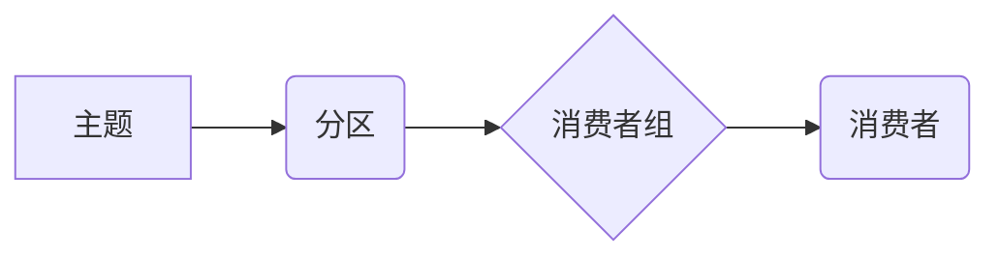

> Kafka, Group, 分区, 消费者, 订阅, 重均衡, 消费组, 负载均衡, 并发消费

## 1. 背景介绍

Apache Kafka 作为一款高性能、分布式、可扩展的消息队列系统，在现代软件架构中扮演着越来越重要的角色。它广泛应用于各种场景，例如日志收集、事件驱动架构、流式数据处理等。在 Kafka 中，消费者组（Consumer Group）是实现消息消费并行处理的关键机制。

消费者组允许多个消费者同时订阅同一个主题，并对主题中的消息进行并行消费。当消费者加入或离开消费者组时，Kafka 会自动重新分配消息分区，确保消息被均匀地分配给所有消费者，从而实现负载均衡和高可用性。

## 2. 核心概念与联系

### 2.1 核心概念

* **主题 (Topic):** Kafka 中的消息发布和订阅的载体，类似于消息队列。
* **分区 (Partition):** 主题被划分为多个分区，每个分区是一个有序的消息序列。
* **消费者 (Consumer):** 订阅主题并消费消息的应用程序。
* **消费者组 (Consumer Group):** 由多个消费者组成的集合，用于协调消费者之间的消息消费。

### 2.2 架构关系



## 3. 核心算法原理 & 具体操作步骤

### 3.1 算法原理概述

Kafka 的消费者组机制基于以下核心算法：

* **消息分配:** Kafka 会根据消费者组的成员数量和主题的分区数量，将消息分区分配给消费者。
* **重均衡:** 当消费者加入或离开消费者组时，Kafka 会重新分配消息分区，确保消息被均匀地分配给所有消费者。
* **消费偏移:** 每个消费者维护一个消费偏移，记录其消费到消息的最新位置。

### 3.2 算法步骤详解

1. **消费者加入消费者组:** 消费者向 Kafka 集群注册，并指定要订阅的主题和消费者组名称。
2. **分配消息分区:** Kafka 会根据消费者组的成员数量和主题的分区数量，将消息分区分配给消费者。
3. **消费消息:** 消费者从分配到的分区中消费消息，并更新其消费偏移。
4. **重均衡:** 当消费者加入或离开消费者组时，Kafka 会触发重均衡过程。
5. **重新分配分区:** Kafka 会重新分配消息分区，确保消息被均匀地分配给所有消费者。

### 3.3 算法优缺点

**优点:**

* **负载均衡:** 消费者组机制可以实现消息消费的负载均衡，提高系统吞吐量。
* **高可用性:** 当消费者出现故障时，Kafka 会自动重新分配消息分区，确保消息的可靠消费。
* **并行消费:** 消费者组可以支持多个消费者同时消费消息，提高消息处理效率。

**缺点:**

* **复杂性:** 消费者组机制相对复杂，需要理解其内部工作机制。
* **状态管理:** 消费者组需要维护消费偏移状态，需要考虑状态持久化和恢复问题。

### 3.4 算法应用领域

* **实时数据处理:** Kafka 的消费者组机制可以用于处理实时数据流，例如日志收集、监控数据分析等。
* **事件驱动架构:** Kafka 可以作为事件驱动架构的核心组件，消费者组可以订阅特定事件，并根据事件触发相应的业务逻辑。
* **消息队列:** Kafka 可以作为消息队列系统，消费者组可以用于处理消息队列中的消息。

## 4. 数学模型和公式 & 详细讲解 & 举例说明

### 4.1 数学模型构建

假设有 `n` 个消费者组成员，`m` 个主题分区，则消息分配的数学模型可以表示为：

```latex
p = \frac{m}{n}
```

其中：

* `p` 表示每个消费者组成员分配的消息分区数量。

### 4.2 公式推导过程

该公式的推导过程如下：

1. 将主题分区数量 `m` 除以消费者组成员数量 `n`，得到每个消费者组成员分配的消息分区数量 `p`。

### 4.3 案例分析与讲解

例如，如果一个主题有 10 个分区，并且有 5 个消费者组成员，则每个消费者组成员将分配 2 个分区 (`p = 10 / 5 = 2`)。

## 5. 项目实践：代码实例和详细解释说明

### 5.1 开发环境搭建

* Java Development Kit (JDK) 8 或更高版本
* Apache Kafka 集群
* IDE (例如 Eclipse, IntelliJ IDEA)

### 5.2 源代码详细实现

```java
import org.apache.kafka.clients.consumer.ConsumerConfig;
import org.apache.kafka.clients.consumer.ConsumerRecord;
import org.apache.kafka.clients.consumer.ConsumerRecords;
import org.apache.kafka.clients.consumer.KafkaConsumer;
import org.apache.kafka.common.serialization.StringDeserializer;

import java.time.Duration;
import java.util.Collections;
import java.util.Properties;

public class KafkaConsumerExample {

    public static void main(String[] args) {
        // Kafka 配置
        Properties props = new Properties();
        props.put(ConsumerConfig.BOOTSTRAP_SERVERS_CONFIG, "localhost:9092");
        props.put(ConsumerConfig.GROUP_ID_CONFIG, "my-group");
        props.put(ConsumerConfig.KEY_DESERIALIZER_CLASS_CONFIG, StringDeserializer.class.getName());
        props.put(ConsumerConfig.VALUE_DESERIALIZER_CLASS_CONFIG, StringDeserializer.class.getName());

        // 创建 Kafka 消费者
        KafkaConsumer<String, String> consumer = new KafkaConsumer<>(props);

        // 订阅主题
        consumer.subscribe(Collections.singletonList("my-topic"));

        // 消费消息
        while (true) {
            ConsumerRecords<String, String> records = consumer.poll(Duration.ofMillis(100));
            for (ConsumerRecord<String, String> record : records) {
                System.out.println("Received message: " + record.value());
            }
        }
    }
}
```

### 5.3 代码解读与分析

* **Kafka 配置:**  配置了 Kafka 集群地址、消费者组 ID、键和值反序列化器等参数。
* **创建 Kafka 消费者:** 使用配置信息创建 Kafka 消费者实例。
* **订阅主题:** 消费者订阅指定的主题。
* **消费消息:** 使用 `poll()` 方法从主题中拉取消息，并处理消息内容。

### 5.4 运行结果展示

当消费者运行时，它会从主题 `my-topic` 中拉取消息，并打印消息内容到控制台。

## 6. 实际应用场景

### 6.1 实时数据处理

Kafka 的消费者组机制可以用于处理实时数据流，例如日志收集、监控数据分析等。

### 6.2 事件驱动架构

Kafka 可以作为事件驱动架构的核心组件，消费者组可以订阅特定事件，并根据事件触发相应的业务逻辑。

### 6.3 消息队列

Kafka 可以作为消息队列系统，消费者组可以用于处理消息队列中的消息。

### 6.4 未来应用展望

随着微服务架构的兴起，Kafka 的消费者组机制将发挥越来越重要的作用。它可以用于实现微服务之间的消息通信、事件驱动和数据流处理等场景。

## 7. 工具和资源推荐

### 7.1 学习资源推荐

* Apache Kafka 官方文档: https://kafka.apache.org/documentation/
* Kafka 入门教程: https://www.tutorialspoint.com/kafka/index.htm

### 7.2 开发工具推荐

* Apache Kafka CLI: https://kafka.apache.org/documentation/#cli
* Kafka Manager: https://kafka-manager.github.io/

### 7.3 相关论文推荐

* Kafka: A Distributed Streaming Platform
* Building a Real-Time Data Pipeline with Apache Kafka

## 8. 总结：未来发展趋势与挑战

### 8.1 研究成果总结

Kafka 的消费者组机制是一个成熟且高效的消息消费机制，它为分布式系统提供了强大的消息处理能力。

### 8.2 未来发展趋势

* **更智能的重均衡算法:** 为了提高消息消费效率和可靠性，未来可能会出现更智能的重均衡算法，例如基于机器学习的算法。
* **更丰富的消费模式:** 未来可能会出现更多类型的消费模式，例如基于状态的消费、基于规则的消费等。
* **更强大的安全机制:** 为了保障消息安全，未来可能会出现更强大的安全机制，例如加密、身份验证等。

### 8.3 面临的挑战

* **复杂性:** 消费者组机制相对复杂，需要理解其内部工作机制。
* **状态管理:** 消费者组需要维护消费偏移状态，需要考虑状态持久化和恢复问题。
* **性能优化:** 在高吞吐量场景下，需要对消费者组机制进行性能优化。

### 8.4 研究展望

未来，消费者组机制将会继续发展，并与其他技术融合，例如云计算、容器化、人工智能等，为分布式系统提供更强大的消息处理能力。

## 9. 附录：常见问题与解答

### 9.1 消费者组如何实现负载均衡？

Kafka 的消费者组机制通过将消息分区分配给消费者，并实现自动重均衡，从而实现负载均衡。

### 9.2 如何处理消费者故障？

当消费者出现故障时，Kafka 会自动重新分配其分配的消息分区给其他消费者，确保消息的可靠消费。

### 9.3 如何管理消费偏移？

Kafka 会自动维护消费偏移，并将其持久化到磁盘，确保消费进度不会丢失。

### 9.4 如何监控消费者组的运行状态？

可以使用 Kafka 管理工具或监控平台监控消费者组的运行状态，例如消息消费速度、消费偏移、消费者数量等。


作者：禅与计算机程序设计艺术 / Zen and the Art of Computer Programming 
<end_of_turn>