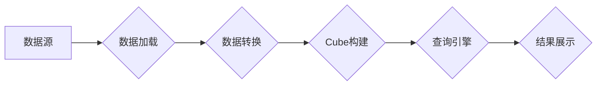

> Kylin, 数据仓库, OLAP, 多维分析, 性能优化, 分布式计算, 数据模型, 代码实例

## 1. 背景介绍

在当今数据爆炸的时代，企业积累了海量的业务数据，如何高效地分析这些数据，挖掘其中的价值，成为了企业竞争力的关键。数据仓库作为企业级数据分析的中心平台，承担着存储、整合和管理企业数据的重要职责。而Kylin，作为一款开源的分布式多维数据分析引擎，凭借其高性能、易用性和灵活性，在数据仓库领域获得了广泛的应用。

Kylin的核心思想是将数据预先聚合，构建多维数据模型，并通过高效的查询引擎，快速响应用户的多维分析需求。它支持多种数据源，包括关系型数据库、NoSQL数据库和云存储等，并能够与主流的数据仓库平台进行集成。

## 2. 核心概念与联系

Kylin的核心概念包括：

* **数据模型:** Kylin采用星型模型或雪花型模型来构建数据模型，将事实表和维度表进行关联，方便用户进行多维分析。
* **Cube:** Cube是Kylin的核心数据结构，它是一个多维数据块，包含了预先聚合的数据。
* **Segment:** Segment是Cube的细分单元，用于存储Cube中的数据，并支持动态更新。
* **Query Engine:** Kylin的查询引擎负责处理用户的多维分析查询，并返回结果。

**Kylin架构流程图:**



## 3. 核心算法原理 & 具体操作步骤

### 3.1  算法原理概述

Kylin的核心算法是基于**数据聚合**和**索引优化**的。它通过预先对数据进行聚合，构建多维数据模型，并使用高效的索引结构，快速定位查询所需的数据。

### 3.2  算法步骤详解

1. **数据加载:** 从数据源加载数据，并进行数据清洗和转换。
2. **数据聚合:** 根据数据模型，对数据进行聚合，构建Cube。
3. **索引构建:** 为Cube构建索引，提高查询效率。
4. **查询处理:** 用户提交查询，查询引擎根据索引定位数据，并返回结果。

### 3.3  算法优缺点

**优点:**

* 高性能：预先聚合数据，并使用高效的索引结构，可以显著提高查询效率。
* 易用性：Kylin提供友好的API和Web界面，方便用户进行数据模型构建和查询操作。
* 灵活性：支持多种数据源和数据模型，可以满足不同用户的需求。

**缺点:**

* 数据更新成本：数据更新需要重新构建Cube，可能会带来一定的成本。
* 存储空间占用：Cube的存储空间较大，需要考虑存储成本。

### 3.4  算法应用领域

Kylin广泛应用于以下领域：

* **商业智能:** 分析销售数据、客户行为、市场趋势等。
* **金融分析:** 分析股票价格、风险评估、投资策略等。
* **运营分析:** 分析用户行为、产品性能、营销效果等。
* **科学研究:** 分析实验数据、模型预测、数据可视化等。

## 4. 数学模型和公式 & 详细讲解 & 举例说明

### 4.1  数学模型构建

Kylin的数学模型主要基于**星型模型**和**雪花型模型**。

* **星型模型:** 将事实表与维度表进行关联，事实表存储业务数据，维度表存储描述业务数据的属性信息。

* **雪花型模型:** 是一种更复杂的模型，将维度表进行分解，形成多个子维度表，并通过关系进行关联。

### 4.2  公式推导过程

Kylin的查询引擎使用**多维数据聚合**算法来处理查询。

**公式:**

```latex
Aggregate(Dimension1, Dimension2, ..., Measure)
```

其中:

* **Aggregate:** 聚合函数，例如SUM、AVG、COUNT等。
* **Dimension1, Dimension2, ...:** 维度属性。
* **Measure:** 测量值。

### 4.3  案例分析与讲解

假设我们有一个星型模型的数据仓库，包含以下表：

* **事实表:** sales，存储销售数据，包含字段：sale_id, product_id, customer_id, sale_date, sale_amount。
* **维度表:** product，存储产品信息，包含字段：product_id, product_name, category。

我们可以使用Kylin查询以下信息：

* 每个产品在每个月的销售总额。

**查询语句:**

```sql
SELECT
    product_name,
    sale_date,
    SUM(sale_amount) AS total_sale_amount
FROM
    sales
GROUP BY
    product_name,
    sale_date
```

Kylin的查询引擎会根据数据模型和索引结构，快速定位所需的数据，并返回结果。

## 5. 项目实践：代码实例和详细解释说明

### 5.1  开发环境搭建

Kylin支持多种开发环境，例如Linux、Windows和MacOS。

**步骤:**

1. 安装Java JDK。
2. 下载Kylin安装包。
3. 解压安装包，并按照说明进行配置。

### 5.2  源代码详细实现

Kylin的源代码主要包含以下模块：

* **数据加载模块:** 用于从数据源加载数据。
* **数据转换模块:** 用于对数据进行清洗和转换。
* **Cube构建模块:** 用于构建多维数据模型。
* **查询引擎模块:** 用于处理用户查询。

### 5.3  代码解读与分析

Kylin的代码实现使用了多种技术，例如：

* **Hadoop:** Kylin基于Hadoop分布式计算框架，可以处理海量数据。
* **Spark:** Kylin支持使用Spark进行数据加载和聚合。
* **HBase:** Kylin可以使用HBase作为数据存储引擎。

### 5.4  运行结果展示

Kylin提供Web界面，可以查看Cube构建进度、查询结果等信息。

## 6. 实际应用场景

Kylin在实际应用场景中，可以用于以下场景：

* **电商平台:** 分析商品销售数据、用户行为数据、营销效果数据等。
* **金融机构:** 分析股票价格、风险评估、客户画像等。
* **医疗机构:** 分析患者数据、疾病诊断数据、医疗资源利用率等。

### 6.4  未来应用展望

Kylin未来将继续发展，支持更多数据源、数据模型和分析功能。

## 7. 工具和资源推荐

### 7.1  学习资源推荐

* Kylin官方文档: https://kylin.apache.org/docs/
* Kylin社区论坛: https://kylin.apache.org/community/

### 7.2  开发工具推荐

* Apache Hadoop
* Apache Spark
* Apache HBase

### 7.3  相关论文推荐

* Kylin: A Distributed Multi-Dimensional Data Analysis Engine
* Efficient Data Aggregation for Multi-Dimensional Data Analysis

## 8. 总结：未来发展趋势与挑战

### 8.1  研究成果总结

Kylin是一个开源的分布式多维数据分析引擎，它提供了高性能、易用性和灵活性，在数据仓库领域获得了广泛的应用。

### 8.2  未来发展趋势

Kylin将继续发展，支持更多数据源、数据模型和分析功能，并与其他大数据技术进行深度融合。

### 8.3  面临的挑战

Kylin面临的主要挑战包括：

* 数据更新成本
* 存储空间占用
* 复杂性

### 8.4  研究展望

未来研究方向包括：

* 提高数据更新效率
* 优化存储空间利用率
* 简化系统复杂性

## 9. 附录：常见问题与解答

### 9.1  常见问题

* Kylin支持哪些数据源？
* 如何构建Kylin数据模型？
* 如何使用Kylin进行查询？

### 9.2  解答

* Kylin支持多种数据源，包括关系型数据库、NoSQL数据库和云存储等。
* Kylin提供友好的API和Web界面，方便用户进行数据模型构建。
* Kylin提供SQL查询语言，用户可以使用熟悉的SQL语句进行查询。


作者：禅与计算机程序设计艺术 / Zen and the Art of Computer Programming 
<end_of_turn>