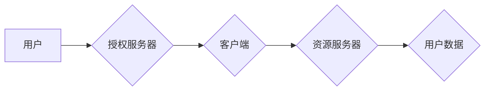

> OAuth 2.0,授权,安全,API,第三方应用,用户认证,访问令牌,刷新令牌

## 1. 背景介绍

在当今互联网时代，应用程序之间的互联互通日益频繁，第三方应用需要访问用户数据和资源，而用户希望能够控制自己的数据共享。OAuth 2.0 协议应运而生，它提供了一种安全、高效的授权机制，允许用户授权第三方应用访问其数据和资源，而无需直接共享其凭据。

OAuth 2.0 协议是开放标准，由互联网工程任务组 (IETF) 维护，它基于 OAuth 1.0 协议，并对其进行了改进和扩展。OAuth 2.0 协议更加简洁、易于理解和实现，并且支持多种授权模式，可以满足不同的应用场景需求。

## 2. 核心概念与联系

OAuth 2.0 协议的核心概念包括：

* **资源所有者 (Resource Owner):** 拥有数据和资源的用户。
* **客户端 (Client):** 需要访问资源的应用程序。
* **授权服务器 (Authorization Server):** 管理用户授权和颁发访问令牌的服务器。
* **资源服务器 (Resource Server):** 拥有用户数据和资源的服务器。

OAuth 2.0 协议的工作流程如下：



**授权流程:**

1. 用户访问第三方应用，应用需要访问用户的资源。
2. 第三方应用向授权服务器发起授权请求，请求用户授权访问其资源。
3. 用户在授权服务器上进行身份验证，并选择授权应用访问哪些资源。
4. 授权服务器颁发访问令牌给第三方应用，该令牌包含用户授权信息。
5. 第三方应用使用访问令牌向资源服务器请求用户数据。
6. 资源服务器验证访问令牌，如果有效，则返回用户数据。

## 3. 核心算法原理 & 具体操作步骤

### 3.1  算法原理概述

OAuth 2.0 协议的核心算法是基于哈希算法和数字签名技术，确保授权流程的安全性和可靠性。

* **哈希算法:** 用于生成不可逆的哈希值，用于验证数据完整性和安全性。
* **数字签名:** 使用私钥对数据进行签名，用于验证数据来源和完整性。

### 3.2  算法步骤详解

1. **授权请求:** 客户端向授权服务器发送授权请求，包含客户端 ID、授权范围等信息。
2. **用户身份验证:** 授权服务器验证用户的身份，通常通过用户名和密码或其他身份验证方式。
3. **授权决策:** 用户在授权服务器上选择授权应用访问哪些资源。
4. **访问令牌颁发:** 授权服务器根据用户的授权决策，生成访问令牌并返回给客户端。
5. **资源访问:** 客户端使用访问令牌向资源服务器请求用户数据。
6. **资源访问验证:** 资源服务器验证访问令牌的有效性，并根据授权范围返回用户数据。

### 3.3  算法优缺点

**优点:**

* **安全性:** 使用哈希算法和数字签名技术，确保授权流程的安全性和可靠性。
* **简化流程:** 用户无需直接共享其凭据，简化了授权流程。
* **灵活性和可扩展性:** 支持多种授权模式，可以满足不同的应用场景需求。

**缺点:**

* **复杂性:** OAuth 2.0 协议相对复杂，需要一定的技术知识才能理解和实现。
* **依赖第三方服务:** OAuth 2.0 协议依赖于授权服务器和资源服务器，如果这些服务出现问题，可能会影响应用的正常运行。

### 3.4  算法应用领域

OAuth 2.0 协议广泛应用于各种互联网应用场景，例如：

* **社交媒体:** 用户授权第三方应用访问其社交媒体数据。
* **云存储:** 用户授权第三方应用访问其云存储数据。
* **支付平台:** 用户授权第三方应用进行支付操作。
* **API 网关:** 控制 API 的访问权限。

## 4. 数学模型和公式 & 详细讲解 & 举例说明

### 4.1  数学模型构建

OAuth 2.0 协议的数学模型可以抽象为一个三元组 (R, C, A)，其中：

* R: 资源所有者
* C: 客户端
* A: 授权服务器

### 4.2  公式推导过程

OAuth 2.0 协议的授权流程可以表示为以下公式：

```
授权 = f(R, C, A)
```

其中，f() 为授权函数，它接受资源所有者、客户端和授权服务器作为输入，并返回授权结果。

### 4.3  案例分析与讲解

假设用户 Alice 想要授权第三方应用 Bob 访问其社交媒体数据。

1. Bob 向授权服务器发起的授权请求，包含 Bob 的客户端 ID 和 Alice 想要授权的资源范围。
2. 授权服务器验证 Alice 的身份，并展示 Alice 授权 Bob 访问哪些资源。
3. Alice 选择授权 Bob 访问其社交媒体数据。
4. 授权服务器根据 Alice 的授权决策，生成访问令牌并返回给 Bob。
5. Bob 使用访问令牌向社交媒体平台的资源服务器请求 Alice 的社交媒体数据。
6. 资源服务器验证访问令牌的有效性，并根据授权范围返回 Alice 的社交媒体数据。

## 5. 项目实践：代码实例和详细解释说明

### 5.1  开发环境搭建

* 操作系统: Ubuntu 20.04 LTS
* 编程语言: Python 3.8
* 框架: Flask

### 5.2  源代码详细实现

```python
from flask import Flask, request, jsonify

app = Flask(__name__)

# 模拟授权服务器
@app.route('/authorize', methods=['GET'])
def authorize():
    # 获取客户端 ID 和授权范围
    client_id = request.args.get('client_id')
    scope = request.args.get('scope')

    # 验证客户端 ID 和授权范围
    # ...

    # 生成访问令牌
    access_token = 'your_access_token'

    # 返回访问令牌
    return jsonify({'access_token': access_token})

if __name__ == '__main__':
    app.run(debug=True)
```

### 5.3  代码解读与分析

* `authorize` 函数模拟授权服务器的授权流程。
* `request.args.get()` 方法获取客户端请求的参数。
* `access_token` 是一个模拟的访问令牌，实际应用中需要使用更安全的算法生成。
* `jsonify()` 方法将访问令牌转换为 JSON 格式返回给客户端。

### 5.4  运行结果展示

运行上述代码，访问 `http://localhost:5000/authorize?client_id=your_client_id&scope=your_scope`，即可获取访问令牌。

## 6. 实际应用场景

OAuth 2.0 协议广泛应用于各种互联网应用场景，例如：

* **社交媒体:** 用户授权第三方应用访问其社交媒体数据，例如 Facebook、Twitter 等。
* **云存储:** 用户授权第三方应用访问其云存储数据，例如 Google Drive、Dropbox 等。
* **支付平台:** 用户授权第三方应用进行支付操作，例如 PayPal、Alipay 等。
* **API 网关:** 控制 API 的访问权限，例如 Google API、Microsoft Azure API 等。

### 6.4  未来应用展望

随着互联网的不断发展，OAuth 2.0 协议的应用场景将会更加广泛，例如：

* **物联网:** 用户授权设备访问其数据和资源。
* **区块链:** 用户授权应用程序访问其区块链数据。
* **人工智能:** 用户授权应用程序访问其数据用于训练人工智能模型。

## 7. 工具和资源推荐

### 7.1  学习资源推荐

* OAuth 2.0 规范: https://oauth.net/2/
* OAuth 2.0 权威指南: https://oauth.net/2/guide/

### 7.2  开发工具推荐

* OAuth 2.0 Python 库: https://github.com/requests/requests

### 7.3  相关论文推荐

* OAuth 2.0: An Authorization Framework for the Web
* OAuth 2.0: A Comprehensive Guide

## 8. 总结：未来发展趋势与挑战

### 8.1  研究成果总结

OAuth 2.0 协议已经成为互联网应用中广泛使用的授权机制，它为用户提供了安全、高效的授权方式，并促进了应用程序之间的互联互通。

### 8.2  未来发展趋势

* **更安全的授权机制:** 随着网络安全威胁的不断升级，OAuth 2.0 协议需要不断改进，以提供更安全的授权机制。
* **更灵活的授权模式:** OAuth 2.0 协议需要支持更多灵活的授权模式，以满足不同的应用场景需求。
* **更广泛的应用场景:** OAuth 2.0 协议的应用场景将会更加广泛，例如物联网、区块链等领域。

### 8.3  面临的挑战

* **复杂性:** OAuth 2.0 协议相对复杂，需要一定的技术知识才能理解和实现。
* **兼容性:** 不同 OAuth 2.0 协议实现的兼容性问题需要得到解决。
* **用户体验:** OAuth 2.0 协议的授权流程需要更加简洁易懂，以提高用户体验。

### 8.4  研究展望

未来，OAuth 2.0 协议的研究方向将集中在以下几个方面：

* **提高安全性:** 研究更安全的授权机制，例如基于区块链的授权机制。
* **增强灵活性:** 研究更灵活的授权模式，例如基于角色的授权模式。
* **优化用户体验:** 研究更加简洁易懂的授权流程，提高用户体验。


## 9. 附录：常见问题与解答

**常见问题:**

* OAuth 2.0 和 OAuth 1.0 的区别是什么？
* OAuth 2.0 支持哪些授权模式？
* 如何实现 OAuth 2.0 的安全授权？

**解答:**

* OAuth 2.0 是 OAuth 1.0 的改进版本，它更加简洁、易于理解和实现，并且支持多种授权模式。
* OAuth 2.0 支持多种授权模式，例如授权码模式、密码模式、客户端模式、隐式授权模式等。
* OAuth 2.0 的安全授权可以通过使用哈希算法和数字签名技术来实现。


作者：禅与计算机程序设计艺术 / Zen and the Art of Computer Programming 
<end_of_turn>