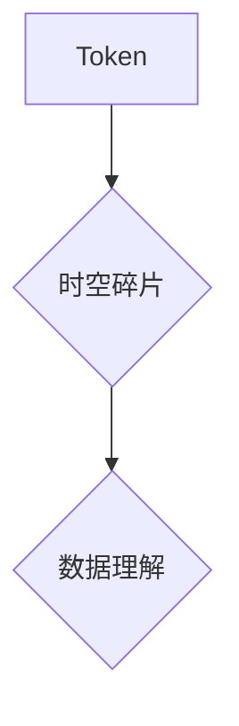

> Token, 时空碎片, 自然语言处理, 深度学习, Transformer, 知识图谱, 计算机视觉, 数据结构, 算法设计

## 1. 背景介绍

在当今数据爆炸的时代，信息处理和理解能力成为人工智能发展的重要驱动力。自然语言处理 (NLP) 和计算机视觉 (CV) 作为人工智能的核心领域，在文本理解、图像识别、语音合成等方面取得了显著进展。这些进展离不开对数据进行有效编码和处理的技术，而 Token 和时空碎片作为两种重要的数据表示方式，在推动人工智能发展中发挥着关键作用。

Token 是对文本或序列数据进行分割的基本单位，可以是单词、子单词、字符或其他语义单元。时空碎片则是一种更高级的数据表示方式，它将数据片段与时间和空间信息关联起来，从而更全面地刻画数据的上下文和语义关系。

## 2. 核心概念与联系

### 2.1 Token

Token 是 NLP 和 CV 中常用的数据表示方式，它将原始数据分割成更小的、可处理的单元。Token 的选择取决于具体的应用场景和任务需求。例如，在机器翻译任务中，通常使用单词或子单词作为 Token；而在语音识别任务中，则可能使用音素或 phonemes 作为 Token。

### 2.2 时空碎片

时空碎片是一种更高级的数据表示方式，它将数据片段与时间和空间信息关联起来，从而更全面地刻画数据的上下文和语义关系。例如，在视频理解任务中，时空碎片可以包含视频片段、时间戳和空间位置信息，从而更好地理解视频内容的演变和场景变化。

### 2.3 Token 与时空碎片的联系

Token 可以看作是时空碎片的基本组成部分。时空碎片可以由多个 Token 组成，并通过时间和空间信息进行关联。例如，一个时空碎片可以包含一个视频片段中的多个 Token，以及这些 Token 在视频中的时间戳和空间位置信息。

**Mermaid 流程图**



## 3. 核心算法原理 & 具体操作步骤

### 3.1 算法原理概述

Token 和时空碎片的处理通常涉及以下核心算法：

* **Tokenization:** 将原始数据分割成 Token。
* **Embedding:** 将 Token 映射到低维向量空间，以便于后续的计算和处理。
* **Attention Mechanism:** 用于捕捉 Token 之间的依赖关系，并赋予不同 Token 不同的权重。
* **Temporal Modeling:** 用于处理时间序列数据，例如视频或语音。
* **Spatial Modeling:** 用于处理空间信息，例如图像或地图。

### 3.2 算法步骤详解

**Tokenization:**

1. 根据具体的应用场景和任务需求，选择合适的 Tokenization 策略。
2. 使用分词器或正则表达式等工具，将原始数据分割成 Token。

**Embedding:**

1. 使用预训练的词向量模型 (例如 Word2Vec 或 GloVe) 或训练自己的 Embedding 模型。
2. 将每个 Token 映射到一个低维向量空间。

**Attention Mechanism:**

1. 计算每个 Token 之间的注意力权重。
2. 根据注意力权重，对 Token 进行加权求和，得到上下文向量。

**Temporal Modeling:**

1. 使用循环神经网络 (RNN) 或 Transformer 等模型，处理时间序列数据。
2. 学习时间序列数据的依赖关系和模式。

**Spatial Modeling:**

1. 使用卷积神经网络 (CNN) 或其他空间建模方法，处理空间信息。
2. 学习空间信息之间的关系和特征。

### 3.3 算法优缺点

**Token:**

* **优点:** 简单易实现，能够有效地分割数据。
* **缺点:** 无法捕捉 Token 之间的上下文关系和语义信息。

**时空碎片:**

* **优点:** 可以捕捉 Token 之间的上下文关系和语义信息，更全面地刻画数据。
* **缺点:** 更加复杂，需要更多的计算资源和数据。

### 3.4 算法应用领域

* **自然语言处理:** 文本分类、情感分析、机器翻译、问答系统等。
* **计算机视觉:** 视频理解、图像识别、目标检测、场景分析等。

## 4. 数学模型和公式 & 详细讲解 & 举例说明

### 4.1 数学模型构建

**Token Embedding:**

假设我们有一个词汇表 V，包含 N 个单词。每个单词 w ∈ V 都可以映射到一个低维向量 e(w) ∈ R^d，其中 d 是词向量的维度。

**Attention Mechanism:**

注意力机制可以表示为以下公式：

```latex
Attention(Q, K, V) = softmax(Q K^T / sqrt(d_k)) V
```

其中：

* Q 是查询矩阵，表示需要关注的 Token。
* K 是键矩阵，表示所有 Token 的表示。
* V 是值矩阵，表示所有 Token 的语义信息。
* d_k 是键向量的维度。

**Temporal Modeling:**

循环神经网络 (RNN) 可以用以下公式表示：

```latex
h_t = f(W_xh x_t + W_hh h_{t-1} + b_h)
```

其中：

* h_t 是时间步 t 的隐藏状态。
* x_t 是时间步 t 的输入。
* W_xh 和 W_hh 是权重矩阵。
* b_h 是偏置项。
* f 是激活函数。

### 4.2 公式推导过程

**Attention Mechanism:**

注意力机制的 softmax 函数用于计算每个 Token 之间的注意力权重。注意力权重越高，表示该 Token 对当前 Token 的影响越大。

**Temporal Modeling:**

RNN 的隐藏状态 h_t 是时间步 t 的上下文信息，它包含了之前所有时间步的输入信息。

### 4.3 案例分析与讲解

**机器翻译:**

在机器翻译任务中，可以使用 Transformer 模型和注意力机制，将源语言文本翻译成目标语言文本。Transformer 模型可以捕捉源语言文本中的长距离依赖关系，注意力机制可以赋予不同 Token 不同的权重，从而更好地理解文本的语义信息。

**视频理解:**

在视频理解任务中，可以使用时空碎片和 RNN 模型，理解视频内容的演变和场景变化。时空碎片可以包含视频片段、时间戳和空间位置信息，RNN 模型可以处理时间序列数据，学习视频内容的依赖关系和模式。

## 5. 项目实践：代码实例和详细解释说明

### 5.1 开发环境搭建

* Python 3.x
* TensorFlow 或 PyTorch
* CUDA 和 cuDNN (可选)

### 5.2 源代码详细实现

```python
# Tokenization
import nltk
nltk.download('punkt')
tokens = nltk.word_tokenize("This is a sample sentence.")

# Embedding
import gensim
model = gensim.models.Word2Vec.load("word2vec_model.bin")
embeddings = [model.wv[token] for token in tokens]

# Attention Mechanism
# ...

# Temporal Modeling
import tensorflow as tf
model = tf.keras.Sequential([
    tf.keras.layers.LSTM(128, return_sequences=True),
    tf.keras.layers.LSTM(64),
    tf.keras.layers.Dense(10, activation='softmax')
])

# ...
```

### 5.3 代码解读与分析

* Tokenization: 使用 NLTK 库进行分词。
* Embedding: 使用预训练的 Word2Vec 模型进行词向量化。
* Attention Mechanism: 使用 TensorFlow 或 PyTorch 实现注意力机制。
* Temporal Modeling: 使用 LSTM 网络处理时间序列数据。

### 5.4 运行结果展示

* 运行代码后，可以得到模型的训练结果和预测结果。

## 6. 实际应用场景

### 6.1 自然语言处理

* **机器翻译:** 将文本从一种语言翻译成另一种语言。
* **文本摘要:** 从长文本中提取关键信息生成摘要。
* **情感分析:** 分析文本中的情感倾向，例如正面、负面或中性。
* **问答系统:** 根据用户的问题，从知识库中找到答案。

### 6.2 计算机视觉

* **视频理解:** 理解视频内容的演变和场景变化。
* **图像识别:** 将图像分类为不同的类别。
* **目标检测:** 在图像中检测和识别特定目标。
* **场景分析:** 分析图像中的场景和物体关系。

### 6.3 其他领域

* **语音识别:** 将语音转换为文本。
* **音乐生成:** 生成新的音乐作品。
* **药物发现:** 预测药物的活性。

### 6.4 未来应用展望

* **更智能的聊天机器人:** 可以更自然地理解和回应用户的对话。
* **个性化教育:** 根据学生的学习进度和需求提供个性化的学习内容。
* **自动驾驶汽车:** 可以更安全地驾驶汽车。
* **医疗诊断:** 可以帮助医生更准确地诊断疾病。

## 7. 工具和资源推荐

### 7.1 学习资源推荐

* **书籍:**
    * "Deep Learning" by Ian Goodfellow, Yoshua Bengio, and Aaron Courville
    * "Speech and Language Processing" by Daniel Jurafsky and James H. Martin
    * "Computer Vision: Algorithms and Applications" by Richard Szeliski
* **在线课程:**
    * Coursera: Deep Learning Specialization
    * Udacity: Artificial Intelligence Nanodegree
    * edX: Artificial Intelligence

### 7.2 开发工具推荐

* **Python:** 广泛用于人工智能开发。
* **TensorFlow:** 开源深度学习框架。
* **PyTorch:** 开源深度学习框架。
* **Keras:** 高级深度学习 API，可以运行在 TensorFlow 或 Theano 后端。

### 7.3 相关论文推荐

* "Attention Is All You Need" by Vaswani et al. (2017)
* "BERT: Pre-training of Deep Bidirectional Transformers for Language Understanding" by Devlin et al. (2018)
* "ImageNet Classification with Deep Convolutional Neural Networks" by Krizhevsky et al. (2012)

## 8. 总结：未来发展趋势与挑战

### 8.1 研究成果总结

Token 和时空碎片是人工智能领域的重要技术，在自然语言处理和计算机视觉等领域取得了显著进展。

### 8.2 未来发展趋势

* **更强大的模型:** 研究更强大的深度学习模型，例如 Transformer 的变体和混合模型。
* **更有效的训练方法:** 研究更有效的训练方法，例如迁移学习和自监督学习。
* **更广泛的应用场景:** 将 Token 和时空碎片应用到更多领域，例如医疗、金融和教育。

### 8.3 面临的挑战

* **数据规模和质量:** 深度学习模型需要大量的训练数据，而高质量的数据往往难以获取。
* **计算资源:** 训练大型深度学习模型需要大量的计算资源。
* **可解释性:** 深度学习模型的决策过程往往难以理解，这限制了其在一些领域中的应用。

### 8.4 研究展望

未来，我们将继续研究 Token 和时空碎片的技术，探索其在人工智能领域更广泛的应用潜力。


## 9. 附录：常见问题与解答

* **Q: Token 和时空碎片有什么区别？**
* **A:** Token 是对数据进行分割的基本单位，而时空碎片则将数据片段与时间和空间信息关联起来，从而更全面地刻画数据的上下文和语义关系。

* **Q: 如何选择合适的 Tokenization 策略？**
* **A:** 选择 Tokenization 策略取决于具体的应用场景和任务需求。例如，在机器翻译任务中，通常使用单词或子单词作为 Token；而在语音识别任务中，则可能使用音素或 phonemes 作为 Token。

* **Q: 如何训练 Token Embedding 模型？**
* **A:** 可以使用预训练的词向量模型 (例如 Word2Vec 或 GloVe) 或训练自己的 Embedding 模型。

* **Q: 如何评估 Token 和时空碎片的性能？**
* **A:** 可以使用不同的评估指标，例如准确率、召回率、F1-score 等。

作者：禅与计算机程序设计艺术 / Zen and the Art of Computer Programming


<end_of_turn>