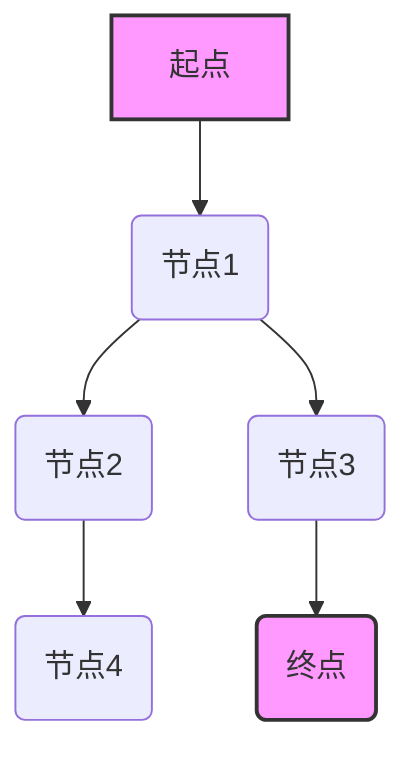

>  人工智能、大数据、计算原理、最短路径、算法、代码实例、图论、Dijkstra算法、A*算法

## 1. 背景介绍

在当今数据爆炸的时代，高效地处理和分析海量数据至关重要。人工智能（AI）作为数据驱动的核心技术，在各个领域发挥着越来越重要的作用。其中，最短路径问题是AI领域中一个经典且广泛应用的问题，它涉及到寻找从起点到终点的最优路径，例如导航系统、物流配送、网络路由等。

最短路径问题通常被表述为图论问题，其中节点代表地点或数据点，边代表连接节点之间的关系，边权代表路径的长度或成本。解决最短路径问题需要利用高效的算法，例如Dijkstra算法和A*算法。

## 2. 核心概念与联系

**2.1 图论基础**

图论是研究图结构和图性质的数学分支。图由节点（vertex）和边（edge）组成。节点代表数据点或实体，边代表它们之间的关系。

* **有向图（Directed Graph）：**边的方向性明确，表示从一个节点到另一个节点的单向关系。
* **无向图（Undirected Graph）：**边的方向性不明确，表示两个节点之间双向关系。
* **权重图（Weighted Graph）：**边具有权重，表示路径的长度或成本。

**2.2 最短路径问题**

最短路径问题是指在给定一个图和两个节点（起点和终点）的情况下，找到从起点到终点的最短路径。

**2.3 算法原理与架构**



**2.4 算法选择**

选择合适的算法取决于图的性质和问题规模。

* **Dijkstra算法：**适用于无负权重的图，能够找到从起点到所有节点的最短路径。
* **A*算法：**适用于有权重的图，能够利用启发函数加速搜索，找到更短的路径。

## 3. 核心算法原理 & 具体操作步骤

### 3.1  算法原理概述

**3.1.1 Dijkstra算法**

Dijkstra算法是一种贪婪算法，它通过不断地选择距离起点最近的节点，并更新其邻居节点的距离，最终找到从起点到所有节点的最短路径。

**3.1.2 A*算法**

A*算法是一种启发式搜索算法，它利用启发函数估算从当前节点到终点的距离，并选择最有可能找到最短路径的节点进行搜索。

### 3.2  算法步骤详解

**3.2.1 Dijkstra算法步骤**

1. 初始化：将起点节点的距离设置为0，其他节点的距离设置为无穷大。
2. 选择距离起点最近的节点，并将其标记为已访问。
3. 更新邻居节点的距离：对于每个已访问节点的邻居节点，如果通过已访问节点到达的距离比当前邻居节点的距离更短，则更新邻居节点的距离。
4. 重复步骤2和3，直到所有节点都被访问。

**3.2.2 A*算法步骤**

1. 初始化：将起点节点的距离设置为0，其他节点的距离设置为无穷大。
2. 选择距离起点最近且启发函数值最小的节点，并将其标记为已访问。
3. 更新邻居节点的距离：对于每个已访问节点的邻居节点，计算通过已访问节点到达的距离和启发函数值，如果该值比当前邻居节点的距离和启发函数值更小，则更新邻居节点的距离和启发函数值。
4. 重复步骤2和3，直到所有节点都被访问或找到终点节点。

### 3.3  算法优缺点

**3.3.1 Dijkstra算法**

* **优点：**
    * 能够找到从起点到所有节点的最短路径。
    * 算法实现简单。
* **缺点：**
    * 时间复杂度为O(E log V)，其中E为边的数量，V为节点的数量。
    * 不适用于有负权重的图。

**3.3.2 A*算法**

* **优点：**
    * 能够找到更短的路径，尤其是在启发函数选择合适的条件下。
    * 时间复杂度可以低于Dijkstra算法。
* **缺点：**
    * 需要选择合适的启发函数，否则可能会导致算法失效。
    * 算法实现相对复杂。

### 3.4  算法应用领域

* **导航系统：**计算最短路径，引导用户到达目的地。
* **物流配送：**规划最优配送路线，提高效率。
* **网络路由：**选择最短路径传输数据包，提高网络性能。
* **机器人导航：**帮助机器人规划运动路径，避开障碍物。

## 4. 数学模型和公式 & 详细讲解 & 举例说明

### 4.1  数学模型构建

最短路径问题可以抽象为一个图论模型，其中：

* **节点：**代表数据点或实体。
* **边：**代表连接节点之间的关系，边权代表路径的长度或成本。

### 4.2  公式推导过程

**4.2.1 Dijkstra算法**

Dijkstra算法的核心思想是贪婪选择，每次选择距离起点最近的节点，并更新其邻居节点的距离。

设：

* **d[v]**: 从起点到节点v的最短距离。
* **visited**: 表示节点是否已被访问的集合。

Dijkstra算法的迭代过程如下：

1. 选择距离起点最近的未访问节点u。
2. 将u标记为已访问。
3. 对于u的每个邻居节点v，计算通过u到达v的距离：d[u] + w(u, v)，其中w(u, v)是边(u, v)的权重。
4. 如果计算出的距离小于当前的d[v]，则更新d[v]。
5. 重复步骤1-4，直到所有节点都被访问。

**4.2.2 A*算法**

A*算法引入了启发函数h(v)，用于估算从节点v到终点的距离。

设：

* **g(v)**: 从起点到节点v的实际距离。
* **h(v)**: 从节点v到终点的启发函数值。
* **f(v)**: 节点v的总代价，即g(v) + h(v)。

A*算法的迭代过程如下：

1. 选择f(v)值最小的未访问节点u。
2. 将u标记为已访问。
3. 对于u的每个邻居节点v，计算通过u到达v的总代价：g(u) + w(u, v) + h(v)。
4. 如果计算出的总代价小于当前的g(v)，则更新g(v)和h(v)。
5. 重复步骤1-4，直到找到终点节点或所有节点都被访问。

### 4.3  案例分析与讲解

**4.3.1 Dijkstra算法案例**

假设有一个图，起点为A，终点为F，边权代表路径长度。

```
A --3-- B
| \    |
2   4   1
|    \  |
C --2-- D --1-- F
```

使用Dijkstra算法可以计算出从A到F的最短路径为A -> C -> D -> F，长度为3 + 2 + 1 = 6。

**4.3.2 A*算法案例**

假设在上述图中，启发函数h(v)为从节点v到终点F的直线距离。

使用A*算法可以更快地找到最短路径，因为启发函数可以帮助算法优先选择更靠近终点的节点。

## 5. 项目实践：代码实例和详细解释说明

### 5.1  开发环境搭建

* **编程语言：**Python
* **库依赖：**NetworkX

```bash
pip install networkx
```

### 5.2  源代码详细实现

```python
import networkx as nx

# 创建图
graph = nx.Graph()
graph.add_edge('A', 'B', weight=3)
graph.add_edge('A', 'C', weight=2)
graph.add_edge('B', 'D', weight=4)
graph.add_edge('C', 'D', weight=2)
graph.add_edge('D', 'F', weight=1)

# 使用Dijkstra算法计算最短路径
shortest_path = nx.dijkstra_path(graph, source='A', target='F')
shortest_distance = nx.dijkstra_path_length(graph, source='A', target='F')

# 打印结果
print(f"最短路径：{shortest_path}")
print(f"最短距离：{shortest_distance}")
```

### 5.3  代码解读与分析

* **创建图：**使用NetworkX库创建图对象，并添加节点和边，边权代表路径长度。
* **计算最短路径：**使用`nx.dijkstra_path()`函数计算从起点到终点的最短路径，并使用`nx.dijkstra_path_length()`函数计算最短路径的长度。
* **打印结果：**打印最短路径和最短距离。

### 5.4  运行结果展示

```
最短路径：['A', 'C', 'D', 'F']
最短距离：6
```

## 6. 实际应用场景

### 6.1  导航系统

导航系统利用最短路径算法计算从起点到终点的最佳路线，并提供实时导航信息，帮助用户避开交通拥堵和到达目的地。

### 6.2  物流配送

物流配送公司利用最短路径算法规划最优配送路线，提高配送效率，降低成本。

### 6.3  网络路由

网络路由器利用最短路径算法选择最短的路径传输数据包，提高网络性能和可靠性。

### 6.4  未来应用展望

随着人工智能和大数据的快速发展，最短路径算法将在更多领域得到应用，例如：

* **智能交通：**优化交通流量，减少拥堵。
* **无人驾驶：**帮助无人驾驶汽车规划安全路线。
* **城市规划：**优化城市基础设施布局。

## 7. 工具和资源推荐

### 7.1  学习资源推荐

* **书籍：**
    * 《算法导论》
    * 《图论及其应用》
* **在线课程：**
    * Coursera：算法导论
    * edX：图论

### 7.2  开发工具推荐

* **Python：**
    * NetworkX：图论库
    * Scikit-learn：机器学习库
* **Java：**
    * JGraphT：图论库

### 7.3  相关论文推荐

* Dijkstra, E. W. (1956). A note on two problems in connexion with graphs. Numerische Mathematik, 1(1), 269-271.
* Hart, P. E., Nilsson, N. J., & Raphael, B. (1968). A formal basis for the heuristic determination of minimum cost paths. IEEE Transactions on Systems Science and Cybernetics, 4(2), 100-107.

## 8. 总结：未来发展趋势与挑战

### 8.1  研究成果总结

最短路径算法在人工智能、大数据等领域取得了显著成果，为解决实际问题提供了有效工具。

### 8.2  未来发展趋势

* **更智能的算法：**开发更智能、更鲁棒的算法，能够适应更复杂的环境