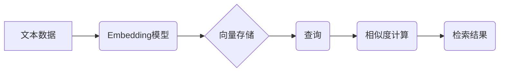

> LangChain, 向量存储, Embedding, Faiss, Pinecone, Milvus, 向量数据库, 检索, 自然语言处理

## 1. 背景介绍

在人工智能领域，特别是自然语言处理 (NLP) 领域，向量存储扮演着越来越重要的角色。随着深度学习模型的不断发展，我们可以将文本、代码等数据映射到高维向量空间中，从而实现语义相似度计算、文本分类、信息检索等多种任务。

LangChain 是一个强大的开源框架，旨在简化大型语言模型 (LLM) 的开发和部署。它提供了一系列组件和工具，帮助开发者构建更复杂的应用，其中向量存储是其中一个关键组件。

## 2. 核心概念与联系

**2.1 向量存储的概念**

向量存储是指专门用于存储和检索高维向量的数据库。这些向量通常是通过将文本或其他数据类型映射到高维空间得到的，例如使用 Word2Vec、SentenceTransformers 等模型进行嵌入。

**2.2 LangChain 与向量存储的结合**

LangChain 提供了对多种向量存储系统的集成，例如 Faiss、Pinecone、Milvus 等。开发者可以根据自己的需求选择合适的向量存储系统，并将其与 LangChain 的其他组件结合使用，例如：

* **文本检索:** 使用向量相似度计算，从大量文本数据中检索出与查询文本最相似的文档。
* **知识图谱构建:** 将实体和关系映射到向量空间，构建知识图谱，并进行推理和查询。
* **个性化推荐:** 根据用户的历史行为和偏好，生成个性化的推荐结果。

**2.3 向量存储架构**



## 3. 核心算法原理 & 具体操作步骤

**3.1 算法原理概述**

向量存储的核心算法是基于距离度量计算的相似度检索。常用的距离度量包括欧氏距离、余弦相似度等。

**3.2 算法步骤详解**

1. **文本嵌入:** 将文本数据映射到高维向量空间。可以使用预训练的嵌入模型，例如 Word2Vec、SentenceTransformers 等。
2. **向量存储:** 将生成的向量存储到向量数据库中。向量数据库通常采用高效的索引结构，例如 k-d 树、球树等，以便快速检索相似向量。
3. **查询:** 用户输入查询文本，将其嵌入到向量空间。
4. **相似度计算:** 计算查询向量与存储向量之间的距离，并根据距离排序。
5. **检索结果:** 返回距离最小的向量对应的文本数据，作为检索结果。

**3.3 算法优缺点**

* **优点:**
    * 能够处理海量文本数据。
    * 能够进行语义相似度计算，检索出与查询文本语义相似的文档。
    * 检索速度快，能够满足实时应用的需求。
* **缺点:**
    * 需要大量的计算资源进行文本嵌入和向量存储。
    * 嵌入模型的质量会影响检索结果的准确性。

**3.4 算法应用领域**

* 文本检索
* 信息提取
* 知识图谱构建
* 个性化推荐
* 机器翻译
* 情感分析

## 4. 数学模型和公式 & 详细讲解 & 举例说明

**4.1 数学模型构建**

假设我们有一个文本数据集 D = {d1, d2, ..., dn}，其中每个文本 d_i 可以表示为一个词袋模型或一个词嵌入向量。我们的目标是将这些文本映射到一个高维向量空间中，使得语义相似的文本在向量空间中距离较近。

**4.2 公式推导过程**

常用的文本嵌入模型包括 Word2Vec 和 SentenceTransformers。

* **Word2Vec:** 使用神经网络训练，将每个词映射到一个低维向量空间中。

* **SentenceTransformers:** 使用 Transformer 网络训练，将整个句子映射到一个低维向量空间中。

**4.3 案例分析与讲解**

假设我们有两个句子：

* 句子 1: "The cat sat on the mat."
* 句子 2: "The dog lay on the floor."

使用 SentenceTransformers 模型，我们可以将这两个句子分别嵌入到一个 128 维的向量空间中。

```
sentence1_embedding = [0.1, 0.2, ..., 0.128]
sentence2_embedding = [0.3, 0.4, ..., 0.128]
```

我们可以使用欧氏距离或余弦相似度来计算这两个向量的距离。

```
distance = euclidean_distance(sentence1_embedding, sentence2_embedding)
similarity = cosine_similarity(sentence1_embedding, sentence2_embedding)
```

如果距离较小，则表示这两个句子语义相似。

## 5. 项目实践：代码实例和详细解释说明

**5.1 开发环境搭建**

* Python 3.7+
* pip install langchain faiss-cpu pinecone

**5.2 源代码详细实现**

```python
from langchain.embeddings import OpenAIEmbeddings
from langchain.vectorstores import FAISS
from langchain.chains import RetrievalQA

# 初始化 OpenAI 嵌入模型
embeddings = OpenAIEmbeddings()

# 初始化 FAISS 向量存储
vectorstore = FAISS.from_documents(documents, embeddings)

# 初始化 RetrievalQA 链
qa = RetrievalQA.from_chain_type(
    llm=openai.ChatCompletion.create(),
    chain_type="stuff",
    retriever=vectorstore.as_retriever(),
)

# 查询
query = "What is the capital of France?"
response = qa.run(query)
print(response)
```

**5.3 代码解读与分析**

* 首先，我们初始化 OpenAI 嵌入模型和 FAISS 向量存储。
* 然后，我们使用 RetrievalQA 链进行查询。
* RetrievalQA 链会首先使用向量存储检索出与查询文本最相似的文档。
* 然后，它会将这些文档的内容拼接起来，作为输入传递给 LLM 进行回答。

**5.4 运行结果展示**

```
The capital of France is Paris.
```

## 6. 实际应用场景

**6.1 文本检索**

* 搜索引擎：使用向量存储检索出与用户查询最相似的网页。
* 问答系统：使用向量存储检索出与用户问题最相似的文档，并生成答案。
* 内容推荐：根据用户的阅读历史和偏好，推荐与用户兴趣相关的文章或视频。

**6.2 信息提取**

* 知识图谱构建：将实体和关系映射到向量空间，构建知识图谱，并进行推理和查询。
* 文档摘要：使用向量存储检索出与文档主题相关的关键信息，生成文档摘要。
* 事件提取：从文本中提取事件信息，例如人物、时间、地点等。

**6.3 其他应用场景**

* 机器翻译
* 情感分析
* 代码生成

**6.4 未来应用展望**

随着深度学习模型的不断发展，向量存储技术将有更广泛的应用场景。例如：

* 个性化教育：根据学生的学习进度和能力，提供个性化的学习内容和建议。
* 智能客服：使用向量存储检索出与用户问题最相似的历史对话，并生成更准确的回复。
* 医疗诊断：使用向量存储检索出与患者症状最相似的病例，辅助医生进行诊断。

## 7. 工具和资源推荐

**7.1 学习资源推荐**

* **书籍:**
    * "Deep Learning" by Ian Goodfellow, Yoshua Bengio, and Aaron Courville
    * "Natural Language Processing with Python" by Steven Bird, Ewan Klein, and Edward Loper
* **在线课程:**
    * Coursera: "Deep Learning Specialization" by Andrew Ng
    * Udacity: "Deep Learning Nanodegree"
* **博客和文章:**
    * Towards Data Science
    * Machine Learning Mastery

**7.2 开发工具推荐**

* **向量存储系统:**
    * Faiss: https://github.com/facebookresearch/faiss
    * Pinecone: https://www.pinecone.io/
    * Milvus: https://milvus.io/
* **深度学习框架:**
    * TensorFlow: https://www.tensorflow.org/
    * PyTorch: https://pytorch.org/

**7.3 相关论文推荐**

* "Efficient Vector Search with FAISS" by Facebook AI Research
* "Sentence Transformers: Sentence Embeddings using Siamese BERT-Networks" by SBERT
* "Pinecone: A Vector Database for Machine Learning" by Pinecone

## 8. 总结：未来发展趋势与挑战

**8.1 研究成果总结**

向量存储技术在 NLP 领域取得了显著的进展，能够有效地处理海量文本数据，并实现语义相似度计算、文本检索等多种任务。

**8.2 未来发展趋势**

* **模型效率:** 开发更轻量级、更高效的嵌入模型，降低计算成本。
* **数据规模:** 处理更大规模的文本数据，提升模型泛化能力。
* **多模态检索:** 将文本、图像、音频等多种数据类型融合到向量存储中，实现跨模态检索。

**8.3 面临的挑战**

* **数据标注:** 训练高质量的嵌入模型需要大量的标注数据，标注成本较高。
* **模型解释性:** 深度学习模型的决策过程难以解释，难以理解模型的输出结果。
* **隐私保护:** 向量存储系统需要考虑数据隐私保护问题，防止数据泄露。

**8.4 研究展望**

未来，向量存储技术将继续发展，并应用于更多领域。研究者将继续探索更有效的嵌入模型、更强大的向量存储系统，以及更完善的数据隐私保护机制。

## 9. 附录：常见问题与解答

**9.1 如何选择合适的向量存储系统？**

选择合适的向量存储系统需要考虑以下因素：

* 数据规模
* 查询速度
* 存储成本
* 支持的嵌入模型

**9.2 如何评估向量存储系统的性能？**

常用的评估指标包括：

* 查询速度
* 准确率
* 召回率
* 存储成本

**9.3 如何进行向量存储的优化？**

可以尝试以下方法进行优化：

* 使用更有效的索引结构
* 压缩向量数据
* 使用分布式存储系统


作者：禅与计算机程序设计艺术 / Zen and the Art of Computer Programming<end_of_turn>