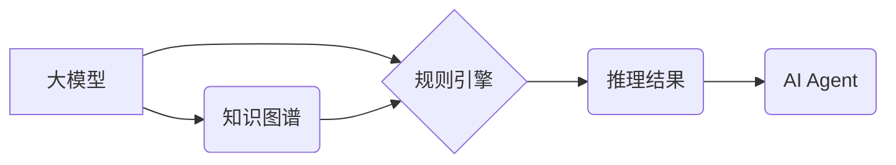

> 大模型、AI Agent、推理引擎、ReAct框架、知识图谱、规则引擎、对话系统、自然语言理解

## 1. 背景介绍

近年来，大模型技术取得了飞速发展，其强大的泛化能力和知识表示能力为构建智能代理（AI Agent）提供了强大的基础。AI Agent 作为一种能够感知环境、做出决策并与环境交互的智能体，在各个领域都展现出巨大的应用潜力，例如客服机器人、智能家居、自动驾驶等。

然而，单纯依靠大模型的直接输出往往难以满足复杂场景下的推理需求。AI Agent 需要具备更强的逻辑推理能力、知识推理能力以及规则执行能力，才能更好地理解用户意图、做出合理的决策并与环境进行有效交互。

为了解决这一问题，我们提出了 ReAct 框架，这是一个面向大模型应用的推理引擎，旨在为 AI Agent 提供更强大的推理能力和灵活的应用场景。

## 2. 核心概念与联系

ReAct 框架的核心概念是将大模型的知识表示能力与规则引擎和知识图谱相结合，构建一个多层次的推理体系。

**框架架构：**



**核心概念解释：**

* **大模型:** 提供丰富的知识表示和语义理解能力，用于提取关键信息和构建知识图谱。
* **知识图谱:**  存储和组织着实体、关系和属性等知识，为推理提供结构化知识基础。
* **规则引擎:**  根据预定义的规则和逻辑，对知识图谱中的信息进行推理和决策。
* **推理结果:**  规则引擎推理的结果，用于指导 AI Agent 的行为决策。
* **AI Agent:**  利用推理结果与环境交互，完成特定任务。

## 3. 核心算法原理 & 具体操作步骤

### 3.1  算法原理概述

ReAct 框架的核心算法基于知识图谱推理和规则引擎执行。

* **知识图谱推理:** 利用基于规则的推理算法，例如 Description Logic (DL) 或 OWL，对知识图谱中的信息进行推理，发现新的知识或关系。
* **规则引擎执行:**  根据预定义的规则，对推理结果进行加工和决策，生成最终的行动指令。

### 3.2  算法步骤详解

1. **知识图谱构建:**  利用大模型的文本理解能力，从文本数据中提取实体、关系和属性，构建知识图谱。
2. **规则定义:**  根据具体应用场景，定义一组规则，描述不同知识组合下的推理逻辑和决策策略。
3. **推理执行:**  将知识图谱和规则输入到 ReAct 框架中，执行推理算法，得到推理结果。
4. **决策生成:**  规则引擎根据推理结果和预定义规则，生成最终的行动指令。
5. **AI Agent 行动:**  AI Agent 根据指令与环境交互，完成任务。

### 3.3  算法优缺点

**优点:**

* **灵活性和可扩展性:**  规则引擎可以根据需要灵活修改和扩展，适应不同的应用场景。
* **可解释性:**  规则引擎的决策过程是可解释的，可以帮助用户理解 AI Agent 的行为逻辑。
* **知识重用:**  知识图谱可以存储和重用大量的知识，提高推理效率。

**缺点:**

* **规则设计复杂:**  规则的定义和维护需要专业知识和经验。
* **推理效率:**  对于规模庞大的知识图谱，推理过程可能需要较长时间。

### 3.4  算法应用领域

ReAct 框架的应用领域非常广泛，例如：

* **对话系统:**  构建更智能、更自然的对话系统，能够理解用户复杂的需求并提供更精准的回复。
* **智能客服:**  自动处理客户咨询，提高客服效率和用户体验。
* **自动驾驶:**  辅助驾驶决策，提高车辆安全性。
* **医疗诊断:**  辅助医生进行诊断，提高诊断准确率。

## 4. 数学模型和公式 & 详细讲解 & 举例说明

### 4.1  数学模型构建

ReAct 框架的推理过程可以抽象为一个图论模型，其中：

* **节点:**  知识图谱中的实体和关系。
* **边:**  实体之间的关系。

推理过程可以看作是图论模型上的路径搜索，寻找满足特定条件的路径。

### 4.2  公式推导过程

假设我们有一个知识图谱，其中包含实体 A、B、C 和关系 R。

* **知识表示:**

```
A R B
```

* **规则:**

```
如果 A R B，则 C 是 A 的子集。
```

* **推理过程:**

根据规则，我们可以推导出：

```
C ⊆ A
```

### 4.3  案例分析与讲解

**案例:**

假设我们有一个对话系统，用户输入“今天天气怎么样？”，系统需要根据天气预报知识图谱进行推理，并给出天气信息。

**推理过程:**

1. 系统识别用户意图，提取关键词“天气”和“今天”。
2. 系统在知识图谱中查找与“天气”和“今天”相关的实体和关系。
3. 系统根据规则引擎执行规则，例如“如果日期是今天，则返回对应日期的天气预报”。
4. 系统返回天气预报信息给用户。

## 5. 项目实践：代码实例和详细解释说明

### 5.1  开发环境搭建

ReAct 框架可以使用 Python 语言开发，并依赖于一些开源库，例如：

* **知识图谱库:**  Neo4j、GraphDB
* **规则引擎库:**  Drools、Jess
* **大模型API:**  OpenAI API、HuggingFace Transformers

### 5.2  源代码详细实现

```python
# 知识图谱加载
graph = Neo4jGraph()
graph.load_data("weather_data.csv")

# 规则定义
rule = Rule("if date == today then return weather_forecast(date)")

# 推理执行
result = graph.query(rule)

# 结果输出
print(result)
```

### 5.3  代码解读与分析

* **知识图谱加载:**  使用 Neo4jGraph 库加载天气预报数据，构建知识图谱。
* **规则定义:**  使用 Drools 库定义规则，描述天气预报的查询逻辑。
* **推理执行:**  使用 graph.query() 方法执行规则推理，获取天气预报结果。
* **结果输出:**  打印推理结果。

### 5.4  运行结果展示

运行代码后，系统将返回今天的天气预报信息。

## 6. 实际应用场景

ReAct 框架可以应用于各种场景，例如：

* **智能客服:**  根据用户问题，从知识库中查找相关信息，并提供精准的回复。
* **个性化推荐:**  根据用户的兴趣爱好和历史行为，推荐个性化的商品或服务。
* **医疗诊断辅助:**  根据患者的症状和病史，辅助医生进行诊断。

### 6.4  未来应用展望

ReAct 框架在未来将朝着以下方向发展：

* **更强大的推理能力:**  探索更先进的推理算法，例如深度学习推理，提高推理效率和准确性。
* **更灵活的应用场景:**  支持更多类型的知识表示和规则定义，适应更广泛的应用场景。
* **更易于使用的开发平台:**  提供更友好的开发平台和工具，降低开发门槛。

## 7. 工具和资源推荐

### 7.1  学习资源推荐

* **知识图谱:**  Stanford Encyclopedia of Philosophy - Knowledge Representation
* **规则引擎:**  Drools Documentation
* **大模型:**  HuggingFace Transformers

### 7.2  开发工具推荐

* **Neo4j:**  https://neo4j.com/
* **GraphDB:**  https://www.ontotext.com/products/graphdb/
* **Drools:**  https://www.drools.org/

### 7.3  相关论文推荐

* **Knowledge Graph Embedding: A Survey**
* **Rule-Based Reasoning for AI Agents**
* **Large Language Models for Dialogue Systems**

## 8. 总结：未来发展趋势与挑战

### 8.1  研究成果总结

ReAct 框架为大模型应用提供了强大的推理引擎，能够有效地解决 AI Agent 在复杂场景下的推理需求。

### 8.2  未来发展趋势

ReAct 框架将朝着更强大的推理能力、更灵活的应用场景和更易于使用的开发平台方向发展。

### 8.3  面临的挑战

ReAct 框架面临的主要挑战包括：

* **推理效率:**  对于规模庞大的知识图谱，推理过程可能需要较长时间。
* **规则设计复杂:**  规则的定义和维护需要专业知识和经验。
* **数据质量:**  知识图谱的质量直接影响推理结果的准确性。

### 8.4  研究展望

未来，我们将继续致力于 ReAct 框架的研发，探索更先进的推理算法、更灵活的应用场景和更易于使用的开发平台，推动 AI Agent 技术的发展。

## 9. 附录：常见问题与解答

**常见问题:**

* **ReAct 框架支持哪些类型的知识图谱？**

ReAct 框架支持多种类型的知识图谱，例如 RDF、OWL 和 JSON-LD。

* **ReAct 框架支持哪些类型的规则引擎？**

ReAct 框架支持多种类型的规则引擎，例如 Drools、Jess 和 Prolog。

* **ReAct 框架的性能如何？**

ReAct 框架的性能取决于知识图谱的大小和规则的复杂度。对于规模较小的知识图谱和简单的规则，ReAct 框架可以提供较高的推理效率。

**作者：禅与计算机程序设计艺术 / Zen and the Art of Computer Programming**


<end_of_turn>