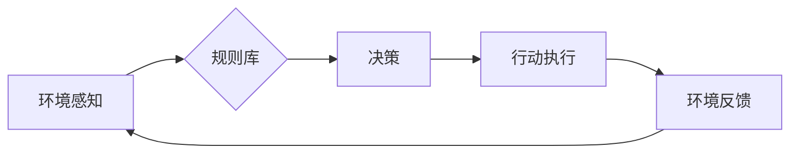

>  Agent, 智能体, 决策, 行为, 规则, 状态机, 有限状态机, 知识表示, 规划, 搜索, 

## 1. 背景介绍

在人工智能领域，智能体（Agent）的概念一直是核心研究方向之一。智能体是指能够感知环境、做出决策并执行行动的系统。在人工智能发展初期，由于计算能力和数据量的限制，传统的智能体通常基于规则或有限状态机（Finite State Machine，FSM）等方法实现。这些方法虽然能够解决一些简单的任务，但缺乏灵活性，难以应对复杂环境下的挑战。

随着深度学习技术的兴起，大模型的出现为智能体的发展带来了新的机遇。大模型拥有强大的学习能力和泛化能力，能够从海量数据中学习到复杂的知识和模式，从而构建更智能、更灵活的智能体。

然而，大模型并非万能，在某些场景下，传统的规则驱动的智能体仍然具有其优势。例如，在需要明确定义规则和行为规范的领域，如医疗诊断、金融交易等，规则驱动的智能体能够提供更高的可解释性和安全性。

本文将深入探讨大模型出现之前的智能体，分析其核心概念、算法原理、实现方法以及应用场景，为读者提供对传统智能体的一种全面理解。

## 2. 核心概念与联系

### 2.1 智能体（Agent）

智能体是一个能够感知环境、做出决策并执行行动的系统。它具有以下几个关键特征：

* **感知能力：** 智能体能够感知周围环境的信息，例如传感器数据、用户输入等。
* **决策能力：** 智能体能够根据感知到的信息做出决策，选择最优的行动方案。
* **执行能力：** 智能体能够执行决策，改变环境状态。
* **学习能力：** 一些智能体能够从经验中学习，不断改进决策策略。

### 2.2 规则驱动的智能体

规则驱动的智能体是基于预先定义的规则来进行决策和执行行动的。这些规则通常以“如果-那么”的形式表达，描述了特定情况下的行为。

**规则驱动的智能体架构：**



### 2.3 有限状态机（FSM）

有限状态机是一种数学模型，用于描述系统在不同状态之间的转换。它由状态集合、输入集合和转换函数组成。

**有限状态机的特点：**

* 状态有限：系统只能处于有限个状态之一。
* 输入有限：系统接受的输入有限。
* 转换确定：输入和当前状态决定了下一个状态。

**有限状态机的应用：**

有限状态机广泛应用于各种领域，例如：

* 自动机
* 编译器
* 游戏设计
* 人工智能

## 3. 核心算法原理 & 具体操作步骤

### 3.1 算法原理概述

规则驱动的智能体和有限状态机都是基于明确定义的规则和状态转换来实现决策和行为的。

* **规则驱动的智能体：** 通过匹配环境信息与规则条件，选择相应的行动规则进行执行。
* **有限状态机：** 根据当前状态和输入信息，通过转换函数确定下一个状态，并执行相应的动作。

### 3.2 算法步骤详解

**规则驱动的智能体：**

1. **环境感知：** 智能体感知环境信息，例如传感器数据、用户输入等。
2. **规则匹配：** 将环境信息与规则库中的规则进行匹配，找到匹配的规则。
3. **决策执行：** 根据匹配的规则，选择相应的行动方案并执行。
4. **环境反馈：** 智能体接收环境反馈，更新环境状态。

**有限状态机：**

1. **状态初始化：** 智能体从初始状态开始。
2. **输入接收：** 智能体接收环境输入信息。
3. **状态转换：** 根据当前状态和输入信息，通过转换函数确定下一个状态。
4. **动作执行：** 在新的状态下执行相应的动作。
5. **状态更新：** 更新智能体的状态。

### 3.3 算法优缺点

**规则驱动的智能体：**

* **优点：**
    * 可解释性高：规则易于理解和解释。
    * 可控性强：规则可以明确定义，控制智能体的行为。
    * 效率高：规则匹配和执行速度快。
* **缺点：**
    * 难以处理复杂环境：规则难以覆盖所有可能的情况。
    * 缺乏学习能力：规则需要人工定义，难以适应变化的环境。

**有限状态机：**

* **优点：**
    * 结构简单：易于理解和实现。
    * 效率高：状态转换和动作执行速度快。
* **缺点：**
    * 难以处理复杂逻辑：状态数量可能爆炸式增长。
    * 缺乏学习能力：状态和转换规则需要人工定义。

### 3.4 算法应用领域

* **规则驱动的智能体：**
    * 医疗诊断
    * 金融交易
    * 工业控制
* **有限状态机：**
    * 自动机
    * 编译器
    * 游戏设计

## 4. 数学模型和公式 & 详细讲解 & 举例说明

### 4.1 数学模型构建

**有限状态机数学模型：**

* 状态集合：S = {s1, s2, ..., sn}
* 输入集合：I = {i1, i2, ..., im}
* 状态转换函数：δ: S × I → S
* 初始状态：s0 ∈ S
* 接受状态：F ⊆ S

**规则驱动的智能体数学模型：**

* 规则集：R = {r1, r2, ..., rn}
* 规则条件：C(ri)
* 规则动作：A(ri)

### 4.2 公式推导过程

**有限状态机状态转换公式：**

```
s' = δ(s, i)
```

其中：

* s'：下一个状态
* s：当前状态
* i：输入信息

**规则驱动的智能体决策公式：**

```
action = argmax_a P(a|state, rules)
```

其中：

* action：决策动作
* P(a|state, rules)：给定状态和规则集，动作a发生的概率

### 4.3 案例分析与讲解

**有限状态机案例：**

一个简单的自动售货机可以看作是一个有限状态机。

* 状态：空闲、等待付款、 dispensing 商品、错误
* 输入：按键、钞票
* 状态转换：根据按键和钞票输入，自动售货机会转换到不同的状态。

**规则驱动的智能体案例：**

一个简单的聊天机器人可以基于规则来进行对话。

* 规则：
    * 如果用户输入“你好”，则机器人回复“你好，请问有什么可以帮您吗？”
    * 如果用户输入“天气”，则机器人查询天气信息并回复。

## 5. 项目实践：代码实例和详细解释说明

### 5.1 开发环境搭建

* Python 3.x
* TensorFlow 或 PyTorch

### 5.2 源代码详细实现

```python
# 有限状态机示例代码

class VendingMachine:
    def __init__(self):
        self.state = "idle"

    def input(self, action):
        if self.state == "idle":
            if action == "insert_coin":
                self.state = "waiting_payment"
            else:
                print("Invalid action in idle state")
        elif self.state == "waiting_payment":
            # ...
        # ...

# 规则驱动的智能体示例代码

class Chatbot:
    def __init__(self):
        self.rules = [
            {"condition": "你好", "action": "你好，请问有什么可以帮您吗？"},
            {"condition": "天气", "action": "查询天气信息并回复"}
        ]

    def respond(self, user_input):
        for rule in self.rules:
            if rule["condition"] in user_input:
                return rule["action"]
        return "对不起，我不明白您的意思。"

```

### 5.3 代码解读与分析

* 有限状态机代码：定义了自动售货机的状态、输入和状态转换规则。
* 规则驱动的智能体代码：定义了聊天机器人的规则集，根据用户输入匹配规则并生成回复。

### 5.4 运行结果展示

运行上述代码，可以模拟自动售货机的操作和聊天机器人的对话。

## 6. 实际应用场景

### 6.1 智能家居

规则驱动的智能体可以用于控制智能家居设备，例如灯光、空调、窗帘等。

### 6.2 自动化测试

有限状态机可以用于构建自动化测试用例，模拟用户操作并验证软件功能。

### 6.3 游戏开发

有限状态机广泛应用于游戏开发，用于控制角色行为、游戏逻辑和事件处理。

### 6.4 未来应用展望

随着人工智能技术的进步，规则驱动的智能体和有限状态机将继续在各种领域得到应用。例如：

* **个性化推荐：** 基于用户行为和偏好，构建规则驱动的智能体进行个性化推荐。
* **自动驾驶：** 利用有限状态机控制自动驾驶汽车的行为，应对不同的路况和交通场景。
* **机器人交互：** 设计规则驱动的智能体，使机器人能够更好地理解和响应人类指令。

## 7. 工具和资源推荐

### 7.1 学习资源推荐

* **书籍：**
    * 《人工智能：现代方法》
    * 《人工智能导论》
* **在线课程：**
    * Coursera 上的《人工智能》课程
    * edX 上的《机器学习》课程

### 7.2 开发工具推荐

* **Python：** 广泛用于人工智能开发，拥有丰富的库和工具。
* **TensorFlow：** 深度学习框架，用于构建和训练神经网络模型。
* **PyTorch：** 深度学习框架，灵活易用，适合研究和开发。

### 7.3 相关论文推荐

* **《Reinforcement Learning: An Introduction》**
* **《Deep Learning》**

## 8. 总结：未来发展趋势与挑战

### 8.1 研究成果总结

大模型的出现为智能体的发展带来了新的机遇，但也面临着新的挑战。

* **大模型优势：**
    * 强大的学习能力和泛化能力
    * 能够处理复杂环境和任务
* **大模型挑战：**
    * 计算资源消耗大
    * 训练数据量大
    * 可解释性和安全性问题

### 8.2 未来发展趋势

* **模型压缩和效率优化：** 降低大模型的计算资源消耗。
* **联邦学习：** 保护数据隐私，实现分布式训练。
* **可解释性研究：** 提高大模型的透明度和可理解性。

### 8.3 面临的挑战

* **数据获取和标注：** 大模型训练需要海量数据，数据获取和标注成本高。
* **算法设计和优化：** 针对大模型的算法设计和优化仍然是一个挑战。
* **伦理和社会影响：** 大模型的应用需要考虑伦理和社会影响。

### 8.4 研究展望

未来，人工智能研究将继续探索大模型的潜力，并解决其面临的挑战。

## 9. 附录：常见问题与解答

* **Q：规则驱动的智能体和有限状态机有什么区别？**
* **A：** 规则驱动的智能体基于规则库进行决策，而有限状态机基于状态转换规则进行决策。

* **Q：大模型如何与规则驱动的智能体和有限状态机结合使用？**
* **A：** 大模型可以用于学习规则或状态转换规则，提高智能体的性能和适应性。

* **Q：大