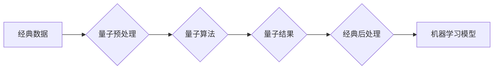

> 量子计算，机器学习，量子机器学习，量子神经网络，量子算法，量子纠缠，量子叠加

## 1. 背景介绍

人工智能（AI）近年来取得了令人瞩目的进展，从语音识别到图像识别，再到自然语言处理，AI已经渗透到我们生活的方方面面。然而，传统机器学习算法的性能仍然受到计算能力和数据规模的限制。量子计算作为一种新兴的计算范式，拥有超越经典计算的强大潜力，为突破AI发展瓶颈提供了新的方向。

量子计算利用量子力学原理，例如量子叠加和量子纠缠，构建出全新的计算模型。与经典计算机使用比特（0或1）进行计算不同，量子计算机使用量子比特（qubit），可以同时处于0和1的叠加态。这种叠加态使得量子计算机能够并行处理大量信息，从而实现指数级的计算速度提升。

## 2. 核心概念与联系

**2.1 量子计算与机器学习的联系**

量子计算和机器学习是两个互补的领域，它们可以相互促进发展。量子计算可以为机器学习算法提供更强大的计算能力，从而提高算法的效率和精度。而机器学习算法可以帮助我们更好地理解和控制量子计算系统。

**2.2 量子机器学习的架构**

量子机器学习（QML）旨在利用量子计算的优势来解决机器学习中的挑战。QML的架构通常包括以下几个部分：

* **量子算法库:** 包含用于机器学习任务的量子算法，例如量子支持向量机、量子神经网络等。
* **量子硬件平台:** 提供量子计算资源，例如IBM Quantum、Google Quantum AI等。
* **经典-量子接口:** 连接经典计算机和量子计算机，用于数据预处理、结果分析等。

**2.3  Mermaid 流程图**



## 3. 核心算法原理 & 具体操作步骤

**3.1 算法原理概述**

量子支持向量机（QSVM）是一种将支持向量机（SVM）算法迁移到量子计算平台上的方法。QSVM利用量子叠加和量子纠缠的特性，可以有效地处理高维数据，并提高分类精度。

**3.2 算法步骤详解**

1. **量子化数据:** 将经典数据映射到量子态，例如使用量子编码将数据点编码为量子比特。
2. **构建量子支持向量:** 利用量子叠加和量子纠缠，构建一个量子支持向量空间，其中每个量子支持向量代表一个数据点。
3. **量子优化:** 使用量子优化算法，例如量子梯度下降，找到最佳的量子支持向量，从而确定分类边界。
4. **量子预测:** 将新数据映射到量子态，并根据量子支持向量进行分类预测。

**3.3 算法优缺点**

* **优点:**
    * 能够处理高维数据，提高分类精度。
    * 利用量子计算的并行计算能力，加速训练过程。
* **缺点:**
    * 量子硬件平台目前仍处于发展初期，稳定性和可扩展性有限。
    * 量子算法的开发和优化需要专门的知识和技术。

**3.4 算法应用领域**

* **图像识别:** 将QSVM应用于图像分类、目标检测等任务。
* **自然语言处理:** 将QSVM应用于文本分类、情感分析等任务。
* **金融风险管理:** 将QSVM应用于欺诈检测、信用评分等任务。

## 4. 数学模型和公式 & 详细讲解 & 举例说明

**4.1 数学模型构建**

在QSVM中，数据点被表示为量子态，支持向量被表示为量子叠加态。分类边界由量子支持向量张成的量子子空间决定。

**4.2 公式推导过程**

QSVM的损失函数和优化目标类似于经典SVM，但使用量子计算的原理进行计算。

**4.3 案例分析与讲解**

假设我们有一个二分类问题，数据点分别属于两个类别。我们可以使用QSVM构建一个量子支持向量空间，并找到最佳的量子支持向量，从而将两个类别分开。

## 5. 项目实践：代码实例和详细解释说明

**5.1 开发环境搭建**

需要安装量子计算软件包，例如Qiskit、Cirq等，并连接量子硬件平台。

**5.2 源代码详细实现**

```python
from qiskit import QuantumCircuit, Aer, execute

# 创建量子电路
qc = QuantumCircuit(2)

# 应用量子门
qc.h(0)
qc.cx(0, 1)

# 测量量子比特
qc.measure(0, 0)
qc.measure(1, 1)

# 运行量子电路
simulator = Aer.get_backend('qasm_simulator')
job = execute(qc, simulator, shots=1024)
result = job.result()
counts = result.get_counts(qc)

# 打印结果
print(counts)
```

**5.3 代码解读与分析**

这段代码演示了如何使用Qiskit库构建一个简单的量子电路，并运行在模拟器上。

**5.4 运行结果展示**

运行结果显示了量子电路的测量结果，例如00、11等。

## 6. 实际应用场景

**6.1 量子机器学习在金融领域的应用**

* **欺诈检测:** 利用QML识别异常交易模式，提高欺诈检测的准确率。
* **信用评分:** 利用QML分析客户的信用历史数据，更准确地评估客户的信用风险。

**6.2 量子机器学习在医疗领域的应用**

* **疾病诊断:** 利用QML分析患者的医疗影像数据，提高疾病诊断的准确率。
* **药物研发:** 利用QML模拟药物分子与蛋白质的相互作用，加速药物研发过程。

**6.4 未来应用展望**

随着量子计算技术的不断发展，QML将在更多领域得到应用，例如材料科学、能源、环境保护等。

## 7. 工具和资源推荐

**7.1 学习资源推荐**

* **书籍:**
    * "Quantum Computing for Computer Scientists" by Noson S. Yanofsky and Mirco A. Mannucci
    * "Quantum Machine Learning" by Maria Schuld and Francesco Petruccione
* **在线课程:**
    * Qiskit Textbook: https://qiskit.org/textbook/
    * Google Quantum AI Education: https://quantumai.google/education

**7.2 开发工具推荐**

* **Qiskit:** https://qiskit.org/
* **Cirq:** https://quantumai.google/cirq
* **PennyLane:** https://pennylane.ai/

**7.3 相关论文推荐**

* "Quantum Support Vector Machines" by Maria Schuld and Francesco Petruccione
* "Quantum Machine Learning: A Review" by Maria Schuld and Francesco Petruccione

## 8. 总结：未来发展趋势与挑战

**8.1 研究成果总结**

QML是一个新兴的领域，取得了一些重要的研究成果，例如量子支持向量机、量子神经网络等。

**8.2 未来发展趋势**

* **量子硬件的进步:** 量子硬件的稳定性和可扩展性将不断提高，为QML的发展提供更强大的计算资源。
* **量子算法的创新:** 将开发出更多高效的量子算法，用于解决更复杂的问题。
* **量子软件生态的完善:** 将建立起更完善的量子软件生态系统，包括工具、库和平台。

**8.3 面临的挑战**

* **量子硬件的局限性:** 目前的量子硬件仍然存在噪声、易出错等问题，需要进一步改进。
* **量子算法的开发难度:** 开发量子算法需要专门的知识和技术，难度较高。
* **量子软件生态的建设:** 量子软件生态系统尚不完善，需要更多的开发者和研究者参与。

**8.4 研究展望**

QML是一个充满机遇和挑战的领域，未来将会有更多突破和创新。


## 9. 附录：常见问题与解答

**9.1 什么是量子叠加？**

量子叠加是指量子比特可以同时处于多个状态的叠加态。

**9.2 什么是量子纠缠？**

量子纠缠是指两个或多个量子比特之间存在一种特殊的关联，即使它们相隔很远，测量一个量子比特的状态也会立即影响另一个量子比特的状态。

**9.3 量子计算与经典计算有什么区别？**

量子计算利用量子力学原理，可以并行处理大量信息，从而实现指数级的计算速度提升。而经典计算则使用比特进行计算，只能串行处理信息。


作者：禅与计算机程序设计艺术 / Zen and the Art of Computer Programming 
<end_of_turn>