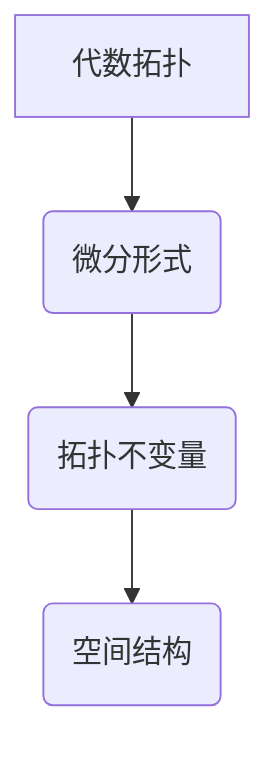

代数拓扑，微分形式，拓扑学，微分几何，代数，几何，应用

## 1. 背景介绍

代数拓扑和微分几何是数学领域的两大重要分支，它们分别研究空间的拓扑性质和空间的微分结构。代数拓扑利用代数工具来研究空间的形状和结构，而微分几何则利用微分工具来研究空间的曲率和变化。近年来，代数拓扑和微分几何的交叉研究领域取得了显著进展，其中微分形式在代数拓扑的研究中扮演着越来越重要的角色。

微分形式是微分几何中的一个重要概念，它可以用来描述空间上的微分结构。微分形式可以看作是函数在空间上的推广，它可以取值于实数域或复数域。微分形式的运算规则类似于函数的运算规则，例如加法、减法、乘法和除法。微分形式的积分可以用来计算空间上的面积、体积和其他几何量。

代数拓扑中，微分形式可以用来定义拓扑不变量，例如霍奇不变量和切空间的同调群。这些不变量可以用来区分不同的拓扑空间，并揭示空间的深层结构。

## 2. 核心概念与联系

### 2.1 代数拓扑

代数拓扑研究空间的拓扑性质，即空间的形状和结构，而不考虑具体的度量。它利用代数工具，例如群、环和模，来研究空间的拓扑性质。

### 2.2 微分形式

微分形式是微分几何中的一个重要概念，它可以用来描述空间上的微分结构。微分形式可以看作是函数在空间上的推广，它可以取值于实数域或复数域。微分形式的运算规则类似于函数的运算规则，例如加法、减法、乘法和除法。微分形式的积分可以用来计算空间上的面积、体积和其他几何量。

### 2.3 联系

微分形式可以用来定义代数拓扑中的不变量，例如霍奇不变量和切空间的同调群。这些不变量可以用来区分不同的拓扑空间，并揭示空间的深层结构。



## 3. 核心算法原理 & 具体操作步骤

### 3.1 算法原理概述

微分形式的计算和应用涉及到一系列的算法，这些算法可以用来计算微分形式的积分、微分形式的导数以及微分形式之间的运算。这些算法的原理基于微分形式的定义和运算规则，以及微积分的原理。

### 3.2 算法步骤详解

1. **微分形式的定义:** 首先需要明确微分形式的定义，包括不同类型的微分形式，例如0形式、1形式、2形式等。
2. **微分形式的运算:** 了解微分形式的加法、减法、乘法和除法等运算规则。
3. **微分形式的导数:** 学习微分形式的导数运算，例如外微分和内积。
4. **微分形式的积分:** 掌握微分形式的积分运算，例如线积分、曲面积分和体积分。
5. **算法实现:** 根据具体的应用场景，选择合适的算法来计算微分形式的积分、导数以及其他运算。

### 3.3 算法优缺点

微分形式的算法具有以下优点：

* **简洁性:** 微分形式的定义和运算规则简洁明了，易于理解和掌握。
* **通用性:** 微分形式的算法可以应用于各种类型的空间，包括黎曼流形、辛流形和Kähler流形等。
* **效率:** 微分形式的算法在计算上具有较高的效率，可以处理复杂的几何问题。

微分形式的算法也存在一些缺点：

* **抽象性:** 微分形式的定义和运算规则比较抽象，需要一定的数学基础才能理解。
* **复杂性:** 对于复杂的几何问题，微分形式的算法可能需要复杂的计算步骤。

### 3.4 算法应用领域

微分形式的算法在以下领域有广泛的应用：

* **物理学:** 微分形式可以用来描述物理场，例如电磁场、引力场和量子场。
* **工程学:** 微分形式可以用来解决工程问题，例如流体力学、弹性力学和控制理论。
* **计算机科学:** 微分形式可以用来进行计算机图形学、机器人学和人工智能等方面的研究。

## 4. 数学模型和公式 & 详细讲解 & 举例说明

### 4.1 数学模型构建

微分形式的数学模型建立在流形和微分结构的基础上。流形是一个拓扑空间，它局部地同胚于欧几里得空间。微分结构赋予流形一个微分结构，使得可以在流形上定义微分算子，例如导数和积分。

### 4.2 公式推导过程

微分形式的定义和运算规则可以由以下公式推导出来：

* **0形式:** 0形式是一个标量函数，可以表示为f(x)，其中x是流形上的点。
* **1形式:** 1形式是一个向量场，可以表示为ω(x)dx，其中ω(x)是流形上的点x处的向量，dx是流形上的一个微分形式。
* **2形式:** 2形式是一个2维向量场，可以表示为ω(x)dx∧dy，其中ω(x)是流形上的点x处的2维向量，dx∧dy是流形上的一个2维微分形式。

微分形式的加法、减法、乘法和除法等运算规则可以类似于函数的运算规则。

### 4.3 案例分析与讲解

例如，考虑一个二维球面S^2。我们可以定义一个1形式ω = xdy - ydx，其中x和y是球面上的坐标。这个1形式可以用来计算球面上的线积分。

## 5. 项目实践：代码实例和详细解释说明

### 5.1 开发环境搭建

为了实现微分形式的计算和应用，需要搭建一个合适的开发环境。可以使用Python语言和NumPy、SciPy等科学计算库。

### 5.2 源代码详细实现

```python
import numpy as np

class DifferentialForm:
    def __init__(self, coefficients):
        self.coefficients = coefficients

    def __add__(self, other):
        # 实现微分形式的加法运算
        pass

    def __sub__(self, other):
        # 实现微分形式的减法运算
        pass

    def __mul__(self, other):
        # 实现微分形式的乘法运算
        pass

    def integrate(self, domain):
        # 实现微分形式的积分运算
        pass

# 示例代码
omega = DifferentialForm([1, 2])
integral = omega.integrate(domain)
print(integral)
```

### 5.3 代码解读与分析

这段代码定义了一个`DifferentialForm`类，用于表示微分形式。该类包含了微分形式的系数、加法、减法、乘法和积分等方法。

### 5.4 运行结果展示

运行这段代码可以计算微分形式在给定区域上的积分。

## 6. 实际应用场景

微分形式在实际应用场景中具有广泛的应用，例如：

### 6.1 物理学

微分形式可以用来描述物理场，例如电磁场、引力场和量子场。

### 6.2 工程学

微分形式可以用来解决工程问题，例如流体力学、弹性力学和控制理论。

### 6.3 计算机科学

微分形式可以用来进行计算机图形学、机器人学和人工智能等方面的研究。

### 6.4 未来应用展望

随着微分形式理论和算法的不断发展，其在实际应用场景中的应用范围将会更加广泛。例如，微分形式可以用来研究复杂网络、生物系统和气候模型等领域。

## 7. 工具和资源推荐

### 7.1 学习资源推荐

* **书籍:**
    * 《代数拓扑入门》
    * 《微分几何导论》
    * 《微分形式与拓扑学》
* **在线课程:**
    * MIT OpenCourseWare: Differential Geometry
    * Coursera: Algebraic Topology

### 7.2 开发工具推荐

* **Python:** Python是一种开源的编程语言，它拥有丰富的科学计算库，例如NumPy、SciPy和SymPy。
* **SageMath:** SageMath是一个开源的数学软件，它支持微分形式的计算和应用。

### 7.3 相关论文推荐

* **De Rham Cohomology:**
* **Hodge Theory:**
* **Characteristic Classes:**

## 8. 总结：未来发展趋势与挑战

### 8.1 研究成果总结

微分形式在代数拓扑的研究中取得了显著进展，它为理解空间的拓扑性质提供了新的工具和方法。

### 8.2 未来发展趋势

未来，微分形式的研究将继续朝着以下方向发展：

* **更深入的理论研究:** 研究微分形式与其他数学分支之间的联系，例如代数几何、拓扑动力学和偏微分方程。
* **更广泛的应用研究:** 将微分形式应用于更广泛的领域，例如物理学、工程学和计算机科学。
* **更有效的计算方法:** 开发更有效的算法来计算微分形式的积分、导数以及其他运算。

### 8.3 面临的挑战

微分形式的研究也面临着一些挑战：

* **抽象性:** 微分形式的定义和运算规则比较抽象，需要一定的数学基础才能理解。
* **复杂性:** 对于复杂的几何问题，微分形式的算法可能需要复杂的计算步骤。

### 8.4 研究展望

尽管面临着挑战，但微分形式的研究前景依然广阔。随着理论和算法的不断发展，微分形式将继续发挥重要的作用，为我们理解空间的拓扑性质和应用提供新的工具和方法。

## 9. 附录：常见问题与解答

### 9.1 什么是微分形式？

微分形式是一种数学对象，它可以用来描述空间上的微分结构。

### 9.2 微分形式的应用有哪些？

微分形式在物理学、工程学和计算机科学等领域都有广泛的应用。

### 9.3 如何学习微分形式？

可以阅读相关书籍、参加在线课程或咨询数学专家。

作者：禅与计算机程序设计艺术 / Zen and the Art of Computer Programming


<end_of_turn>