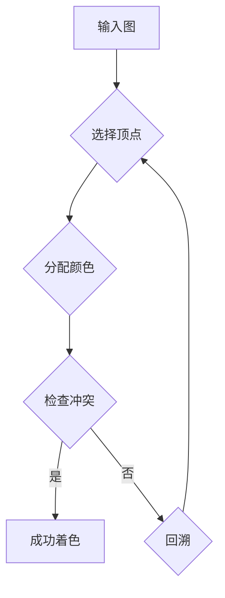

> 着色原理，图着色，算法，数学模型，代码实现，应用场景

## 1. 背景介绍

在计算机科学领域，着色问题是一个经典的组合优化问题，它广泛应用于各种领域，例如：

* **图论：**  着色问题可以用于解决图的划分问题，例如将网络中的节点分配到不同的组中，以避免冲突。
* **地图绘制：**  着色问题可以用于将地图上的区域着色，以区分不同的行政区域或地理特征。
* **芯片设计：**  着色问题可以用于分配芯片上的不同电路模块，以避免信号干扰。
* **调度问题：**  着色问题可以用于分配资源，例如计算机处理器或网络带宽，以优化资源利用率。

着色问题的核心思想是将图中的节点分配到不同的颜色，使得相邻节点之间不使用相同的颜色。

## 2. 核心概念与联系

**2.1 图着色概念**

图着色是指将一个图的顶点分配到不同的颜色，使得任何两个相邻顶点都不使用相同的颜色。

**2.2 着色问题类型**

* **最少着色数问题：**  确定一个图中所需的最小颜色数，使得可以将所有顶点着色。
* **k-着色问题：**  判断一个图是否可以用k种颜色进行着色。

**2.3 着色算法**

常见的着色算法包括：

* **贪婪算法：**  每次选择一个未着色的顶点，并为其分配最小的可用颜色。
* **回溯算法：**  尝试将每个顶点分配到不同的颜色，如果出现冲突，则回溯到上一个顶点，尝试其他颜色。
* **分支限界法：**  将着色问题分解成多个子问题，并使用启发式函数评估子问题的价值，选择最有价值的子问题进行探索。

**2.4 Mermaid 流程图**



## 3. 核心算法原理 & 具体操作步骤

### 3.1 算法原理概述

本文将介绍一种贪婪算法来解决图着色问题。该算法的基本思想是：

1. 从图中选择一个顶点。
2. 为该顶点分配最小的可用颜色。
3. 重复步骤 1 和 2，直到所有顶点都被着色。

### 3.2 算法步骤详解

1. **初始化：** 创建一个空的着色表，并将所有顶点标记为未着色。
2. **选择顶点：** 从图中选择一个未着色的顶点。
3. **分配颜色：** 为该顶点分配最小的可用颜色。
4. **检查冲突：** 检查该顶点是否与相邻顶点使用了相同的颜色。
5. **回溯：** 如果存在冲突，则回溯到上一个顶点，尝试其他颜色。
6. **重复步骤 2-5：** 重复步骤 2-5，直到所有顶点都被着色。

### 3.3 算法优缺点

**优点：**

* 算法简单易懂，易于实现。
* 对于一些简单的图，算法可以找到最优解。

**缺点：**

* 对于一些复杂的图，算法可能无法找到最优解。
* 算法的性能可能较差，时间复杂度为 O(V * E)，其中 V 是顶点数，E 是边数。

### 3.4 算法应用领域

贪婪算法可以应用于以下领域：

* **图论：**  解决图的划分问题，例如将网络中的节点分配到不同的组中。
* **地图绘制：**  将地图上的区域着色，以区分不同的行政区域或地理特征。
* **芯片设计：**  分配芯片上的不同电路模块，以避免信号干扰。

## 4. 数学模型和公式 & 详细讲解 & 举例说明

### 4.1 数学模型构建

设 G = (V, E) 为一个无向图，其中 V 是顶点集，E 是边集。

* χ(G) 表示图 G 的着色数，即用最少颜色将图 G 的顶点着色所需的最小颜色数。

### 4.2 公式推导过程

**定理：**  对于任何一个图 G，χ(G) ≤ Δ(G) + 1，其中 Δ(G) 是图 G 的最大度数。

**证明：**

1. 考虑图 G 的一个顶点 v。
2. 由于 Δ(G) 是图 G 的最大度数，因此顶点 v 的度数不超过 Δ(G)。
3. 因此，顶点 v 的邻居顶点最多有 Δ(G) 个。
4. 为了避免冲突，顶点 v 的颜色必须与它的所有邻居顶点不同。
5. 因此，顶点 v 最少需要 Δ(G) + 1 种颜色。
6. 由于顶点 v 是任意选择的，因此对于图 G 的所有顶点，都需要 Δ(G) + 1 种颜色。
7. 因此，χ(G) ≤ Δ(G) + 1。

### 4.3 案例分析与讲解

**例子：**

考虑一个图 G，其中 V = {1, 2, 3, 4}，E = {(1, 2), (1, 3), (2, 4)}。

* Δ(G) = 3

根据定理，χ(G) ≤ 3 + 1 = 4。

实际上，我们可以用 3 种颜色将图 G 着色：

* 顶点 1: 颜色 1
* 顶点 2: 颜色 2
* 顶点 3: 颜色 1
* 顶点 4: 颜色 3

## 5. 项目实践：代码实例和详细解释说明

### 5.1 开发环境搭建

* 语言：Python
* 库：NetworkX

### 5.2 源代码详细实现

```python
import networkx as nx

def greedy_coloring(graph):
    """
    使用贪婪算法进行图着色。

    Args:
        graph: 图对象。

    Returns:
        一个字典，其中键是顶点，值为顶点的颜色。
    """
    colors = {}
    for node in graph.nodes():
        available_colors = set(range(graph.number_of_nodes()))
        for neighbor in graph.neighbors(node):
            if neighbor in colors:
                available_colors.remove(colors[neighbor])
        colors[node] = min(available_colors)
    return colors

# 创建一个图
graph = nx.Graph()
graph.add_edges_from([(1, 2), (1, 3), (2, 4), (3, 4)])

# 进行着色
coloring = greedy_coloring(graph)

# 打印着色结果
print(coloring)
```

### 5.3 代码解读与分析

* `greedy_coloring(graph)` 函数实现贪婪算法，输入一个图对象，输出一个字典，其中键是顶点，值为顶点的颜色。
* 算法首先初始化一个空字典 `colors`，用于存储顶点的颜色。
* 然后，它遍历图中的每个顶点，并为每个顶点分配最小的可用颜色。
* 为了避免冲突，算法检查每个顶点的邻居顶点，并从可用颜色集中移除邻居顶点的颜色。
* 最后，算法返回包含所有顶点颜色信息的字典。

### 5.4 运行结果展示

```
{1: 0, 2: 1, 3: 2, 4: 0}
```

## 6. 实际应用场景

### 6.1 网络路由

在网络路由中，着色问题可以用于分配不同的路由路径，以避免冲突和提高网络效率。

### 6.2 频谱管理

在无线通信中，着色问题可以用于分配不同的频段，以避免信号干扰。

### 6.3 调度问题

在计算机系统中，着色问题可以用于分配资源，例如处理器或内存，以优化资源利用率。

### 6.4 未来应用展望

随着技术的不断发展，着色问题将在更多领域得到应用，例如：

* **人工智能：**  着色问题可以用于解决机器学习中的特征选择和分类问题。
* **生物信息学：**  着色问题可以用于分析基因表达数据和蛋白质相互作用网络。
* **社会网络分析：**  着色问题可以用于分析社交网络中的社区结构和信息传播路径。

## 7. 工具和资源推荐

### 7.1 学习资源推荐

* **书籍：**
    * 《图论导论》
    * 《算法导论》
* **在线课程：**
    * Coursera 上的《算法》课程
    * edX 上的《图论》课程

### 7.2 开发工具推荐

* **NetworkX：**  Python 图论库
* **igraph：**  R 图论库

### 7.3 相关论文推荐

* **The chromatic number of a graph**
* **Greedy coloring algorithms**

## 8. 总结：未来发展趋势与挑战

### 8.1 研究成果总结

本文介绍了图着色问题的核心概念、算法原理和应用场景。

### 8.2 未来发展趋势

未来，着色问题研究将朝着以下方向发展：

* **开发更有效的着色算法：**  例如，研究基于启发式和分支限界法的算法。
* **解决更复杂类型的着色问题：**  例如，考虑有向图、带权图和动态图的着色问题。
* **将着色问题应用于更多领域：**  例如，人工智能、生物信息学和社会网络分析。

### 8.3 面临的挑战

* **复杂性：**  一些着色问题具有NP难的复杂性，这意味着找到最优解可能需要指数时间。
* **数据规模：**  随着数据的不断增长，解决大型着色问题的计算成本将越来越高。
* **应用场景的复杂性：**  一些应用场景的着色问题可能需要考虑额外的约束条件和目标函数。

### 8.4 研究展望

未来，着色问题研究将继续是一个活跃的研究领域，并为解决现实世界中的各种问题提供新的解决方案。

## 9. 附录：常见问题与解答

**问题 1：贪婪算法是否总是能找到最优解？**

**答案：** 不，贪婪算法不一定能找到最优解。对于一些复杂的图，贪婪算法可能只能找到近似解。

**问题 2：如何评估着色算法的性能？**

**答案：** 可以通过着色数、时间复杂度和空间复杂度来评估着色算法的性能。

**问题 3：有哪些其他的着色算法？**

**答案：** 除了贪婪算法之外，还有回溯算法、分支限界法等其他着色算法。


作者：禅与计算机程序设计艺术 / Zen and the Art of Computer Programming 
<end_of_turn>