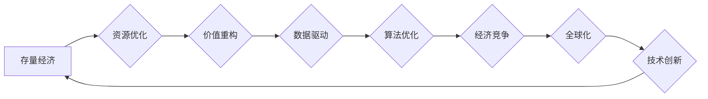

>  存量经济、经济竞争、数据驱动、算法优化、人工智能、技术创新、全球化、市场格局

## 1. 背景介绍

全球经济正处于一个深刻变革的时期。传统经济模式面临着挑战，新兴技术不断涌现，全球化进程加速。在这个背景下，"存量经济"的概念逐渐成为人们关注的焦点。存量经济是指在资源相对有限的情况下，通过对现有资源的优化利用和再分配，实现经济增长的模式。

与过去注重增量经济的模式相比，存量经济更加注重效率和价值创造。它强调数据驱动、算法优化、技术创新等要素，通过挖掘现有资源的潜能，实现经济效益的提升。

## 2. 核心概念与联系

**2.1 存量经济的核心概念**

存量经济的核心概念包括：

* **资源优化:**  充分利用现有资源，减少浪费，提高资源利用率。
* **价值重构:**  通过技术创新和商业模式创新，赋予现有资源新的价值。
* **数据驱动:**  利用大数据分析和人工智能技术，洞察市场需求和用户行为，优化资源配置。
* **算法优化:**  运用算法模型，提高资源分配效率和生产流程的优化。

**2.2 存量经济与经济竞争的关系**

在存量经济时代，经济竞争更加激烈。企业需要通过技术创新、产品差异化、服务升级等方式，在存量市场中抢占市场份额。

**2.3 存量经济与全球化**

全球化进程加速，使得资源流动更加频繁，存量经济的竞争更加全球化。企业需要具备跨国运营能力，才能在全球存量市场中获得竞争优势。

**2.4 存量经济与技术创新**

技术创新是存量经济发展的关键驱动力。人工智能、大数据、云计算等新兴技术，为存量经济提供了新的发展机遇。

**Mermaid 流程图**



## 3. 核心算法原理 & 具体操作步骤

**3.1 算法原理概述**

存量经济的核心算法原理主要包括：

* **资源匹配算法:**  通过分析用户需求和资源供应，匹配最合适的资源组合。
* **价值评估算法:**  对资源进行价值评估，确定资源的市场价格和交易价值。
* **优化分配算法:**  根据资源需求和价值评估结果，优化资源分配方案，提高资源利用效率。

**3.2 算法步骤详解**

1. **数据收集:**  收集用户需求、资源供应、市场价格等相关数据。
2. **数据清洗:**  对收集到的数据进行清洗和预处理，去除噪声和异常值。
3. **特征提取:**  从数据中提取关键特征，例如用户需求的细分、资源的属性和价值等。
4. **模型训练:**  利用机器学习算法，训练资源匹配、价值评估和优化分配模型。
5. **资源匹配:**  根据用户需求和资源供应，利用资源匹配算法，匹配最合适的资源组合。
6. **价值评估:**  利用价值评估算法，对匹配到的资源组合进行价值评估，确定交易价格。
7. **资源分配:**  根据优化分配算法，分配资源，确保资源的合理利用。

**3.3 算法优缺点**

**优点:**

* **提高资源利用效率:**  通过算法优化，可以更好地匹配资源需求和供应，提高资源利用率。
* **降低资源浪费:**  通过价值评估和优化分配，可以减少资源的浪费，提高资源的经济效益。
* **提升用户体验:**  通过精准匹配和个性化服务，可以提升用户的体验，增强用户粘性。

**缺点:**

* **数据依赖:**  算法的准确性依赖于数据的质量和数量。
* **算法复杂性:**  一些算法的训练和运行需要强大的计算能力。
* **伦理风险:**  算法的决策可能会存在偏见和歧视，需要进行伦理评估和监管。

**3.4 算法应用领域**

存量经济算法广泛应用于以下领域：

* **共享经济:**  例如共享汽车、共享房屋、共享办公等。
* **电商平台:**  例如商品推荐、价格优化、物流配送等。
* **金融服务:**  例如风险评估、信用评分、投资决策等。
* **城市管理:**  例如交通管理、资源调度、环境监测等。

## 4. 数学模型和公式 & 详细讲解 & 举例说明

**4.1 数学模型构建**

存量经济的数学模型可以描述资源的供求关系、价值评估机制、资源分配策略等。

**4.2 公式推导过程**

例如，我们可以构建一个简单的资源匹配模型，用公式表示资源匹配的效率：

```latex
效率 = \frac{匹配数量}{总资源数量}
```

其中，匹配数量是指通过算法匹配到的资源数量，总资源数量是指所有可供匹配的资源数量。

**4.3 案例分析与讲解**

假设一个共享汽车平台，有100辆汽车和1000个用户。用户对不同类型的汽车有不同的需求，汽车的供给量也存在差异。通过资源匹配算法，可以将用户和汽车进行匹配，提高资源利用率。

如果算法匹配效率为0.8，则匹配到的汽车数量为80辆，资源利用率为80%。

## 5. 项目实践：代码实例和详细解释说明

**5.1 开发环境搭建**

* 操作系统：Linux
* 编程语言：Python
* 开发工具：Jupyter Notebook

**5.2 源代码详细实现**

```python
# 资源匹配算法示例代码

# 用户需求数据
user_demand = {
    "用户1": "SUV",
    "用户2": "轿车",
    "用户3": "SUV",
    # ...
}

# 资源供应数据
resource_supply = {
    "汽车1": "SUV",
    "汽车2": "轿车",
    "汽车3": "SUV",
    # ...
}

# 匹配算法
def match_resources(user_demand, resource_supply):
    matched_resources = []
    for user, demand in user_demand.items():
        for resource, supply in resource_supply.items():
            if demand == supply:
                matched_resources.append((user, resource))
    return matched_resources

# 匹配结果
matched_resources = match_resources(user_demand, resource_supply)

# 打印匹配结果
print("匹配结果：", matched_resources)
```

**5.3 代码解读与分析**

* 代码首先定义了用户需求数据和资源供应数据。
* 然后定义了一个`match_resources`函数，用于匹配用户需求和资源供应。
* 函数遍历用户需求和资源供应，如果需求和供应匹配，则将用户和资源添加到`matched_resources`列表中。
* 最后打印匹配结果。

**5.4 运行结果展示**

运行代码后，将输出匹配结果，例如：

```
匹配结果： [('用户1', '汽车1'), ('用户3', '汽车3')]
```

## 6. 实际应用场景

**6.1 共享经济**

* **共享汽车:**  通过算法匹配用户需求和汽车供应，提高汽车利用率，降低运营成本。
* **共享房屋:**  通过算法匹配用户需求和房屋供应，提高房屋利用率，降低租金成本。
* **共享办公:**  通过算法匹配用户需求和办公空间供应，提高办公空间利用率，降低办公成本。

**6.2 电商平台**

* **商品推荐:**  通过算法分析用户购买历史和浏览记录，推荐用户可能感兴趣的商品。
* **价格优化:**  通过算法分析市场价格和用户需求，动态调整商品价格，提高销售额。
* **物流配送:**  通过算法优化配送路线和配送时间，提高物流效率，降低配送成本。

**6.3 金融服务**

* **风险评估:**  通过算法分析用户的信用记录和财务状况，评估用户的信用风险。
* **信用评分:**  通过算法计算用户的信用评分，为用户提供不同的金融服务。
* **投资决策:**  通过算法分析市场数据和投资风险，为用户提供投资建议。

**6.4 城市管理**

* **交通管理:**  通过算法分析交通流量和路况，优化交通信号灯控制，缓解交通拥堵。
* **资源调度:**  通过算法优化资源分配，提高资源利用效率，例如水资源调度、能源调度等。
* **环境监测:**  通过算法分析环境数据，监测环境质量，预警环境污染。

**6.5 未来应用展望**

存量经济算法的应用场景将更加广泛，例如：

* **个性化服务:**  通过算法分析用户的需求和偏好，提供更加个性化的服务。
* **智能制造:**  通过算法优化生产流程，提高生产效率和产品质量。
* **智慧农业:**  通过算法分析农业数据，提高农业生产效率和产品质量。

## 7. 工具和资源推荐

**7.1 学习资源推荐**

* **书籍:**
    * 《数据驱动决策》
    * 《算法导论》
    * 《机器学习》
* **在线课程:**
    * Coursera
    * edX
    * Udacity

**7.2 开发工具推荐**

* **编程语言:** Python, R
* **机器学习库:** scikit-learn, TensorFlow, PyTorch
* **数据分析工具:** Pandas, NumPy

**7.3 相关论文推荐**

* **存量经济理论:**
    * 《存量经济学》
    * 《资源稀缺与经济增长》
* **算法优化:**
    * 《算法导论》
    * 《高效算法》

## 8. 总结：未来发展趋势与挑战

**8.1 研究成果总结**

存量经济的概念和算法已经取得了一定的发展成果，在共享经济、电商平台、金融服务等领域取得了应用成功。

**8.2 未来发展趋势**

* **人工智能技术的应用:**  人工智能技术将更加广泛地应用于存量经济算法，提高算法的智能化和自动化程度。
* **数据驱动的决策:**  存量经济决策将更加依赖于数据分析和预测，数据质量和数据安全将更加重要。
* **个性化服务:**  存量经济将更加注重个性化服务，算法将更加精准地分析用户的需求和偏好。

**8.3 面临的挑战**

* **数据隐私和安全:**  存量经济算法依赖于大量用户数据，如何保护用户隐私和数据安全是一个重要的挑战。
* **算法公平性和透明度:**  算法决策可能会存在偏见和歧视，需要提高算法的公平性和透明度。
* **伦理风险:**  存量经济算法可能会带来一些伦理风险，例如算法操控、算法歧视等，需要进行伦理评估和监管。

**8.4 研究展望**

未来研究方向包括：

* **开发更加智能和高效的存量经济算法。**
* **解决数据隐私和安全问题。**
* **提高算法的公平性和透明度。**
* **研究存量经济算法的伦理风险，并制定相应的监管措施。**

## 9. 附录：常见问题与解答

**9.1 如何提高存量经济算法的效率？**

* 提高数据质量和数据量。
* 选择更合适的算法模型。
* 优化算法参数。
* 利用云计算和分布式计算技术提高算法的计算能力。

**9.2 如何解决存量经济算法的伦理风险？**

* 确保算法的公平性和透明度。
* 进行伦理评估和风险控制。
* 制定相应的法律法规和监管措施。
* 加强公众对存量经济算法的教育和宣传。


作者：禅与计算机程序设计艺术 / Zen and the Art of Computer Programming 
<end_of_turn>