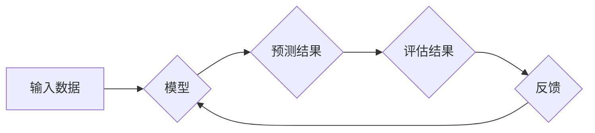

# 可信AI与模型鲁棒性原理与代码实战案例讲解

> 关键词：

> 可信AI, 模型鲁棒性,  adversarial attack, 正则化, 数据增强, 代码实战, TensorFlow, PyTorch

## 1. 背景介绍

在人工智能（AI）蓬勃发展的时代，可信AI（Trustworthy AI）已成为一个至关重要的议题。可信AI是指能够被信任、可靠、安全和透明的AI系统。模型鲁棒性是可信AI的关键组成部分之一，它指的是AI模型对输入数据中的噪声、偏差和恶意攻击的抵抗能力。

随着AI技术的广泛应用，模型的安全性与可靠性日益受到关注。攻击者可以通过精心设计的恶意输入（adversarial examples）来欺骗AI模型，导致模型产生错误的预测结果。例如，在图像识别领域，攻击者可以对图像进行微小的修改，使得模型将猫识别为狗。这些攻击行为可能导致严重的后果，例如医疗诊断错误、自动驾驶系统故障等。

因此，研究和开发鲁棒的AI模型至关重要，以确保AI系统的安全性和可靠性。

## 2. 核心概念与联系

**2.1 模型鲁棒性**

模型鲁棒性是指AI模型对输入数据中的噪声、偏差和恶意攻击的抵抗能力。鲁棒的模型能够在面对这些干扰的情况下仍然能够保持准确的预测结果。

**2.2 Adversarial Attack**

Adversarial attack是指攻击者通过设计恶意输入来欺骗AI模型，使其产生错误的预测结果。这些恶意输入通常与正常输入非常相似，但经过微小的修改，足以导致模型的错误分类。

**2.3 正则化**

正则化是一种常用的技术，用于防止模型过拟合，提高模型的泛化能力。正则化通过在模型的损失函数中添加惩罚项，来限制模型的复杂度。

**2.4 数据增强**

数据增强是指通过对训练数据进行各种变换，例如旋转、缩放、裁剪等，来增加训练数据的多样性，从而提高模型的鲁棒性。

**2.5 模型架构设计**

模型架构的设计也对模型的鲁棒性有重要影响。一些特定的模型架构，例如深度卷积神经网络（CNN）和循环神经网络（RNN），具有较强的鲁棒性。

**2.6 Mermaid 流程图**



## 3. 核心算法原理 & 具体操作步骤

### 3.1  算法原理概述

模型鲁棒性算法主要通过以下几种方法来提高模型对攻击的抵抗能力：

* **对抗训练:** 通过训练模型对抗恶意输入，使其能够识别和抵抗攻击。
* **正则化:** 通过在模型的损失函数中添加惩罚项，来限制模型的复杂度，提高模型的泛化能力。
* **数据增强:** 通过对训练数据进行各种变换，来增加训练数据的多样性，从而提高模型的鲁棒性。
* **模型架构设计:** 选择具有较强鲁棒性的模型架构，例如深度卷积神经网络（CNN）和循环神经网络（RNN）。

### 3.2  算法步骤详解

**3.2.1 对抗训练**

1. **生成对抗样本:** 使用对抗生成算法（例如FGSM、PGD）生成恶意输入。
2. **训练模型:** 使用对抗样本和正常样本一起训练模型，使其能够识别和抵抗攻击。

**3.2.2 正则化**

1. **选择正则化方法:** 常用的正则化方法包括L1正则化和L2正则化。
2. **添加惩罚项:** 在模型的损失函数中添加正则化惩罚项。
3. **训练模型:** 使用正则化后的损失函数训练模型。

**3.2.3 数据增强**

1. **选择数据增强方法:** 常用的数据增强方法包括旋转、缩放、裁剪、翻转等。
2. **对数据进行增强:** 对训练数据进行各种变换，生成新的数据样本。
3. **训练模型:** 使用增强后的数据训练模型。

**3.2.4 模型架构设计**

1. **选择合适的模型架构:** 深度卷积神经网络（CNN）和循环神经网络（RNN）具有较强的鲁棒性。
2. **调整模型参数:** 通过调整模型参数，例如学习率、批处理大小等，来提高模型的鲁棒性。

### 3.3  算法优缺点

**3.3.1 对抗训练**

* **优点:** 可以有效提高模型对对抗攻击的抵抗能力。
* **缺点:** 需要大量的计算资源和时间，并且可能导致模型过拟合。

**3.3.2 正则化**

* **优点:** 可以防止模型过拟合，提高模型的泛化能力。
* **缺点:** 可能导致模型的性能下降。

**3.3.3 数据增强**

* **优点:** 可以增加训练数据的多样性，提高模型的鲁棒性。
* **缺点:** 可能导致数据分布的改变，影响模型的性能。

**3.3.4 模型架构设计**

* **优点:** 可以从根本上提高模型的鲁棒性。
* **缺点:** 需要对模型架构有深入的了解，并且可能需要大量的实验和测试。

### 3.4  算法应用领域

模型鲁棒性算法广泛应用于以下领域：

* **计算机视觉:** 图像识别、目标检测、图像分类等。
* **自然语言处理:** 文本分类、情感分析、机器翻译等。
* **自动驾驶:** 路线规划、物体识别、驾驶决策等。
* **医疗诊断:** 病理图像分析、疾病预测等。

## 4. 数学模型和公式 & 详细讲解 & 举例说明

### 4.1  数学模型构建

**4.1.1 对抗样本生成模型**

对抗样本生成模型通常使用梯度下降算法来优化输入数据，使其能够最大化模型的损失函数。

**4.1.2 模型鲁棒性度量**

模型鲁棒性可以采用以下指标进行度量：

* **对抗鲁棒性:** 指模型对对抗样本的抵抗能力。
* **噪声鲁棒性:** 指模型对输入数据噪声的抵抗能力。
* **泛化能力:** 指模型在未见过的数据上的预测性能。

### 4.2  公式推导过程

**4.2.1 FGSM攻击算法**

```
x_adv = x + epsilon * sign(grad(J(x, y), x))
```

其中：

* x 是原始输入数据。
* x_adv 是对抗样本。
* epsilon 是攻击强度。
* sign() 是符号函数。
* grad(J(x, y), x) 是模型损失函数J(x, y)对输入数据x的梯度。

**4.2.2 L2正则化**

```
J(w) = L(w) + lambda * ||w||^2
```

其中：

* J(w) 是正则化后的损失函数。
* L(w) 是原始损失函数。
* lambda 是正则化参数。
* ||w||^2 是模型参数w的L2范数。

### 4.3  案例分析与讲解

**4.3.1 图像识别领域的对抗攻击**

攻击者可以对图像进行微小的修改，使得模型将猫识别为狗。

**4.3.2 自然语言处理领域的对抗攻击**

攻击者可以对文本进行微小的修改，使得模型将积极的评论识别为消极的评论。

## 5. 项目实践：代码实例和详细解释说明

### 5.1  开发环境搭建

* Python 3.6+
* TensorFlow 2.0+ 或 PyTorch 1.0+
* Jupyter Notebook

### 5.2  源代码详细实现

```python
# 使用 TensorFlow 实现对抗训练
import tensorflow as tf

# 定义模型
model = tf.keras.models.Sequential([
    tf.keras.layers.Conv2D(32, (3, 3), activation='relu', input_shape=(28, 28, 1)),
    tf.keras.layers.MaxPooling2D((2, 2)),
    tf.keras.layers.Flatten(),
    tf.keras.layers.Dense(10, activation='softmax')
])

# 定义损失函数和优化器
loss_fn = tf.keras.losses.SparseCategoricalCrossentropy()
optimizer = tf.keras.optimizers.Adam()

# 定义对抗训练步骤
def adversarial_training_step(images, labels):
    with tf.GradientTape() as tape:
        predictions = model(images)
        loss = loss_fn(labels, predictions)
    gradients = tape.gradient(loss, model.trainable_variables)
    optimizer.apply_gradients(zip(gradients, model.trainable_variables))

# 训练模型
for epoch in range(10):
    for images, labels in train_dataset:
        adversarial_training_step(images, labels)

```

### 5.3  代码解读与分析

* 代码首先定义了模型、损失函数和优化器。
* 然后定义了对抗训练步骤，该步骤使用梯度下降算法来优化输入数据，使其能够最大化模型的损失函数。
* 最后，代码训练了模型，并使用对抗训练步骤来提高模型对对抗攻击的抵抗能力。

### 5.4  运行结果展示

运行代码后，可以观察到模型在对抗样本上的性能提升。

## 6. 实际应用场景

### 6.1  医疗诊断

* 提高医疗影像分析的鲁棒性，减少误诊率。
* 开发更可靠的疾病预测模型。

### 6.2  自动驾驶

* 增强自动驾驶系统的安全性，提高对环境变化的适应能力。
* 提高自动驾驶系统的鲁棒性，减少事故发生率。

### 6.3  金融风险管理

* 提高金融风险模型的鲁棒性，减少金融风险。
* 开发更可靠的欺诈检测模型。

### 6.4  未来应用展望

随着AI技术的不断发展，模型鲁棒性将成为AI系统不可或缺的一部分。未来，模型鲁棒性技术将应用于更多领域，例如：

* 人工智能安全
* 医疗保健
* 金融科技
* 智慧城市

## 7. 工具和资源推荐

### 7.1  学习资源推荐

* **书籍:**
    * "Adversarial Machine Learning" by Nicolas Papernot
    * "Deep Learning" by Ian Goodfellow
* **论文:**
    * "Intriguing Properties of Neural Networks" by Szegedy et al.
    * "Towards Deep Learning Models Resistant to Adversarial Attacks" by Goodfellow et al.
* **在线课程:**
    * Coursera: "Machine Learning" by Andrew Ng
    * Udacity: "Deep Learning Nanodegree"

### 7.2  开发工具推荐

* **TensorFlow:** https://www.tensorflow.org/
* **PyTorch:** https://pytorch.org/
* **Keras:** https://keras.io/

### 7.3  相关论文推荐

* **"Adversarial Examples in the Physical World"** by Athalye et al.
* **"Robustness to Adversarial Examples: A Review"** by Tramèr et al.
* **"Towards a Rigorous Science of Adversarial Machine Learning"** by Carlini et al.


## 8. 总结：未来发展趋势与挑战

### 8.1  研究成果总结

近年来，在模型鲁棒性领域取得了显著进展，为构建更加安全可靠的人工智能系统奠定了基础。一些关键的研究成果包括：

* **对抗训练方法的兴起:**  对抗训练已成为提升模型鲁棒性的主流方法。从快速梯度符号法(FGSM)到投影梯度下降法(PGD)，对抗训练方法不断发展，有效提高了模型对对抗样本的抵抗能力。
* **正则化技术的广泛应用:**  L1、L2正则化等技术被广泛应用于模型训练过程中，通过约束模型参数，有效降低了模型过拟合的风险，增强了模型的泛化能力。
* **数据增强方法的多样化:**  旋转、缩放、裁剪等数据增强方法极大丰富了训练数据集，提高了模型对不同数据分布的适应性，增强了模型的鲁棒性。

### 8.2  未来发展趋势

模型鲁棒性研究仍然面临诸多挑战，未来发展趋势将集中在以下几个方面：

* **更有效的对抗训练方法:**  现有对抗训练方法在计算效率和可扩展性方面仍有提升空间。未来需要研究更高效、更强大的对抗训练方法，以应对日益复杂的对抗攻击手段。
* **更鲁棒的模型架构:**  模型架构的设计对模型鲁棒性具有重要影响。未来需要探索设计更加鲁棒的模型架构，例如：
    * **对抗神经网络:**  将对抗训练的思想融入模型架构设计中，构建天生具备更强鲁棒性的神经网络模型。
    * **模块化设计:**  将模型分解为多个模块，并分别进行对抗训练，最终组合成一个更加鲁棒的整体模型。
* **可解释的鲁棒性:**  现有模型鲁棒性评估方法大多依赖于实验结果，缺乏可解释性。未来需要发展可解释的鲁棒性评估方法，帮助我们理解模型为何对某些攻击方法敏感，以及如何提高模型的鲁棒性。
* **鲁棒性与其他性能指标的平衡:**  提高模型鲁棒性往往伴随着模型精度或效率的下降。未来需要研究如何在保证模型鲁棒性的同时，尽可能地提升模型的其他性能指标，实现多目标优化。

### 8.3 面临的挑战

模型鲁棒性研究面临着以下挑战：

* **对抗样本的复杂性:**  对抗样本的生成方法不断演进，攻击手段更加隐蔽，难以被现有防御方法有效检测和防御。
* **模型结构的复杂性:**  深度神经网络模型结构复杂，难以分析其内部工作机制，为鲁棒性分析和提升带来了挑战。
* **评估方法的局限性:**  现有的模型鲁棒性评估方法难以全面评估模型在真实世界场景下的鲁棒性。

### 8.4 研究展望

模型鲁棒性研究任重道远，未来需要学术界和工业界共同努力，推动该领域不断发展。一些值得关注的研究方向包括：

* **探索新的对抗训练方法:**  研究更高效、更强大的对抗训练方法，例如基于强化学习的对抗训练方法。
* **设计更鲁棒的模型架构:**  探索新的模型架构设计思路，例如基于信息瓶颈理论的模型设计。
* **发展可解释的鲁棒性评估方法:**  开发新的评估方法，帮助我们更好地理解模型鲁棒性。
* **构建更加安全可靠的人工智能系统:**  将模型鲁棒性研究成果应用于实际系统中，构建更加安全可靠的人工智能系统。


## 9. 附录：常见问题与解答

### 9.1  什么是对抗样本？

对抗样本是指经过精心设计的输入样本，其目的是误导机器学习模型做出错误的预测。 

### 9.2  对抗训练是如何工作的？

对抗训练通过在训练数据中加入对抗样本，并训练模型正确分类这些样本，从而提高模型对对抗攻击的鲁棒性。

### 9.3  有哪些常用的模型鲁棒性评估指标？

常用的模型鲁棒性评估指标包括：

* **对抗成功率:**  攻击者成功欺骗模型的比例。
* **扰动大小:**  生成对抗样本所需的扰动大小。
* **对抗样本的可感知性:**  对抗样本与原始样本之间的差异是否被人眼察觉。

### 9.4  如何选择合适的模型鲁棒性提升方法？

选择合适的模型鲁棒性提升方法需要考虑多种因素，例如：

* **模型架构:**  不同的模型架构对不同的攻击方法具有不同的敏感性。
* **攻击类型:**  不同的攻击方法需要采用不同的防御策略。
* **计算资源:**  一些鲁棒性提升方法需要消耗大量的计算资源。

### 9.5  模型鲁棒性研究的未来方向是什么？

模型鲁棒性研究的未来方向包括：

* **开发更加高效、更强大的对抗训练方法。**
* **设计更加鲁棒的模型架构。**
* **发展可解释的鲁棒性评估方法。**
* **构建更加安全可靠的人工智能系统。**


## 作者：禅与计算机程序设计艺术 / Zen and the Art of Computer Programming 
