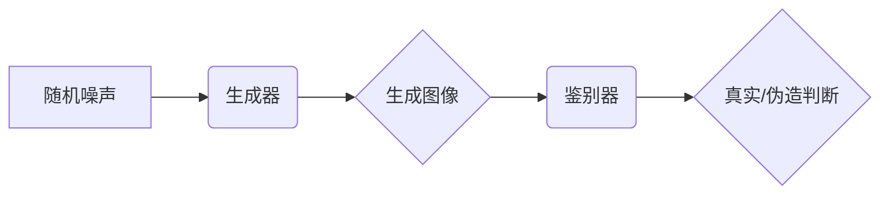

> 生成对抗网络 (GAN)，图像风格迁移，语义风格迁移，高级别语义，图像处理，深度学习

## 1. 背景介绍

图像风格迁移技术近年来备受关注，它能够将一种图像的风格（例如绘画风格、艺术风格）迁移到另一幅图像上，从而创造出具有独特艺术效果的图像。传统的图像风格迁移方法主要基于滤波器和纹理合成等技术，但这些方法往往难以捕捉图像的高级语义信息，导致迁移效果不够自然和逼真。

随着深度学习技术的快速发展，基于生成对抗网络 (GAN) 的图像风格迁移技术应运而生。GAN 是一种由生成器 (Generator) 和鉴别器 (Discriminator) 组成的神经网络架构，通过对抗训练的方式，生成器不断学习生成逼真的图像，而鉴别器则不断学习区分真实图像和生成图像。这种对抗机制使得 GAN 在图像生成领域取得了显著的成果，也为图像风格迁移技术提供了新的思路和方法。

## 2. 核心概念与联系

### 2.1 生成对抗网络 (GAN)

GAN 是一种由两个神经网络相互竞争的框架，生成器 (Generator) 负责生成新的数据样本，而鉴别器 (Discriminator) 负责判断数据样本是真实数据还是生成数据。

**生成器 (Generator):**

* 输入随机噪声向量
* 输出生成图像

**鉴别器 (Discriminator):**

* 输入图像
* 输出判断图像是否为真实图像的概率

GAN 的训练过程是通过最小化鉴别器错误率和最大化生成器生成逼真图像的概率来实现的。

**Mermaid 流程图:**



### 2.2 语义风格迁移

语义风格迁移是指将图像的风格迁移到另一幅图像上，同时保留图像的语义信息。传统的风格迁移方法往往只关注图像的纹理和色彩信息，而忽略了图像的语义信息，导致迁移效果不够自然和逼真。

语义风格迁移技术需要能够理解图像的语义内容，并将其与目标风格相结合。

## 3. 核心算法原理 & 具体操作步骤

### 3.1 算法原理概述

基于生成对抗网络的图像高级别语义风格迁移技术主要包括以下几个步骤：

1. **特征提取:** 使用预训练的卷积神经网络 (CNN) 从输入图像和目标风格图像中提取特征，并分别得到内容特征和风格特征。

2. **风格迁移:** 将目标风格特征与内容特征相结合，生成具有目标风格的图像。

3. **图像生成:** 使用生成器网络将风格迁移后的特征映射回图像空间，生成最终的风格迁移图像。

4. **对抗训练:** 使用鉴别器网络判断生成的图像是否为真实图像，并根据鉴别器的反馈调整生成器网络的参数，从而提高生成的图像的逼真度。

### 3.2 算法步骤详解

1. **特征提取:**

* 使用预训练的 CNN 模型 (例如 VGGNet) 从输入图像和目标风格图像中提取特征。
* 将 CNN 的不同层输出的特征分别作为内容特征和风格特征。

2. **风格迁移:**

* 使用 Gram矩阵计算风格特征的统计信息。
* 将目标风格的 Gram矩阵与内容特征相结合，生成具有目标风格的特征。

3. **图像生成:**

* 使用生成器网络将风格迁移后的特征映射回图像空间，生成最终的风格迁移图像。

4. **对抗训练:**

* 使用鉴别器网络判断生成的图像是否为真实图像。
* 根据鉴别器的反馈调整生成器网络的参数，从而提高生成的图像的逼真度。

### 3.3 算法优缺点

**优点:**

* 可以生成具有较高逼真度的风格迁移图像。
* 可以捕捉图像的高级语义信息，从而实现更自然和逼真的风格迁移效果。

**缺点:**

* 训练过程复杂，需要大量的训练数据和计算资源。
* 难以控制风格迁移的程度，有时会产生不期望的结果。

### 3.4 算法应用领域

* **图像艺术创作:** 将不同的艺术风格迁移到图像上，创造出具有独特艺术效果的图像。
* **图像编辑:** 修改图像的风格，例如将照片转换为油画风格。
* **虚拟现实 (VR) 和增强现实 (AR):** 为虚拟场景和增强现实应用生成具有特定风格的图像。

## 4. 数学模型和公式 & 详细讲解 & 举例说明

### 4.1 数学模型构建

**生成器网络 (G):**

* 输入：随机噪声向量 z
* 输出：生成图像 x'

**鉴别器网络 (D):**

* 输入：图像 x
* 输出：判断图像是否为真实图像的概率 p(x)

**损失函数:**

* 生成器损失函数: L_G = -E_{z} [log(D(G(z)))]
* 鉴别器损失函数: L_D = -E_{x} [log(D(x))] - E_{z} [log(1 - D(G(z)))]

### 4.2 公式推导过程

* 生成器损失函数的目标是最大化鉴别器对生成图像的判断概率。
* 鉴别器损失函数的目标是区分真实图像和生成图像，并最小化对生成图像的误判概率。

### 4.3 案例分析与讲解

假设我们想要将梵高的风格迁移到一张风景照片上。

1. 使用预训练的 CNN 模型提取风景照片和梵高画作的特征。
2. 将梵高的风格特征与风景照片的内容特征相结合，生成具有梵高风格的特征。
3. 使用生成器网络将风格迁移后的特征映射回图像空间，生成最终的风格迁移图像。

## 5. 项目实践：代码实例和详细解释说明

### 5.1 开发环境搭建

* Python 3.x
* TensorFlow 或 PyTorch
* CUDA 和 cuDNN

### 5.2 源代码详细实现

```python
# 生成器网络
class Generator(nn.Module):
    def __init__(self):
        super(Generator, self).__init__()
        # ...

    def forward(self, z):
        # ...

# 鉴别器网络
class Discriminator(nn.Module):
    def __init__(self):
        super(Discriminator, self).__init__()
        # ...

    def forward(self, x):
        # ...

# 训练循环
for epoch in range(num_epochs):
    # ...
    # 训练生成器
    # ...
    # 训练鉴别器
    # ...
```

### 5.3 代码解读与分析

* 生成器网络负责生成具有目标风格的图像。
* 鉴别器网络负责判断图像是否为真实图像。
* 训练循环中，生成器和鉴别器网络交替训练，直到生成器能够生成逼真的图像。

### 5.4 运行结果展示

* 展示风格迁移后的图像，并与原始图像进行对比。

## 6. 实际应用场景

### 6.1 艺术创作

* 将不同的艺术风格迁移到图像上，创造出具有独特艺术效果的图像。

### 6.2 图像编辑

* 修改图像的风格，例如将照片转换为油画风格。

### 6.3 游戏开发

* 为游戏场景生成具有特定风格的图像。

### 6.4 未来应用展望

* 更逼真的风格迁移效果。
* 更灵活的风格控制。
* 更广泛的应用场景。

## 7. 工具和资源推荐

### 7.1 学习资源推荐

* **书籍:**
    * 《深度学习》
    * 《生成对抗网络》
* **在线课程:**
    * Coursera: 深度学习
    * Udacity: 生成对抗网络

### 7.2 开发工具推荐

* **TensorFlow:** 开源深度学习框架
* **PyTorch:** 开源深度学习框架
* **Keras:** 高级深度学习 API

### 7.3 相关论文推荐

* 《Image Style Transfer Using Convolutional Neural Networks》
* 《Unsupervised Representation Learning with Deep Convolutional Generative Adversarial Networks》

## 8. 总结：未来发展趋势与挑战

### 8.1 研究成果总结

基于生成对抗网络的图像高级别语义风格迁移技术取得了显著的成果，能够生成具有较高逼真度的风格迁移图像，并捕捉图像的高级语义信息。

### 8.2 未来发展趋势

* 更逼真的风格迁移效果。
* 更灵活的风格控制。
* 更广泛的应用场景。

### 8.3 面临的挑战

* 训练过程复杂，需要大量的训练数据和计算资源。
* 难以控制风格迁移的程度，有时会产生不期望的结果。

### 8.4 研究展望

* 研究更有效的风格迁移算法。
* 开发更易于使用的风格迁移工具。
* 探索更广泛的风格迁移应用场景。

## 9. 附录：常见问题与解答

* **Q: 如何选择合适的预训练模型？**
* **A:** 选择预训练模型时，需要考虑模型的架构、大小和训练数据。

* **Q: 如何控制风格迁移的程度？**
* **A:** 可以通过调整风格特征的权重来控制风格迁移的程度。

* **Q: 如何解决训练过程中的问题？**
* **A:** 可以参考相关文献和在线社区的经验，并根据实际情况进行调整。


作者：禅与计算机程序设计艺术 / Zen and the Art of Computer Programming 
<end_of_turn>