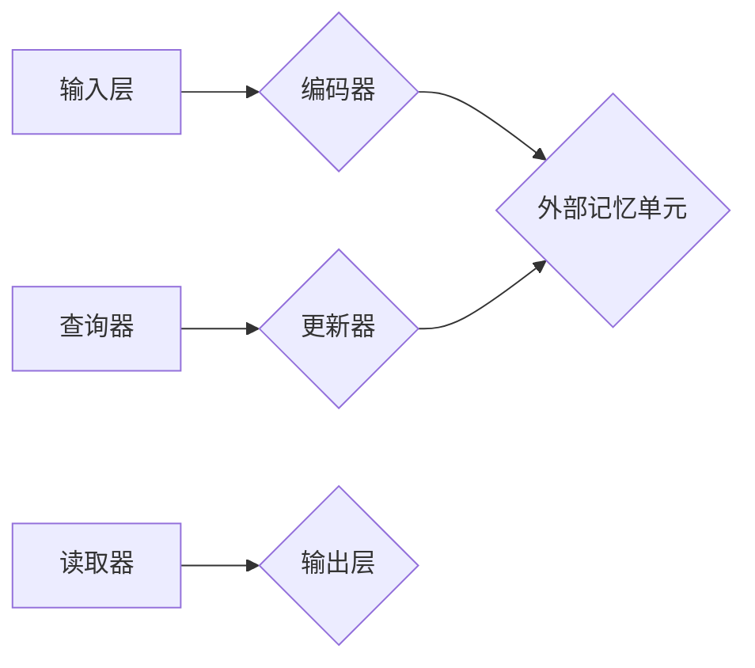

> 视觉逻辑推理、记忆网络、深度学习、知识图谱、计算机视觉

## 1. 背景介绍

视觉逻辑推理是指机器能够理解图像中的场景、物体关系以及逻辑规则，并据此进行推理和决策的能力。它在人工智能领域具有重要意义，能够推动计算机视觉技术向更高级的智能方向发展。传统的视觉推理方法主要依赖于手工设计的规则和特征，难以处理复杂场景和开放世界问题。近年来，深度学习技术的兴起为视觉逻辑推理带来了新的机遇。

深度学习模型能够自动学习图像特征和语义表示，并通过复杂的网络结构进行推理。然而，传统的深度学习模型缺乏记忆能力，难以处理长序列信息和跨场景推理问题。记忆网络 (Memory Network) 是一种新兴的深度学习架构，它通过引入外部记忆单元来解决这个问题。记忆网络能够存储和检索图像信息，从而实现更强大的视觉逻辑推理能力。

## 2. 核心概念与联系

### 2.1 记忆网络

记忆网络是一种深度学习架构，它通过引入外部记忆单元来增强模型的记忆能力。记忆网络的核心思想是将信息存储在外部记忆单元中，并通过查询、更新和读取操作来访问和利用这些信息。

**记忆网络的结构通常包括以下几个部分：**

* **输入层:**接收图像或文本等输入数据。
* **编码器:**将输入数据编码成向量表示，并将其存储在外部记忆单元中。
* **查询器:**根据查询信息从外部记忆单元中检索相关信息。
* **更新器:**根据查询信息和外部记忆单元中的信息更新外部记忆单元。
* **读取器:**从外部记忆单元中读取相关信息，并将其输出。

**Mermaid 流程图:**



### 2.2 视觉逻辑推理

视觉逻辑推理是指机器能够理解图像中的场景、物体关系以及逻辑规则，并据此进行推理和决策的能力。它涉及到以下几个方面：

* **场景理解:**识别图像中的物体、场景和关系。
* **知识推理:**根据图像信息和已有的知识进行逻辑推理。
* **决策制定:**根据推理结果做出决策。

**视觉逻辑推理的应用场景包括:**

* **机器人导航:**帮助机器人理解环境信息，规划路径和避开障碍物。
* **图像识别:**识别图像中的物体、场景和事件。
* **医疗诊断:**辅助医生诊断疾病，分析病理图像。
* **自动驾驶:**帮助汽车理解道路环境，做出驾驶决策。

## 3. 核心算法原理 & 具体操作步骤

### 3.1 算法原理概述

基于记忆网络的视觉逻辑推理算法的核心思想是将图像信息编码成向量表示，并存储在外部记忆单元中。然后，通过查询、更新和读取操作来访问和利用这些信息，实现对图像场景的理解和逻辑推理。

**算法流程:**

1. **图像预处理:**对输入图像进行预处理，例如尺寸调整、颜色转换等。
2. **图像特征提取:**使用卷积神经网络 (CNN) 等方法提取图像特征。
3. **图像信息编码:**将提取的图像特征编码成向量表示，并存储在外部记忆单元中。
4. **逻辑规则编码:**将逻辑规则编码成向量表示，并存储在外部记忆单元中。
5. **查询和推理:**根据查询信息，从外部记忆单元中检索相关图像信息和逻辑规则，并进行逻辑推理。
6. **结果输出:**输出推理结果，例如物体关系、场景描述等。

### 3.2 算法步骤详解

1. **图像预处理:**

   * 将输入图像调整为预设的尺寸，以适应模型的输入要求。
   * 对图像进行归一化处理，将像素值范围调整到 [0, 1] 之间。
   * 可选：对图像进行数据增强，例如旋转、翻转、裁剪等，以提高模型的泛化能力。

2. **图像特征提取:**

   * 使用预训练的 CNN 模型，例如 ResNet、VGG 等，提取图像特征。
   * CNN 模型能够自动学习图像的层次特征，从低层特征到高层特征，逐渐抽象出更抽象的语义信息。
   * 提取的特征通常是图像中不同区域的特征向量，这些向量包含了图像的纹理、形状、颜色等信息。

3. **图像信息编码:**

   * 将提取的图像特征向量输入到编码器中，编码器是一个全连接神经网络，它将图像特征向量映射到一个低维的向量表示。
   * 编码后的向量表示包含了图像的语义信息，可以用于后续的逻辑推理。

4. **逻辑规则编码:**

   * 将逻辑规则用符号表示，例如谓词逻辑、规则语言等。
   * 将符号表示的逻辑规则编码成向量表示，可以使用词嵌入技术或其他编码方法。
   * 编码后的逻辑规则向量可以与图像信息向量进行比较和推理。

5. **查询和推理:**

   * 根据查询信息，从外部记忆单元中检索相关图像信息和逻辑规则。
   * 查询器是一个全连接神经网络，它根据查询信息生成一个查询向量，并与外部记忆单元中的向量进行匹配。
   * 匹配结果可以用来检索相关图像信息和逻辑规则。
   * 使用推理模块，例如注意力机制、图神经网络等，对检索到的信息进行逻辑推理，得出最终的推理结果。

6. **结果输出:**

   * 将推理结果输出，例如物体关系、场景描述等。
   * 可以使用自然语言生成器将推理结果转换为自然语言文本。

### 3.3 算法优缺点

**优点:**

* 能够处理长序列信息和跨场景推理问题。
* 能够学习和利用外部知识。
* 能够进行更复杂的逻辑推理。

**缺点:**

* 训练复杂度高，需要大量的训练数据。
* 记忆单元的容量有限，难以存储大量信息。
* 推理速度相对较慢。

### 3.4 算法应用领域

* **机器人导航:**帮助机器人理解环境信息，规划路径和避开障碍物。
* **图像识别:**识别图像中的物体、场景和事件。
* **医疗诊断:**辅助医生诊断疾病，分析病理图像。
* **自动驾驶:**帮助汽车理解道路环境，做出驾驶决策。

## 4. 数学模型和公式 & 详细讲解 & 举例说明

### 4.1 数学模型构建

**记忆网络的数学模型可以概括为以下几个部分:**

* **编码器:** 将图像特征向量 $x$ 编码成记忆单元向量 $c$。

$$c = f_e(x)$$

* **查询器:** 根据查询向量 $q$ 从记忆单元向量 $c$ 中检索相关信息。

$$a = g_q(q, c)$$

* **更新器:** 根据查询向量 $q$ 和记忆单元向量 $c$ 更新记忆单元向量 $c$。

$$c' = f_u(q, c, a)$$

* **读取器:** 从更新后的记忆单元向量 $c'$ 中读取相关信息。

$$o = g_r(q, c')$$

**其中:**

* $f_e$, $g_q$, $f_u$, $g_r$ 分别表示编码器、查询器、更新器和读取器的函数。
* $x$ 表示图像特征向量。
* $q$ 表示查询向量。
* $c$ 表示记忆单元向量。
* $a$ 表示注意力权重向量。
* $c'$ 表示更新后的记忆单元向量。
* $o$ 表示读取到的信息向量。

### 4.2 公式推导过程

**查询器:**

查询器通常使用注意力机制来计算记忆单元向量 $c$ 和查询向量 $q$ 之间的相关性。注意力机制可以学习到不同记忆单元对查询信息的贡献程度，从而选择出与查询信息最相关的记忆单元。

**注意力权重计算公式:**

$$a_i = \frac{exp(score(q, c_i))}{\sum_{j=1}^{N} exp(score(q, c_j))}$$

**其中:**

* $a_i$ 表示第 $i$ 个记忆单元的注意力权重。
* $score(q, c_i)$ 表示查询向量 $q$ 和第 $i$ 个记忆单元向量 $c_i$ 之间的相似度得分。
* $N$ 表示记忆单元的数量。

**更新器:**

更新器通常使用门控机制来控制记忆单元向量 $c$ 的更新程度。门控机制可以根据查询向量 $q$ 和注意力权重向量 $a$ 来决定哪些记忆单元需要更新。

**更新公式:**

$$c'_i = (1 - \alpha_i)c_i + \alpha_i \cdot f_u(q, c_i, a_i)$$

**其中:**

* $\alpha_i$ 表示第 $i$ 个记忆单元的更新门控值。
* $f_u(q, c_i, a_i)$ 表示更新器函数的输出。

### 4.3 案例分析与讲解

**案例:**

假设我们有一个记忆网络模型，用于识别图像中的物体关系。

**输入图像:** 一张包含猫和狗的图像。

**查询信息:** “猫和狗的关系”。

**推理过程:**

1. 编码器将图像特征向量编码成记忆单元向量。
2. 查询器根据查询信息检索与“猫和狗的关系”相关的记忆单元向量。
3. 更新器根据查询信息和注意力权重向量更新记忆单元向量。
4. 读取器从更新后的记忆单元向量中读取相关信息，例如“猫和狗是哺乳动物”。

**输出结果:** “猫和狗是哺乳动物”。

## 5. 项目实践：代码实例和详细解释说明

### 5.1 开发环境搭建

* **操作系统:** Ubuntu 18.04
* **Python 版本:** 3.7
* **深度学习框架:** TensorFlow 2.0
* **其他依赖库:** numpy, matplotlib, tqdm

### 5.2 源代码详细实现

```python
import tensorflow as tf

# 定义记忆网络模型
class MemoryNetwork(tf.keras.Model):
    def __init__(self, input_dim, memory_size, embedding_dim):
        super(MemoryNetwork, self).__init__()
        self.embedding_dim = embedding_dim
        self.memory_size = memory_size

        # 编码器
        self.encoder = tf.keras.Sequential([
            tf.keras.layers.Dense(128, activation='relu'),
            tf.keras.layers.Dense(embedding_dim)
        ])

        # 查询器
        self.query = tf.keras.Sequential([
            tf.keras.layers.Dense(embedding_dim)
        ])

        # 更新器
        self.updater = tf.keras.Sequential([
            tf.keras.layers.Dense(embedding_dim)
        ])

        # 读取器
        self.reader = tf.keras.Sequential([
            tf.keras.layers.Dense(1)
        ])

        # 记忆单元
        self.memory = tf.Variable(tf.zeros((memory_size, embedding_dim)))

    def call(self, inputs):
        # 编码图像特征
        image_embeddings = self.encoder(inputs)

        # 查询记忆单元
        query_embedding = self.query(inputs)
        attention_weights = tf.nn.softmax(tf.matmul(query_embedding, self.memory), axis=1)
        context_vector = tf.matmul(attention_weights, self.memory)

        # 更新记忆单元
        updated_memory = self.updater(tf.concat([query_embedding, context_vector], axis=1))
        self.memory.assign(updated_memory)

        # 读取记忆单元
        read_output = self.reader(context_vector)

        return read_output

# 实例化模型
model = MemoryNetwork(input_dim=12