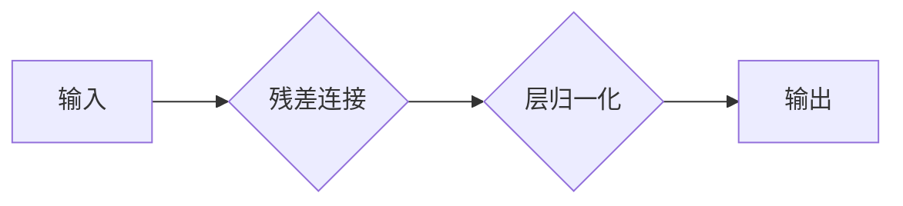

> 大规模语言模型，残差连接，层归一化，深度学习，自然语言处理，Transformer

## 1. 背景介绍

近年来，深度学习在自然语言处理 (NLP) 领域取得了显著进展，大规模语言模型 (LLM) 作为其重要组成部分，展现出强大的文本生成、翻译、问答等能力。然而，随着模型规模的不断扩大，训练和部署这些模型面临着巨大的挑战。其中，残差连接和层归一化作为重要的架构设计，在提升模型性能和训练稳定性方面发挥着关键作用。

### 1.1 深度学习与自然语言处理

深度学习是一种基于多层神经网络的机器学习方法，能够从海量数据中学习复杂的特征表示。在 NLP 领域，深度学习模型能够有效地处理文本序列数据，并实现各种自然语言理解和生成任务。

### 1.2 大规模语言模型的崛起

大规模语言模型是指拥有数亿甚至数十亿参数的深度学习模型，通过训练海量文本数据，能够捕捉语言的复杂结构和语义关系。代表性的 LLM 包括 GPT-3、BERT、LaMDA 等，它们在文本生成、机器翻译、问答系统等领域展现出令人惊叹的性能。

### 1.3 训练和部署的挑战

随着模型规模的不断扩大，训练和部署 LLM 面临着诸多挑战：

* **计算资源需求高:** 训练大型模型需要大量的计算资源和时间。
* **梯度消失/爆炸问题:** 深层网络训练时容易出现梯度消失或爆炸问题，影响模型训练的稳定性。
* **过拟合问题:** 模型过拟合训练数据，导致在未见过的数据上表现不佳。

## 2. 核心概念与联系

残差连接和层归一化是两种重要的架构设计，旨在解决深度学习模型训练中的挑战。

### 2.1 残差连接

残差连接 (Residual Connection) 是一种网络结构，它允许模型学习残差映射，即输入到输出之间的差异。通过残差连接，模型能够更有效地学习深层特征，并缓解梯度消失问题。

### 2.2 层归一化

层归一化 (Layer Normalization) 是一种正则化技术，它对每个样本的每个特征进行归一化处理，从而提高模型的训练稳定性和泛化能力。

### 2.3 残差连接与层归一化的联系

残差连接和层归一化通常被结合使用，以构建更深、更稳定的深度学习模型。层归一化可以加速残差连接的训练，并提高模型的泛化能力。



## 3. 核心算法原理 & 具体操作步骤

### 3.1 算法原理概述

残差连接和层归一化都是基于对神经网络结构和训练过程的改进，旨在解决深度学习模型训练中的挑战。

* **残差连接:** 通过学习残差映射，允许模型更有效地学习深层特征，并缓解梯度消失问题。
* **层归一化:** 通过对每个样本的每个特征进行归一化处理，提高模型的训练稳定性和泛化能力。

### 3.2 算法步骤详解

#### 3.2.1 残差连接

1. 将输入特征 x 传入两个子网络，分别为 f(x) 和 g(x)。
2. 将 f(x) 和 g(x) 相加，得到残差连接输出：y = f(x) + g(x)。

#### 3.2.2 层归一化

1. 对每个样本的每个特征进行归一化处理，使其均值为 0，标准差为 1。
2. 将归一化后的特征作为输入，传递到后续神经网络层。

### 3.3 算法优缺点

#### 3.3.1 残差连接

* **优点:** 缓解梯度消失问题，提高模型训练的稳定性；能够学习更深层的特征表示。
* **缺点:** 增加模型参数量，可能导致过拟合问题。

#### 3.3.2 层归一化

* **优点:** 提高模型的训练稳定性和泛化能力；能够加速模型训练速度。
* **缺点:** 可能导致模型的表达能力下降。

### 3.4 算法应用领域

残差连接和层归一化广泛应用于各种深度学习模型，例如：

* **图像识别:** ResNet、DenseNet 等模型利用残差连接提高了图像识别精度。
* **自然语言处理:** BERT、GPT 等模型利用残差连接和层归一化提高了文本理解和生成能力。
* **语音识别:** Transformer 模型利用残差连接和层归一化提高了语音识别准确率。

## 4. 数学模型和公式 & 详细讲解 & 举例说明

### 4.1 数学模型构建

#### 4.1.1 残差连接

残差连接的数学模型可以表示为：

$$y = F(x) + x$$

其中：

* $x$ 是输入特征向量。
* $F(x)$ 是一个非线性函数，代表子网络的计算过程。
* $y$ 是残差连接输出向量。

#### 4.1.2 层归一化

层归一化的数学模型可以表示为：

$$\hat{x} = \frac{x - \mu}{\sigma}$$

其中：

* $x$ 是输入特征向量。
* $\mu$ 是特征向量 $x$ 的均值。
* $\sigma$ 是特征向量 $x$ 的标准差。
* $\hat{x}$ 是归一化后的特征向量。

### 4.2 公式推导过程

#### 4.2.1 残差连接

残差连接的推导过程主要基于以下思想：

* 将深层网络分解为多个浅层网络，每个网络学习一个残差映射。
* 通过残差连接，模型能够更有效地学习深层特征，并缓解梯度消失问题。

#### 4.2.2 层归一化

层归一化的推导过程主要基于以下思想：

* 对每个样本的每个特征进行归一化处理，使其分布更集中，从而提高模型的训练稳定性和泛化能力。

### 4.3 案例分析与讲解

#### 4.3.1 ResNet 模型

ResNet 模型利用残差连接，能够训练非常深的网络，并在图像识别任务中取得了优异的性能。

#### 4.3.2 BERT 模型

BERT 模型利用残差连接和层归一化，能够捕捉文本序列中的长距离依赖关系，并在各种 NLP 任务中取得了突破性的进展。

## 5. 项目实践：代码实例和详细解释说明

### 5.1 开发环境搭建

* 操作系统: Ubuntu 20.04
* Python 版本: 3.8
* 深度学习框架: PyTorch 1.8

### 5.2 源代码详细实现

```python
import torch
import torch.nn as nn

class ResidualBlock(nn.Module):
    def __init__(self, in_channels, out_channels, stride=1):
        super(ResidualBlock, self).__init__()
        self.conv1 = nn.Conv2d(in_channels, out_channels, kernel_size=3, stride=stride, padding=1)
        self.bn1 = nn.BatchNorm2d(out_channels)
        self.relu = nn.ReLU(inplace=True)
        self.conv2 = nn.Conv2d(out_channels, out_channels, kernel_size=3, stride=1, padding=1)
        self.bn2 = nn.BatchNorm2d(out_channels)
        self.shortcut = nn.Sequential()
        if stride != 1 or in_channels != out_channels:
            self.shortcut = nn.Sequential(
                nn.Conv2d(in_channels, out_channels, kernel_size=1, stride=stride),
                nn.BatchNorm2d(out_channels)
            )

    def forward(self, x):
        out = self.conv1(x)
        out = self.bn1(out)
        out = self.relu(out)
        out = self.conv2(out)
        out = self.bn2(out)
        out += self.shortcut(x)
        out = self.relu(out)
        return out

class ResNet(nn.Module):
    def __init__(self, block, num_blocks, num_classes=10):
        super(ResNet, self).__init__()
        self.in_channels = 64
        self.conv1 = nn.Conv2d(3, 64, kernel_size=3, stride=1, padding=1)
        self.bn1 = nn.BatchNorm2d(64)
        self.relu = nn.ReLU(inplace=True)
        self.layer1 = self._make_layer(block, 64, num_blocks[0], stride=1)
        self.layer2 = self._make_layer(block, 128, num_blocks[1], stride=2)
        self.layer3 = self._make_layer(block, 256, num_blocks[2], stride=2)
        self.layer4 = self._make_layer(block, 512, num_blocks[3], stride=2)
        self.avgpool = nn.AdaptiveAvgPool2d((1, 1))
        self.fc = nn.Linear(512, num_classes)

    def _make_layer(self, block, out_channels, num_blocks, stride):
        layers = []
        layers.append(block(self.in_channels, out_channels, stride))
        self.in_channels = out_channels
        for i in range(1, num_blocks):
            layers.append(block(out_channels, out_channels))
        return nn.Sequential(*layers)

    def forward(self, x):
        out = self.conv1(x)
        out = self.bn1(out)
        out = self.relu(out)
        out = self.layer1(out)
        out = self.layer2(out)
        out = self.layer3(out)
        out = self.layer4(out)
        out = self.avgpool(out)
        out = torch.flatten(out, 1)
        out = self.fc(out)
        return out

# 实例化模型
model = ResNet(ResidualBlock, [2, 2, 2, 2])

# 打印模型结构
print(model)
```

### 5.3 代码解读与分析

* **ResidualBlock:** 残差块的定义，包含两个卷积层、两个 BatchNorm 层和一个 ReLU 激活函数。
* **ResNet:** ResNet 模型的定义，包含多个残差块组成的网络结构。
* **_make_layer:** 创建残差块层的辅助函数。
* **forward:** 模型的正向传播过程。

### 5.4 运行结果展示

运行上述代码，可以训练一个 ResNet 模型，并评估其在图像识别任务上的性能。

## 6. 实际应用场景

### 6.1 图像识别

ResNet 模型在图像识别任务中取得了显著的成果，例如：

* **物体检测:** 识别图像中存在的物体，并定位其位置。
* **图像分类:** 将图像分类到预定义的类别中。
* **图像分割:** 将图像分割成不同的区域，每个区域代表不同的物体或场景。

### 6.2 自然语言处理

BERT 模型在自然语言处理任务中取得了突破性的进展，例如：

* **文本分类:** 将文本分类到预定义的类别中。
* **问答系统:** 回答用户提出的问题。
* **文本摘要:** 生成文本的简短摘要。

### 6.3 其他应用场景

残差连接和层归一化也应用于其他领域，例如