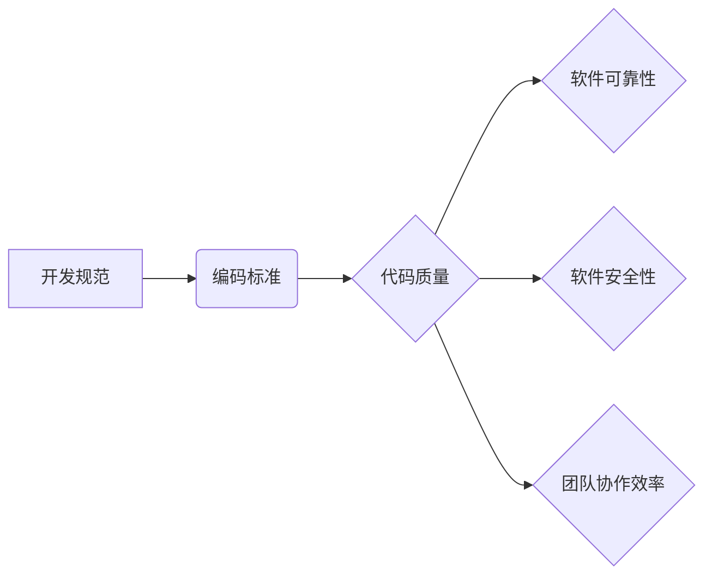

> 开发规范，编码标准，代码质量，代码可读性，代码维护，软件工程，代码风格，代码审查，代码测试

## 1. 背景介绍

在软件开发领域，代码质量是至关重要的因素。高质量的代码不仅易于理解和维护，还能提高软件的可靠性和安全性。而开发规范和编码标准是保证代码质量的关键保障措施。

随着软件工程的发展，项目规模不断扩大，团队协作模式日益普遍。在这种情况下，统一的开发规范和编码标准显得尤为重要。它们可以帮助团队成员保持代码风格的一致性，提高代码的可读性和可维护性，降低代码错误的发生率，并促进团队协作效率。

## 2. 核心概念与联系

**2.1 开发规范**

开发规范是指软件开发过程中遵循的一系列规则和准则，涵盖了代码风格、代码结构、代码注释、版本控制等方面。它们旨在规范软件开发流程，提高代码质量和可维护性。

**2.2 编码标准**

编码标准是指针对代码编写风格和格式的一系列规则和规范。它们通常包括代码缩进、命名规则、空格使用、注释格式等方面。编码标准的目的是使代码更加易读、易维护和易理解。

**2.3 关系图**



## 3. 核心算法原理 & 具体操作步骤

**3.1 算法原理概述**

代码风格检查算法通常基于语法分析和模式匹配技术。

* 语法分析：首先，算法会对代码进行语法分析，识别代码中的各种语法元素，例如变量、函数、循环等。
* 模式匹配：然后，算法会根据预定义的编码标准规则，对代码中的语法元素进行模式匹配，检查是否符合标准规范。

**3.2 算法步骤详解**

1. **代码解析:** 将源代码转换为抽象语法树 (AST)，以便于算法分析。
2. **规则匹配:** 遍历 AST，根据编码标准规则，匹配代码元素是否符合规范。
3. **错误报告:** 如果发现代码不符合规范，则生成错误报告，指出具体位置和违反的规则。

**3.3 算法优缺点**

* **优点:**
    * 自动化检查，提高效率。
    * 规范代码风格，提高代码可读性和可维护性。
    * 减少代码错误，提高软件质量。
* **缺点:**
    * 编码标准规则的制定需要专业知识和经验。
    * 算法可能无法识别所有潜在的代码风格问题。
    * 严格的编码标准可能会限制开发人员的灵活性。

**3.4 算法应用领域**

代码风格检查算法广泛应用于软件开发领域，例如：

* 静态代码分析工具
* 代码审查工具
* 持续集成/持续交付 (CI/CD) 系统

## 4. 数学模型和公式 & 详细讲解 & 举例说明

**4.1 数学模型构建**

代码风格检查算法可以抽象为一个状态机模型，其中每个状态代表代码的语法结构，每个状态转换代表代码元素的匹配规则。

**4.2 公式推导过程**

状态机模型的转换规则可以表示为逻辑公式，例如：

```latex
if (token == "if") {
    state = IF_STATEMENT;
} else if (token == "else") {
    state = ELSE_STATEMENT;
}
```

**4.3 案例分析与讲解**

例如，对于代码片段 `if (x > 0) { ... } else { ... }`，状态机模型会首先进入 `IF_STATEMENT` 状态，然后根据 `else` 关键字进入 `ELSE_STATEMENT` 状态。

## 5. 项目实践：代码实例和详细解释说明

**5.1 开发环境搭建**

* 操作系统：Linux/macOS/Windows
* 编程语言：Python
* 工具：PyLint、Flake8

**5.2 源代码详细实现**

```python
import pylint

# 使用 PyLint 检查代码风格
pylint.lint(['my_code.py'])

# 使用 Flake8 检查代码风格
import flake8

flake8.check_file('my_code.py')
```

**5.3 代码解读与分析**

* `pylint.lint(['my_code.py'])`：使用 PyLint 工具检查 `my_code.py` 文件的代码风格。
* `flake8.check_file('my_code.py')`：使用 Flake8 工具检查 `my_code.py` 文件的代码风格。

**5.4 运行结果展示**

运行上述代码后，会生成详细的代码风格检查报告，指出代码中存在的潜在问题和建议。

## 6. 实际应用场景

**6.1 开源项目**

开源项目通常采用严格的编码标准，以确保代码质量和可维护性。

**6.2 企业级软件开发**

企业级软件开发项目通常需要遵循公司内部的开发规范和编码标准，以保证软件的统一性和可靠性。

**6.2 未来应用展望**

随着人工智能技术的不断发展，代码风格检查算法将更加智能化和自动化，能够识别更多潜在的代码风格问题，并提供更精准的解决方案。

## 7. 工具和资源推荐

**7.1 学习资源推荐**

* 《Clean Code》 by Robert C. Martin
* 《The Pragmatic Programmer》 by Andrew Hunt and David Thomas
* 《Code Complete》 by Steve McConnell

**7.2 开发工具推荐**

* PyLint
* Flake8
* ESLint
* RuboCop

**7.3 相关论文推荐**

* "A Survey of Static Code Analysis Tools"
* "Automatic Code Style Enforcement"

## 8. 总结：未来发展趋势与挑战

**8.1 研究成果总结**

代码风格检查算法已经取得了显著的成果，能够有效地提高代码质量和可维护性。

**8.2 未来发展趋势**

* 更智能化的代码风格检查算法，能够识别更多潜在的代码风格问题。
* 更个性化的代码风格配置，能够满足不同开发团队的需求。
* 代码风格检查与代码重构的结合，能够自动修复代码风格问题。

**8.3 面临的挑战**

* 编码标准的制定需要专业知识和经验，难以满足所有开发团队的需求。
* 严格的编码标准可能会限制开发人员的灵活性。
* 代码风格检查算法难以识别所有潜在的代码风格问题。

**8.4 研究展望**

未来研究方向包括：

* 开发更智能、更灵活的代码风格检查算法。
* 建立统一的编码标准体系，满足不同开发团队的需求。
* 将代码风格检查与代码重构结合，实现自动化修复。

## 9. 附录：常见问题与解答

**9.1 如何制定有效的编码标准？**

制定有效的编码标准需要考虑以下因素：

* 开发团队的经验和技能水平
* 项目的规模和复杂度
* 编码标准的适用范围
* 编码标准的维护和更新机制

**9.2 如何选择合适的代码风格检查工具？**

选择合适的代码风格检查工具需要考虑以下因素：

* 支持的编程语言
* 检查规则的覆盖范围
* 报告格式和可读性
* 集成性

**9.3 如何解决代码风格检查工具产生的错误报告？**

解决代码风格检查工具产生的错误报告需要根据具体情况进行分析和处理。

* 确认错误报告的准确性
* 了解错误报告的原因
* 根据编码标准进行修改


作者：禅与计算机程序设计艺术 / Zen and the Art of Computer Programming 
<end_of_turn>