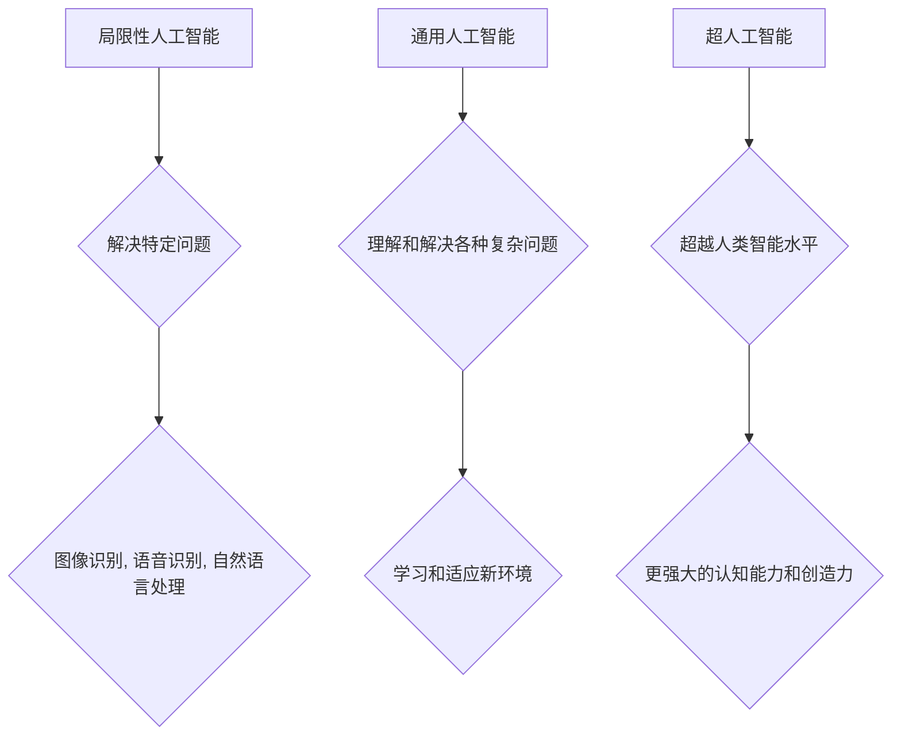

> 人工智能, 阶段, 发展, 挑战, 未来

## 1. 背景介绍

人工智能（Artificial Intelligence，AI）作为一项前沿科技，近年来发展迅速，取得了令人瞩目的成就。从早期局限于特定领域的专家系统，到如今能够进行图像识别、自然语言处理、决策分析等复杂任务的通用人工智能，AI正深刻地改变着我们的生活和工作方式。

张钹院士，中国人工智能领域的领军人物，曾提出过人工智能发展的三个阶段：

* **第一阶段：局限性人工智能（Narrow AI）**：专注于解决特定问题，例如玩象棋、识别图像等。这类AI系统在特定领域表现出色，但缺乏泛化能力，无法应对超出其训练范围的问题。
* **第二阶段：通用人工智能（General AI）**：具备人类一般的智能水平，能够理解和解决各种复杂问题，并具备学习和适应新环境的能力。
* **第三阶段：超人工智能（Super AI）**：超越人类智能水平，拥有更强大的认知能力和创造力。

张钹院士的观点为我们理解人工智能的发展方向提供了重要的参考。

## 2. 核心概念与联系

### 2.1  人工智能的定义

人工智能是指模拟和扩展人类智能的计算机系统。它涵盖了多个学科，包括计算机科学、数学、心理学、神经科学等。

### 2.2  人工智能的三个阶段

* **第一阶段：局限性人工智能（Narrow AI）**

    * 特点：专注于解决特定问题，例如图像识别、语音识别、自然语言处理等。
    * 代表性技术：机器学习、深度学习、强化学习等。
    * 应用场景：自动驾驶、医疗诊断、金融风险控制等。

* **第二阶段：通用人工智能（General AI）**

    * 特点：具备人类一般的智能水平，能够理解和解决各种复杂问题。
    * 目前处于研究阶段，尚未实现。
    * 挑战：如何构建能够学习和适应新环境的智能系统。

* **第三阶段：超人工智能（Super AI）**

    * 特点：超越人类智能水平，拥有更强大的认知能力和创造力。
    * 目前处于科幻小说和哲学讨论阶段，存在伦理和安全风险。



## 3. 核心算法原理 & 具体操作步骤

### 3.1  算法原理概述

人工智能算法是实现人工智能功能的核心。常见的算法包括：

* **机器学习算法：**通过数据训练模型，使模型能够从数据中学习规律，并进行预测或分类。
* **深度学习算法：**一种更高级的机器学习算法，利用多层神经网络模拟人类大脑的学习过程。
* **强化学习算法：**通过奖励和惩罚机制，训练智能体在环境中学习最佳策略。

### 3.2  算法步骤详解

以机器学习算法为例，其基本步骤如下：

1. **数据收集和预处理：**收集相关数据，并进行清洗、转换、特征提取等预处理工作。
2. **模型选择：**根据任务需求选择合适的机器学习模型，例如线性回归、逻辑回归、决策树、支持向量机等。
3. **模型训练：**使用训练数据训练模型，调整模型参数，使模型能够准确地预测或分类。
4. **模型评估：**使用测试数据评估模型的性能，例如准确率、召回率、F1-score等。
5. **模型部署：**将训练好的模型部署到实际应用场景中，用于进行预测或分类。

### 3.3  算法优缺点

每个算法都有其优缺点，需要根据具体任务选择合适的算法。

* **机器学习算法：**优点：能够从数据中学习规律，适应不断变化的环境。缺点：需要大量数据进行训练，对数据质量要求高。
* **深度学习算法：**优点：能够处理复杂的数据，学习更深层次的特征。缺点：训练时间长，计算资源消耗大。
* **强化学习算法：**优点：能够学习最佳策略，适应动态环境。缺点：训练过程复杂，需要设计合理的奖励机制。

### 3.4  算法应用领域

人工智能算法广泛应用于各个领域，例如：

* **医疗保健：**疾病诊断、药物研发、个性化治疗等。
* **金融服务：**风险控制、欺诈检测、投资决策等。
* **制造业：**质量控制、预测维护、智能制造等。
* **交通运输：**自动驾驶、交通流量优化等。

## 4. 数学模型和公式 & 详细讲解 & 举例说明

### 4.1  数学模型构建

人工智能算法的数学模型通常基于线性代数、微积分、概率论等数学基础。例如，神经网络的激活函数可以表示为 sigmoid 函数或 ReLU 函数，这些函数的数学表达式可以用来计算神经元的输出值。

### 4.2  公式推导过程

例如，线性回归模型的目标是找到一条直线，能够最佳地拟合训练数据。模型的损失函数可以定义为预测值与真实值的平方差，通过梯度下降算法，不断调整模型参数，使得损失函数最小化。

### 4.3  案例分析与讲解

例如，在图像识别任务中，可以使用卷积神经网络（CNN）进行图像分类。CNN 利用卷积操作提取图像特征，并通过全连接层进行分类。

## 5. 项目实践：代码实例和详细解释说明

### 5.1  开发环境搭建

使用 Python 语言和 TensorFlow 或 PyTorch 等深度学习框架进行开发。

### 5.2  源代码详细实现

```python
import tensorflow as tf

# 定义模型结构
model = tf.keras.models.Sequential([
    tf.keras.layers.Conv2D(32, (3, 3), activation='relu', input_shape=(28, 28, 1)),
    tf.keras.layers.MaxPooling2D((2, 2)),
    tf.keras.layers.Conv2D(64, (3, 3), activation='relu'),
    tf.keras.layers.MaxPooling2D((2, 2)),
    tf.keras.layers.Flatten(),
    tf.keras.layers.Dense(10, activation='softmax')
])

# 编译模型
model.compile(optimizer='adam',
              loss='sparse_categorical_crossentropy',
              metrics=['accuracy'])

# 训练模型
model.fit(x_train, y_train, epochs=5)

# 评估模型
loss, accuracy = model.evaluate(x_test, y_test)
print('Test loss:', loss)
print('Test accuracy:', accuracy)
```

### 5.3  代码解读与分析

这段代码定义了一个简单的卷积神经网络模型，用于手写数字识别任务。模型包含两层卷积层、两层最大池化层、一层全连接层和一层输出层。

### 5.4  运行结果展示

训练完成后，模型可以用于预测新的手写数字图像。

## 6. 实际应用场景

### 6.1  自动驾驶

人工智能技术在自动驾驶领域发挥着重要作用，例如：

* **环境感知：**利用摄像头、雷达、激光雷达等传感器获取环境信息，识别道路、车辆、行人等。
* **路径规划：**根据环境信息规划行驶路径，避开障碍物，安全到达目的地。
* **决策控制：**根据环境信息和路径规划，控制车辆的加速、减速、转向等动作。

### 6.2  医疗诊断

人工智能技术可以辅助医生进行疾病诊断，例如：

* **图像分析：**利用深度学习算法分析医学影像，识别肿瘤、骨折等异常情况。
* **病历分析：**利用自然语言处理技术分析病历信息，辅助医生诊断疾病。
* **药物研发：**利用机器学习算法分析药物数据，预测药物的疗效和安全性。

### 6.3  金融风险控制

人工智能技术可以帮助金融机构识别和控制风险，例如：

* **欺诈检测：**利用机器学习算法分析交易数据，识别异常交易行为，防止欺诈。
* **信用评估：**利用机器学习算法分析客户数据，评估客户的信用风险。
* **投资决策：**利用机器学习算法分析市场数据，辅助投资决策。

### 6.4  未来应用展望

人工智能技术的发展将带来更多新的应用场景，例如：

* **个性化教育：**根据学生的学习情况，提供个性化的学习内容和教学方法。
* **智能家居：**利用人工智能技术，实现家居设备的智能化控制和管理。
* **机器人服务：**开发更加智能的机器人，用于服务业、医疗保健等领域。

## 7. 工具和资源推荐

### 7.1  学习资源推荐

* **在线课程：**Coursera、edX、Udacity 等平台提供丰富的 AI 课程。
* **书籍：**《深度学习》、《人工智能：现代方法》等书籍。
* **博客和论坛：**机器之心、AI 算法等网站和论坛。

### 7.2  开发工具推荐

* **Python：**人工智能开发的常用语言。
* **TensorFlow：**开源深度学习框架。
* **PyTorch：**开源深度学习框架。
* **Keras：**深度学习框架，易于使用。

### 7.3  相关论文推荐

* **《ImageNet Classification with Deep Convolutional Neural Networks》**
* **《Attention Is All You Need》**
* **《Deep Reinforcement Learning》**

## 8. 总结：未来发展趋势与挑战

### 8.1  研究成果总结

人工智能技术取得了显著的进展，在各个领域都展现出巨大的应用潜力。

### 8.2  未来发展趋势

* **更强大的计算能力：**人工智能算法的训练需要大量的计算资源，未来将需要更加强大的计算能力支持。
* **更丰富的训练数据：**人工智能算法的性能与训练数据的质量密切相关，未来将需要收集和标注更多的数据。
* **更深入的理论研究：**人工智能算法的原理和机制尚不完全清楚，未来需要更深入的理论研究。

### 8.3  面临的挑战

* **伦理问题：**人工智能技术的应用可能带来伦理问题，例如算法偏见、隐私泄露等。
* **安全问题：**人工智能系统可能被恶意攻击，导致安全风险。
* **就业问题：**人工智能技术可能导致部分工作岗位被取代。

### 8.4  研究展望

未来人工智能研究将继续朝着更智能、更安全、更可解释的方向发展。

## 9. 附录：常见问题与解答

### 9.1  什么是机器学习？

机器学习是一种人工智能技术，通过数据训练模型，使模型能够从数据中学习规律，并进行预测或分类。

### 9.2  什么是深度学习？

深度学习是一种更高级的机器学习算法，利用多层神经网络模拟人类大脑的学习过程。

### 9.3  人工智能会取代人类吗？

人工智能技术的发展可能会改变一些工作岗位，但不会完全取代人类。人类的创造力、想象力和情感能力仍然是人工智能无法替代的。

作者：禅与计算机程序设计艺术 / Zen and the Art of Computer Programming


<end_of_turn>