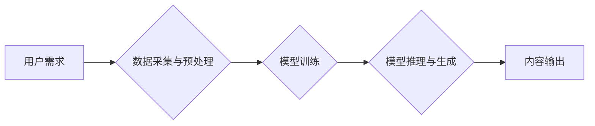

> AIGC, 文本生成, 图像生成, 多模态, 伦理, 安全, 监管

## 1. 背景介绍

人工智能（AI）技术近年来发展迅速，特别是生成式人工智能（AIGC）的兴起，为人类创造内容的方式带来了革命性的改变。AIGC是指利用人工智能技术自动生成各种新内容，例如文本、图像、音频、视频等。从ChatGPT的爆火到DALL-E 2的惊艳表现，AIGC已经不再是科幻小说中的幻想，而是触手可及的现实。

AIGC技术的应用场景广泛，涵盖了教育、娱乐、营销、设计、科研等各个领域。它可以帮助人们更高效地创作内容，激发创意灵感，并为人们的生活带来更多便利。

## 2. 核心概念与联系

**2.1  AIGC的核心概念**

AIGC的核心概念是利用深度学习算法训练模型，使其能够理解和生成人类语言和多模态数据。

**2.2  AIGC与传统内容创作的对比**

传统内容创作依赖于人类的经验、知识和创造力，而AIGC则通过算法和数据驱动，自动生成内容。

**2.3  AIGC的优势和挑战**

AIGC具有以下优势：

* **效率提升:** AIGC可以大幅提高内容创作效率，节省时间和人力成本。
* **创意激发:** AIGC可以帮助人们突破思维定式，激发新的创意灵感。
* **个性化定制:** AIGC可以根据用户的需求和喜好，生成个性化的内容。

然而，AIGC也面临一些挑战：

* **内容质量:** AIGC生成的內容质量仍然存在一定差距，需要不断改进算法和训练数据。
* **伦理问题:** AIGC可能被用于生成虚假信息、侵犯版权等，需要制定相应的伦理规范和法律法规。
* **安全风险:** AIGC可能被用于恶意攻击、传播有害信息等，需要加强安全防护措施。

**2.4  AIGC的未来发展趋势**

AIGC技术将朝着以下方向发展：

* **多模态生成:** AIGC将不仅仅局限于文本生成，还会扩展到图像、音频、视频等多模态内容的生成。
* **个性化定制:** AIGC将更加注重用户体验，提供更加个性化、定制化的内容服务。
* **跨领域应用:** AIGC将应用于更多领域，例如教育、医疗、金融等，为人们的生活带来更多便利。

**2.5  AIGC架构图**

## 3. 核心算法原理 & 具体操作步骤

**3.1  算法原理概述**

AIGC的核心算法主要包括：

* **Transformer模型:** Transformer模型是一种深度学习模型，能够有效地处理序列数据，例如文本。它通过注意力机制，能够捕捉文本中的长距离依赖关系，从而生成更加流畅、自然的文本。
* **生成对抗网络(GAN):** GAN是一种生成模型，由生成器和鉴别器两部分组成。生成器试图生成逼真的数据，而鉴别器试图区分真实数据和生成数据。通过不断的对抗训练，生成器能够生成越来越逼真的数据。

**3.2  算法步骤详解**

**3.2.1  Transformer模型训练步骤**

1. **数据预处理:** 将文本数据进行清洗、分词、词向量化等预处理操作。
2. **模型构建:** 根据Transformer模型的架构，构建模型结构，包括编码器和解码器。
3. **模型训练:** 使用训练数据，通过反向传播算法，训练模型参数。
4. **模型评估:** 使用测试数据，评估模型的生成效果。

**3.2.2  GAN模型训练步骤**

1. **数据准备:** 准备真实数据和噪声数据。
2. **模型构建:** 构建生成器和鉴别器模型。
3. **模型训练:** 使用真实数据和噪声数据，训练生成器和鉴别器模型。
4. **模型评估:** 使用生成器生成的假数据，评估模型的生成效果。

**3.3  算法优缺点**

**3.3.1  Transformer模型**

* **优点:** 能够有效地处理长距离依赖关系，生成流畅、自然的文本。
* **缺点:** 训练成本高，需要大量的计算资源。

**3.3.2  GAN模型**

* **优点:** 可以生成逼真的数据，适用于图像、音频等多模态数据生成。
* **缺点:** 训练过程比较复杂，容易出现模式崩溃等问题。

**3.4  算法应用领域**

* **文本生成:** 文章写作、故事创作、对话系统等。
* **图像生成:** 图片合成、图像修复、艺术创作等。
* **音频生成:** 语音合成、音乐创作、音效制作等。
* **视频生成:** 视频剪辑、视频特效、动画制作等。

## 4. 数学模型和公式 & 详细讲解 & 举例说明

**4.1  数学模型构建**

AIGC模型通常基于深度学习框架，例如TensorFlow或PyTorch。这些框架提供了一系列预训练模型和工具，可以帮助开发者快速构建和训练AIGC模型。

**4.2  公式推导过程**

AIGC模型的训练过程涉及到大量的数学公式，例如损失函数、梯度下降算法等。这些公式的推导过程比较复杂，需要一定的数学基础。

**4.3  案例分析与讲解**

**4.3.1  文本生成案例**

假设我们想要训练一个文本生成模型，生成类似于新闻报道的文本。我们可以使用Transformer模型，并训练模型在新闻报道数据集上。

训练过程中，模型会学习到新闻报道的语法结构、词汇特征和主题内容。最终，模型能够根据输入的关键词或句子，生成类似于新闻报道的文本。

**4.3.2  图像生成案例**

假设我们想要训练一个图像生成模型，生成逼真的猫的图像。我们可以使用GAN模型，并训练模型在猫图像数据集上。

训练过程中，生成器会尝试生成猫的图像，而鉴别器会试图区分真实猫图像和生成器生成的图像。通过不断的对抗训练，生成器能够生成越来越逼真的猫图像。

## 5. 项目实践：代码实例和详细解释说明

**5.1  开发环境搭建**

AIGC模型的开发环境通常需要安装Python、深度学习框架（例如TensorFlow或PyTorch）以及相关的库和工具。

**5.2  源代码详细实现**

AIGC模型的源代码实现比较复杂，需要根据具体的模型架构和任务需求进行编写。

**5.3  代码解读与分析**

代码解读需要分析代码的逻辑结构、算法实现以及数据处理流程。

**5.4  运行结果展示**

运行结果展示需要展示模型生成的文本、图像、音频等内容，并进行评估和分析。

## 6. 实际应用场景

**6.1  教育领域**

* **智能辅导系统:** AIGC可以帮助学生理解学习内容，解答疑问，提供个性化的学习指导。
* **自动批改系统:** AIGC可以自动批改学生的作业，节省教师的时间和精力。
* **虚拟教师:** AIGC可以模拟教师的教学方式，为学生提供沉浸式的学习体验。

**6.2  娱乐领域**

* **游戏创作:** AIGC可以帮助游戏开发者生成游戏场景、人物、道具等内容，提高游戏开发效率。
* **影视制作:** AIGC可以用于生成电影剧本、特效、配音等内容，降低影视制作成本。
* **音乐创作:** AIGC可以帮助音乐人创作新的音乐作品，探索新的音乐风格。

**6.3  营销领域**

* **内容营销:** AIGC可以帮助企业生成各种营销内容，例如广告文案、社交媒体帖子等，提高营销效果。
* **个性化推荐:** AIGC可以根据用户的兴趣爱好，推荐个性化的产品和服务。
* **客户服务:** AIGC可以用于构建智能客服系统，为客户提供24小时在线服务。

**6.4  未来应用展望**

AIGC技术将应用于更多领域，例如医疗、金融、科研等，为人们的生活带来更多便利。

## 7. 工具和资源推荐

**7.1  学习资源推荐**

* **在线课程:** Coursera、edX、Udacity等平台提供AIGC相关的在线课程。
* **书籍:** 《深度学习》、《自然语言处理》等书籍可以帮助读者了解AIGC的基础知识。
* **博客和论坛:** 许多技术博客和论坛提供AIGC相关的技术文章和讨论。

**7.2  开发工具推荐**

* **TensorFlow:** Google开发的开源深度学习框架。
* **PyTorch:** Facebook开发的开源深度学习框架。
* **HuggingFace:** 提供各种预训练AIGC模型和工具。

**7.3  相关论文推荐**

* **Attention Is All You Need:** Transformer模型的奠基性论文。
* **Generative Adversarial Networks:** GAN模型的奠基性论文。

## 8. 总结：未来发展趋势与挑战

**8.1  研究成果总结**

近年来，AIGC技术取得了显著进展，模型的生成能力不断提升，应用场景也越来越广泛。

**8.2  未来发展趋势**

AIGC技术将朝着以下方向发展：

* **多模态生成:** AIGC将不仅仅局限于文本生成，还会扩展到图像、音频、视频等多模态内容的生成。
* **个性化定制:** AIGC将更加注重用户体验，提供更加个性化、定制化的内容服务。
* **跨领域应用:** AIGC将应用于更多领域，例如教育、医疗、金融等，为人们的生活带来更多便利。

**8.3  面临的挑战**

AIGC技术也面临一些挑战：

* **内容质量:** AIGC生成的內容质量仍然存在一定差距，需要不断改进算法和训练数据。
* **伦理问题:** AIGC可能被用于生成虚假信息、侵犯版权等，需要制定相应的伦理规范和法律法规。
* **安全风险:** AIGC可能被用于恶意攻击、传播有害信息等，需要加强安全防护措施。

**8.4  研究展望**

未来，AIGC研究将更加注重以下方面：

* **提高内容质量:** 研究更有效的算法和训练方法，生成更高质量的内容。
* **解决伦理问题:** 制定相应的伦理规范和法律法规，引导AIGC技术健康发展。
* **加强安全防护:** 研究AIGC的安全防护技术，防止其被用于恶意目的。

## 9. 附录：常见问题与解答

**9.1  AIGC与传统内容创作的区别是什么？**

AIGC利用算法和数据驱动，自动生成内容，而传统内容创作依赖于人类的经验、知识和创造力。

**9.2  AIGC有哪些应用场景？**

AIGC应用场景广泛，例如文本生成、图像生成、音频生成、视频生成等。

**9.3  AIGC技术有哪些挑战？**

AIGC技术面临的内容质量、伦理问题和安全风险等挑战。

**9.4  如何学习AIGC技术？**

可以通过在线课程、书籍、博客和论坛等方式学习AIGC技术。

作者：禅与计算机程序设计艺术 / Zen and the Art of Computer Programming

<end_of_turn>