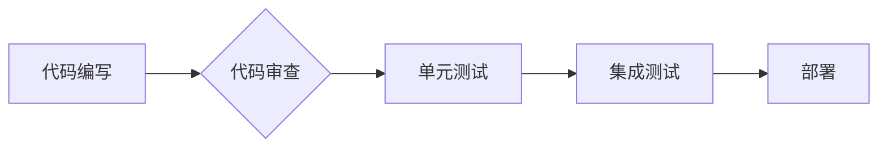

> 流水线, 生产效率, 优化, 自动化, 持续集成, 持续交付, DevOps

## 1. 背景介绍

在现代工业和软件开发领域，流水线模式已经成为提高生产效率和质量的关键手段。流水线，也称为生产线，是一种将生产过程分解成多个独立步骤，并由不同的工人或机器依次完成的组织方式。这种模式源于早期汽车制造业的应用，后来被广泛应用于各种行业，包括软件开发。

软件开发中的流水线通常指的是将软件开发流程自动化和标准化的过程，它将代码编写、测试、构建、部署等各个环节串联起来，形成一个连续的流程。通过流水线，开发团队可以更快地交付高质量的软件，并提高开发效率。

## 2. 核心概念与联系

### 2.1 流水线模式

流水线模式的核心思想是将复杂的任务分解成一系列简单、可重复的步骤，并通过协作和分工来完成。每个步骤都由专门的工人或机器负责，并按照预定的顺序进行操作。这种模式可以有效地提高生产效率，因为每个工人只需要专注于自己的任务，并可以重复执行相同的操作，从而提高熟练度和速度。

### 2.2 流水线与软件开发

在软件开发领域，流水线模式被应用于软件开发流程的自动化和标准化。它将软件开发过程分解成多个阶段，例如代码编写、代码审查、单元测试、集成测试、部署等，并通过自动化工具和流程来实现这些阶段的连续执行。

### 2.3 流水线架构

**Mermaid 流程图**



## 3. 核心算法原理 & 具体操作步骤

### 3.1 算法原理概述

流水线模式的核心算法原理是基于分工合作和流水线生产的思想。它将复杂的任务分解成一系列简单、可重复的步骤，并通过自动化工具和流程来实现这些步骤的连续执行。

### 3.2 算法步骤详解

1. **代码编写:** 开发人员编写代码，并将其提交到代码库中。
2. **代码审查:** 其他开发人员对提交的代码进行审查，以确保代码质量和符合规范。
3. **单元测试:** 开发人员编写单元测试用例，并运行测试以验证代码的正确性。
4. **集成测试:** 将多个模块集成在一起，并进行集成测试以验证模块之间的交互和整体功能。
5. **部署:** 将经过测试的代码部署到测试环境或生产环境中。

### 3.3 算法优缺点

**优点:**

* **提高效率:** 通过自动化和标准化流程，可以显著提高软件开发效率。
* **提高质量:** 代码审查和测试环节可以有效地保证代码质量。
* **缩短交付周期:** 流水线模式可以加速软件交付周期。
* **提高团队协作:** 流水线模式可以促进团队成员之间的协作和沟通。

**缺点:**

* **初始成本较高:** 建立流水线需要投入一定的成本，包括工具、培训和流程设计。
* **流程复杂:** 流水线模式的流程可能比较复杂，需要团队成员进行充分的培训和理解。
* **缺乏灵活性:** 流水线模式的流程相对固定，可能难以适应快速变化的需求。

### 3.4 算法应用领域

流水线模式广泛应用于软件开发领域，包括：

* **Web 应用开发:** 用于开发和部署Web应用程序。
* **移动应用开发:** 用于开发和部署移动应用程序。
* **云计算平台:** 用于构建和部署云计算平台。
* **数据分析平台:** 用于构建和部署数据分析平台。

## 4. 数学模型和公式 & 详细讲解 & 举例说明

### 4.1 数学模型构建

我们可以使用以下数学模型来描述流水线对生产效率的影响：

```latex
Efficiency = \frac{Total Output}{Total Input}
```

其中：

* **Efficiency:** 生产效率
* **Total Output:** 总产量
* **Total Input:** 总投入

### 4.2 公式推导过程

假设一个流水线生产过程，投入时间为 **T**，产出数量为 **Q**。则生产效率可以表示为：

```latex
Efficiency = \frac{Q}{T}
```

### 4.3 案例分析与讲解

假设一个软件开发团队使用流水线模式开发一个软件项目，项目开发时间为 **T**，项目产出数量为 **Q**。使用流水线模式后，开发团队可以将开发时间缩短为 **T'**，项目产出数量增加到 **Q'**。

则使用流水线模式后的生产效率为：

```latex
Efficiency' = \frac{Q'}{T'}
```

如果 **Efficiency' > Efficiency**，则说明流水线模式提高了软件开发效率。

## 5. 项目实践：代码实例和详细解释说明

### 5.1 开发环境搭建

为了演示流水线模式的应用，我们可以使用以下开发环境搭建一个简单的软件开发流水线：

* **版本控制系统:** Git
* **代码构建工具:** Maven
* **单元测试框架:** JUnit
* **持续集成平台:** Jenkins

### 5.2 源代码详细实现

以下是一个简单的Java应用程序的代码示例，以及对应的单元测试用例：

```java
// HelloWorld.java
public class HelloWorld {
    public static void main(String[] args) {
        System.out.println("Hello, World!");
    }
}
```

```java
// HelloWorldTest.java
import org.junit.jupiter.api.Test;
import static org.junit.jupiter.api.Assertions.assertEquals;

public class HelloWorldTest {
    @Test
    public void testHelloWorld() {
        HelloWorld helloWorld = new HelloWorld();
        assertEquals("Hello, World!", helloWorld.main(null));
    }
}
```

### 5.3 代码解读与分析

* **HelloWorld.java:** 这是一个简单的Java应用程序，它打印出“Hello, World!”的字符串。
* **HelloWorldTest.java:** 这是一个单元测试用例，它测试HelloWorld应用程序的main方法是否能够正确打印出“Hello, World!”的字符串。

### 5.4 运行结果展示

通过运行单元测试用例，我们可以验证HelloWorld应用程序的正确性。

## 6. 实际应用场景

流水线模式在软件开发领域有着广泛的应用场景，例如：

* **持续集成 (CI):** 流水线模式可以用于实现持续集成，即将代码频繁地提交到代码库，并自动构建和测试代码。
* **持续交付 (CD):** 流水线模式可以用于实现持续交付，即将经过测试的代码自动部署到测试环境或生产环境中。
* **DevOps:** 流水线模式是DevOps文化的重要组成部分，它可以帮助开发团队和运维团队更好地协作，并提高软件交付效率。

### 6.4 未来应用展望

随着软件开发技术的不断发展，流水线模式的应用场景将会更加广泛。例如：

* **人工智能 (AI):** 流水线模式可以用于训练和部署人工智能模型。
* **物联网 (IoT):** 流水线模式可以用于管理和维护物联网设备。
* **区块链 (Blockchain):** 流水线模式可以用于开发和部署区块链应用程序。

## 7. 工具和资源推荐

### 7.1 学习资源推荐

* **书籍:**
    * "The Phoenix Project: A Novel About IT, DevOps, and Helping Your Business Win" by Gene Kim, Kevin Behr, and George Spafford
    * "Continuous Delivery: Reliable Software Releases through Build, Test, and Deployment Automation" by Jez Humble and David Farley
* **在线课程:**
    * Udemy: DevOps Fundamentals
    * Coursera: DevOps Specialization

### 7.2 开发工具推荐

* **版本控制系统:** Git
* **代码构建工具:** Maven, Gradle
* **单元测试框架:** JUnit, TestNG
* **持续集成平台:** Jenkins, CircleCI, Travis CI
* **容器化平台:** Docker, Kubernetes

### 7.3 相关论文推荐

* "The DevOps Handbook: How to Create World-Class Agility, Reliability, and Security in Technology Organizations" by Gene Kim, Jez Humble, Patrick Debois, and John Willis
* "Accelerate: The Science of Lean Software and DevOps: Building and Scaling High Performing Technology Organizations" by Nicole Forsgren, Jez Humble, and Gene Kim

## 8. 总结：未来发展趋势与挑战

### 8.1 研究成果总结

流水线模式已经成为软件开发领域的重要技术，它可以显著提高软件开发效率和质量。

### 8.2 未来发展趋势

未来，流水线模式将会更加智能化、自动化和可扩展。例如：

* **人工智能 (AI):** AI可以用于自动优化流水线流程，并提高流水线效率。
* **云计算 (Cloud Computing):** 云计算平台可以提供更加灵活和可扩展的流水线服务。
* **容器化 (Containerization):** 容器化技术可以简化流水线部署和管理。

### 8.3 面临的挑战

尽管流水线模式具有诸多优势，但也面临一些挑战，例如：

* **流程复杂性:** 流水线模式的流程可能比较复杂，需要团队成员进行充分的培训和理解。
* **安全风险:** 流水线模式可能会引入新的安全风险，需要采取相应的安全措施。
* **技术演进:** 软件开发技术不断演进，流水线模式需要不断更新和改进以适应新的技术。

### 8.4 研究展望

未来，研究人员将继续探索流水线模式的应用场景和优化方法，以提高软件开发效率和质量。

## 9. 附录：常见问题与解答

### 9.1 什么是流水线？

流水线是一种将生产过程分解成多个独立步骤，并由不同的工人或机器依次完成的组织方式。

### 9.2 流水线模式有哪些优点？

流水线模式可以提高生产效率、提高代码质量、缩短交付周期和提高团队协作。

### 9.3 如何搭建一个简单的软件开发流水线？

可以使用Git、Maven、JUnit和Jenkins等工具搭建一个简单的软件开发流水线。

### 9.4 流水线模式有哪些挑战？

流水线模式面临的挑战包括流程复杂性、安全风险和技术演进。

### 9.5 流水线模式的未来发展趋势是什么？

未来，流水线模式将会更加智能化、自动化和可扩展。


作者：禅与计算机程序设计艺术 / Zen and the Art of Computer Programming 
<end_of_turn>