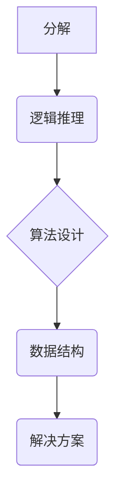

> 结构化思维，算法设计，逻辑推理，数据结构，编程思维，问题解决

## 1. 背景介绍

在当今信息爆炸的时代，我们每天都面临着海量的资讯和信息处理任务。如何有效地获取、理解和利用这些信息，成为了一个至关重要的挑战。结构化思维，作为一种高效的认知模式，为我们提供了解决这一问题的关键。它是一种将复杂问题分解成更小的、可管理的子问题，并通过逻辑推理和算法设计来解决问题的思维方式。

结构化思维在各个领域都具有广泛的应用，尤其是在软件开发、数据分析、科学研究等领域发挥着至关重要的作用。它可以帮助我们：

* **清晰地定义问题：** 通过分解复杂问题，我们可以更准确地识别问题的核心，并制定更有效的解决方案。
* **提高逻辑推理能力：** 结构化思维强调逻辑推理和步骤式思考，可以帮助我们增强逻辑思维能力，并更有效地解决问题。
* **优化算法设计：** 在软件开发中，结构化思维可以帮助我们设计更简洁、高效的算法，提高软件的性能和可靠性。
* **促进数据分析：** 在数据分析领域，结构化思维可以帮助我们构建更合理的分析模型，并从海量数据中提取有价值的信息。

## 2. 核心概念与联系

结构化思维的核心概念包括：

* **分解：** 将复杂问题分解成更小的、可管理的子问题。
* **逻辑推理：** 使用逻辑规则和推理方法来分析问题和解决问题。
* **算法设计：** 设计步骤明确、逻辑清晰的算法来解决问题。
* **数据结构：** 使用合适的结构来存储和组织数据，以便于处理和分析。

这些概念相互关联，共同构成了结构化思维的框架。



## 3. 核心算法原理 & 具体操作步骤

### 3.1  算法原理概述

算法是一种解决特定问题的步骤式描述，它可以被计算机执行。一个好的算法应该具有以下特点：

* **确定性：** 对于给定的输入，算法应该始终产生相同的输出。
* **有限性：** 算法应该在有限的时间内完成执行。
* **有效性：** 算法应该能够被计算机理解和执行。

### 3.2  算法步骤详解

算法的步骤通常可以分为以下几个部分：

1. **输入：** 算法接收输入数据。
2. **处理：** 算法对输入数据进行处理，例如计算、比较、排序等操作。
3. **输出：** 算法生成输出结果。

### 3.3  算法优缺点

不同的算法具有不同的优缺点，选择合适的算法取决于具体的问题和需求。

* **时间复杂度：** 算法执行的时间与输入数据大小的关系。
* **空间复杂度：** 算法使用的内存空间大小。

### 3.4  算法应用领域

算法广泛应用于各个领域，例如：

* **搜索引擎：** 使用算法来排名网页，并根据用户查询返回相关结果。
* **图像识别：** 使用算法来识别图像中的物体和场景。
* **推荐系统：** 使用算法来推荐用户可能感兴趣的内容。

## 4. 数学模型和公式 & 详细讲解 & 举例说明

### 4.1  数学模型构建

数学模型可以用来描述和分析现实世界中的现象和关系。在结构化思维中，数学模型可以帮助我们更清晰地理解问题，并设计更有效的解决方案。

### 4.2  公式推导过程

公式推导过程是数学模型构建的重要步骤，它需要遵循一定的逻辑规则和推理方法。

### 4.3  案例分析与讲解

通过对实际案例的分析，我们可以更深入地理解数学模型和公式的应用。

## 5. 项目实践：代码实例和详细解释说明

### 5.1  开发环境搭建

在进行项目实践之前，我们需要搭建一个合适的开发环境。

### 5.2  源代码详细实现

以下是一个简单的代码实例，演示了如何使用结构化思维来解决一个问题。

```python
def calculate_sum(numbers):
  """
  计算一组数字的总和。

  Args:
    numbers: 一组数字。

  Returns:
    数字的总和。
  """
  total = 0
  for number in numbers:
    total += number
  return total

# 测试代码
numbers = [1, 2, 3, 4, 5]
sum_of_numbers = calculate_sum(numbers)
print(f"数字的总和为：{sum_of_numbers}")
```

### 5.3  代码解读与分析

这段代码实现了计算一组数字总和的功能。它首先定义了一个名为 `calculate_sum` 的函数，该函数接受一组数字作为输入，并返回它们的总和。

### 5.4  运行结果展示

运行这段代码，输出结果为：

```
数字的总和为：15
```

## 6. 实际应用场景

结构化思维在各个领域都有广泛的应用场景，例如：

* **软件开发：** 结构化思维可以帮助程序员设计更清晰、更易维护的代码。
* **数据分析：** 结构化思维可以帮助数据分析师构建更合理的分析模型，并从海量数据中提取有价值的信息。
* **科学研究：** 结构化思维可以帮助科学家更有效地解决科学问题，并进行更深入的研究。

### 6.4  未来应用展望

随着人工智能和机器学习技术的不断发展，结构化思维将发挥越来越重要的作用。它可以帮助我们更好地理解和利用人工智能技术，并将其应用于更广泛的领域。

## 7. 工具和资源推荐

### 7.1  学习资源推荐

* **书籍：**
    * 《结构化编程》
    * 《算法导论》
    * 《设计模式》
* **在线课程：**
    * Coursera 上的算法课程
    * edX 上的编程思维课程

### 7.2  开发工具推荐

* **编程语言：** Python, Java, C++
* **代码编辑器：** VS Code, Sublime Text, Atom
* **版本控制系统：** Git

### 7.3  相关论文推荐

* **论文搜索引擎：** Google Scholar, ACM Digital Library

## 8. 总结：未来发展趋势与挑战

### 8.1  研究成果总结

结构化思维已经取得了显著的成果，并在各个领域得到了广泛应用。它为我们提供了解决复杂问题、提高效率和创新能力的有效工具。

### 8.2  未来发展趋势

未来，结构化思维将继续发展和完善，并与人工智能、机器学习等新兴技术相结合，为我们带来更多新的应用和价值。

### 8.3  面临的挑战

结构化思维的应用也面临着一些挑战，例如：

* **复杂问题：** 一些问题过于复杂，难以用结构化思维有效解决。
* **知识迁移：** 将结构化思维应用到新的领域需要一定的知识迁移和适应能力。

### 8.4  研究展望

未来，我们需要继续探索结构化思维的更深层次原理，并将其应用于更广泛的领域，以更好地解决人类面临的各种挑战。

## 9. 附录：常见问题与解答

### 9.1  常见问题

* 如何培养结构化思维能力？
* 如何将结构化思维应用到实际工作中？

### 9.2  解答

* 培养结构化思维能力需要通过不断的练习和思考，例如：
    * 将复杂问题分解成更小的子问题。
    * 使用逻辑推理和算法设计来解决问题。
    * 尝试用结构化思维来分析和解决日常遇到的问题。
* 将结构化思维应用到实际工作中，可以从以下几个方面入手：
    * 在工作中使用思维导图或其他工具来记录和组织想法。
    * 将工作任务分解成更小的、可管理的子任务。
    * 使用算法和流程来提高工作效率。


作者：禅与计算机程序设计艺术 / Zen and the Art of Computer Programming 
<end_of_turn>