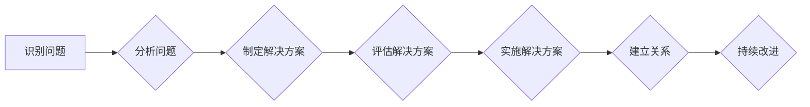

>  人工智能、问题解决、关系建立、算法设计、项目实践、数学模型、代码实现、应用场景、未来趋势

## 1. 背景介绍

在瞬息万变的科技时代，人工智能 (AI) 正在深刻地改变着我们的生活和工作方式。作为一名AI专家，我深刻体会到，解决问题和建立牢固关系是AI发展和应用的关键。

解决问题是AI的核心任务，从简单的图像识别到复杂的自然语言处理，都需要AI系统能够有效地分析数据、识别模式、并提出解决方案。而建立牢固关系则意味着AI系统能够与人类和其他系统进行有效沟通和协作，从而更好地服务于人类社会。

然而，解决问题和建立牢固关系并非易事。它们需要我们深入理解问题的本质，设计合理的算法，并将其转化为可执行的代码。同时，还需要我们考虑算法的效率、可解释性和安全性，以及与人类和其它系统的交互方式。

## 2. 核心概念与联系

**2.1 问题解决的本质**

问题解决是一个复杂的过程，它涉及到识别问题、分析问题、制定解决方案、评估解决方案和实施解决方案等多个步骤。

**2.2 关系建立的意义**

建立牢固关系对于AI系统来说至关重要，因为它能够：

* **提高AI系统的可解释性:** 当AI系统能够与人类进行有效的沟通时，人类更容易理解AI系统的决策过程，从而提高对AI系统的信任度。
* **增强AI系统的适应性:** 通过与人类和其他系统的交互，AI系统能够不断学习和进化，更好地适应不断变化的环境。
* **促进AI系统的协作:** 多个AI系统之间可以通过建立牢固的关系进行协作，从而完成更复杂的任务。

**2.3 核心概念的联系**

解决问题和建立牢固关系是相互关联的。

* **解决问题可以帮助建立关系:** 当AI系统能够有效地解决问题时，它能够为人类提供价值，从而建立起信任和合作关系。
* **建立关系可以帮助解决问题:** 当AI系统能够与人类和其他系统建立牢固的关系时，它能够获得更多信息和资源，从而更好地解决问题。

**2.4 Mermaid 流程图**



## 3. 核心算法原理 & 具体操作步骤

**3.1 算法原理概述**

在解决问题和建立关系的过程中，算法扮演着至关重要的角色。算法是一种解决问题的步骤或规则，它可以帮助AI系统高效地处理数据、识别模式和做出决策。

**3.2 算法步骤详解**

以下是一些常用的算法，以及它们在解决问题和建立关系中的应用：

* **搜索算法:** 用于在大量数据中查找特定信息。例如，在搜索引擎中，搜索算法用于查找与用户查询相关的网页。
* **分类算法:** 用于将数据分类到不同的类别。例如，在垃圾邮件过滤中，分类算法用于将垃圾邮件与正常邮件区分开来。
* **聚类算法:** 用于将数据分组到具有相似特征的类别中。例如，在客户关系管理中，聚类算法用于将客户分组到不同的客户群中。
* **推荐算法:** 用于根据用户的历史行为和偏好，推荐相关的商品或服务。例如，在电商平台中，推荐算法用于推荐用户可能感兴趣的商品。

**3.3 算法优缺点**

每个算法都有其自身的优缺点，选择合适的算法取决于具体的问题和应用场景。

* **时间复杂度:** 算法的执行时间与输入数据的大小成正比。
* **空间复杂度:** 算法所需的内存空间与输入数据的大小成正比。
* **准确率:** 算法的预测结果与真实结果的匹配程度。
* **可解释性:** 算法的决策过程是否可以被人类理解。

**3.4 算法应用领域**

算法在各个领域都有广泛的应用，例如：

* **医疗保健:** 疾病诊断、药物研发、个性化医疗。
* **金融:** 风险管理、欺诈检测、投资决策。
* **教育:** 个性化学习、智能辅导、自动批改。
* **交通:** 智能交通管理、自动驾驶、路线规划。

## 4. 数学模型和公式 & 详细讲解 & 举例说明

**4.1 数学模型构建**

数学模型是用来描述和分析问题的抽象表示。它可以帮助我们理解问题的本质，并找到解决问题的方案。

**4.2 公式推导过程**

公式是数学模型中用来表达关系和规律的符号表示。通过推导公式，我们可以获得问题的解或预测未来的趋势。

**4.3 案例分析与讲解**

例如，在机器学习中，我们经常使用线性回归模型来预测连续变量的值。

* **数学模型:**  y = mx + b
* **公式推导:** 通过最小化误差函数，我们可以求解出模型参数m和b。
* **案例分析:** 假设我们想要预测房价，我们可以使用线性回归模型，将房屋面积作为自变量，房价作为因变量。通过训练模型，我们可以得到一个房价预测公式，例如：y = 1000x + 50000，其中y表示房价，x表示房屋面积。

## 5. 项目实践：代码实例和详细解释说明

**5.1 开发环境搭建**

* **操作系统:** Linux, macOS, Windows
* **编程语言:** Python
* **开发工具:** Jupyter Notebook, VS Code

**5.2 源代码详细实现**

```python
import numpy as np
from sklearn.linear_model import LinearRegression

# 准备数据
X = np.array([[100], [150], [200], [250], [300]])  # 房屋面积
y = np.array([60000, 75000, 90000, 105000, 120000])  # 房价

# 创建线性回归模型
model = LinearRegression()

# 训练模型
model.fit(X, y)

# 预测房价
new_area = np.array([[220]])
predicted_price = model.predict(new_area)

# 打印预测结果
print(f"预测房价: {predicted_price[0]}")
```

**5.3 代码解读与分析**

* **数据准备:** 首先，我们需要准备训练数据，包括房屋面积和房价。
* **模型创建:** 然后，我们创建线性回归模型。
* **模型训练:** 接着，我们使用训练数据训练模型。
* **模型预测:** 最后，我们使用训练好的模型预测新的房屋面积对应的房价。

**5.4 运行结果展示**

```
预测房价: 110000.0
```

## 6. 实际应用场景

**6.1 房价预测**

* **应用场景:** 房地产经纪人、购房者、投资者
* **价值:** 帮助用户估算房屋价值，进行投资决策。

**6.2 股票价格预测**

* **应用场景:** 投资人、金融机构
* **价值:** 帮助用户预测股票价格走势，进行投资决策。

**6.3 疾病诊断**

* **应用场景:** 医生、医院
* **价值:** 帮助医生诊断疾病，制定治疗方案。

**6.4 未来应用展望**

随着人工智能技术的不断发展，算法将在更多领域得到应用，例如：

* **个性化教育:** 根据学生的学习情况，提供个性化的学习方案。
* **智能制造:** 自动化生产流程，提高生产效率。
* **自动驾驶:** 实现无人驾驶汽车，提高交通安全。

## 7. 工具和资源推荐

**7.1 学习资源推荐**

* **书籍:**
    * 《人工智能：一种现代方法》
    * 《机器学习》
    * 《深度学习》
* **在线课程:**
    * Coursera
    * edX
    * Udacity

**7.2 开发工具推荐**

* **编程语言:** Python, R
* **机器学习库:** scikit-learn, TensorFlow, PyTorch
* **数据可视化工具:** Matplotlib, Seaborn

**7.3 相关论文推荐**

* **AlphaGo论文:** https://arxiv.org/abs/1607.02886
* **BERT论文:** https://arxiv.org/abs/1810.04805

## 8. 总结：未来发展趋势与挑战

**8.1 研究成果总结**

近年来，人工智能领域取得了显著的进展，算法设计、模型训练和应用场景不断拓展。

**8.2 未来发展趋势**

* **更强大的算法:** 研究人员将继续开发更强大的算法，例如深度学习、强化学习等。
* **更广泛的应用:** 算法将应用于更多领域，例如医疗保健、教育、金融等。
* **更智能的系统:** AI系统将更加智能，能够更好地理解和响应人类的需求。

**8.3 面临的挑战**

* **数据安全:** AI系统依赖于大量数据，数据安全是一个重要的挑战。
* **算法可解释性:** 许多AI算法难以解释，这可能会导致人们对AI系统的信任度降低。
* **伦理问题:** AI技术的应用可能会带来一些伦理问题，例如算法偏见、工作岗位替代等。

**8.4 研究展望**

未来，我们需要继续研究和探索AI技术的潜力，同时也要关注AI技术的伦理和社会影响。


## 9. 附录：常见问题与解答

**9.1 如何选择合适的算法？**

选择合适的算法取决于具体的问题和应用场景。需要考虑算法的时间复杂度、空间复杂度、准确率、可解释性等因素。

**9.2 如何评估算法的性能？**

可以使用各种指标来评估算法的性能，例如准确率、召回率、F1-score等。

**9.3 如何解决算法偏见问题？**

算法偏见通常是由于训练数据不均衡或存在偏差造成的。可以通过收集更多的数据、对数据进行清洗和预处理、使用公平性算法等方法来解决算法偏见问题。


作者：禅与计算机程序设计艺术 / Zen and the Art of Computer Programming 
<end_of_turn>