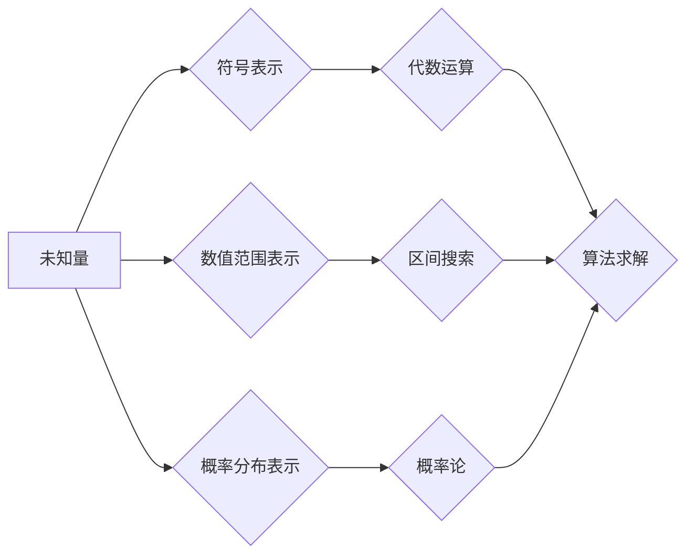

> 计算之术，未知量，表示，算法，数学模型，编程，应用场景

## 1. 背景介绍

在计算的旅程中，我们从简单的算术运算开始，逐渐探索更复杂的问题解决方法。然而，在面对未知数时，我们该如何进行计算呢？如何将这些不可知的量转化为可操作的形式，以便计算机能够理解和处理？

这正是本章要探讨的核心主题：**未知量的表示**。

从古至今，人类一直在寻找方法来表达和处理未知数。从简单的代数方程到复杂的数学模型，我们不断发展新的工具和方法来应对未知的挑战。

## 2. 核心概念与联系

**2.1  未知量的本质**

未知量是指在计算过程中尚未确定的值。它可以是变量、参数、常数，甚至更复杂的结构。

**2.2  未知量的表示方法**

* **符号表示:** 使用字母或其他符号来代表未知量，例如 x, y, z 等。
* **数值范围表示:** 使用区间或范围来描述未知量的可能取值，例如 0 ≤ x ≤ 10。
* **概率分布表示:** 使用概率分布函数来描述未知量的概率分布，例如正态分布、均匀分布等。

**2.3  未知量与算法的关系**

算法是解决问题的步骤序列。在处理未知量时，算法需要根据未知量的表示方法进行相应的处理。例如，如果未知量用符号表示，算法需要使用代数运算来求解；如果未知量用数值范围表示，算法需要进行区间搜索或优化；如果未知量用概率分布表示，算法需要使用概率论和统计学方法进行处理。

**2.4  未知量与数学模型的关系**

数学模型是描述客观现象的抽象表示。在数学模型中，未知量通常作为变量出现，通过方程或不等式来约束其取值。

**Mermaid 流程图**



## 3. 核心算法原理 & 具体操作步骤

**3.1  算法原理概述**

本章将介绍几种常用的处理未知量的算法，包括：

* **代数方程求解算法:** 用于求解未知数的代数方程。
* **数值优化算法:** 用于寻找未知量在特定范围内最优值。
* **概率估计算法:** 用于估计未知量的概率分布。

**3.2  算法步骤详解**

**3.2.1 代数方程求解算法**

1. **识别未知量:** 确定方程中需要求解的未知数。
2. **化简方程:** 使用代数运算将方程简化到可以求解的形式。
3. **求解未知数:** 使用适当的代数方法求解未知数的值。

**3.2.2 数值优化算法**

1. **定义目标函数:** 确定需要优化的目标函数。
2. **设定搜索范围:** 确定未知量在哪个范围内进行搜索。
3. **选择优化算法:** 选择合适的数值优化算法，例如梯度下降法、牛顿法等。
4. **迭代搜索:** 使用优化算法迭代搜索目标函数的最小值或最大值。

**3.2.3 概率估计算法**

1. **收集样本数据:** 收集包含未知量信息的样本数据。
2. **选择概率分布模型:** 选择合适的概率分布模型来描述未知量的分布。
3. **估计模型参数:** 使用样本数据估计模型参数。
4. **预测未知量:** 使用估计的模型参数预测未知量的取值。

**3.3  算法优缺点**

* **代数方程求解算法:** 优点是精确、易于理解；缺点是只能处理线性方程组，对于非线性方程组的求解能力有限。
* **数值优化算法:** 优点是能够处理非线性问题，并可以找到近似最优解；缺点是求解过程可能比较复杂，需要大量的计算资源。
* **概率估计算法:** 优点是能够处理不确定性，并可以给出概率分布信息；缺点是需要大量的样本数据，并且模型选择和参数估计都比较复杂。

**3.4  算法应用领域**

* **科学计算:** 用于求解物理、化学、生物等领域的科学问题。
* **工程设计:** 用于优化工程结构、控制系统等。
* **机器学习:** 用于训练机器学习模型，预测未知数据。
* **数据分析:** 用于分析数据趋势、发现隐藏模式。

## 4. 数学模型和公式 & 详细讲解 & 举例说明

**4.1  数学模型构建**

数学模型是利用数学语言和符号来描述客观现象的抽象表示。在处理未知量时，我们可以构建数学模型来表达未知量与已知量的关系。

例如，假设我们想要描述一个物体运动的轨迹，我们可以构建以下数学模型：

* **位置:**  x(t) = v0 * t + 1/2 * a * t^2
* **速度:** v(t) = v0 + a * t

其中：

* x(t) 是物体在时间 t 时的位置
* v(t) 是物体在时间 t 时的速度
* v0 是物体初始速度
* a 是物体加速度
* t 是时间

**4.2  公式推导过程**

上述公式的推导过程基于牛顿第二定律：

* F = m * a

其中：

* F 是物体所受合力
* m 是物体的质量
* a 是物体的加速度

根据牛顿第二定律，我们可以推导出物体运动的方程，进而得到位置和速度的公式。

**4.3  案例分析与讲解**

假设一个物体从静止开始运动，加速度为 9.8 m/s^2，请问物体在 5 秒后运动的距离是多少？

根据上述数学模型，我们可以计算出物体在 5 秒后的位置：

* x(5) = 0 * 5 + 1/2 * 9.8 * 5^2 = 122.5 m

因此，物体在 5 秒后运动的距离为 122.5 米。

## 5. 项目实践：代码实例和详细解释说明

**5.1  开发环境搭建**

本项目使用 Python 语言进行开发，需要安装 Python 3.x 及相关库。

**5.2  源代码详细实现**

```python
import math

# 定义函数计算物体在特定时间下的位置
def calculate_position(v0, a, t):
  return v0 * t + 0.5 * a * t**2

# 设置初始速度、加速度和时间
v0 = 0  # 初始速度
a = 9.8  # 加速度
t = 5  # 时间

# 计算物体在指定时间下的位置
position = calculate_position(v0, a, t)

# 打印结果
print(f"物体在 {t} 秒后运动的距离为：{position} 米")
```

**5.3  代码解读与分析**

* `calculate_position()` 函数接收初始速度、加速度和时间作为参数，并根据公式计算物体在指定时间下的位置。
* `v0`, `a` 和 `t` 分别代表初始速度、加速度和时间。
* `position` 变量存储了计算出的物体位置。
* 最后，使用 f-string 格式化输出结果。

**5.4  运行结果展示**

```
物体在 5 秒后运动的距离为：122.5 米
```

## 6. 实际应用场景

**6.1  科学计算**

在物理学、化学学、天文学等领域，科学家们经常需要使用数学模型来描述和预测自然现象。例如，在计算行星轨道时，需要使用牛顿万有引力定律和运动方程来求解行星的位置和速度。

**6.2  工程设计**

在工程设计中，工程师们需要使用数学模型来优化结构、控制系统等。例如，在设计桥梁时，需要使用结构力学模型来计算桥梁的承载能力和变形量。

**6.3  机器学习**

在机器学习领域，算法需要处理大量的未知数据。例如，在图像识别任务中，算法需要学习图像特征，并预测图像的类别。

**6.4  未来应用展望**

随着人工智能技术的不断发展，未知量表示将发挥越来越重要的作用。例如，在自动驾驶领域，车辆需要处理大量的传感器数据，并预测道路上的未知情况。

## 7. 工具和资源推荐

**7.1  学习资源推荐**

* **书籍:**
    * 《数学建模》
    * 《算法导论》
    * 《机器学习》
* **在线课程:**
    * Coursera: 数学建模
    * edX: 算法导论
    * Udacity: 机器学习

**7.2  开发工具推荐**

* **Python:** 广泛应用于科学计算、数据分析和机器学习。
* **MATLAB:** 专业数学计算和仿真软件。
* **R:** 用于统计分析和数据可视化。

**7.3  相关论文推荐**

* **《深度学习》**
* **《支持向量机》**
* **《随机森林》**

## 8. 总结：未来发展趋势与挑战

**8.1  研究成果总结**

在处理未知量方面，我们已经取得了显著的成果。从代数方程求解到数值优化，从概率估计到机器学习，各种算法和模型不断发展，为我们提供了更强大的工具来应对未知的挑战。

**8.2  未来发展趋势**

未来，处理未知量将继续是人工智能领域的重要研究方向。随着数据量的不断增长和计算能力的提升，我们将看到更多更复杂的算法和模型的出现，能够更有效地处理未知数据，并为我们提供更精准的预测和决策支持。

**8.3  面临的挑战**

尽管取得了显著的成果，处理未知量仍然面临着许多挑战。例如，如何处理高维数据、非线性数据和不确定性数据，如何提高算法的效率和鲁棒性，如何更好地解释和理解模型的决策过程，这些都是需要进一步研究和探索的问题。

**8.4  研究展望**

未来，我们将继续探索新的算法和模型，以更好地处理未知量，并将其应用于更广泛的领域。我们相信，随着技术的不断进步，处理未知量将成为人工智能领域的核心能力，并为人类社会带来更多福祉。

## 9. 附录：常见问题与解答

**9.1  Q: 如何选择合适的未知量表示方法？**

**A:** 选择合适的未知量表示方法取决于具体的应用场景和问题类型。例如，如果未知量是连续的，可以使用数值范围表示；如果未知量是离散的，可以使用符号表示；如果未知量具有概率性，可以使用概率分布表示。

**9.2  Q: 如何评估算法的性能？**

**A:** 算法的性能可以根据不同的指标进行评估，例如准确率、召回率、F1-score、运行时间等。选择合适的评估指标取决于具体的应用场景和问题类型。

**9.3  Q: 如何解释和理解模型的决策过程？**

**A:** 解释和理解模型的决策过程是一个重要的研究方向。一些常用的方法包括：

* **特征重要性分析:** 分析哪些特征对模型的决策结果影响最大。
* **可视化解释:** 使用可视化技术来展示模型的决策过程。
* **局部解释:** 对单个样本进行解释，分析模型是如何做出决策的。


作者：禅与计算机程序设计艺术 / Zen and the Art of Computer Programming 
<end_of_turn>