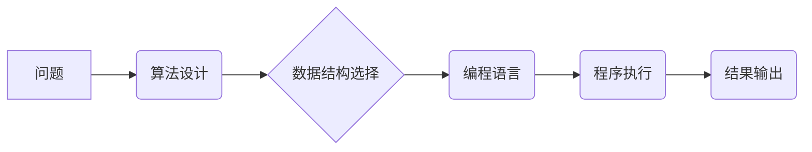

> 计算思维、面向机器、算法设计、数据结构、编程语言、计算模型、计算机科学基础

## 1. 背景介绍

在信息时代，计算已成为人类社会不可或缺的一部分。从智能手机到大型数据中心，计算技术无处不在，深刻地改变着我们的生活方式和工作模式。然而，计算的本质是什么？如何让机器理解和执行我们的指令？这些问题一直是计算机科学研究的核心。

本篇文章将深入探讨面向机器的计算思维，揭示计算的本质，并介绍一些基本的计算概念和算法，帮助读者理解计算机是如何工作的。

## 2. 核心概念与联系

面向机器的计算思维是一种将问题分解成一系列可被机器理解和执行的步骤的思维方式。它要求我们以机器的视角思考问题，并用逻辑清晰、结构严谨的方式表达解决方案。

**核心概念：**

* **算法:** 一组明确的步骤，用于解决特定问题或完成特定任务。
* **数据结构:** 用于组织和存储数据的结构，例如数组、链表、树、图等。
* **编程语言:** 用于编写程序的符号系统，例如Python、Java、C++等。
* **计算模型:** 用于描述计算机如何执行算法的抽象模型，例如冯·诺伊曼体系结构。

**核心概念联系：**



## 3. 核心算法原理 & 具体操作步骤

### 3.1  算法原理概述

算法是计算机科学的核心概念之一，它是一种解决问题的步骤序列。一个好的算法应该具有以下特点：

* **确定性:** 对于给定的输入，算法应该始终产生相同的输出。
* **有限性:** 算法应该在有限的时间内完成执行。
* **有效性:** 算法的每一步操作都应该能够被计算机执行。

### 3.2  算法步骤详解

以排序算法为例，介绍算法的具体步骤：

**冒泡排序算法:**

1. 比较相邻的两个元素，如果顺序错误，则交换它们的位置。
2. 重复步骤1，直到整个数组排序完成。

**具体操作步骤:**

```python
def bubble_sort(arr):
  n = len(arr)
  for i in range(n):
    for j in range(0, n-i-1):
      if arr[j] > arr[j+1]:
        arr[j], arr[j+1] = arr[j+1], arr[j]
  return arr

# 测试代码
arr = [64, 34, 25, 12, 22, 11, 90]
sorted_arr = bubble_sort(arr)
print("排序后的数组:", sorted_arr)
```

### 3.3  算法优缺点

**冒泡排序算法的优点:**

* 实现简单，易于理解和实现。

**冒泡排序算法的缺点:**

* 时间复杂度较高，效率较低。

### 3.4  算法应用领域

冒泡排序算法是一种基础的排序算法，广泛应用于各种场景，例如：

* 数据排序
* 数据分析
* 搜索引擎

## 4. 数学模型和公式 & 详细讲解 & 举例说明

### 4.1  数学模型构建

算法的效率通常用时间复杂度和空间复杂度来衡量。

* **时间复杂度:** 指的是算法执行时间与输入数据大小的函数关系。
* **空间复杂度:** 指的是算法执行过程中使用的内存空间大小与输入数据大小的函数关系。

### 4.2  公式推导过程

**时间复杂度计算公式:**

```latex
T(n) = a*n^b + c
```

其中：

* T(n) 是算法的时间复杂度
* n 是输入数据大小
* a, b, c 是常数

**空间复杂度计算公式:**

```latex
S(n) = d*n^e + f
```

其中：

* S(n) 是算法的空间复杂度
* n 是输入数据大小
* d, e, f 是常数

### 4.3  案例分析与讲解

以冒泡排序算法为例，其时间复杂度为 O(n^2)，空间复杂度为 O(1)。

**时间复杂度分析:**

冒泡排序算法需要进行 n-1 轮循环，每轮循环需要比较 n-i 个元素，因此总共需要执行 O(n^2) 次比较操作。

**空间复杂度分析:**

冒泡排序算法只需要使用常数大小的额外内存空间，因此其空间复杂度为 O(1)。

## 5. 项目实践：代码实例和详细解释说明

### 5.1  开发环境搭建

本项目使用 Python 语言进行开发，需要安装 Python 解释器和相关库。

### 5.2  源代码详细实现

```python
def bubble_sort(arr):
  n = len(arr)
  for i in range(n):
    for j in range(0, n-i-1):
      if arr[j] > arr[j+1]:
        arr[j], arr[j+1] = arr[j+1], arr[j]
  return arr

# 测试代码
arr = [64, 34, 25, 12, 22, 11, 90]
sorted_arr = bubble_sort(arr)
print("排序后的数组:", sorted_arr)
```

### 5.3  代码解读与分析

* 函数 `bubble_sort(arr)` 接受一个数组 `arr` 作为输入，并返回排序后的数组。
* 外层循环 `for i in range(n)` 控制排序轮数，每次循环将最大的元素“冒泡”到数组末尾。
* 内层循环 `for j in range(0, n-i-1)` 比较相邻元素，如果顺序错误，则交换它们的位置。
* `arr[j], arr[j+1] = arr[j+1], arr[j]` 是 Python 的交换语句，用于交换两个变量的值。

### 5.4  运行结果展示

```
排序后的数组: [11, 12, 22, 25, 34, 64, 90]
```

## 6. 实际应用场景

冒泡排序算法是一种基础的排序算法，广泛应用于各种场景，例如：

* **数据排序:** 将数据按照特定顺序排列，例如将学生成绩按照分数从高到低排序。
* **数据分析:** 对数据进行排序，以便更容易地分析和理解数据趋势。
* **搜索引擎:** 将网页按照相关性排序，以便用户更容易找到所需的信息。

### 6.4  未来应用展望

随着计算技术的不断发展，面向机器的计算思维将发挥越来越重要的作用。

## 7. 工具和资源推荐

### 7.1  学习资源推荐

* **书籍:**
    * 《算法导论》
    * 《数据结构与算法分析》
* **在线课程:**
    * Coursera 上的《算法导论》课程
    * edX 上的《数据结构与算法》课程

### 7.2  开发工具推荐

* **Python 解释器:** Python 3.x
* **代码编辑器:** VS Code, Sublime Text

### 7.3  相关论文推荐

* 《The Art of Computer Programming》 by Donald Knuth
* 《Introduction to Algorithms》 by Thomas H. Cormen, Charles E. Leiserson, Ronald L. Rivest, and Clifford Stein

## 8. 总结：未来发展趋势与挑战

### 8.1  研究成果总结

面向机器的计算思维是计算机科学的核心概念之一，它为我们理解和构建计算机系统提供了重要的理论基础。

### 8.2  未来发展趋势

* **人工智能:** 人工智能的发展将进一步推动面向机器的计算思维的发展，例如，机器学习算法的优化和设计将依赖于更深入的计算思维。
* **量子计算:** 量子计算的出现将带来新的计算模型和算法，需要我们重新思考面向机器的计算思维。

### 8.3  面临的挑战

* **算法复杂度:** 随着数据规模的不断增长，算法的复杂度将成为一个重要的挑战。
* **可解释性:** 许多人工智能算法的决策过程难以解释，这将影响人们对人工智能的信任和接受度。

### 8.4  研究展望

未来，面向机器的计算思维将继续发展和完善，并与其他领域交叉融合，为人类社会带来更多创新和进步。

## 9. 附录：常见问题与解答

**常见问题:**

* 什么是算法？
* 如何设计一个好的算法？
* 如何评估算法的效率？

**解答:**

* 算法是一种解决问题的步骤序列。
* 一个好的算法应该具有确定性、有限性和有效性。
* 算法的效率通常用时间复杂度和空间复杂度来衡量。


作者：禅与计算机程序设计艺术 / Zen and the Art of Computer Programming 
<end_of_turn>