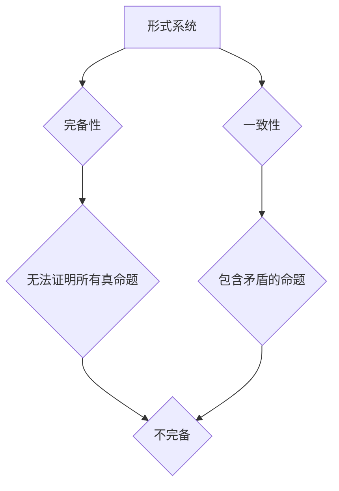

> 哥德尔不完备性定理，计算理论，形式系统，完备性，一致性，逻辑证明，计算机科学

## 1. 背景介绍

在计算机科学的蓬勃发展中，我们不断探索计算的边界，试图用算法和程序解决一切问题。然而，20世纪30年代，一位名叫Kurt Gödel的数学家提出了一个惊人的结论：任何一个足够复杂的逻辑系统，都无法证明自身所有真命题，也无法避免包含矛盾。这个结论被称为哥德尔不完备性定理，它对计算机科学和哲学产生了深远的影响。

哥德尔不完备性定理揭示了计算的局限性，告诉我们有些问题是无法用算法解决的。它表明，即使是最强大的计算机，也无法解决所有问题，因为有些问题本身就无法用逻辑和计算来表达或解决。

## 2. 核心概念与联系

### 2.1  形式系统

形式系统是一个由符号、规则和公理组成的系统，用于进行逻辑推理。它类似于一个游戏，玩家使用规则和公理来构建新的命题，并试图证明某些命题是正确的。

### 2.2  完备性

一个形式系统是完备的，如果它能够证明所有真命题。换句话说，如果一个命题是真实的，那么这个形式系统能够证明它。

### 2.3  一致性

一个形式系统是一致的，如果它不能证明矛盾的命题。矛盾的命题是指同时是真也是假的命题。

### 2.4  哥德尔不完备性定理

哥德尔不完备性定理指出，任何一个足够复杂的逻辑系统，都无法同时满足完备性和一致性。换句话说，任何一个足够复杂的逻辑系统，要么无法证明所有真命题（不完备），要么能够证明矛盾的命题（不一致）。

**Mermaid 流程图**

## 3. 核心算法原理 & 具体操作步骤

哥德尔不完备性定理本身不是一个算法，而是一个数学定理。它证明了形式系统的局限性，而不是提供了一种解决问题的算法。

### 3.1  算法原理概述

哥德尔不完备性定理的证明依赖于逻辑和数学的复杂概念，包括：

* ** Gödel编码：** 将自然语言中的语句编码成数字形式，以便计算机可以处理。
* **递归函数：** 一种可以定义为自身函数的函数，用于模拟计算过程。
* **自我引用：** 一个语句引用自身，导致逻辑悖论。

### 3.2  算法步骤详解

哥德尔不完备性定理的证明过程非常复杂，涉及大量的数学推导和逻辑推理。简而言之，哥德尔证明了：

1. 任何一个足够复杂的逻辑系统，都可以用 Gödel编码来表示自身。
2. 可以构造一个语句，它表达了“这个语句无法被证明”的意思。
3. 如果这个逻辑系统是完备的，那么它就必须能够证明这个语句。
4. 但是，如果这个语句被证明，那么它就意味着它无法被证明，这导致了矛盾。

因此，哥德尔得出结论：任何一个足够复杂的逻辑系统，都无法同时满足完备性和一致性。

### 3.3  算法优缺点

哥德尔不完备性定理本身不是一个算法，因此没有优缺点之分。

### 3.4  算法应用领域

哥德尔不完备性定理对计算机科学和哲学产生了深远的影响：

* **计算机科学：** 它揭示了计算的局限性，表明有些问题是无法用算法解决的。它也促进了对人工智能和计算复杂性的研究。
* **哲学：** 它引发了关于知识、真理和逻辑的深刻思考。它表明，人类的知识体系并非完美无缺，存在着不可克服的局限性。

## 4. 数学模型和公式 & 详细讲解 & 举例说明

哥德尔不完备性定理的证明依赖于复杂的数学模型和公式。

### 4.1  数学模型构建

哥德尔使用了一个形式系统，称为“Gödel系统”，来模拟逻辑推理过程。这个系统包含：

* **符号：** 用于表示命题、变量、逻辑连接词等。
* **规则：** 用于构建新的命题和进行逻辑推理。
* **公理：** 一些被认为是显然正确的命题。

### 4.2  公式推导过程

哥德尔证明了存在一个语句，它表达了“这个语句无法被证明”的意思。这个语句被称为“Gödel语句”。他通过一系列复杂的逻辑推导，证明了如果Gödel系统是完备的，那么它就必须能够证明Gödel语句。但是，如果Gödel语句被证明，那么它就意味着它无法被证明，这导致了矛盾。

### 4.3  案例分析与讲解

为了更好地理解哥德尔不完备性定理，我们可以考虑一个简单的例子：

假设我们有一个形式系统，它包含以下公理：

* 所有命题都是真的。

在这个系统中，我们可以证明任何命题都是真的，因为它包含了“所有命题都是真的”这个公理。但是，这个系统是不一致的，因为它包含了矛盾的命题。

## 5. 项目实践：代码实例和详细解释说明

由于哥德尔不完备性定理是一个数学定理，而不是一个算法，因此无法用代码直接实现。但是，我们可以用代码来模拟哥德尔证明过程的一部分，例如：

* 使用Gödel编码来将自然语言语句编码成数字形式。
* 使用递归函数来模拟逻辑推理过程。

## 6. 实际应用场景

哥德尔不完备性定理的应用场景主要集中在以下几个方面：

* **人工智能：** 它提醒我们，人工智能系统不可能完全模仿人类的智能，因为存在着不可克服的局限性。
* **软件工程：** 它强调了软件开发中的逻辑错误和边界条件的重要性。
* **哲学：** 它引发了关于知识、真理和逻辑的深刻思考。

### 6.4  未来应用展望

随着计算机科学和人工智能的不断发展，哥德尔不完备性定理将继续发挥重要作用。它将帮助我们更好地理解计算的局限性，并推动我们探索新的计算模型和方法。

## 7. 工具和资源推荐

### 7.1  学习资源推荐

* **《Gödel, Escher, Bach: An Eternal Golden Braid》 by Douglas Hofstadter:** 这本书以生动的方式解释了哥德尔不完备性定理和相关概念。
* **《Logicomix: An Epic Search for Truth》 by Apostolos Doxiadis and Christos H. Papadimitriou:** 这本书以漫画的形式讲述了逻辑学和哥德尔不完备性定理的历史。

### 7.2  开发工具推荐

* **Coq:** 一个用于形式验证的编程语言。
* **Isabelle/HOL:** 另一个用于形式验证的编程语言。

### 7.3  相关论文推荐

* **“On Formally Undecidable Propositions of Principia Mathematica and Related Systems” by Kurt Gödel:** 这篇论文是哥德尔不完备性定理的原始证明。

## 8. 总结：未来发展趋势与挑战

哥德尔不完备性定理是一个重要的数学定理，它揭示了计算的局限性，并对计算机科学和哲学产生了深远的影响。未来，哥德尔不完备性定理将继续激励人们探索新的计算模型和方法，并推动我们更好地理解计算的本质。

### 8.1  研究成果总结

哥德尔不完备性定理的证明是20世纪数学领域的重要成果之一。它不仅改变了人们对逻辑和计算的理解，也引发了广泛的哲学讨论。

### 8.2  未来发展趋势

未来，哥德尔不完备性定理的研究将继续深入，包括：

* **探索新的形式系统：** 研究新的形式系统，并探索它们是否能够克服哥德尔不完备性定理的局限性。
* **应用于人工智能：** 将哥德尔不完备性定理应用于人工智能领域，更好地理解人工智能的局限性，并探索新的人工智能模型。
* **哲学思考：** 继续探讨哥德尔不完备性定理对知识、真理和逻辑的哲学意义。

### 8.3  面临的挑战

哥德尔不完备性定理的研究面临着一些挑战：

* **数学复杂性：** 哥德尔不完备性定理的证明非常复杂，需要深入的数学知识和逻辑推理能力。
* **哲学争议：** 哥德尔不完备性定理引发了关于知识、真理和逻辑的哲学争议，这些争议至今仍未得到完全解决。

### 8.4  研究展望

尽管面临着挑战，但哥德尔不完备性定理的研究仍然充满着希望。它将继续激励人们探索计算的边界，并推动我们更好地理解世界。

## 9. 附录：常见问题与解答

### 9.1  哥德尔不完备性定理证明的详细过程是什么？

哥德尔不完备性定理的证明非常复杂，涉及大量的数学推导和逻辑推理。简而言之，哥德尔证明了：

1. 任何一个足够复杂的逻辑系统，都可以用 Gödel编码来表示自身。
2. 可以构造一个语句，它表达了“这个语句无法被证明”的意思。
3. 如果这个逻辑系统是完备的，那么它就必须能够证明这个语句。
4. 但是，如果这个语句被证明，那么它就意味着它无法被证明，这导致了矛盾。

因此，哥德尔得出结论：任何一个足够复杂的逻辑系统，都无法同时满足完备性和一致性。

### 9.2  哥德尔不完备性定理有什么实际应用？

哥德尔不完备性定理的实际应用主要集中在以下几个方面：

* **人工智能：** 它提醒我们，人工智能系统不可能完全模仿人类的智能，因为存在着不可克服的局限性。
* **软件工程：** 它强调了软件开发中的逻辑错误和边界条件的重要性。
* **哲学：** 它引发了关于知识、真理和逻辑的深刻思考。

作者：禅与计算机程序设计艺术 / Zen and the Art of Computer Programming 
<end_of_turn>