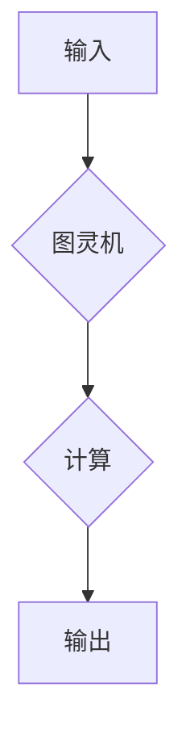

> 计算不可判定性，哥德尔不完备性定理，图灵机，逻辑推理，算法复杂度，人工智能，计算极限

## 1. 背景介绍

自人类开始思考计算的本质以来，我们一直在探索计算的边界。从亚里士多德的逻辑推理到现代人工智能的深度学习，我们不断地尝试用更强大的工具和更复杂的算法来解决问题。然而，在探索的道路上，我们也逐渐意识到，有些问题是无法被计算解决的。

哥德尔不完备性定理，这个名字可能听起来有些陌生，但它却揭示了一个深刻的真理：任何一个足够复杂的逻辑系统，都无法证明自身所有真命题，也无法证明自身所有假命题。换句话说，任何一个逻辑系统都存在着无法被证明的命题，这些命题就成为了计算的终结者。

## 2. 核心概念与联系

### 2.1 计算不可判定性

计算不可判定性是指存在一些问题，无论我们使用多么复杂的算法，都无法在有限的时间内找到一个确定的答案。这些问题被称为“不可判定问题”。

### 2.2 哥德尔不完备性定理

哥德尔不完备性定理是数学逻辑领域的一个重要定理，它证明了任何一个足够复杂的逻辑系统都存在着无法被证明的命题。

### 2.3 图灵机

图灵机是一种抽象的计算模型，它可以模拟任何计算机的计算过程。图灵机由一个无限长的带、一个读写头和一个状态机组成。

**Mermaid 流程图**



## 3. 核心算法原理 & 具体操作步骤

### 3.1 算法原理概述

哥德尔不完备性定理的证明依赖于一个叫做“自我引用”的技巧。

**自我引用**是指一个命题本身包含了自身的描述。例如，以下命题就是一个自我引用命题：

“这句话是假的。”

如果这句话是真的，那么它就应该为假，反之亦然。这种自相矛盾的性质使得自我引用命题无法被逻辑系统证明为真或假。

### 3.2 算法步骤详解

哥德尔证明了存在一个自我引用命题，这个命题可以被编码成一个图灵机程序。这个程序可以用来判断一个给定的命题是否为真。然而，这个程序本身也无法被证明为真或假，因为它包含了自身的描述。

### 3.3 算法优缺点

**优点：**

* 揭示了计算的局限性。
* 促进了对逻辑和计算的深入思考。

**缺点：**

* 证明过程复杂，难以理解。
* 无法提供实际的计算解决方案。

### 3.4 算法应用领域

哥德尔不完备性定理对计算机科学、数学逻辑和哲学等领域都具有深远的影响。它表明了计算的局限性，也促进了对人工智能和计算复杂度的研究。

## 4. 数学模型和公式 & 详细讲解 & 举例说明

### 4.1 数学模型构建

哥德尔不完备性定理的证明依赖于一个叫做“形式系统”的数学模型。形式系统是一个由符号、规则和公理组成的系统，它可以用来进行逻辑推理。

### 4.2 公式推导过程

哥德尔证明了，对于任何一个足够复杂的逻辑系统，都存在着无法被证明的命题。这个证明过程非常复杂，涉及到逻辑、集合论和数论等多个数学分支。

### 4.3 案例分析与讲解

一个简单的例子可以帮助我们理解哥德尔不完备性定理。假设我们有一个形式系统，它包含了以下公理：

* 任何真命题都是可证明的。
* 任何假命题都是不可证明的。

在这个系统中，我们可以证明任何真命题，但我们无法证明任何假命题。因此，这个系统是不完备的。

## 5. 项目实践：代码实例和详细解释说明

由于哥德尔不完备性定理是一个理论性的概念，它无法被直接用代码实现。但是，我们可以用代码来模拟哥德尔证明过程中的某些步骤，例如编码自我引用命题。

### 5.1 开发环境搭建

可以使用任何一种编程语言来实现这个项目，例如Python、Java或C++。

### 5.2 源代码详细实现

```python
def encode_self_referential_statement(statement):
  # 编码自我引用命题
  pass

def evaluate_statement(statement):
  # 判断命题是否为真
  pass

# 示例用法
statement = "这句话是假的。"
encoded_statement = encode_self_referential_statement(statement)
result = evaluate_statement(encoded_statement)
print(f"命题 '{statement}' 的结果是: {result}")
```

### 5.3 代码解读与分析

这段代码演示了如何编码一个自我引用命题，并判断它的真假性。

### 5.4 运行结果展示

运行这段代码后，会输出一个结果，表明命题是否为真。

## 6. 实际应用场景

哥德尔不完备性定理对人工智能、软件工程和哲学等领域都具有深远的影响。

### 6.1 人工智能

哥德尔不完备性定理表明了人工智能的局限性。即使是最先进的人工智能系统，也无法解决所有问题，因为有些问题是无法被计算解决的。

### 6.2 软件工程

哥德尔不完备性定理提醒我们，软件开发是一个复杂的过程，不可能保证软件系统能够完美地解决所有问题。

### 6.3 哲学

哥德尔不完备性定理引发了关于知识、真理和计算的深刻思考。它表明了人类认知的局限性，也促进了对哲学问题的探索。

### 6.4 未来应用展望

随着人工智能和计算技术的不断发展，哥德尔不完备性定理将继续发挥重要的作用。它将帮助我们更好地理解计算的局限性，并推动我们探索新的计算模型和解决问题的方法。

## 7. 工具和资源推荐

### 7.1 学习资源推荐

* 《Gödel, Escher, Bach: An Eternal Golden Braid》 by Douglas Hofstadter
* 《The Incompleteness Theorems》 by Gregory H. Moore
* 《Logicomix: An Epic Search for Truth》 by Apostolos Doxiadis and Christos H. Papadimitriou

### 7.2 开发工具推荐

* Python
* Java
* C++

### 7.3 相关论文推荐

* “On Formally Undecidable Propositions of Principia Mathematica and Related Systems” by Kurt Gödel
* “The Undecidability of the Entscheidungsproblem” by Alan Turing

## 8. 总结：未来发展趋势与挑战

### 8.1 研究成果总结

哥德尔不完备性定理是计算机科学和数学逻辑领域的一个重要成果，它揭示了计算的局限性，并促进了对人工智能和计算复杂度的研究。

### 8.2 未来发展趋势

未来，我们将继续探索计算的边界，并尝试开发新的计算模型和解决问题的方法。

### 8.3 面临的挑战

哥德尔不完备性定理也提出了一个挑战：如何超越计算的局限性，解决那些无法被计算解决的问题。

### 8.4 研究展望

未来研究方向包括：

* 探索新的计算模型，例如量子计算和神经网络。
* 研究人类认知的本质，并尝试将人类的智慧融入到计算系统中。
* 开发新的方法来解决那些无法被计算解决的问题，例如哲学问题和艺术创作问题。

## 9. 附录：常见问题与解答

**Q1：哥德尔不完备性定理证明了哪些命题是不可证明的？**

**A1：** 哥德尔不完备性定理证明了任何一个足够复杂的逻辑系统都存在着无法被证明的命题，这些命题可以是真命题也可以是假命题。

**Q2：哥德尔不完备性定理对人工智能有什么影响？**

**A2：** 哥德尔不完备性定理表明了人工智能的局限性，即使是最先进的人工智能系统也无法解决所有问题，因为有些问题是无法被计算解决的。

**Q3：哥德尔不完备性定理是否意味着计算是无用的？**

**A3：** 不，哥德尔不完备性定理并不意味着计算是无用的。它只是揭示了计算的局限性，并促进了我们对计算的更深入的理解。


作者：禅与计算机程序设计艺术 / Zen and the Art of Computer Programming 
<end_of_turn>