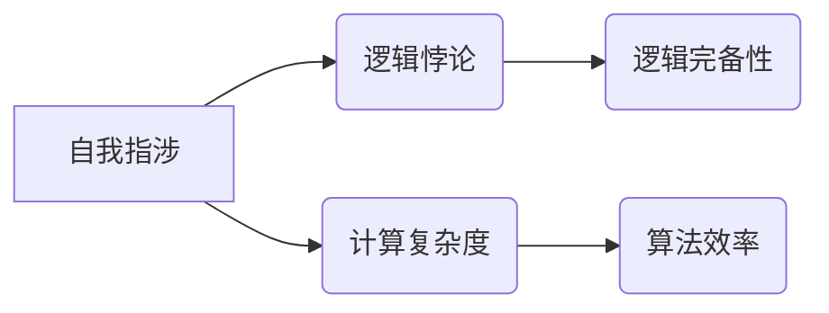

> 自我指涉, 逻辑悖论, 计算复杂度, 数学基础, 第三数学危机

## 1. 背景介绍

自人类开始思考计算的本质以来，就不断地遇到新的挑战和难题。从古代的算盘到现代的超级计算机，计算能力的不断提升，也伴随着新的理论和概念的出现。其中，**自我指涉**这一概念，就如同一个无形的迷雾，笼罩着计算的边界，引发了关于计算本质、逻辑的完备性以及数学基础的深刻思考。

**自我指涉**是指一个系统或实体能够直接或间接地引用自身，形成一种循环的逻辑关系。例如，著名的“这句陈述是假的”的悖论，就是一个典型的自我指涉例子。这句话本身就包含了对自身真假的判断，而无论这句话是真还是假，都违背了自身的定义，从而陷入了一个逻辑悖论。

在计算机科学领域，自我指涉现象也经常出现。例如，在编程语言中，我们可以使用递归函数来实现自我指涉，例如计算阶乘函数。然而，过度使用递归函数可能会导致栈溢出错误，甚至陷入无限循环。

**第三次数学危机**是指20世纪中叶以来，数学界对数学基础的重新审视和质疑。与第一、二次数学危机不同，第三次数学危机更关注于数学的完备性、确定性以及与现实世界的联系。自我指涉现象，正是第三次数学危机中一个重要的议题。

## 2. 核心概念与联系

**自我指涉**与**计算复杂度**、**逻辑完备性**等概念密切相关。

* **计算复杂度**: 指的是一个算法解决特定问题所需的时间和空间资源。自我指涉现象可能会导致算法的复杂度急剧增加，甚至变得不可计算。
* **逻辑完备性**: 指的是一个逻辑系统能够表达所有有效的命题。自我指涉现象可能会导致逻辑系统出现矛盾和悖论，从而质疑逻辑的完备性。

**核心概念关系图**:



## 3. 核心算法原理 & 具体操作步骤

### 3.1  算法原理概述

由于自我指涉的本质是循环逻辑，因此处理自我指涉问题通常需要采用一些特殊的算法和技巧。

* **递归**: 递归是一种函数自调用自身的方法，可以用来处理一些具有循环结构的问题。然而，递归算法需要谨慎设计，否则可能会导致栈溢出错误或无限循环。
* **迭代**: 迭代是一种通过循环来解决问题的算法，可以避免递归算法的潜在问题。
* **类型系统**: 类型系统可以帮助我们识别和避免自我指涉的潜在问题。通过对变量和函数的类型进行约束，我们可以限制自我指涉的发生。

### 3.2  算法步骤详解

以下是一个简单的例子，演示如何使用迭代算法来处理自我指涉问题：

**问题**: 计算一个数的阶乘。

**迭代算法步骤**:

1. 初始化一个变量 `fact`，值为 1。
2. 循环遍历从 1 到输入数的整数。
3. 在每次循环中，将 `fact` 乘以当前循环变量的值。
4. 循环结束后，`fact` 的值就是输入数的阶乘。

### 3.3  算法优缺点

**优点**:

* 避免了递归算法的潜在问题，例如栈溢出错误和无限循环。
* 效率较高，尤其是在处理大规模数据时。

**缺点**:

* 代码实现可能相对复杂，需要仔细设计循环逻辑。

### 3.4  算法应用领域

迭代算法广泛应用于各种领域，例如：

* **数据处理**: 处理大量数据，例如排序、查找、聚合等操作。
* **图像处理**: 对图像进行各种操作，例如滤波、边缘检测、图像压缩等。
* **机器学习**: 训练机器学习模型，例如神经网络、支持向量机等。

## 4. 数学模型和公式 & 详细讲解 & 举例说明

### 4.1  数学模型构建

我们可以用数学模型来描述自我指涉现象。例如，我们可以用一个二元逻辑函数 `f(x)` 来表示一个系统是否包含自我指涉。

* 如果 `f(x) = True`，则系统包含自我指涉。
* 如果 `f(x) = False`，则系统不包含自我指涉。

### 4.2  公式推导过程

我们可以通过分析系统的结构和逻辑关系，推导 `f(x)` 的表达式。例如，如果一个系统包含一个循环结构，并且循环中的逻辑包含对自身引用的语句，则 `f(x)` 的表达式可能包含循环变量和循环条件的函数。

### 4.3  案例分析与讲解

例如，我们可以分析“这句陈述是假的”的悖论。

* 设 `p` 为“这句陈述是假的”的真值。
* 如果 `p = True`，则陈述本身是假的，与 `p = True` 相矛盾。
* 如果 `p = False`，则陈述本身是真的，与 `p = False` 相矛盾。

因此，这个陈述本身就是一个逻辑悖论，它包含了自我指涉，导致了逻辑矛盾。

## 5. 项目实践：代码实例和详细解释说明

### 5.1  开发环境搭建

本项目使用 Python 语言进行开发，开发环境如下：

* 操作系统: Ubuntu 20.04
* Python 版本: 3.8.10
* IDE: VS Code

### 5.2  源代码详细实现

```python
def factorial(n):
  """
  计算一个数的阶乘。

  Args:
    n: 一个整数。

  Returns:
    n 的阶乘。
  """
  fact = 1
  for i in range(1, n + 1):
    fact *= i
  return fact

# 测试代码
number = 5
result = factorial(number)
print(f"{number} 的阶乘为: {result}")
```

### 5.3  代码解读与分析

* 函数 `factorial(n)` 使用迭代算法计算阶乘。
* 变量 `fact` 用于存储阶乘结果。
* 循环遍历从 1 到 `n` 的整数，每次循环将 `fact` 乘以当前循环变量的值。
* 函数返回最终的 `fact` 值。

### 5.4  运行结果展示

```
5 的阶乘为: 120
```

## 6. 实际应用场景

自我指涉现象在现实世界中也存在于许多领域，例如：

* **语言学**: 语言中存在许多自我指涉的现象，例如代词、反身代词等。
* **心理学**: 人类思维中也存在自我指涉的现象，例如自我意识、自我认知等。
* **社会学**: 社会中也存在自我指涉的现象，例如社会规范、文化认同等。

### 6.4  未来应用展望

随着人工智能技术的不断发展，自我指涉现象在人工智能领域将发挥越来越重要的作用。例如：

* **自然语言处理**: 自我指涉可以帮助人工智能更好地理解和生成人类语言。
* **机器学习**: 自我指涉可以帮助人工智能更好地学习和推理。
* **机器人技术**: 自我指涉可以帮助机器人更好地理解和交互于人类世界。

## 7. 工具和资源推荐

### 7.1  学习资源推荐

* **书籍**:
    * 《Gödel, Escher, Bach: An Eternal Golden Braid》 by Douglas Hofstadter
    * 《The Emperor's New Mind: Concerning Computers, Minds, and the Laws of Physics》 by Roger Penrose
* **在线课程**:
    * Coursera: Logic and Reasoning
    * edX: Introduction to Artificial Intelligence

### 7.2  开发工具推荐

* **编程语言**: Python, Lisp, Prolog
* **IDE**: VS Code, Atom, Emacs

### 7.3  相关论文推荐

* **The Liar Paradox** by Graham Priest
* **Self-Reference and the Limits of Formal Systems** by Kurt Gödel

## 8. 总结：未来发展趋势与挑战

### 8.1  研究成果总结

第三次数学危机引发了对计算本质、逻辑完备性以及数学基础的深刻思考。自我指涉现象，作为第三次数学危机中一个重要的议题，促使我们重新审视计算的边界和逻辑的完备性。

### 8.2  未来发展趋势

未来，自我指涉现象的研究将继续深入，并可能在以下几个方面取得突破：

* **更完善的数学模型**: 构建更完善的数学模型来描述自我指涉现象，并探索其与其他数学概念之间的联系。
* **更有效的算法**: 开发更有效的算法来处理自我指涉问题，提高计算效率和解决复杂问题的能力。
* **新的应用领域**: 将自我指涉现象应用于新的领域，例如人工智能、量子计算等，探索其在这些领域中的潜力。

### 8.3  面临的挑战

研究自我指涉现象也面临着一些挑战：

* **逻辑悖论**: 自我指涉现象容易导致逻辑悖论，如何解决这些悖论是研究的重要课题。
* **计算复杂度**: 处理自我指涉问题可能导致计算复杂度急剧增加，如何提高算法效率是另一个挑战。
* **哲学问题**: 自我指涉现象也涉及到一些哲学问题，例如意识、自我、真实性等，需要跨学科合作才能深入探讨。

### 8.4  研究展望

尽管面临着挑战，但研究自我指涉现象仍然具有重要的意义。它将帮助我们更好地理解计算的本质、逻辑的完备性以及人类思维的奥秘。相信随着研究的深入，我们将不断取得新的突破，并为人类社会带来新的价值。

## 9. 附录：常见问题与解答

**问题 1**: 自我指涉现象只存在于数学和逻辑领域吗？

**答案**: 不，自我指涉现象也存在于现实世界中，例如语言、心理学、社会学等领域。

**问题 2**: 如何避免自我指涉导致的逻辑悖论？

**答案**: 

* 通过构建更完善的逻辑系统，例如类型系统，来限制自我指涉的发生。
* 通过设计更合理的算法，避免陷入无限循环或逻辑矛盾。

**问题 3**: 自我指涉现象在人工智能领域有什么应用？

**答案**: 自我指涉可以帮助人工智能更好地理解和生成人类语言，学习和推理，以及与人类世界交互。


作者：禅与计算机程序设计艺术 / Zen and the Art of Computer Programming 
<end_of_turn>