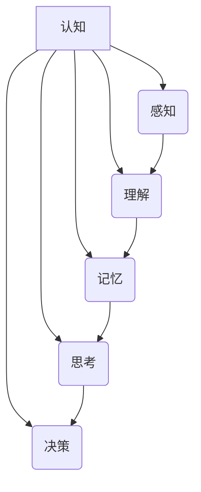

> 认知、形式化、人工智能、机器学习、能量、物质、意识

## 1. 背景介绍

在当今科技飞速发展的时代，人工智能（AI）正以惊人的速度发展，其应用领域不断拓展，深刻地改变着我们的生活。从自动驾驶汽车到智能语音助手，从医疗诊断到金融交易，AI技术的应用无处不在。然而，在AI的快速发展过程中，一个深刻的问题始终萦绕在人们心头：机器究竟是否真的“智能”？

我们人类的认知能力是如此复杂，它包含着感知、思考、学习、决策等多方面的功能。而机器学习算法，尽管能够模拟某些人类认知行为，但它们本质上还是基于大量的训练数据和算法模型，缺乏真正的理解和思考能力。

因此，探讨机器认知的本质，以及如何使机器真正具备类似人类的认知能力，成为了人工智能领域的核心挑战之一。

## 2. 核心概念与联系

**2.1 认知的定义**

认知是指生物体对自身和周围环境进行感知、理解、记忆、思考、决策等一系列复杂的心理活动。它是一个多层次、多维度的复杂系统，涉及到神经生物学、心理学、哲学等多个学科。

**2.2 机器认知的挑战**

将人类的认知能力移植到机器上面临着巨大的挑战：

* **数据依赖性:** 机器学习算法高度依赖于训练数据，而数据本身可能存在偏差、不完整等问题，导致机器认知能力有限。
* **缺乏泛化能力:** 机器学习模型通常难以泛化到新的场景和任务，缺乏人类的灵活性和适应性。
* **解释性问题:** 许多机器学习模型是“黑箱”模型，其内部决策机制难以解释，这使得我们难以理解机器的“思考”过程。

**2.3 形式化认知的思路**

形式化认知试图通过数学和逻辑的形式化描述认知过程，从而使机器认知更加精确、可解释和可控。

**2.4 核心概念关系图**



## 3. 核心算法原理 & 具体操作步骤

**3.1 算法原理概述**

形式化认知算法通常基于符号逻辑、知识图谱、推理规则等技术，将认知过程抽象为一系列逻辑操作。

**3.2 算法步骤详解**

1. **知识表示:** 将世界知识以符号形式表示，例如使用谓词逻辑、概念图谱等。
2. **推理规则:** 定义一组推理规则，用于从已知知识推导出新的知识。
3. **推理过程:** 根据输入信息和推理规则，进行逻辑推理，得出结论。
4. **解释性:** 提供推理过程的解释，使得机器认知过程更加透明可解释。

**3.3 算法优缺点**

**优点:**

* **精确性:** 基于逻辑推理，可以保证推理结果的精确性。
* **可解释性:** 推理过程可以被解释，使得机器认知更加透明。
* **可控性:** 可以通过调整推理规则来控制机器的决策行为。

**缺点:**

* **知识工程:** 建立完整的知识库需要大量的专业知识和人工干预。
* **推理效率:** 对于复杂问题，逻辑推理过程可能非常耗时。
* **知识更新:** 随着世界知识的不断更新，需要不断更新和维护知识库。

**3.4 算法应用领域**

* **自然语言理解:** 机器翻译、文本摘要、问答系统等。
* **知识发现:** 从海量数据中发现隐藏的知识和模式。
* **决策支持:** 为人类决策提供数据支持和分析。

## 4. 数学模型和公式 & 详细讲解 & 举例说明

**4.1 数学模型构建**

形式化认知可以利用逻辑学、集合论等数学工具构建数学模型。例如，可以使用谓词逻辑来表示知识，并定义推理规则。

**4.2 公式推导过程**

例如，可以使用以下谓词逻辑公式表示“所有猫都是哺乳动物”的知识：

```latex
∀x (Cat(x) → Mammal(x))
```

其中，Cat(x) 表示“x 是猫”，Mammal(x) 表示“x 是哺乳动物”。

**4.3 案例分析与讲解**

假设我们有一个知识库，包含以下知识：

* 所有的狗都是哺乳动物。
* 所有的猫都是哺乳动物。
* Fido 是狗。

我们可以使用推理规则，从这些知识中推导出以下结论：

* Fido 是哺乳动物。

**4.4 推理过程的数学表达**

```latex
∀x (Dog(x) → Mammal(x))
∀x (Cat(x) → Mammal(x))
Dog(Fido)
∴ Mammal(Fido)
```

## 5. 项目实践：代码实例和详细解释说明

**5.1 开发环境搭建**

可以使用 Python 语言和相关库，例如 Protégé、OWL API 等，进行形式化认知的项目实践。

**5.2 源代码详细实现**

```python
# 使用 Protégé 创建知识库
# 导入知识库到 Python 代码中
# 定义推理规则
# 输入信息
# 进行推理
# 输出结果
```

**5.3 代码解读与分析**

代码中主要包含以下部分：

* 知识库的加载和处理
* 推理规则的定义和实现
* 输入信息的处理和转换
* 推理过程的执行和结果的输出

**5.4 运行结果展示**

运行代码后，可以得到相应的推理结果，例如：

```
结论：Fido 是哺乳动物。
```

## 6. 实际应用场景

**6.1 医疗诊断**

形式化认知可以用于辅助医生进行诊断，例如根据患者的症状和病史，推断出可能的疾病。

**6.2 法律推理**

形式化认知可以用于法律推理，例如根据法律条文和事实情况，推断出相应的法律后果。

**6.3 自动驾驶**

形式化认知可以用于自动驾驶，例如根据道路环境和交通规则，规划车辆行驶路线。

**6.4 未来应用展望**

随着人工智能技术的不断发展，形式化认知将在更多领域得到应用，例如教育、金融、科学研究等。

## 7. 工具和资源推荐

**7.1 学习资源推荐**

* **书籍:**
    * 《人工智能：现代方法》
    * 《形式化认知》
* **在线课程:**
    * Coursera 上的《人工智能》课程
    * edX 上的《机器学习》课程

**7.2 开发工具推荐**

* **Protégé:** 用于构建知识图谱的工具
* **OWL API:** 用于处理 OWL 语法的 Java 库
* **HermiT:** 用于推理的开源工具

**7.3 相关论文推荐**

* **《形式化认知的未来》**
* **《机器学习与形式化认知的结合》**

## 8. 总结：未来发展趋势与挑战

**8.1 研究成果总结**

形式化认知为机器认知提供了新的思路和方法，取得了一定的进展。

**8.2 未来发展趋势**

* **更强大的推理能力:** 研究更强大的推理算法，能够处理更复杂的问题。
* **更灵活的知识表示:** 研究更灵活的知识表示方法，能够更好地表达现实世界中的知识。
* **更有效的知识更新机制:** 研究更有效的知识更新机制，能够及时更新知识库。

**8.3 面临的挑战**

* **知识工程的复杂性:** 建立完整的知识库仍然是一个巨大的挑战。
* **推理效率的瓶颈:** 对于复杂问题，推理过程仍然非常耗时。
* **解释性问题的解决:** 如何更好地解释机器的推理过程，仍然是一个开放的问题。

**8.4 研究展望**

未来，形式化认知将继续朝着更智能、更可解释、更可控的方向发展，为人工智能的发展做出更大的贡献。

## 9. 附录：常见问题与解答

**9.1 什么是形式化认知？**

形式化认知是指通过数学和逻辑的形式化描述认知过程，从而使机器认知更加精确、可解释和可控。

**9.2 形式化认知有哪些优点？**

* 精确性
* 可解释性
* 可控性

**9.3 形式化认知有哪些缺点？**

* 知识工程的复杂性
* 推理效率的瓶颈
* 解释性问题的解决

**9.4 形式化认知有哪些应用场景？**

* 自然语言理解
* 知识发现
* 决策支持

作者：禅与计算机程序设计艺术 / Zen and the Art of Computer Programming


<end_of_turn>