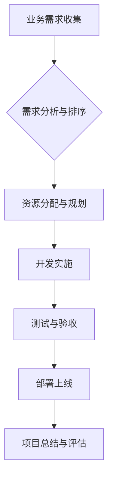

> 跨部门协调、资源管理、需求排序、业务理解、落地节奏、项目管理

## 1. 背景介绍

在当今快速发展的科技时代，软件项目越来越复杂，涉及多个部门、多个团队的协作。如何有效地协调跨部门资源，对需求进行合理的排序和把控落地节奏，成为项目成功关键。

传统的项目管理方法往往侧重于技术实现，缺乏对业务需求的深入理解，导致资源分配不合理、项目进度滞后、最终目标难以达成。

## 2. 核心概念与联系

**2.1 跨部门协调**

跨部门协调是指多个部门之间相互合作，共同完成一个目标的过程。在软件项目中，跨部门协调涉及到产品、开发、测试、运营等多个部门，需要建立有效的沟通机制和协作流程。

**2.2 资源管理**

资源管理是指合理规划、分配和利用项目所需的各种资源，包括人力、物力、财力等。有效的资源管理可以提高项目效率，降低成本，确保项目按计划完成。

**2.3 需求排序**

需求排序是指根据需求的优先级、价值和可实现性，对需求进行排列和分类。合理的需求排序可以帮助项目团队集中精力开发最重要的功能，提高项目价值。

**2.4 落地节奏**

落地节奏是指项目实施的进度和速度。合理的落地节奏可以确保项目按计划完成，避免项目延期或超支。

**2.5 业务理解**

业务理解是指对项目所服务的业务领域、目标用户和市场环境的深入了解。对业务的深入理解是进行有效需求排序和控制落地节奏的基础。

**2.6 流程图**



## 3. 核心算法原理 & 具体操作步骤

**3.1 算法原理概述**

本方案采用基于业务价值和可实现性的需求排序算法，结合资源分配和进度控制策略，实现跨部门资源协调和项目落地节奏把控。

**3.2 算法步骤详解**

1. **业务需求收集:** 从各个部门收集项目相关的业务需求，并进行初步整理和分类。
2. **需求分析与排序:** 对收集到的需求进行分析，评估其价值、可实现性和风险，并根据预设的排序规则进行排序。
3. **资源分配与规划:** 根据需求排序结果，合理分配项目所需的资源，包括人力、物力、财力等。
4. **开发实施:** 开发团队根据需求文档和资源分配计划，进行开发实施工作。
5. **测试与验收:** 测试团队对开发成果进行测试和验收，确保项目质量。
6. **部署上线:** 将经过测试和验收的项目成果部署到生产环境，并进行上线运营。
7. **项目总结与评估:** 项目结束后，进行总结和评估，分析项目成功与失败的原因，为下次项目提供参考。

**3.3 算法优缺点**

**优点:**

* 能够根据业务价值和可实现性对需求进行排序，提高项目价值。
* 能够合理分配资源，提高项目效率。
* 能够控制项目落地节奏，确保项目按计划完成。

**缺点:**

* 需要对业务需求进行深入分析和评估，需要专业人员进行操作。
* 需要建立有效的沟通机制和协作流程，确保跨部门协作顺利进行。

**3.4 算法应用领域**

本方案适用于各种类型的软件项目，例如：

* 企业级软件开发
* Web 应用开发
* 移动应用开发
* 数据分析平台开发

## 4. 数学模型和公式 & 详细讲解 & 举例说明

**4.1 数学模型构建**

我们使用一个简单的数学模型来表示需求的价值和可实现性：

```latex
价值 = f(需求重要性, 需求影响范围)
可实现性 = g(技术难度, 资源可用性)
```

其中：

* 价值：需求的价值，是一个数值表示。
* 可实现性：需求的可实现性，也是一个数值表示。
* 需求重要性：需求对业务的影响程度。
* 需求影响范围：需求对用户和业务的影响范围。
* 技术难度：实现需求的技术难度。
* 资源可用性：实现需求所需的资源是否充足。

**4.2 公式推导过程**

我们可以根据需求的价值和可实现性，构建一个需求排序公式：

```latex
排序 = 价值 * 可实现性
```

**4.3 案例分析与讲解**

假设我们有一个软件项目，需要开发以下功能：

* 功能 A：用户登录功能，需求重要性高，需求影响范围广，技术难度低，资源可用性高。
* 功能 B：用户注册功能，需求重要性中等，需求影响范围中等，技术难度中等，资源可用性中等。
* 功能 C：用户支付功能，需求重要性高，需求影响范围广，技术难度高，资源可用性低。

根据上述公式，我们可以计算出每个功能的排序值：

* 功能 A：排序 = 价值 * 可实现性 = 高 * 高 = 高
* 功能 B：排序 = 价值 * 可实现性 = 中等 * 中等 = 中等
* 功能 C：排序 = 价值 * 可实现性 = 高 * 低 = 低

因此，根据排序值，我们应该优先开发功能 A，其次是功能 B，最后是功能 C。

## 5. 项目实践：代码实例和详细解释说明

**5.1 开发环境搭建**

本方案可以使用任何主流的软件开发环境搭建，例如：

* Java 开发环境
* Python 开发环境
* Node.js 开发环境

**5.2 源代码详细实现**

由于篇幅限制，这里只提供一个简单的需求排序算法的代码示例：

```python
def calculate_priority(importance, impact, difficulty, availability):
  """
  计算需求的优先级

  Args:
    importance: 需求重要性 (1-5 分)
    impact: 需求影响范围 (1-5 分)
    difficulty: 技术难度 (1-5 分)
    availability: 资源可用性 (1-5 分)

  Returns:
    需求优先级 (1-10 分)
  """
  priority = (importance * impact) * (difficulty / availability)
  return priority

# 示例需求
demand_a = {
  "importance": 5,
  "impact": 5,
  "difficulty": 1,
  "availability": 5
}

demand_b = {
  "importance": 3,
  "impact": 3,
  "difficulty": 3,
  "availability": 3
}

demand_c = {
  "importance": 5,
  "impact": 5,
  "difficulty": 5,
  "availability": 1
}

# 计算需求优先级
priority_a = calculate_priority(**demand_a)
priority_b = calculate_priority(**demand_b)
priority_c = calculate_priority(**demand_c)

# 打印结果
print(f"需求 A 优先级: {priority_a}")
print(f"需求 B 优先级: {priority_b}")
print(f"需求 C 优先级: {priority_c}")
```

**5.3 代码解读与分析**

该代码定义了一个 `calculate_priority` 函数，用于计算需求的优先级。函数接收四个参数：需求重要性、需求影响范围、技术难度和资源可用性。

函数内部使用一个简单的公式计算优先级，并将结果返回。

**5.4 运行结果展示**

运行该代码后，会输出每个需求的优先级值。

## 6. 实际应用场景

**6.1 案例分析**

例如，一家电商平台需要开发一个新的用户注册功能。

* 需求 A：用户注册功能，需求重要性高，需求影响范围广，技术难度中等，资源可用性高。
* 需求 B：用户支付功能，需求重要性高，需求影响范围广，技术难度高，资源可用性低。

根据上述分析，电商平台应该优先开发用户注册功能，因为其优先级更高。

**6.2 未来应用展望**

随着人工智能技术的不断发展，跨部门资源协调和需求排序将更加智能化和自动化。

未来，我们可以利用机器学习算法，对业务需求进行更深入的分析和预测，并根据预测结果，自动分配资源和控制落地节奏。

## 7. 工具和资源推荐

**7.1 学习资源推荐**

* 项目管理书籍：
    * 《项目管理实战》
    * 《敏捷软件开发》
* 跨部门协作工具：
    * Slack
    * Microsoft Teams
    * Jira

**7.2 开发工具推荐**

* 代码版本控制工具：
    * Git
    * SVN
* 项目管理工具：
    * Jira
    * Trello
    * Asana

**7.3 相关论文推荐**

* 《跨部门协作中的资源分配问题》
* 《基于机器学习的软件需求排序算法》

## 8. 总结：未来发展趋势与挑战

**8.1 研究成果总结**

本方案提出了一种基于业务价值和可实现性的需求排序算法，结合资源分配和进度控制策略，有效地解决了跨部门资源协调和项目落地节奏把控的问题。

**8.2 未来发展趋势**

未来，跨部门资源协调和需求排序将更加智能化和自动化，利用人工智能技术，实现更精准的资源分配和更有效的项目管理。

**8.3 面临的挑战**

* 如何更准确地评估业务需求的价值和可实现性。
* 如何建立更有效的跨部门沟通机制和协作流程。
* 如何应对项目环境的不断变化，及时调整资源分配和落地节奏。

**8.4 研究展望**

未来，我们将继续研究跨部门资源协调和需求排序的算法和方法，探索更智能化和自动化的人工智能解决方案，为软件项目管理提供更有效的支持。

## 9. 附录：常见问题与解答

**9.1 如何评估需求的价值和可实现性？**

我们可以使用多种方法评估需求的价值和可实现性，例如：

* 专家评估
* 用户调查
* 数据分析

**9.2 如何建立有效的跨部门沟通机制和协作流程？**

我们可以使用以下方法建立有效的跨部门沟通机制和协作流程：

* 定期召开跨部门会议
* 使用协作工具进行沟通和信息共享
* 建立清晰的责任和权限分配机制

**9.3 如何应对项目环境的不断变化，及时调整资源分配和落地节奏？**

我们可以使用以下方法应对项目环境的不断变化，及时调整资源分配和落地节奏：

* 定期进行项目进度评估和风险分析
* 建立灵活的项目计划和资源分配机制
* 积极沟通和协作，及时调整项目计划和资源分配


作者：禅与计算机程序设计艺术 / Zen and the Art of Computer Programming 
<end_of_turn>