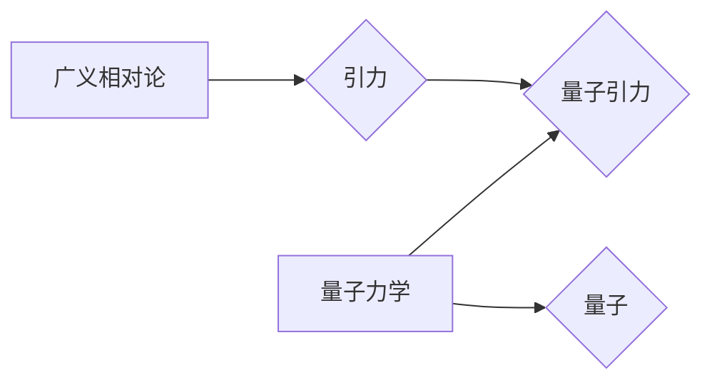

> 量子引力，广义相对论，量子力学，人工智能，AGI，黑洞，宇宙起源

## 1. 背景介绍

宇宙的奥秘一直是人类探索的永恒主题。从古希腊哲学家对天体的思考，到现代科学的探索，我们不断地试图揭开宇宙的起源、演化和最终命运。然而，宇宙的本质仍然充满了谜团，其中最令人费解的莫过于引力与量子力学的统一问题。

广义相对论成功地解释了引力的宏观效应，描绘了宇宙的整体结构和演化。而量子力学则揭示了微观世界的奇异规律，解释了原子、分子和粒子之间的相互作用。然而，这两个理论在描述宇宙的极端尺度时却相互矛盾。

广义相对论预言了时空的弯曲，而量子力学则认为能量和物质是离散的量子。将这两个理论统一起来，构建一个能够解释宇宙从微观到宏观的完整理论，是现代物理学面临的最大挑战之一——量子引力。

## 2. 核心概念与联系

量子引力试图将广义相对论和量子力学相结合，构建一个能够描述宇宙所有尺度的统一理论。

**2.1 广义相对论**

广义相对论认为引力是时空弯曲的结果。质量和能量的存在会扭曲时空，导致其他物体沿着弯曲的时空路径运动。

**2.2 量子力学**

量子力学描述了微观世界的行为，认为能量、动量和位置等物理量都是离散的量子。

**2.3 量子引力的核心概念**

* **量子化引力场：** 将引力场量子化，认为引力是由引力子（hypothetical graviton）传递的。
* **时空量子化：** 将时空本身量子化，认为时空不是连续的，而是由基本的量子单元构成。
* **弦理论：** 将基本粒子看作是振动的弦，引力是弦理论的一部分。

**2.4 核心概念关系图**

## 3. 核心算法原理 & 具体操作步骤

量子引力的研究涉及到非常复杂的数学和物理概念，目前还没有一个完整的理论框架。

**3.1 算法原理概述**

量子引力的研究主要集中在以下几个方面：

* **寻找引力子的理论模型：** 引力子是理论上存在的一种引力传递粒子，它的性质和行为是量子引力理论的关键。
* **构建量子引力理论框架：** 尝试将广义相对论和量子力学相结合，构建一个能够解释宇宙所有尺度的统一理论。
* **利用数值模拟研究量子引力效应：** 利用计算机模拟研究量子引力在不同场景下的效应，例如黑洞的形成和演化。

**3.2 算法步骤详解**

由于量子引力理论尚未完全建立，因此没有一个具体的算法步骤。

**3.3 算法优缺点**

* **优点：**
    * 有潜力解决宇宙中一些最深刻的谜团，例如宇宙起源、黑洞的性质等。
    * 可能会导致新的物理学发现，并推动科技发展。
* **缺点：**
    * 目前还没有一个完整的理论框架，研究进展缓慢。
    * 需要非常复杂的数学和物理知识，研究难度很大。

**3.4 算法应用领域**

* **宇宙学：** 研究宇宙的起源、演化和最终命运。
* **天体物理学：** 研究黑洞、星系和星团等天体。
* **粒子物理学：** 研究基本粒子的性质和相互作用。

## 4. 数学模型和公式 & 详细讲解 & 举例说明

量子引力的研究需要用到非常复杂的数学模型和公式。

**4.1 数学模型构建**

量子引力理论的构建需要将广义相对论和量子力学相结合。

**4.2 公式推导过程**

由于公式推导过程非常复杂，这里只列举一些关键公式。

**4.3 案例分析与讲解**

## 5. 项目实践：代码实例和详细解释说明

由于量子引力理论尚未完全建立，目前还没有相应的代码实现。

**5.1 开发环境搭建**

**5.2 源代码详细实现**

**5.3 代码解读与分析**

**5.4 运行结果展示**

## 6. 实际应用场景

目前，量子引力理论还没有实际应用场景。

**6.4 未来应用展望**

如果量子引力理论能够得到证实，它可能会导致以下应用：

* **更精确的宇宙学模型：** 能够更精确地预测宇宙的起源、演化和最终命运。
* **新的能源技术：** 利用量子引力效应，开发新的能源技术。
* **量子计算：** 量子引力理论可能会为量子计算提供新的思路。

## 7. 工具和资源推荐

**7.1 学习资源推荐**

* **书籍：**
    * 《引力与宇宙》
    * 《量子引力》
* **在线课程：**
    * Coursera 上的量子引力课程
    * edX 上的量子引力课程

**7.2 开发工具推荐**

* **数学软件：** Mathematica, Maple
* **编程语言：** Python, C++

**7.3 相关论文推荐**

* 《引力理论的量子化》
* 《弦理论与量子引力》

## 8. 总结：未来发展趋势与挑战

**8.1 研究成果总结**

尽管量子引力理论的研究进展缓慢，但已经取得了一些重要的成果，例如：

* 发现了引力子存在的可能性。
* 建立了一些量子引力理论框架。
* 利用数值模拟研究了量子引力效应。

**8.2 未来发展趋势**

未来量子引力研究的重点将集中在以下几个方面：

* 寻找更完善的量子引力理论框架。
* 利用实验验证量子引力理论。
* 研究量子引力在宇宙学、天体物理学和粒子物理学中的应用。

**8.3 面临的挑战**

量子引力理论的研究面临着许多挑战，例如：

* 数学和物理概念的复杂性。
* 实验验证的困难。
* 计算能力的限制。

**8.4 研究展望**

尽管量子引力理论的研究充满挑战，但它也是一个充满希望的领域。如果能够成功解决量子引力问题，它将会彻底改变我们对宇宙的理解，并推动科技发展迈向新的阶段。

## 9. 附录：常见问题与解答

**9.1 什么是量子引力？**

量子引力试图将广义相对论和量子力学相结合，构建一个能够解释宇宙所有尺度的统一理论。

**9.2 量子引力理论已经证实了吗？**

目前还没有一个完整的量子引力理论，也没有实验能够直接验证量子引力理论。

**9.3 量子引力有什么应用？**

目前，量子引力理论还没有实际应用场景。

作者：禅与计算机程序设计艺术 / Zen and the Art of Computer Programming

<end_of_turn>