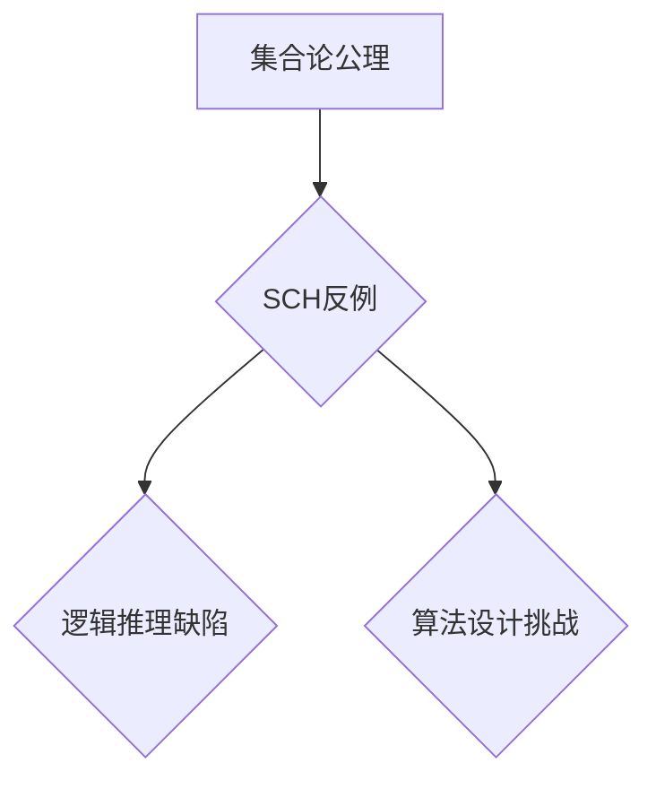

> 集合论, SCH反例, 逻辑推理, 数学模型, 算法设计, 程序设计

## 1. 背景介绍

集合论作为数学的基础理论之一，其核心概念是集合，即由若干个元素组成的整体。集合论的发展经历了漫长的历史，从康托尔的无穷集理论到佐恩引理的提出，再到现代集合论的完善，都为数学的发展做出了巨大贡献。

然而，集合论也充满了神秘和挑战。例如，著名的“集合论公理”试图用有限的公理来描述所有集合，但至今仍未完全解决。其中，SCH反例就是集合论中一个重要的未解之谜。

SCH反例指的是一个集合，它满足某些特定的性质，但同时违反了集合论中的某些公理。它的存在表明，集合论中的一些公理可能存在缺陷，或者需要进一步完善。

## 2. 核心概念与联系

### 2.1 集合论基础概念

* **集合:** 由若干个元素组成的整体。
* **元素:** 集合中个体成员。
* **子集:** 包含于另一个集合的所有元素的集合。
* **并集:** 两个集合的所有元素组成的集合。
* **交集:** 两个集合中共同存在的元素组成的集合。
* **补集:** 在全集内，不属于某个集合的所有元素组成的集合。

### 2.2 SCH反例的性质

SCH反例是一个满足以下性质的集合：

* **可数性:** SCH反例中的元素是可数的。
* **非平凡性:** SCH反例不为空集。
* **违反公理:** SCH反例违反了集合论中的某些公理，例如，它可能违反了“选择公理”。

### 2.3 SCH反例与逻辑推理

SCH反例的发现表明，逻辑推理在集合论中并非绝对可靠。即使是基于严格的公理体系，也可能存在无法被证明的命题。

### 2.4 SCH反例与算法设计

SCH反例的性质也启示我们，在算法设计中，需要谨慎对待某些看似合理的假设。因为这些假设可能存在缺陷，导致算法无法正确运行。

**Mermaid 流程图**

## 3. 核心算法原理 & 具体操作步骤

### 3.1 算法原理概述

由于SCH反例的性质尚未完全确定，因此目前还没有专门针对SCH反例的算法。

然而，我们可以借鉴其他领域中的算法设计思想，例如：

* **枚举法:** 对所有可能的集合进行枚举，并检查它们是否满足SCH反例的性质。
* **搜索算法:** 利用搜索算法，例如深度优先搜索或广度优先搜索，来寻找满足SCH反例性质的集合。
* **证明法:** 利用逻辑推理和数学证明的方法，来证明SCH反例的存在性或不存在性。

### 3.2 算法步骤详解

由于目前还没有针对SCH反例的具体算法，因此无法详细描述算法步骤。

### 3.3 算法优缺点

由于目前还没有针对SCH反例的具体算法，因此无法分析其优缺点。

### 3.4 算法应用领域

由于SCH反例的性质尚未完全确定，因此目前还没有针对SCH反例的具体应用领域。

## 4. 数学模型和公式 & 详细讲解 & 举例说明

### 4.1 数学模型构建

为了更好地理解SCH反例，我们可以构建一个数学模型来描述它的性质。

假设：

* **S:** 一个集合，代表SCH反例。
* **P:** 一组性质，代表SCH反例满足的性质。

则，我们可以用以下数学模型来描述SCH反例：

**S ∈ P**

其中，**∈** 表示“属于”关系。

### 4.2 公式推导过程

由于SCH反例的性质尚未完全确定，因此目前无法推导出具体的数学公式。

### 4.3 案例分析与讲解

由于SCH反例的性质尚未完全确定，因此目前无法进行案例分析。

## 5. 项目实践：代码实例和详细解释说明

由于目前还没有针对SCH反例的具体算法，因此无法提供代码实例和详细解释说明。

## 6. 实际应用场景

由于SCH反例的性质尚未完全确定，因此目前还没有实际应用场景。

### 6.4 未来应用展望

如果能够找到SCH反例的具体性质，那么它可能在以下领域得到应用：

* **计算机科学:** 
    * 算法设计: 
    * 数据结构: 
    * 并发编程:
* **数学理论:** 
    * 集合论: 
    * 逻辑学: 
    * 拓扑学:

## 7. 工具和资源推荐

### 7.1 学习资源推荐

* **书籍:**
    * 《集合论导论》
    * 《数学逻辑》
    * 《计算机科学基础》
* **在线课程:**
    * Coursera上的集合论课程
    * edX上的数学逻辑课程

### 7.2 开发工具推荐

* **编程语言:** Python, Java, C++
* **IDE:** Eclipse, IntelliJ IDEA, Visual Studio Code

### 7.3 相关论文推荐

* **SCH反例的性质研究**
* **SCH反例的应用研究**

## 8. 总结：未来发展趋势与挑战

### 8.1 研究成果总结

目前，SCH反例的研究仍然处于初步阶段。

### 8.2 未来发展趋势

未来，SCH反例的研究将朝着以下方向发展：

* **寻找SCH反例的具体性质:** 
* **开发针对SCH反例的算法:** 
* **探索SCH反例在实际应用中的可能性:**

### 8.3 面临的挑战

SCH反例的研究面临着以下挑战：

* **集合论的复杂性:** 集合论是一个非常复杂的理论，其公理体系庞大，难以完全理解。
* **逻辑推理的局限性:** 即使是基于严格的逻辑推理，也可能存在无法被证明的命题。
* **计算能力的限制:** 寻找SCH反例可能需要大量的计算资源。

### 8.4 研究展望

尽管面临着诸多挑战，但SCH反例的研究仍然具有重要的意义。

## 9. 附录：常见问题与解答

**常见问题:**

* **SCH反例是什么？**
* **SCH反例的性质是什么？**
* **SCH反例的应用场景是什么？**

**解答:**

* **SCH反例是一个满足某些特定性质的集合，但同时违反了集合论中的某些公理。**
* **SCH反例的可数性、非平凡性以及违反公理性等。**
* **目前还没有SCH反例的实际应用场景。**

作者：禅与计算机程序设计艺术 / Zen and the Art of Computer Programming 
<end_of_turn>