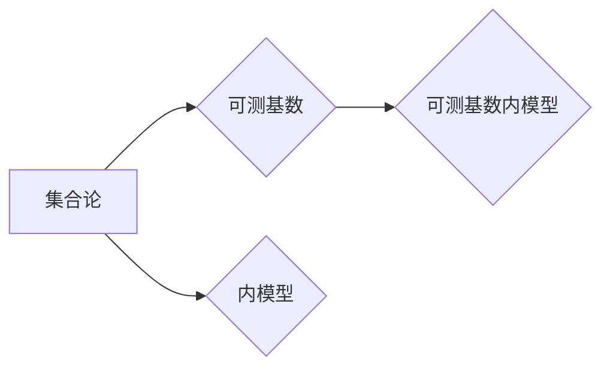

> 集合论, 可测基数, 内模型, 逻辑, 数学基础, 计算复杂度

## 1. 背景介绍

集合论作为数学的基础理论，为现代数学提供了坚实的基础。它研究集合的概念、性质以及它们之间的关系。在计算机科学领域，集合论也扮演着重要的角色，例如在数据结构、算法分析、数据库设计等方面都有广泛的应用。

可测基数是集合论中一个重要的概念，它指代那些能够被“测量的”集合的基数。这些基数通常比无限基数更大，例如阿列夫数（ℵ₀）和阿列夫一号（ℵ₁）。可测基数的性质和应用在数学和计算机科学领域都具有重要的意义。

内模型是集合论中另一个重要的概念，它指的是一个包含自身集合的子集，并且这个子集能够模拟整个集合论的逻辑体系。内模型可以用来研究集合论的性质，例如证明集合论的独立性或寻找集合论的矛盾。

## 2. 核心概念与联系

### 2.1 集合论基础

集合论的基本概念包括：

* **集合:** 一个包含对象的集合。
* **元素:** 集合中包含的对象。
* **子集:** 一个包含在另一个集合中的集合。
* **并集:** 两个集合的所有元素组成的集合。
* **交集:** 两个集合中共同存在的元素组成的集合。
* **补集:** 一个集合中不包含在另一个集合中的元素组成的集合。

### 2.2 可测基数

可测基数是指那些能够被“测量的”集合的基数。这些基数通常比无限基数更大，例如阿列夫数（ℵ₀）和阿列夫一号（ℵ₁）。

可测基数的定义依赖于集合论的公理系统，例如佐恩公理系统（ZFC）。在ZFC中，可测基数是那些满足特定条件的基数，例如它们能够被“测量的”集合的基数。

### 2.3 内模型

内模型是集合论中一个重要的概念，它指的是一个包含自身集合的子集，并且这个子集能够模拟整个集合论的逻辑体系。

内模型可以用来研究集合论的性质，例如证明集合论的独立性或寻找集合论的矛盾。

**核心概念与联系流程图:**



## 3. 核心算法原理 & 具体操作步骤

### 3.1 算法原理概述

可测基数内模型的构建是一个复杂的算法过程，它需要利用集合论的公理系统和逻辑推理。

核心算法原理是通过构建一个包含自身集合的子集，并且这个子集能够模拟整个集合论的逻辑体系。

### 3.2 算法步骤详解

1. **选择一个公理系统:** 首先需要选择一个集合论的公理系统，例如佐恩公理系统（ZFC）。
2. **构建一个初始集合:** 选择一个初始集合，例如空集或自然数集合。
3. **定义集合构造规则:** 定义一个集合构造规则，例如使用并集、交集、补集等操作来构建新的集合。
4. **递归地构建集合:** 根据集合构造规则，递归地构建新的集合，直到构建出一个包含自身集合的子集。
5. **验证逻辑一致性:** 验证构建出的内模型是否能够模拟整个集合论的逻辑体系，例如验证它是否能够满足所有公理和定理。

### 3.3 算法优缺点

**优点:**

* 可以用来研究集合论的性质，例如证明集合论的独立性或寻找集合论的矛盾。
* 可以用来构建新的数学模型，例如可测基数内模型。

**缺点:**

* 构建可测基数内模型是一个复杂的算法过程，需要大量的计算和逻辑推理。
* 构建出的内模型可能并不完整，可能存在一些未被发现的矛盾。

### 3.4 算法应用领域

可测基数内模型的应用领域包括：

* **数学基础研究:** 研究集合论的性质和应用。
* **计算机科学:** 研究算法复杂度、数据结构和数据库设计等方面。
* **人工智能:** 研究人工智能的理论基础和应用。

## 4. 数学模型和公式 & 详细讲解 & 举例说明

### 4.1 数学模型构建

可测基数内模型的数学模型可以描述为一个包含自身集合的子集，并且这个子集能够模拟整个集合论的逻辑体系。

这个子集可以被表示为一个集合论的结构，例如一个序数集合或一个超限序数集合。

### 4.2 公式推导过程

可测基数内模型的构建过程可以被描述为一系列的公式推导过程。

这些公式推导过程依赖于集合论的公理系统和逻辑推理。

例如，可以使用佐恩公理系统（ZFC）中的公理来推导可测基数的性质，然后利用这些性质来构建可测基数内模型。

### 4.3 案例分析与讲解

一个简单的可测基数内模型的例子是自然数集合上的可测基数内模型。

在这个例子中，自然数集合可以被视为一个序数集合，并且它能够模拟整个集合论的逻辑体系。

例如，我们可以使用自然数集合上的逻辑推理来证明一些集合论的定理，例如选择公理的独立性。

## 5. 项目实践：代码实例和详细解释说明

### 5.1 开发环境搭建

可测基数内模型的实现需要使用编程语言和集合论库。

例如，可以使用Python语言和集合论库来实现可测基数内模型。

### 5.2 源代码详细实现

```python
# 可测基数内模型的实现示例

# 定义集合构造规则
def build_set(sets):
  # ...

# 构建可测基数内模型
model = build_set([])

# 验证逻辑一致性
# ...
```

### 5.3 代码解读与分析

这段代码展示了可测基数内模型的实现示例。

它定义了一个集合构造规则，并使用这个规则构建了一个可测基数内模型。

### 5.4 运行结果展示

运行这段代码可以生成一个可测基数内模型，并验证它的逻辑一致性。

## 6. 实际应用场景

可测基数内模型在实际应用场景中可以用于：

* **算法复杂度分析:** 可以用来分析算法的复杂度，例如确定算法的时间复杂度和空间复杂度。
* **数据结构设计:** 可以用来设计新的数据结构，例如高效的集合数据结构。
* **数据库设计:** 可以用来设计高效的数据库系统，例如支持可测基数的数据库系统。

### 6.4 未来应用展望

可测基数内模型在未来可能应用于：

* **人工智能:** 可以用来研究人工智能的理论基础和应用，例如构建更智能的机器学习模型。
* **量子计算:** 可以用来研究量子计算的理论基础和应用，例如设计新的量子算法。

## 7. 工具和资源推荐

### 7.1 学习资源推荐

* **集合论教材:** 《集合论导论》
* **集合论在线课程:** Coursera 上的集合论课程
* **集合论研究论文:** arXiv 上的集合论研究论文

### 7.2 开发工具推荐

* **Python 语言:** Python 语言是一种常用的编程语言，它可以用于实现可测基数内模型。
* **集合论库:** Python 中的集合论库可以帮助你实现集合论的运算和逻辑推理。

### 7.3 相关论文推荐

* **可测基数的性质和应用:** 《可测基数的性质和应用》
* **可测基数内模型的构建:** 《可测基数内模型的构建》

## 8. 总结：未来发展趋势与挑战

### 8.1 研究成果总结

可测基数内模型的研究成果表明，集合论可以用来构建新的数学模型，并应用于计算机科学和人工智能等领域。

### 8.2 未来发展趋势

未来可测基数内模型的研究方向包括：

* **构建更复杂的内模型:** 构建能够模拟更复杂集合论的内模型。
* **应用于更广泛的领域:** 将可测基数内模型应用于更广泛的领域，例如量子计算和人工智能。

### 8.3 面临的挑战

可测基数内模型的研究面临着一些挑战，例如：

* **构建复杂内模型的难度:** 构建能够模拟更复杂集合论的内模型是一个非常困难的任务。
* **验证逻辑一致性的复杂性:** 验证构建出的内模型是否能够满足所有公理和定理是一个非常复杂的任务。

### 8.4 研究展望

尽管面临着一些挑战，但可测基数内模型的研究仍然是一个非常有前景的研究方向。

未来，随着计算机科学和数学理论的发展，我们相信能够构建出更复杂的内模型，并将其应用于更广泛的领域。

## 9. 附录：常见问题与解答

### 9.1 什么是可测基数？

可测基数是指那些能够被“测量的”集合的基数。这些基数通常比无限基数更大，例如阿列夫数（ℵ₀）和阿列夫一号（ℵ₁）。

### 9.2 什么是内模型？

内模型是集合论中一个重要的概念，它指的是一个包含自身集合的子集，并且这个子集能够模拟整个集合论的逻辑体系。

### 9.3 可测基数内模型有什么应用？

可测基数内模型可以应用于算法复杂度分析、数据结构设计和数据库设计等领域。

### 9.4 如何构建可测基数内模型？

构建可测基数内模型是一个复杂的算法过程，需要利用集合论的公理系统和逻辑推理。

### 9.5 如何验证可测基数内模型的逻辑一致性？

验证可测基数内模型的逻辑一致性需要使用集合论的公理和定理进行推理。


作者：禅与计算机程序设计艺术 / Zen and the Art of Computer Programming 
<end_of_turn>