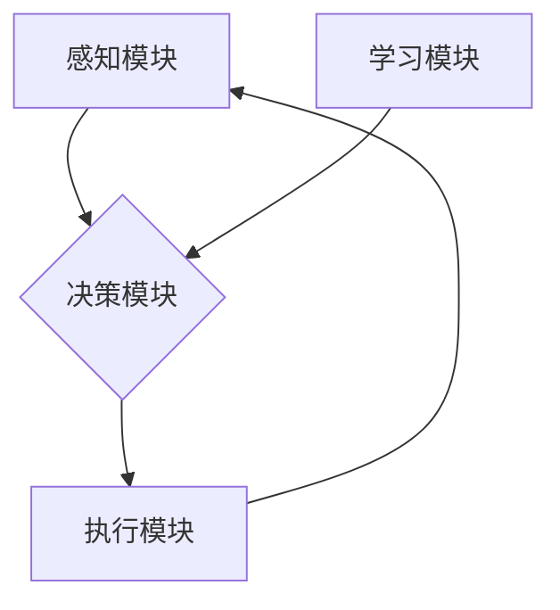

> AI Agent, 智能体, 强化学习, 决策推理, 知识表示, 
> 自然语言理解, 机器学习, 人工智能

## 1. 背景介绍

人工智能（AI）技术近年来取得了飞速发展，从语音识别、图像识别到自然语言处理等领域取得了突破性进展。然而，传统的AI系统大多局限于特定的任务，缺乏通用性和自主性。 

随着AI技术的不断进步，一个新的概念逐渐成为研究热点：**AI Agent**，即智能体。智能体是指能够感知环境、做出决策并与环境交互的智能系统。它不仅能够执行预先定义的任务，还能根据环境变化自主学习和适应，从而实现更灵活、更智能的交互。

## 2. 核心概念与联系

**2.1 智能体定义**

智能体是一个能够感知环境、做出决策并与环境交互的智能系统。它具有以下核心特征：

* **感知能力:** 智能体能够通过传感器或其他方式获取环境信息。
* **决策能力:** 智能体能够根据感知到的信息做出决策，并执行相应的行动。
* **交互能力:** 智能体能够与环境进行交互，例如与其他智能体进行通信、与物理世界进行操作等。
* **学习能力:** 智能体能够通过经验学习，不断改进自己的决策能力。

**2.2 智能体与其他AI概念的关系**

智能体是AI领域的一个重要概念，它与其他AI概念密切相关，例如：

* **机器学习:** 机器学习是智能体学习的关键技术之一，它允许智能体从数据中学习模式和规律，从而改进自己的决策能力。
* **深度学习:** 深度学习是一种更高级的机器学习方法，它能够学习更复杂的模式和关系，从而实现更强大的智能体。
* **自然语言处理:** 自然语言处理是智能体与人类进行交互的关键技术之一，它允许智能体理解和生成人类语言。
* **知识表示:** 知识表示是智能体存储和处理知识的关键技术之一，它允许智能体将知识表示为计算机可以理解的形式。

**2.3 智能体架构**

智能体的架构通常包括以下几个部分：

* **感知模块:** 用于获取环境信息。
* **决策模块:** 用于根据环境信息做出决策。
* **执行模块:** 用于执行决策并与环境交互。
* **学习模块:** 用于学习和改进决策能力。



## 3. 核心算法原理 & 具体操作步骤

**3.1 算法原理概述**

智能体算法的核心是**强化学习**。强化学习是一种机器学习方法，它允许智能体通过与环境交互学习最优策略。

在强化学习中，智能体是一个**代理**，它与一个**环境**交互。环境会根据代理的动作给予代理一个**奖励**或**惩罚**。代理的目标是学习一个策略，使得它在与环境交互的过程中获得最大的总奖励。

**3.2 算法步骤详解**

强化学习算法的具体步骤如下：

1. **初始化:** 智能体初始化一个策略，该策略将状态映射到动作。
2. **感知环境:** 智能体感知环境的状态。
3. **选择动作:** 智能体根据当前状态和策略选择一个动作。
4. **执行动作:** 智能体执行选择的动作，并观察环境的变化。
5. **获得奖励:** 环境根据智能体的动作给予智能体一个奖励或惩罚。
6. **更新策略:** 智能体根据奖励更新策略，使得未来能够获得更高的奖励。

**3.3 算法优缺点**

**优点:**

* 能够学习复杂的任务，无需人工编程。
* 能够适应不断变化的环境。

**缺点:**

* 训练时间长，需要大量的样本数据。
* 难以解释智能体的决策过程。

**3.4 算法应用领域**

强化学习算法在许多领域都有应用，例如：

* **游戏:** 训练AI代理玩游戏，例如AlphaGo、AlphaStar。
* **机器人:** 训练机器人执行复杂的任务，例如导航、抓取。
* **推荐系统:** 训练推荐系统推荐用户感兴趣的内容。
* **金融:** 训练交易策略，进行投资决策。

## 4. 数学模型和公式 & 详细讲解 & 举例说明

**4.1 数学模型构建**

强化学习的数学模型通常由以下几个要素组成：

* **状态空间 (S):** 智能体可能处于的所有状态的集合。
* **动作空间 (A):** 智能体可以执行的所有动作的集合。
* **奖励函数 (R):** 智能体在特定状态执行特定动作后获得的奖励。
* **策略 (π):** 智能体根据当前状态选择动作的策略。

**4.2 公式推导过程**

强化学习的目标是找到一个最优策略，使得智能体在与环境交互的过程中获得最大的总奖励。

最优策略可以通过**动态规划**或**蒙特卡罗方法**等算法来求解。

**4.3 案例分析与讲解**

例如，考虑一个简单的强化学习问题：一个智能体在一个迷宫中寻找出口。

* 状态空间：迷宫中的所有位置。
* 动作空间：向上、向下、向左、向右四个方向。
* 奖励函数：到达出口时获得最大奖励，迷宫中其他位置获得零奖励。

智能体可以通过强化学习算法学习一个策略，使得它能够在迷宫中找到出口。

## 5. 项目实践：代码实例和详细解释说明

**5.1 开发环境搭建**

* Python 3.x
* TensorFlow 或 PyTorch 等深度学习框架
* OpenAI Gym 等强化学习库

**5.2 源代码详细实现**

```python
import gym
import tensorflow as tf

# 定义智能体模型
class Agent(tf.keras.Model):
    def __init__(self):
        super(Agent, self).__init__()
        # 定义模型结构
        # ...

    def call(self, state):
        # 计算动作概率
        # ...

# 创建环境
env = gym.make('CartPole-v1')

# 创建智能体
agent = Agent()

# 训练智能体
for episode in range(1000):
    state = env.reset()
    done = False
    while not done:
        # 选择动作
        action = agent.predict(state)
        # 执行动作
        next_state, reward, done, _ = env.step(action)
        # 更新智能体
        agent.train(state, action, reward, next_state)
        state = next_state

# 测试智能体
state = env.reset()
while True:
    # 选择动作
    action = agent.predict(state)
    # 执行动作
    next_state, reward, done, _ = env.step(action)
    # 显示环境状态
    env.render()
    state = next_state
    if done:
        break
env.close()
```

**5.3 代码解读与分析**

* 代码首先定义了一个智能体模型，该模型使用深度学习框架进行实现。
* 然后创建了一个环境，例如OpenAI Gym中的CartPole-v1环境。
* 创建智能体实例，并使用强化学习算法进行训练。
* 训练过程中，智能体会与环境交互，根据环境的反馈更新自己的策略。
* 训练完成后，可以测试智能体的性能。

**5.4 运行结果展示**

训练完成后，智能体能够在CartPole-v1环境中保持平衡杆的稳定时间更长。

## 6. 实际应用场景

**6.1 游戏AI**

强化学习在游戏AI领域取得了显著成果，例如AlphaGo、AlphaStar等AI代理能够战胜人类顶尖选手。

**6.2 机器人控制**

强化学习可以用于训练机器人执行复杂的任务，例如导航、抓取、组装等。

**6.3 自动驾驶**

强化学习可以用于训练自动驾驶汽车，使其能够在复杂道路环境中安全行驶。

**6.4 个性化推荐**

强化学习可以用于训练个性化推荐系统，推荐用户感兴趣的内容。

**6.5 金融交易**

强化学习可以用于训练交易策略，进行投资决策。

**6.6 未来应用展望**

随着AI技术的不断发展，智能体将在更多领域得到应用，例如医疗、教育、能源等。

## 7. 工具和资源推荐

**7.1 学习资源推荐**

* **书籍:**
    * Reinforcement Learning: An Introduction by Richard S. Sutton and Andrew G. Barto
    * Deep Reinforcement Learning Hands-On by Maxim Lapan
* **课程:**
    * Deep Reinforcement Learning Specialization by DeepLearning.AI
    * Reinforcement Learning by David Silver (University of DeepMind)

**7.2 开发工具推荐**

* **OpenAI Gym:** 强化学习库，提供各种环境和算法。
* **TensorFlow:** 深度学习框架，支持强化学习算法的实现。
* **PyTorch:** 深度学习框架，支持强化学习算法的实现。

**7.3 相关论文推荐**

* Deep Reinforcement Learning with Double Q-learning
* Proximal Policy Optimization Algorithms
* Asynchronous Methods for Deep Reinforcement Learning

## 8. 总结：未来发展趋势与挑战

**8.1 研究成果总结**

近年来，强化学习取得了显著进展，在许多领域取得了突破性成果。

**8.2 未来发展趋势**

* **更强大的算法:** 研究更强大的强化学习算法，例如能够解决更复杂任务的算法。
* **更有效的训练方法:** 研究更有效的训练方法，例如减少训练时间和数据需求的算法。
* **更安全的智能体:** 研究更安全的智能体，使其能够在现实世界中安全可靠地运行。

**8.3 面临的挑战**

* **样本效率:** 强化学习算法通常需要大量的样本数据进行训练，这在现实世界中可能难以实现。
* **可解释性:** 强化学习算法的决策过程难以解释，这可能导致智能体的行为不可预测。
* **安全性和可靠性:** 强化学习算法训练出的智能体可能存在安全性和可靠性问题，需要进一步研究和改进。

**8.4 研究展望**

未来，强化学习将继续是人工智能领域的重要研究方向，其应用范围将不断扩大，为人类社会带来更多福祉。

## 9. 附录：常见问题与解答

**9.1 什么是智能体？**

智能体是一种能够感知环境、做出决策并与环境交互的智能系统。

**9.2 强化学习是什么？**

强化学习是一种机器学习方法，它允许智能体通过与环境交互学习最优策略。

**9.3 智能体有哪些应用场景？**

智能体在许多领域都有应用，例如游戏AI、机器人控制、自动驾驶、个性化推荐、金融交易等。


作者：禅与计算机程序设计艺术 / Zen and the Art of Computer Programming 
<end_of_turn>