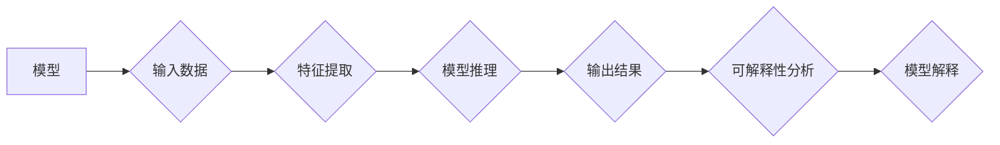

> AI Interpretability, 可解释AI, 模型解释, 决策树, LIME, SHAP, 代码实例, 深度学习

## 1. 背景介绍

人工智能（AI）技术近年来取得了飞速发展，深度学习模型在图像识别、自然语言处理等领域取得了突破性进展。然而，随着模型复杂度的增加，其内部决策机制变得越来越难以理解。这导致了“黑盒”问题，即无法解释模型是如何做出决策的，这对于许多应用场景来说是一个严重的问题。

可解释AI（XAI）旨在解决这一问题，其目标是使AI模型的决策过程更加透明、可理解。XAI的研究方向包括：

* **模型解释:**  解释模型的内部结构和参数如何影响输出结果。
* **决策路径分析:**  追踪模型如何从输入数据到最终决策的推理过程。
* **局部解释:**  解释模型对单个输入数据点的预测结果是如何产生的。

可解释AI对于人工智能技术的信任、可控性和安全性至关重要。它可以帮助我们：

* **提高模型的可信度:**  当我们能够理解模型的决策过程时，我们更容易信任其结果。
* **发现模型的偏差:**  可解释AI可以帮助我们识别模型中的潜在偏差，并采取措施加以修正。
* **促进模型的调试和改进:**  通过分析模型的决策过程，我们可以更好地理解其缺陷，并进行改进。

## 2. 核心概念与联系

可解释AI的实现方法多种多样，可以分为以下几类：

* **模型层面解释:**  通过设计更易于解释的模型结构，例如决策树、线性回归等。
* **方法层面解释:**  使用特定的算法和技术来解释已有的复杂模型，例如LIME、SHAP等。
* **可视化解释:**  通过图形化的方式展示模型的决策过程，例如决策树可视化、特征重要性可视化等。

**Mermaid 流程图:**



## 3. 核心算法原理 & 具体操作步骤

### 3.1  算法原理概述

**LIME (Local Interpretable Model-agnostic Explanations)**是一种通用的模型解释方法，它可以解释任何类型的机器学习模型，包括深度学习模型。LIME的基本思想是：

1. **扰动输入数据:**  对原始输入数据进行随机扰动，生成一系列近似原始数据的样本。
2. **预测扰动样本:**  使用目标模型对扰动样本进行预测。
3. **构建局部解释模型:**  使用简单的模型（例如线性回归）拟合扰动样本和预测结果之间的关系，得到一个局部解释模型。
4. **解释预测结果:**  通过局部解释模型，解释目标模型对原始输入数据的预测结果是如何产生的。

**SHAP (SHapley Additive exPlanations)**是一种基于博弈论的模型解释方法，它可以解释任何类型的机器学习模型。SHAP的基本思想是：

1. **定义特征贡献:**  将每个特征的贡献定义为其在模型预测中的“价值”。
2. **计算特征贡献值:**  使用SHAP值算法计算每个特征的贡献值。
3. **解释预测结果:**  通过特征贡献值，解释目标模型对原始输入数据的预测结果是如何产生的。

### 3.2  算法步骤详解

**LIME算法步骤:**

1. **选择扰动方法:**  常用的扰动方法包括随机添加噪声、随机删除特征等。
2. **生成扰动样本:**  根据选择的扰动方法，生成一系列近似原始数据的样本。
3. **预测扰动样本:**  使用目标模型对扰动样本进行预测。
4. **构建局部解释模型:**  使用简单的模型（例如线性回归）拟合扰动样本和预测结果之间的关系。
5. **解释预测结果:**  通过局部解释模型，解释目标模型对原始输入数据的预测结果是如何产生的。

**SHAP算法步骤:**

1. **定义特征贡献:**  将每个特征的贡献定义为其在模型预测中的“价值”。
2. **计算特征贡献值:**  使用SHAP值算法计算每个特征的贡献值。
3. **解释预测结果:**  通过特征贡献值，解释目标模型对原始输入数据的预测结果是如何产生的。

### 3.3  算法优缺点

**LIME算法:**

* **优点:**  通用的解释方法，可以解释任何类型的机器学习模型。
* **缺点:**  局部解释，无法解释模型全局行为。

**SHAP算法:**

* **优点:**  全局解释，可以解释模型全局行为。
* **缺点:**  计算复杂度较高。

### 3.4  算法应用领域

LIME和SHAP算法广泛应用于以下领域：

* **医疗诊断:**  解释医疗模型的诊断结果，帮助医生更好地理解模型的决策过程。
* **金融风险评估:**  解释金融模型的风险评估结果，帮助金融机构更好地管理风险。
* **自动驾驶:**  解释自动驾驶模型的决策过程，提高自动驾驶系统的安全性。

## 4. 数学模型和公式 & 详细讲解 & 举例说明

### 4.1  数学模型构建

**LIME算法:**

LIME算法的核心是构建一个局部解释模型，该模型可以近似地表示目标模型在某个输入数据点附近的决策过程。假设目标模型为f(x)，其中x是输入数据，y是输出结果。LIME算法的目标是找到一个简单的模型g(x)来近似f(x)在某个输入数据点x0附近的决策过程。

**SHAP算法:**

SHAP算法基于博弈论的Shapley值，它可以分配每个特征对模型预测结果的贡献值。假设模型有n个特征，每个特征的贡献值可以表示为一个向量s，其中s_i表示第i个特征的贡献值。SHAP值算法的目标是找到一个向量s，使得每个特征的贡献值能够公平地反映其对模型预测结果的影响。

### 4.2  公式推导过程

**LIME算法:**

LIME算法的目标是找到一个局部解释模型g(x)来近似目标模型f(x)在某个输入数据点x0附近的决策过程。可以使用最小二乘法来求解g(x)。

**SHAP算法:**

SHAP值算法的公式推导过程比较复杂，涉及到博弈论和组合数学的知识。

### 4.3  案例分析与讲解

**LIME算法案例:**

假设我们有一个图像分类模型，需要解释其对某个图像的分类结果。可以使用LIME算法生成一系列扰动图像，并使用目标模型对这些图像进行分类。然后，使用线性回归模型拟合扰动图像和分类结果之间的关系，得到一个局部解释模型。通过局部解释模型，我们可以了解哪些图像特征对模型的分类结果有重要影响。

**SHAP算法案例:**

假设我们有一个信用评分模型，需要解释其对某个用户的信用评分结果。可以使用SHAP算法计算每个特征对用户信用评分的贡献值。通过分析特征贡献值，我们可以了解哪些特征对用户的信用评分有重要影响。

## 5. 项目实践：代码实例和详细解释说明

### 5.1  开发环境搭建

* Python 3.6+
* scikit-learn
* lime
* shap
* matplotlib

### 5.2  源代码详细实现

```python
# 导入必要的库
from sklearn.linear_model import LogisticRegression
from lime import lime_tabular
from shap import TreeExplainer

# 加载数据
from sklearn.datasets import load_iris
iris = load_iris()
X = iris.data
y = iris.target

# 训练模型
model = LogisticRegression()
model.fit(X, y)

# 使用LIME解释模型
explainer = lime_tabular.LimeTabularExplainer(X, feature_names=iris.feature_names, class_names=iris.target_names)
explanation = explainer.explain_instance(X[0], model.predict_proba, top_labels=2)
explanation.as_pyplot_figure()

# 使用SHAP解释模型
explainer = TreeExplainer(model)
shap_values = explainer.shap_values(X)
shap.summary_plot(shap_values, X, plot_type="bar")
```

### 5.3  代码解读与分析

* **数据加载:**  使用sklearn.datasets.load_iris加载鸢尾花数据集。
* **模型训练:**  使用sklearn.linear_model.LogisticRegression训练逻辑回归模型。
* **LIME解释:**  使用lime_tabular.LimeTabularExplainer解释模型对第一个样本的预测结果。
* **SHAP解释:**  使用TreeExplainer解释模型对所有样本的预测结果。

### 5.4  运行结果展示

运行上述代码，会生成两个可视化结果：

* **LIME解释结果:**  显示了模型对第一个样本的预测结果是如何产生的，以及哪些特征对预测结果有重要影响。
* **SHAP解释结果:**  显示了每个特征对所有样本的预测结果的贡献值。

## 6. 实际应用场景

可解释AI在许多实际应用场景中发挥着重要作用，例如：

* **医疗诊断:**  解释医疗模型的诊断结果，帮助医生更好地理解模型的决策过程。
* **金融风险评估:**  解释金融模型的风险评估结果，帮助金融机构更好地管理风险。
* **自动驾驶:**  解释自动驾驶模型的决策过程，提高自动驾驶系统的安全性。
* **法律判决:**  解释法律模型的判决结果，提高法律判决的透明度和公正性。

### 6.4  未来应用展望

随着人工智能技术的不断发展，可解释AI将发挥越来越重要的作用。未来，可解释AI将应用于更多领域，例如：

* **个性化推荐:**  解释推荐系统的推荐结果，帮助用户更好地理解推荐背后的逻辑。
* **教育领域:**  解释人工智能辅助教学系统的教学过程，帮助学生更好地理解学习内容。
* **科学研究:**  解释人工智能在科学研究中的应用，帮助科学家更好地理解复杂现象。

## 7. 工具和资源推荐

### 7.1  学习资源推荐

* **书籍:**
    * Interpretable Machine Learning by Christoph Molnar
    * The Master Algorithm by Pedro Domingos
* **在线课程:**
    * Stanford CS229: Machine Learning
    * MIT 6.S191: Introduction to Deep Learning

### 7.2  开发工具推荐

* **LIME:** https://github.com/marcotcr/lime
* **SHAP:** https://github.com/slundberg/shap
* **TensorBoard:** https://www.tensorflow.org/tensorboard

### 7.3  相关论文推荐

* **Towards a Rigorous Science of Interpretable Machine Learning** by Christoph Molnar
* **SHAP: A Unified Approach to Interpreting Model Predictions** by Scott Lundberg and Su-In Lee

## 8. 总结：未来发展趋势与挑战

### 8.1  研究成果总结

近年来，可解释AI领域取得了显著进展，出现了许多新的解释方法和工具。这些方法和工具可以帮助我们更好地理解人工智能模型的决策过程，提高模型的可信度和可控性。

### 8.2  未来发展趋势

未来，可解释AI的发展趋势包括：

* **更通用的解释方法:**  开发能够解释各种类型模型的通用解释方法。
* **更有效的解释方法:**  开发能够更高效地解释模型的解释方法。
* **更交互式的解释方法:**  开发能够与用户进行交互的解释方法，帮助用户更好地理解模型的决策过程。

### 8.3  面临的挑战

可解释AI还面临着一些挑战，例如：

* **解释的准确性:**  目前许多解释方法的解释结果可能并不完全准确。
* **解释的复杂性:**  一些解释方法的解释结果可能过于复杂，难以理解。
* **解释的标准化:**  目前还没有