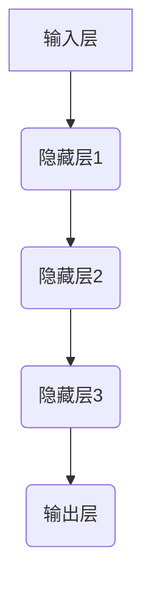

> 深度神经网络，计算艺术，机器学习，人工智能，卷积神经网络，循环神经网络，梯度下降

## 1. 背景介绍

人工智能（AI）正以惊人的速度发展，深度神经网络（DNN）作为其核心驱动力，正在深刻地改变着我们生活和工作的方式。从图像识别到自然语言处理，从医疗诊断到金融预测，DNN 的应用领域日益广泛。然而，DNN 的强大性能背后，隐藏着复杂的数学原理和算法设计。理解 DNN 的计算艺术之道，对于开发更智能、更高效的 AI 系统至关重要。

## 2. 核心概念与联系

深度神经网络本质上是一种模仿人类大脑结构和功能的计算模型。它由多个相互连接的神经元层组成，每个神经元接收来自上一层的输入，并通过权重进行加权求和，然后经过激活函数处理，输出到下一层。

**DNN 架构**



**核心概念：**

* **神经元：** DNN 的基本单元，模拟大脑神经元的功能。
* **权重：** 连接神经元的参数，决定了信号传递的强度。
* **激活函数：** 将神经元的输入转换为输出，引入非线性，使 DNN 能够学习复杂模式。
* **层：** 神经元按功能分组，形成不同的层，例如输入层、隐藏层和输出层。
* **前向传播：** 输入数据通过网络层层传递，最终得到输出结果。
* **反向传播：** 计算误差，并根据误差调整权重，使网络输出更接近真实值。

## 3. 核心算法原理 & 具体操作步骤

### 3.1  算法原理概述

深度神经网络的训练主要基于梯度下降算法。该算法通过不断调整权重，使网络输出与真实值之间的误差最小化。

**梯度下降算法步骤：**

1. 初始化权重。
2. 将输入数据送入网络，计算输出结果。
3. 计算误差，并根据误差计算梯度。
4. 根据梯度更新权重。
5. 重复步骤 2-4，直到误差达到预设阈值。

### 3.2  算法步骤详解

**1. 初始化权重：**

随机赋予每个连接神经元的权重一个初始值。

**2. 前向传播：**

将输入数据逐层传递，计算每个神经元的输出。

**3. 计算误差：**

比较网络输出与真实值的差异，计算误差。常用的误差函数包括均方误差（MSE）和交叉熵损失函数（Cross-Entropy Loss）。

**4. 反向传播：**

根据误差计算每个权重的梯度。梯度表示权重调整的方向和幅度。

**5. 更新权重：**

使用梯度下降算法更新权重，使误差最小化。

**学习率：**

梯度下降算法中有一个重要的参数称为学习率，它控制着权重更新的幅度。学习率过大可能会导致权重震荡，无法收敛；学习率过小可能会导致训练速度过慢。

### 3.3  算法优缺点

**优点：**

* 能够学习复杂非线性关系。
* 性能优异，在许多任务中取得了突破性进展。
* 可并行化训练，加速训练速度。

**缺点：**

* 训练时间长，需要大量数据和计算资源。
* 容易陷入局部最优解。
* 缺乏可解释性，难以理解模型的决策过程。

### 3.4  算法应用领域

* **图像识别：** 人脸识别、物体检测、图像分类。
* **自然语言处理：** 机器翻译、文本摘要、情感分析。
* **语音识别：** 语音转文本、语音助手。
* **医疗诊断：** 病理图像分析、疾病预测。
* **金融预测：** 股票价格预测、风险评估。

## 4. 数学模型和公式 & 详细讲解 & 举例说明

### 4.1  数学模型构建

深度神经网络的数学模型可以表示为一个多层感知机（MLP）。

**MLP 模型：**

```
y = f(W^L * a^(L-1) + b^L)
```

其中：

* y：输出
* f：激活函数
* W^L：第 L 层的权重矩阵
* a^(L-1)：第 L-1 层的激活值
* b^L：第 L 层的偏置向量

### 4.2  公式推导过程

**前向传播：**

```
a^1 = f(W^1 * x + b^1)
a^2 = f(W^2 * a^1 + b^2)
...
a^L = f(W^L * a^(L-1) + b^L)
```

**误差函数：**

```
J = (1/N) * Σ(y_i - a_i)^2
```

其中：

* N：样本数量
* y_i：真实值
* a_i：预测值

**梯度下降：**

```
W^L = W^L - α * ∂J/∂W^L
b^L = b^L - α * ∂J/∂b^L
```

其中：

* α：学习率
* ∂J/∂W^L：权重 W^L 的梯度

### 4.3  案例分析与讲解

**图像分类：**

假设我们训练一个图像分类模型，用于识别猫和狗的图片。

* 输入：一张图片，经过卷积操作转换为特征向量。
* 隐藏层：多个卷积层和池化层，提取图像特征。
* 输出层：两个神经元，分别对应猫和狗的类别。
* 激活函数：ReLU 或 sigmoid 函数。
* 误差函数：交叉熵损失函数。

通过训练，模型学习到猫和狗的特征，并能够准确地识别它们。

## 5. 项目实践：代码实例和详细解释说明

### 5.1  开发环境搭建

* Python 3.x
* TensorFlow 或 PyTorch

### 5.2  源代码详细实现

```python
import tensorflow as tf

# 定义模型
model = tf.keras.models.Sequential([
    tf.keras.layers.Conv2D(32, (3, 3), activation='relu', input_shape=(28, 28, 1)),
    tf.keras.layers.MaxPooling2D((2, 2)),
    tf.keras.layers.Conv2D(64, (3, 3), activation='relu'),
    tf.keras.layers.MaxPooling2D((2, 2)),
    tf.keras.layers.Flatten(),
    tf.keras.layers.Dense(10, activation='softmax')
])

# 编译模型
model.compile(optimizer='adam',
              loss='sparse_categorical_crossentropy',
              metrics=['accuracy'])

# 训练模型
model.fit(x_train, y_train, epochs=10)

# 评估模型
loss, accuracy = model.evaluate(x_test, y_test)
print('Test loss:', loss)
print('Test accuracy:', accuracy)
```

### 5.3  代码解读与分析

* **模型定义：** 使用 Keras API 定义一个卷积神经网络模型。
* **卷积层：** 提取图像特征。
* **池化层：** 降低特征图尺寸，提高模型鲁棒性。
* **全连接层：** 将特征映射到类别输出。
* **激活函数：** ReLU 函数用于隐藏层，softmax 函数用于输出层。
* **编译模型：** 选择优化器、损失函数和评估指标。
* **训练模型：** 使用训练数据训练模型。
* **评估模型：** 使用测试数据评估模型性能。

### 5.4  运行结果展示

训练完成后，模型会输出测试集上的损失值和准确率。

## 6. 实际应用场景

### 6.1  图像识别

* **人脸识别：** 用于解锁手机、验证身份。
* **物体检测：** 用于自动驾驶、安防监控。
* **医学图像分析：** 用于诊断疾病、辅助手术。

### 6.2  自然语言处理

* **机器翻译：** 将文本从一种语言翻译成另一种语言。
* **文本摘要：** 自动生成文本的简短摘要。
* **情感分析：** 分析文本的情感倾向，用于市场调研、客户服务等。

### 6.3  语音识别

* **语音转文本：** 将语音转换为文本，用于语音助手、听写软件等。
* **语音合成：** 将文本转换为语音，用于语音导航、播报系统等。

### 6.4  未来应用展望

* **个性化推荐：** 基于用户行为和偏好，推荐个性化内容。
* **智能客服：** 使用聊天机器人提供自动客服服务。
* **自动写作：** 使用 AI 辅助写作，提高效率和质量。

## 7. 工具和资源推荐

### 7.1  学习资源推荐

* **书籍：**
    * 深度学习
    * 构建深度神经网络
* **在线课程：**
    * Coursera 深度学习课程
    * Udacity 深度学习工程师 Nanodegree

### 7.2  开发工具推荐

* **TensorFlow：** 开源深度学习框架，支持多种硬件平台。
* **PyTorch：** 开源深度学习框架，以其灵活性和研究友好性而闻名。
* **Keras：** 高级深度学习 API，易于使用，可以运行在 TensorFlow、Theano 或 CNTK 后端。

### 7.3  相关论文推荐

* **AlexNet：** ImageNet Large Scale Visual Recognition Challenge 2012 冠军论文。
* **VGGNet：** 深度卷积神经网络架构论文。
* **ResNet：** 残差网络架构论文。

## 8. 总结：未来发展趋势与挑战

### 8.1  研究成果总结

深度神经网络在图像识别、自然语言处理、语音识别等领域取得了突破性进展，推动了人工智能的快速发展。

### 8.2  未来发展趋势

* **模型更深、更广：** 探索更深层次和更广阔结构的网络模型。
* **数据更丰富、更有效：** 利用更多数据和更有效的训练方法提高模型性能。
* **硬件加速：** 开发更强大的硬件平台，加速深度学习训练和推理。
* **可解释性增强：** 研究更可解释的深度学习模型，提高模型透明度和可信度。

### 8.3  面临的挑战

* **数据获取和标注：** 深度学习模型需要大量数据进行训练，数据获取和标注成本高昂。
* **计算资源：** 深度学习模型训练需要大量的计算资源，成本高昂。
* **模型可解释性：** 深度学习模型的决策过程难以理解，缺乏可解释性。
* **伦理问题：** 深度学习模型可能存在偏见和歧视，需要关注伦理问题。

### 8.4  研究展望

未来，深度学习研究将继续朝着更智能、更安全、更可解释的方向发展。


## 9. 附录：常见问题与解答

**1. 什么是深度学习？**

深度学习是一种机器学习的子领域，它使用多层神经网络来学习数据中的复杂模式。

**2. 深度学习有什么优势？**

深度学习能够学习复杂非线性关系，在图像识别、自然语言处理等领域取得了突破性进展。

**3. 如何训练深度学习模型？**

训练深度学习模型需要使用大量数据和强大的计算资源，通常使用梯度下降算法进行训练。

**4. 深度学习有哪些应用场景？**

深度学习应用广泛，包括图像识别、自然语言处理、语音识别、医疗诊断、金融