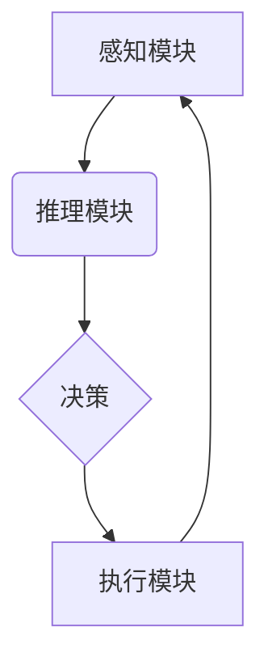

> AI人工智能, 智能代理, 智慧城市, 算法, 应用场景, 未来趋势

## 1. 背景介绍

随着信息技术的飞速发展和互联网的普及，智慧城市建设已成为全球范围内重要的发展趋势。智慧城市旨在通过融合信息技术、物联网、大数据等技术，提升城市管理效率、改善城市生活品质，构建更加智能、便捷、可持续的城市环境。

在智慧城市建设中，人工智能（AI）技术扮演着越来越重要的角色。AI技术能够赋予城市系统智能化感知、决策和执行的能力，推动城市管理向智能化、数据化、精细化方向发展。其中，AI智能代理作为一种重要的AI应用模式，在智慧城市建设中展现出巨大的潜力。

## 2. 核心概念与联系

**2.1 智能代理的概念**

智能代理是指能够自主感知环境、做出决策并执行行动的软件实体。它通常具有以下特征：

* **自主性:** 智能代理能够独立地感知环境信息，并根据自身目标和策略做出决策，无需人工干预。
* **智能性:** 智能代理能够利用人工智能技术，例如机器学习、深度学习等，学习和优化其决策策略，提高其执行效率和准确性。
* **交互性:** 智能代理能够与环境中的其他实体进行交互，例如传感器、 actuators、其他代理等，实现协同工作。

**2.2 智能代理在智慧城市中的应用**

在智慧城市中，智能代理可以应用于各个领域，例如：

* **交通管理:** 智能交通代理可以根据实时路况信息，优化交通信号灯控制、车辆导航、公共交通调度等，缓解交通拥堵，提高交通效率。
* **环境监测:** 智能环境代理可以收集和分析环境数据，例如空气质量、水质、噪音等，监测环境状况，预警环境风险。
* **公共安全:** 智能安全代理可以利用视频监控、传感器等数据，识别异常行为，预警安全事件，提高城市安全水平。
* **城市服务:** 智能服务代理可以提供个性化城市服务，例如预约医疗、缴费、查询信息等，提高市民生活便利性。

**2.3 智能代理架构**

智能代理通常由以下几个模块组成：

* **感知模块:** 用于获取环境信息，例如传感器数据、网络数据等。
* **推理模块:** 用于分析环境信息，做出决策。
* **执行模块:** 用于执行决策，控制 actuators 或与其他系统交互。
* **学习模块:** 用于学习和优化决策策略，提高代理的智能化水平。



## 3. 核心算法原理 & 具体操作步骤

**3.1 算法原理概述**

在智慧城市中，智能代理通常采用基于机器学习的算法进行决策和执行。常见的机器学习算法包括：

* **监督学习:** 利用标记数据训练模型，预测未来输出。例如，利用历史交通数据训练模型，预测未来交通流量。
* **无监督学习:** 利用未标记数据发现数据中的模式和结构。例如，利用城市传感器数据发现城市环境变化的规律。
* **强化学习:** 通过试错学习，优化代理的行为策略，以获得最大奖励。例如，训练智能交通代理，使其能够在复杂交通环境中做出最优决策。

**3.2 算法步骤详解**

以强化学习为例，智能代理在智慧城市中的应用步骤如下：

1. **环境建模:** 建立城市环境的数学模型，描述城市环境的状态、代理的行为和奖励机制。
2. **策略学习:** 利用强化学习算法，训练代理学习最优的行为策略，以最大化奖励。
3. **决策执行:** 代理根据学习到的策略，对城市环境做出决策，例如控制交通信号灯、调整公共交通路线等。
4. **反馈收集:** 收集环境反馈信息，例如交通流量变化、市民满意度等，作为强化学习算法的输入。
5. **策略更新:** 根据环境反馈信息，更新代理的行为策略，使其不断优化。

**3.3 算法优缺点**

* **优点:**

    * 能够适应复杂动态环境，并不断优化决策策略。
    * 能够学习和掌握人类难以掌握的复杂规则。
    * 能够实现智能化决策，提高城市管理效率。

* **缺点:**

    * 需要大量的训练数据和计算资源。
    * 算法的复杂性较高，需要专业的技术人员进行开发和维护。
    * 算法的决策结果可能存在不确定性，需要进行风险评估和控制。

**3.4 算法应用领域**

* **交通管理:** 智能交通信号灯控制、车辆导航、公共交通调度等。
* **环境监测:** 空气质量监测、水质监测、噪音监测等。
* **公共安全:** 视频监控、异常行为识别、安全预警等。
* **城市服务:** 智能客服、预约服务、信息查询等。

## 4. 数学模型和公式 & 详细讲解 & 举例说明

**4.1 数学模型构建**

在智慧城市中，智能代理的决策过程可以建模为马尔可夫决策过程（MDP）。MDP是一个数学框架，用于描述智能代理在环境中交互的过程。

MDP包含以下几个要素：

* **状态空间 (S):** 描述城市环境的所有可能状态。例如，交通流量、空气质量、市民位置等。
* **动作空间 (A):** 描述智能代理可以执行的所有动作。例如，控制交通信号灯、调整公共交通路线等。
* **转移概率 (P):** 描述从一个状态到另一个状态的概率，取决于代理执行的动作。
* **奖励函数 (R):** 描述代理在每个状态执行每个动作获得的奖励。

**4.2 公式推导过程**

智能代理的目标是找到最优策略，即在每个状态下执行的动作，以最大化累积奖励。最优策略可以使用动态规划算法或强化学习算法来求解。

动态规划算法是一种穷举所有可能的状态和动作序列，并选择累积奖励最大的序列。强化学习算法则通过试错学习，不断更新代理的行为策略，以最大化累积奖励。

**4.3 案例分析与讲解**

例如，在交通管理领域，智能代理可以利用MDP模型，学习最优的交通信号灯控制策略。

状态空间可以包含交通流量、车道拥堵情况、行人流量等信息。动作空间可以包含调整信号灯时长、改变信号灯顺序等操作。奖励函数可以根据交通流量、拥堵情况、行人通行时间等指标进行设计。

通过训练强化学习模型，智能代理可以学习到最优的信号灯控制策略，以最大化交通流量和减少拥堵时间。

## 5. 项目实践：代码实例和详细解释说明

**5.1 开发环境搭建**

* 操作系统: Ubuntu 20.04 LTS
* Python 版本: 3.8
* 必要的库: TensorFlow, PyTorch, NumPy, Pandas, Matplotlib

**5.2 源代码详细实现**

```python
import tensorflow as tf

# 定义神经网络模型
model = tf.keras.models.Sequential([
    tf.keras.layers.Dense(64, activation='relu', input_shape=(10,)),
    tf.keras.layers.Dense(32, activation='relu'),
    tf.keras.layers.Dense(1)
])

# 编译模型
model.compile(optimizer='adam', loss='mse')

# 训练模型
model.fit(X_train, y_train, epochs=100)

# 评估模型
loss = model.evaluate(X_test, y_test)
print('Loss:', loss)
```

**5.3 代码解读与分析**

* 该代码示例展示了如何使用TensorFlow框架构建一个简单的深度学习模型。
* 模型输入是一个10维的向量，输出是一个标量值。
* 模型包含两层全连接层，激活函数为ReLU。
* 模型使用Adam优化器和均方误差损失函数进行训练。
* 训练完成后，模型可以用来预测新的数据。

**5.4 运行结果展示**

训练完成后，可以将模型应用于实际场景，例如预测交通流量、空气质量等。

## 6. 实际应用场景

**6.1 交通管理**

* 智能交通信号灯控制: 根据实时交通流量信息，动态调整信号灯时长，优化交通流量，减少拥堵时间。
* 智能车辆导航: 提供实时路况信息和导航建议，帮助驾驶员避开拥堵路段，提高出行效率。
* 智能公共交通调度: 根据乘客需求和实时交通状况，优化公交车路线和调度时间，提高公共交通服务效率。

**6.2 环境监测**

* 智能空气质量监测: 利用传感器收集空气质量数据，实时监测空气污染情况，预警空气质量恶化。
* 智能水质监测: 利用传感器监测水质参数，及时发现水质污染问题，保障水资源安全。
* 智能噪音监测: 利用传感器监测噪音水平，识别噪音污染源，采取措施降低噪音污染。

**6.3 公共安全**

* 智能视频监控: 利用视频分析技术，识别异常行为，预警安全事件，提高城市安全水平。
* 智能巡逻机器人: 利用机器人技术，实现无人巡逻，提高巡逻效率，保障公共安全。
* 智能应急救援: 利用大数据分析和人工智能技术，优化应急救援资源调度，提高应急救援效率。

**6.4 未来应用展望**

随着人工智能技术的不断发展，智能代理在智慧城市中的应用场景将更加广泛。

* **个性化城市服务:** 智能代理可以根据市民的个性化需求，提供定制化的城市服务，例如个性化交通规划、个性化医疗服务等。
* **智慧社区建设:** 智能代理可以帮助构建智慧社区，实现社区安全、社区服务、社区管理等方面的智能化。
* **城市大脑建设:** 智能代理可以作为城市大脑的重要组成部分，帮助城市管理者更好地理解城市运行状况，做出更科学的决策。

## 7. 工具和资源推荐

**7.1 学习资源推荐**

* **书籍:**
    * 《人工智能：现代方法》
    * 《深度学习》
    * 《机器学习》
* **在线课程:**
    * Coursera: 人工智能课程
    * edX: 深度学习课程
    * Udacity: 机器学习工程师课程

**7.2 开发工具推荐**

* **Python:** 广泛应用于人工智能开发，拥有丰富的库和框架。
* **TensorFlow:** Google开发的开源深度学习框架。
* **PyTorch:** Facebook开发的开源深度学习框架。
* **Keras:** TensorFlow的高级API，简化深度学习模型开发。

**7.3 相关论文推荐**

* **Deep Reinforcement Learning for Autonomous Driving**
* **Reinforcement Learning: An Introduction**
* **A Survey of Deep Reinforcement Learning**

## 8. 总结：未来发展趋势与挑战

**8.1 研究成果总结**

近年来，人工智能技术在智慧城市建设领域取得了显著进展。智能代理在交通管理、环境监测、公共安全等领域展现出巨大的潜力，为城市管理和服务带来了新的机遇。

**8.2 未来发展趋势**

* **模型更加复杂:** 未来，智能代理模型将更加复杂，能够处理更加复杂的环境和任务。
* **数据更加丰富:** 未来，智能代理将利用更加丰富的数据进行训练，提高其决策准确性和智能化水平。
* **应用场景更加广泛:** 未来，智能代理将应用于更多智慧城市领域，例如智慧医疗、智慧教育、智慧农业等。

**8.3 面临的挑战**

* **数据安全和隐私保护:** 智能代理需要处理大量用户数据，因此数据安全和隐私保护是一个重要的挑战。
* **算法解释性和可信度:** 智能代理的决策过程通常是复杂的，难以解释和理解，这可能会影响其可信度。
* **伦理和社会影响:** 智能代理的应用可能会带来一些伦理和社会问题，例如就业问题、算法偏见等，需要进行深入研究和探讨。

**8.4 研究展望**

未来，研究人员将继续致力于解决智能代理面临的挑战，推动其技术发展和应用推广。

## 9. 附录：常见问题与