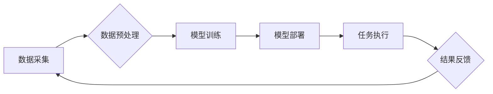

> AI代理工作流，智能农业，机器学习，深度学习，自然语言处理，计算机视觉，数据分析，自动化决策

## 1. 背景介绍

随着全球人口增长和资源短缺的加剧，农业面临着巨大的挑战。传统农业模式的低效率、高耗能和环境污染问题日益突出。而人工智能（AI）技术的快速发展为农业转型升级提供了新的机遇。

智能农业，即利用人工智能技术提高农业生产效率、降低成本、提高产品质量和环境可持续性的农业模式，正逐渐成为农业发展的新趋势。AI代理工作流作为一种新型的智能化解决方案，在智能农业领域展现出巨大的应用潜力。

## 2. 核心概念与联系

**2.1 AI代理工作流概述**

AI代理工作流是一种基于人工智能技术的自动化工作流程管理系统。它由多个智能代理组成，每个代理负责执行特定的任务或流程步骤。这些代理通过机器学习、深度学习、自然语言处理等技术，能够自主学习、决策和执行任务，从而实现对复杂工作流程的自动化管理。

**2.2 AI代理工作流在智能农业中的应用**

在智能农业领域，AI代理工作流可以应用于以下多个方面：

* **田间作业自动化:** 利用无人机、机器人等智能设备，结合AI代理工作流，实现田间播种、施肥、除草、收获等作业的自动化。
* **作物生长监测:** 通过传感器、图像识别等技术，实时监测作物生长状况，并利用AI代理工作流进行数据分析和决策，及时采取措施应对病虫害、水分不足等问题。
* **精准灌溉:** 根据土壤湿度、气象条件等数据，利用AI代理工作流进行精准灌溉，提高水资源利用效率，减少水资源浪费。
* **智能决策支持:** 基于大数据分析和机器学习，AI代理工作流可以为农民提供智能决策支持，帮助他们制定科学合理的种植方案、施肥方案、病虫害防治方案等。

**2.3 AI代理工作流架构**



## 3. 核心算法原理 & 具体操作步骤

**3.1 算法原理概述**

AI代理工作流的核心算法主要包括：

* **机器学习算法:** 用于训练代理模型，使其能够从数据中学习并做出决策。常见的机器学习算法包括决策树、支持向量机、神经网络等。
* **深度学习算法:** 用于处理复杂的数据，例如图像、语音等。深度学习算法能够自动提取数据特征，提高模型的准确性。
* **自然语言处理算法:** 用于理解和处理自然语言文本，例如农民的语音指令、文本信息等。

**3.2 算法步骤详解**

1. **数据采集:** 收集农业生产相关的各种数据，例如土壤湿度、气温、作物生长状况、病虫害信息等。
2. **数据预处理:** 对采集到的数据进行清洗、转换、归一化等处理，使其能够被机器学习算法使用。
3. **模型训练:** 利用机器学习算法，对预处理后的数据进行训练，建立代理模型。
4. **模型部署:** 将训练好的模型部署到智能设备上，例如无人机、机器人等。
5. **任务执行:** 智能设备根据模型的决策，执行相应的任务，例如喷洒农药、灌溉等。
6. **结果反馈:** 收集任务执行的结果，并反馈到模型训练环节，不断优化模型性能。

**3.3 算法优缺点**

**优点:**

* 自动化程度高，提高生产效率。
* 数据驱动决策，提高决策准确性。
* 降低人工成本，提高资源利用效率。

**缺点:**

* 数据质量对模型性能影响较大。
* 模型训练需要大量数据和计算资源。
* 算法的解释性和可解释性较差。

**3.4 算法应用领域**

AI代理工作流在智能农业领域之外，还可应用于其他领域，例如：

* 制造业
* 金融业
* 医疗保健业
* 交通运输业

## 4. 数学模型和公式 & 详细讲解 & 举例说明

**4.1 数学模型构建**

在AI代理工作流中，可以使用数学模型来描述代理的决策过程。例如，可以使用马尔可夫决策过程（MDP）来建模代理在不同状态下采取不同行动的决策过程。

**4.2 公式推导过程**

MDP模型的数学公式如下：

* 状态空间：S
* 动作空间：A
* 状态转移概率：P(s' | s, a)
* 奖励函数：R(s, a)
* 折扣因子：γ

目标是找到一个策略π(s)，使得代理在所有状态下采取的行动能够最大化累积奖励。

**4.3 案例分析与讲解**

例如，在智能农业中，我们可以使用MDP模型来建模无人机在田间作业的决策过程。

* 状态空间：无人机的当前位置、电池电量、作物生长状况等。
* 动作空间：前进、后退、转弯、喷洒农药等。
* 状态转移概率：取决于无人机的运动速度、电池电量、风速等因素。
* 奖励函数：取决于无人机完成任务的效率、电池电量消耗、作物生长状况等因素。

通过训练MDP模型，我们可以得到一个策略，指导无人机在田间作业时，选择最优的行动序列，以最大化任务完成效率和资源利用率。

## 5. 项目实践：代码实例和详细解释说明

**5.1 开发环境搭建**

* 操作系统：Ubuntu 20.04
* Python 版本：3.8
* 必要的库：TensorFlow、PyTorch、OpenCV、Numpy等

**5.2 源代码详细实现**

```python
# 导入必要的库
import tensorflow as tf
from tensorflow.keras.models import Sequential
from tensorflow.keras.layers import Dense, Conv2D, MaxPooling2D, Flatten

# 定义模型结构
model = Sequential()
model.add(Conv2D(32, (3, 3), activation='relu', input_shape=(28, 28, 1)))
model.add(MaxPooling2D((2, 2)))
model.add(Conv2D(64, (3, 3), activation='relu'))
model.add(MaxPooling2D((2, 2)))
model.add(Flatten())
model.add(Dense(10, activation='softmax'))

# 编译模型
model.compile(optimizer='adam',
              loss='sparse_categorical_crossentropy',
              metrics=['accuracy'])

# 训练模型
model.fit(x_train, y_train, epochs=10)

# 评估模型
loss, accuracy = model.evaluate(x_test, y_test)
print('Test loss:', loss)
print('Test accuracy:', accuracy)
```

**5.3 代码解读与分析**

这段代码实现了基于深度学习的图像分类模型。

* 首先，导入必要的库。
* 然后，定义模型结构，包括卷积层、池化层和全连接层。
* 接着，编译模型，指定优化器、损失函数和评价指标。
* 接下来，训练模型，使用训练数据进行模型训练。
* 最后，评估模型，使用测试数据评估模型的性能。

**5.4 运行结果展示**

训练完成后，可以将模型应用于实际场景，例如识别作物病虫害、判断作物生长状况等。

## 6. 实际应用场景

**6.1 智能灌溉系统**

利用传感器收集土壤湿度、气温、降雨量等数据，结合AI代理工作流，实现精准灌溉，提高水资源利用效率。

**6.2 病虫害监测与防治系统**

利用图像识别技术，识别作物病虫害，并根据AI代理工作流的决策，采取相应的防治措施。

**6.3 作物生长监测与预测系统**

利用传感器和图像识别技术，监测作物生长状况，并利用AI代理工作流进行数据分析和预测，帮助农民制定科学合理的种植方案。

**6.4 农业资源管理系统**

利用AI代理工作流，优化农业资源的配置和利用，提高农业生产效率。

**6.5 未来应用展望**

随着人工智能技术的不断发展，AI代理工作流在智能农业领域的应用将更加广泛和深入。例如：

* 更智能的农业机器人，能够自主完成更复杂的任务。
* 更精准的农业决策支持系统，能够为农民提供更个性化的建议。
* 更可持续的农业生产模式，能够减少农业对环境的影响。

## 7. 工具和资源推荐

**7.1 学习资源推荐**

* **书籍:**
    * 《深度学习》
    * 《机器学习》
    * 《人工智能：现代方法》
* **在线课程:**
    * Coursera
    * edX
    * Udacity

**7.2 开发工具推荐**

* **Python:** 
    * TensorFlow
    * PyTorch
    * Keras
* **云平台:**
    * AWS
    * Azure
    * Google Cloud

**7.3 相关论文推荐**

* **论文:**
    * 《Reinforcement Learning for Agriculture》
    * 《Deep Learning for Precision Agriculture》
    * 《AI-Powered Robotics for Sustainable Agriculture》

## 8. 总结：未来发展趋势与挑战

**8.1 研究成果总结**

AI代理工作流在智能农业领域取得了显著的成果，例如提高了农业生产效率、降低了农业成本、提高了农业产品质量等。

**8.2 未来发展趋势**

未来，AI代理工作流在智能农业领域的应用将更加广泛和深入，例如：

* 更智能的农业机器人，能够自主完成更复杂的任务。
* 更精准的农业决策支持系统，能够为农民提供更个性化的建议。
* 更可持续的农业生产模式，能够减少农业对环境的影响。

**8.3 面临的挑战**

AI代理工作流在智能农业领域的应用也面临着一些挑战，例如：

* 数据质量问题：AI代理工作流的性能依赖于数据质量，而农业生产数据往往存在不完整、不准确、格式不统一等问题。
* 计算资源问题：训练复杂的AI模型需要大量的计算资源，这对于一些小型农业企业来说是一个挑战。
* 算法解释性问题：AI代理工作流的决策过程往往是黑箱式的，难以解释，这可能会导致农民对AI技术的信任度降低。

**8.4 研究展望**

未来，需要进一步研究解决上述挑战，例如：

* 开发更 robust 的数据处理算法，提高数据质量。
* 研究更轻量级的AI模型，降低计算资源需求。
* 开发更可解释的AI算法，提高AI技术的透明度。


## 9. 附录：常见问题与解答

**9.1 如何选择合适的AI代理工作流平台？**

选择合适的AI代理工作流平台需要考虑以下因素：

* 平台的功能和特性：平台是否支持您需要的功能，例如数据采集、模型训练、任务调度等。
* 平台的易用性：平台是否易于上手，是否提供完善的文档和支持。
* 平台的成本：平台的费用是否合理，是否提供免费试用。

**9.2 如何训练一个有效的AI代理模型？**

训练一个有效的AI代理模型需要以下步骤：

* 收集高质量的数据。
* 选择合适的模型架构。
* 调整模型参数。
* 评估模型性能。

**9.3 如何部署AI代理工作流到实际场景？**

部署AI代理工作流到实际场景需要以下步骤：

* 选择合适的硬件平台。
* 部署模型和相关软件。
* 测试和调试系统。
* 进行监控和维护。


作者