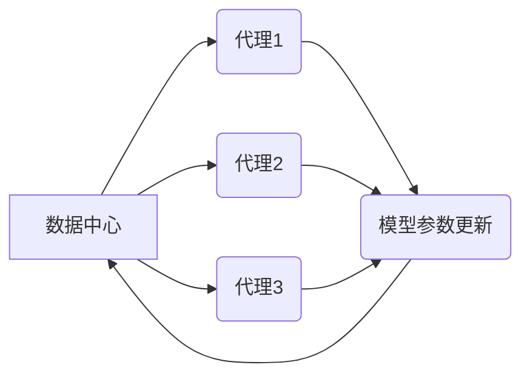

> 深度学习,分布式学习,代理,同步,数据共享,模型训练,算法优化

## 1. 背景介绍

深度学习作为人工智能领域的核心技术之一，在图像识别、自然语言处理、语音识别等领域取得了突破性的进展。然而，随着模型规模的不断扩大，单机训练已经难以满足需求。分布式深度学习应运而生，通过将模型和数据分布在多个节点上进行并行训练，有效提高了训练效率和模型性能。

分布式深度学习的实现方式多种多样，其中一种重要的方式是利用深度学习代理。代理可以理解为模型的独立实例，每个代理负责训练模型的一部分参数，并通过同步机制将训练结果共享给其他代理，最终实现模型的整体训练。

数据共享是分布式深度学习代理训练的关键环节。如何高效、安全地共享数据，是影响分布式深度学习性能和稳定性的重要因素。

## 2. 核心概念与联系

**2.1 深度学习代理**

深度学习代理是一个独立的模型实例，负责训练模型的一部分参数。代理可以运行在不同的节点上，并通过通信机制进行数据共享和模型参数更新。

**2.2 同步机制**

同步机制是指代理之间进行数据共享和模型参数更新的机制。常见的同步机制包括：

* **全量同步:** 所有代理都将模型参数更新发送给所有其他代理。
* **部分同步:** 仅部分代理将模型参数更新发送给其他代理。
* **异步同步:** 代理可以异步地更新模型参数，并通过消息队列进行数据共享。

**2.3 数据共享策略**

数据共享策略是指如何将数据分配给不同的代理进行训练。常见的策略包括：

* **数据切片:** 将数据划分为多个片段，每个片段分配给一个代理进行训练。
* **数据轮询:** 将数据轮流分配给不同的代理进行训练。
* **联邦学习:** 代理在本地训练模型，并将模型参数更新发送给服务器进行聚合，服务器不会访问原始数据。

**2.4 架构图**



## 3. 核心算法原理 & 具体操作步骤

### 3.1 算法原理概述

分布式深度学习代理的同步与数据共享算法的核心思想是将模型参数分布在多个代理上，并通过同步机制进行模型参数更新。

**3.1.1 模型参数分布**

将模型参数划分为多个子集，每个子集分配给一个代理进行训练。

**3.1.2 同步机制**

代理之间通过同步机制进行模型参数更新。常见的同步机制包括全量同步、部分同步和异步同步。

**3.1.3 数据共享策略**

根据数据特性和训练需求，选择合适的分布式数据共享策略，例如数据切片、数据轮询或联邦学习。

### 3.2 算法步骤详解

1. **模型初始化:** 将模型参数初始化，并将其分配给不同的代理。
2. **数据分配:** 根据数据共享策略，将数据分配给不同的代理。
3. **本地训练:** 每个代理使用其分配的数据进行模型训练，并更新其本地模型参数。
4. **模型参数同步:** 代理之间通过同步机制进行模型参数更新。
5. **重复步骤3-4:** 重复上述步骤，直到模型训练达到预设的目标。

### 3.3 算法优缺点

**优点:**

* **提高训练效率:** 通过并行训练，可以显著提高模型训练速度。
* **支持大规模模型训练:** 可以训练比单机训练规模更大的模型。
* **数据隐私保护:** 联邦学习等数据共享策略可以保护原始数据的隐私。

**缺点:**

* **通信开销:** 代理之间的数据传输和模型参数更新会带来通信开销。
* **同步复杂度:** 同步机制的实现需要考虑多个代理的协调和一致性问题。
* **模型性能差异:** 不同代理训练的数据分布可能不同，导致模型性能存在差异。

### 3.4 算法应用领域

分布式深度学习代理的同步与数据共享算法广泛应用于以下领域:

* **图像识别:** 用于训练大型图像识别模型，例如用于自动驾驶、医疗影像分析等。
* **自然语言处理:** 用于训练大型语言模型，例如用于机器翻译、文本生成等。
* **语音识别:** 用于训练大型语音识别模型，例如用于语音助手、语音搜索等。

## 4. 数学模型和公式 & 详细讲解 & 举例说明

### 4.1 数学模型构建

假设我们有N个代理，每个代理负责训练模型的一部分参数。模型参数可以表示为一个向量θ，其中θ = [θ1, θ2, ..., θN]。每个代理的本地模型参数更新可以表示为：

θi = θi - η * ∇L(θi)

其中：

* θi: 代理i的本地模型参数
* η: 学习率
* ∇L(θi): 代理i训练数据上的损失函数梯度

### 4.2 公式推导过程

全量同步机制下，所有代理的本地模型参数更新都会被广播到所有其他代理。因此，每个代理的模型参数更新可以表示为：

θi = θi - η * ∇L(θi) + α * ∑j≠i θj

其中：

* α: 同步系数，控制同步程度

### 4.3 案例分析与讲解

假设我们有3个代理，每个代理训练数据量相等。全量同步机制下，每个代理的模型参数更新可以表示为：

* 代理1: θ1 = θ1 - η * ∇L(θ1) + α * (θ2 + θ3)
* 代理2: θ2 = θ2 - η * ∇L(θ2) + α * (θ1 + θ3)
* 代理3: θ3 = θ3 - η * ∇L(θ3) + α * (θ1 + θ2)

通过全量同步机制，每个代理都可以获得其他代理的模型参数更新，从而提高模型训练的收敛速度和精度。

## 5. 项目实践：代码实例和详细解释说明

### 5.1 开发环境搭建

* 操作系统: Ubuntu 20.04
* Python 版本: 3.8
* 深度学习框架: PyTorch 1.8

### 5.2 源代码详细实现

```python
import torch
import torch.nn as nn
import torch.distributed as dist

# 定义模型
class SimpleModel(nn.Module):
    def __init__(self):
        super(SimpleModel, self).__init__()
        self.linear = nn.Linear(10, 1)

    def forward(self, x):
        return self.linear(x)

# 初始化模型和数据
model = SimpleModel()
data = torch.randn(100, 10)

# 初始化分布式训练环境
dist.init_process_group(backend='nccl')

# 获取当前进程ID
rank = dist.get_rank()

# 将模型参数分布到各个进程
model.to(rank)

# 训练模型
for epoch in range(10):
    # 每个进程对数据进行本地训练
    output = model(data)
    loss = nn.MSELoss()(output, torch.zeros_like(output))
    loss.backward()
    model.step()

    # 全量同步模型参数
    dist.barrier()
    dist.all_reduce(model.state_dict(), op=dist.reduce_op.SUM)

# 结束分布式训练环境
dist.destroy_process_group()
```

### 5.3 代码解读与分析

* 使用 `torch.distributed` 模块初始化分布式训练环境。
* 使用 `dist.init_process_group()` 函数初始化分布式进程组，指定通信后端为 `nccl`。
* 使用 `dist.get_rank()` 函数获取当前进程的ID。
* 使用 `model.to(rank)` 将模型参数分布到各个进程。
* 使用 `dist.barrier()` 函数等待所有进程完成同步。
* 使用 `dist.all_reduce()` 函数将所有进程的模型参数进行求和，实现全量同步。

### 5.4 运行结果展示

运行上述代码，可以观察到每个进程的模型参数在训练过程中不断更新，并最终收敛到一个共同的模型参数值。

## 6. 实际应用场景

分布式深度学习代理的同步与数据共享算法在实际应用场景中具有广泛的应用前景。

### 6.1 图像识别

在图像识别领域，可以利用分布式深度学习代理训练大型图像识别模型，例如用于自动驾驶、医疗影像分析等。

### 6.2 自然语言处理

在自然语言处理领域，可以利用分布式深度学习代理训练大型语言模型，例如用于机器翻译、文本生成等。

### 6.3 语音识别

在语音识别领域，可以利用分布式深度学习代理训练大型语音识别模型，例如用于语音助手、语音搜索等。

### 6.4 未来应用展望

随着深度学习技术的不断发展，分布式深度学习代理的同步与数据共享算法将有更广泛的应用场景。例如，可以用于训练更加复杂的模型，例如生成式对抗网络 (GAN)、强化学习模型等。

## 7. 工具和资源推荐

### 7.1 学习资源推荐

* 深度学习入门书籍:
    * 深度学习 (Deep Learning) - Ian Goodfellow, Yoshua Bengio, Aaron Courville
    * 深度学习实践 (Deep Learning with Python) - Francois Chollet
* 深度学习在线课程:
    * Coursera: Deep Learning Specialization
    * Udacity: Deep Learning Nanodegree
* 深度学习博客和论坛:
    * https://blog.openai.com/
    * https://discuss.pytorch.org/

### 7.2 开发工具推荐

* 深度学习框架:
    * PyTorch: https://pytorch.org/
    * TensorFlow: https://www.tensorflow.org/
* 分布式训练框架:
    * Horovod: https://horovod.ai/
    * Ray: https://ray.io/

### 7.3 相关论文推荐

* Distributed Deep Learning with PyTorch: https://pytorch.org/tutorials/intermediate/distrib_tuto.html
* Parameter Server: https://arxiv.org/abs/1112.0701
* AllReduce: https://arxiv.org/abs/1704.04861

## 8. 总结：未来发展趋势与挑战

### 8.1 研究成果总结

分布式深度学习代理的同步与数据共享算法取得了显著的进展，为训练大型深度学习模型提供了有效的方法。

### 8.2 未来发展趋势

* **更加高效的同步机制:** 研究更加高效的同步机制，例如异步同步、混合同步等，降低通信开销。
* **更加灵活的数据共享策略:** 研究更加灵活的数据共享策略，例如联邦学习、数据加密等，提高数据隐私保护。
* **支持异构计算:** 研究支持异构计算的分布式深度学习框架，例如CPU、GPU、FPGA等。

### 8.3 面临的挑战

* **模型性能差异:** 不同代理训练的数据分布可能不同，导致模型性能存在差异。如何有效解决模型性能差异问题是未来研究的重要方向。
* **通信开销:** 分布式深度学习训练会带来大量的通信开销，如何降低通信开销是另一个挑战。
* **系统复杂性:** 分布式深度学习系统更加复杂，需要考虑多个代理的协调和一致性问题。

### 8.4 研究展望

未来，分布式深度学习代理的同步与数据共享算法将继续发展，为人工智能领域的发展做出更大的贡献。


## 9. 附录：常见问题与解答

**Q1: 什么是分布式深度学习代理？**

A1: 分布式深度学习代理是一个独立的模型实例，负责