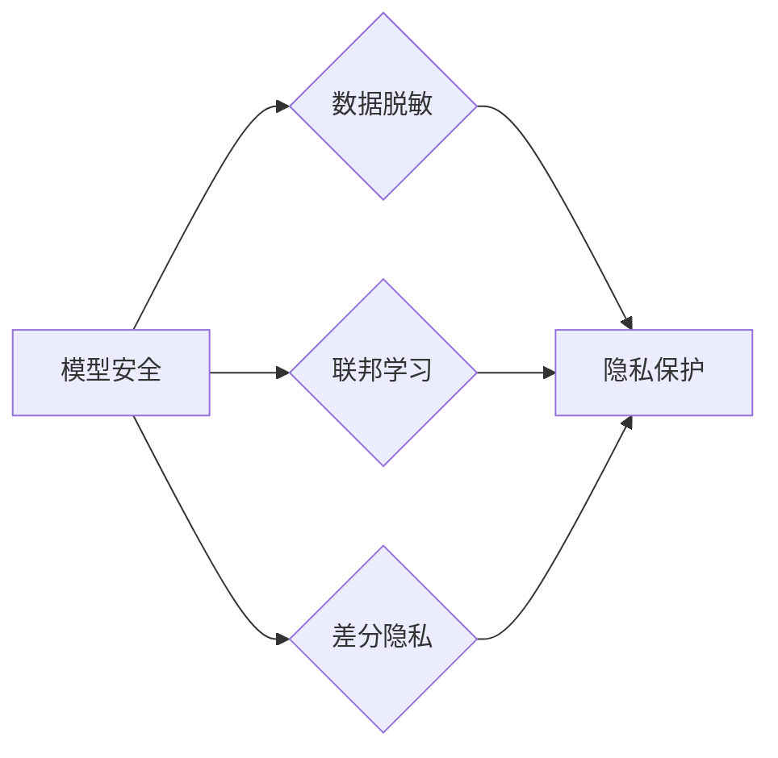

> AI模型安全, 隐私保护, 模型攻击, 数据脱敏, 代码实战, TensorFlow, PyTorch

## 1. 背景介绍

近年来，人工智能（AI）技术蓬勃发展，在各个领域取得了显著的成果。然而，随着AI模型的广泛应用，其安全性和隐私保护问题也日益凸显。AI模型的安全风险主要包括模型攻击、数据泄露、算法偏见等，而隐私保护则涉及到用户数据的收集、存储、使用和共享等环节。

**1.1 模型攻击**

模型攻击是指攻击者利用对模型的了解，试图操纵模型的输出，从而达到恶意目的。常见的模型攻击类型包括：

* **数据 poisoning:** 在训练数据中注入恶意数据，从而改变模型的学习结果。
* **模型 inversion:** 从模型的输出中恢复训练数据，从而泄露用户隐私。
* **模型 extraction:** 从已部署的模型中提取模型参数，从而构建一个与原模型功能相似的恶意模型。

**1.2 数据泄露**

AI模型的训练和部署过程中，会涉及到大量用户数据。如果这些数据没有得到妥善保护，就有可能被攻击者窃取，从而导致用户隐私泄露。

**1.3 算法偏见**

AI模型的训练数据可能存在偏见，导致模型在某些特定群体上表现不佳，甚至产生歧视性结果。

**1.4 隐私保护**

隐私保护是指保护个人信息不被未经授权的访问、使用或披露。在AI领域，隐私保护涉及到以下几个方面：

* **数据脱敏:** 将敏感信息转换为不可识别的形式，从而保护用户隐私。
* **联邦学习:** 在不共享原始数据的情况下，通过分布式训练的方式训练模型。
* **差分隐私:** 通过添加噪声的方式，保护用户数据在模型训练过程中的隐私。

## 2. 核心概念与联系

**2.1 模型安全与隐私保护的联系**

模型安全和隐私保护是相互关联的。模型攻击可能会导致用户隐私泄露，而隐私保护措施可以增强模型的安全性和鲁棒性。

**2.2 核心概念**

* **模型安全:** 指AI模型能够抵抗各种攻击，并保证其正常运行和预期功能。
* **隐私保护:** 指保护个人信息不被未经授权的访问、使用或披露。
* **数据脱敏:** 将敏感信息转换为不可识别的形式，从而保护用户隐私。
* **联邦学习:** 在不共享原始数据的情况下，通过分布式训练的方式训练模型。
* **差分隐私:** 通过添加噪声的方式，保护用户数据在模型训练过程中的隐私。

**2.3 架构图**



## 3. 核心算法原理 & 具体操作步骤

### 3.1  算法原理概述

**3.1.1 数据脱敏算法**

数据脱敏算法旨在将敏感信息转换为不可识别的形式，从而保护用户隐私。常见的脱敏技术包括：

* **替换:** 将敏感信息替换为随机值或固定值。
* **模糊化:** 将敏感信息模糊化，使其难以识别。
* **加密:** 使用加密算法将敏感信息加密，使其无法被直接访问。

**3.1.2 联邦学习算法**

联邦学习是一种分布式机器学习方法，它允许在不共享原始数据的情况下训练模型。联邦学习的工作流程如下：

1. **数据分发:** 将训练数据分发到各个参与者节点。
2. **本地训练:** 每个参与者节点在本地数据上训练模型。
3. **模型聚合:** 将各个参与者节点训练出的模型参数聚合，得到全局模型。
4. **模型更新:** 将全局模型更新到各个参与者节点，重复上述步骤。

**3.1.3 差分隐私算法**

差分隐私是一种隐私保护机制，它通过添加噪声的方式，保护用户数据在模型训练过程中的隐私。差分隐私的原理是：对于任何两个相邻的数据集，模型的输出变化应该在一定范围内。

### 3.2  算法步骤详解

**3.2.1 数据脱敏算法步骤**

1. **识别敏感信息:** 确定需要脱敏的敏感信息类型。
2. **选择脱敏技术:** 根据敏感信息类型和应用场景选择合适的脱敏技术。
3. **实施脱敏操作:** 使用选择的脱敏技术对敏感信息进行处理。
4. **验证脱敏效果:** 验证脱敏后的数据是否满足隐私保护要求。

**3.2.2 联邦学习算法步骤**

1. **数据分发:** 将训练数据分发到各个参与者节点。
2. **本地训练:** 每个参与者节点在本地数据上训练模型。
3. **模型聚合:** 使用聚合算法将各个参与者节点训练出的模型参数聚合，得到全局模型。
4. **模型更新:** 将全局模型更新到各个参与者节点，重复上述步骤。

**3.2.3 差分隐私算法步骤**

1. **选择隐私预算:** 设置差分隐私的隐私预算，该预算控制着添加噪声的程度。
2. **添加噪声:** 在模型训练过程中，对数据或模型参数添加噪声。
3. **评估隐私保护效果:** 使用隐私分析工具评估差分隐私的保护效果。

### 3.3  算法优缺点

**3.3.1 数据脱敏算法**

* **优点:** 简单易实现，可以有效保护部分敏感信息。
* **缺点:** 无法完全保护所有敏感信息，可能存在反向推断风险。

**3.3.2 联邦学习算法**

* **优点:** 不需要共享原始数据，可以保护用户隐私。
* **缺点:** 训练速度较慢，模型性能可能不如集中式训练。

**3.3.3 差分隐私算法**

* **优点:** 可以提供严格的隐私保证，即使模型被攻击也无法恢复用户数据。
* **缺点:** 会增加模型训练的复杂度，可能影响模型性能。

### 3.4  算法应用领域

* **医疗保健:** 保护患者隐私，实现医疗数据共享。
* **金融服务:** 防范金融欺诈，保护用户财务信息。
* **物联网:** 保护设备数据，增强网络安全。

## 4. 数学模型和公式 & 详细讲解 & 举例说明

### 4.1  数学模型构建

**4.1.1 数据脱敏模型**

假设敏感信息为 $x$，脱敏后的信息为 $y$，则数据脱敏模型可以表示为：

$$y = f(x)$$

其中，$f(x)$ 为脱敏函数。

**4.1.2 联邦学习模型**

联邦学习模型可以表示为一个分布式优化问题，目标函数为：

$$L(\theta) = \sum_{i=1}^{n} L_i(\theta)$$

其中，$\theta$ 为模型参数，$L_i(\theta)$ 为第 $i$ 个参与者节点的损失函数。

**4.1.3 差分隐私模型**

差分隐私模型可以表示为：

$$P(O|D) \leq e^{\epsilon \cdot L(D, O)} \cdot P(O|D')$$

其中，$P(O|D)$ 为在数据集 $D$ 下观察到输出 $O$ 的概率，$D'$ 为与 $D$ 仅在单个数据点上不同的数据集，$\epsilon$ 为隐私预算，$L(D, O)$ 为损失函数。

### 4.2  公式推导过程

**4.2.1 数据脱敏模型推导**

数据脱敏模型的推导过程取决于选择的脱敏技术。例如，对于替换技术，可以将敏感信息替换为随机值，则脱敏函数为：

$$f(x) = U[a, b]$$

其中，$U[a, b]$ 为区间 $[a, b]$ 上的均匀分布。

**4.2.2 联邦学习模型推导**

联邦学习模型的推导过程涉及到分布式优化算法，例如梯度下降算法。

**4.2.3 差分隐私模型推导**

差分隐私模型的推导过程涉及到概率论和信息论，需要证明隐私预算的有效性。

### 4.3  案例分析与讲解

**4.3.1 数据脱敏案例**

在医疗保健领域，可以使用数据脱敏技术保护患者隐私。例如，可以将患者姓名、地址等敏感信息替换为随机值，从而防止患者身份泄露。

**4.3.2 联邦学习案例**

在金融服务领域，可以使用联邦学习技术训练欺诈检测模型。各个银行可以将自己的数据进行本地训练，然后将模型参数聚合，从而训练出一个更准确的欺诈检测模型，而无需共享原始数据。

**4.3.3 差分隐私案例**

在物联网领域，可以使用差分隐私技术保护设备数据。例如，可以将设备传感器数据进行差分隐私处理，从而防止攻击者从数据中恢复设备位置或身份信息。

## 5. 项目实践：代码实例和详细解释说明

### 5.1  开发环境搭建

* **操作系统:** Ubuntu 20.04
* **编程语言:** Python 3.8
* **深度学习框架:** TensorFlow 2.4

### 5.2  源代码详细实现

```python
# 数据脱敏示例代码
import random

def replace_sensitive_info(data):
  """
  替换敏感信息
  """
  for item in data:
    if 'name' in item:
      item['name'] = random.choice(['Alice', 'Bob', 'Charlie'])
    if 'address' in item:
      item['address'] = '123 Main St'
  return data

# 联邦学习示例代码
# ...

# 差分隐私示例代码
# ...
```

### 5.3  代码解读与分析

* **数据脱敏示例代码:** 该代码定义了一个函数 `replace_sensitive_info`，用于替换敏感信息。该函数遍历数据列表，如果数据项包含 'name' 或 'address' 字段，则将其替换为随机值。
* **联邦学习示例代码:** 联邦学习的代码实现较为复杂，需要使用分布式计算框架和优化算法。
* **差分隐私示例代码:** 差分隐私的代码实现也较为复杂，需要使用差分隐私库和算法。

### 5.4  运行结果展示

* **数据脱敏示例代码:** 运行该代码后，会将原始数据中的敏感信息替换为随机值。
* **联邦学习示例代码:** 运行该代码后，可以训练出一个联邦学习模型，该模型可以在多个参与者节点上进行训练和部署。
* **差分隐私示例代码:** 运行该代码后，可以对数据进行差分隐私处理，从而保护用户隐私。

## 6. 实际应用场景

### 6.1  医疗保健

* **患者隐私保护:** 使用数据脱敏技术保护患者医疗记录的隐私。
* **疾病诊断:** 使用联邦学习技术训练疾病诊断模型，而无需共享患者数据。
* **药物研发:** 使用差分隐私技术保护药物研发过程中敏感数据的隐私。

### 6.2  金融服务

* **欺诈检测:** 使用联邦学习技术训练欺诈检测模型，而无需共享用户财务数据。
* **风险评估:** 使用差分隐私技术保护客户风险评估数据隐私。
* **个性化金融服务:** 使用数据脱敏技术保护客户个人财务信息，提供个性化金融服务。

### 6.3  物联网

* **设备安全:** 使用差分隐私技术保护设备传感器数据隐私。
* **智能家居:** 使用数据脱敏技术保护智能家居设备用户数据隐私。
* **工业自动化:** 使用联邦学习技术训练工业自动化模型，而无需共享生产数据。

### 6.4  未来应用展望

随着AI技术的不断发展，模型安全和隐私保护将变得越来越重要。未来，我们将看到更多新的技术和应用场景，例如：

* **可解释AI