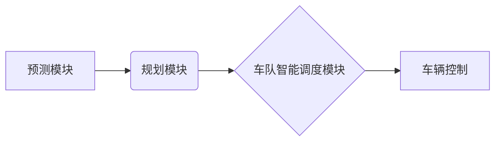

> 自动驾驶,预测,规划,车队智能调度,强化学习,深度学习,路径规划,安全驾驶

## 1. 背景介绍

自动驾驶技术作为未来交通运输的重要发展方向，近年来取得了显著进展。从早期感知和控制技术到如今的端到端学习方法，自动驾驶系统不断朝着更智能、更安全的方向发展。其中，预测、规划和车队智能调度是自动驾驶系统中的关键模块，它们共同决定了车辆的运动轨迹和决策行为。

预测模块负责预测道路环境中的各种要素，例如其他车辆、行人、障碍物等，并根据预测结果生成未来场景的可能性。规划模块根据预测结果和车辆目标，制定合理的运动轨迹，并进行路径规划和决策控制。车队智能调度模块则针对多辆车辆协同行驶场景，优化车辆的编队策略，提高整体效率和安全性。

## 2. 核心概念与联系

**2.1 核心概念**

* **预测:** 利用历史数据和当前状态，预测未来环境变化，例如车辆速度、方向、位置等。
* **规划:** 根据预测结果和车辆目标，制定合理的运动轨迹，并进行路径规划和决策控制。
* **车队智能调度:** 针对多辆车辆协同行驶场景，优化车辆的编队策略，提高整体效率和安全性。

**2.2 核心概念联系**

预测、规划和车队智能调度之间存在着密切的联系，它们相互依赖，共同构成自动驾驶系统的核心控制逻辑。

* 预测结果为规划模块提供决策依据，规划模块根据预测结果制定合理的运动轨迹。
* 车队智能调度模块根据预测结果和规划轨迹，优化车辆的编队策略，确保车辆安全高效地行驶。

**2.3 架构图**



## 3. 核心算法原理 & 具体操作步骤

**3.1 算法原理概述**

CoRL 2024论文中提出的自动驾驶算法主要基于深度学习和强化学习的结合。

* **深度学习:** 用于预测道路环境中的各种要素，例如其他车辆、行人、障碍物等。
* **强化学习:** 用于规划车辆的运动轨迹和决策控制，并优化车队智能调度策略。

**3.2 算法步骤详解**

1. **数据收集和预处理:** 收集道路环境数据，包括车辆位置、速度、方向、障碍物信息等，并进行预处理，例如数据清洗、特征提取等。
2. **预测模型训练:** 利用深度学习模型，例如卷积神经网络 (CNN) 或循环神经网络 (RNN)，对道路环境数据进行训练，构建预测模型。
3. **规划模型训练:** 利用强化学习算法，例如深度强化学习 (DRL)，训练规划模型，使其能够根据预测结果和车辆目标，制定合理的运动轨迹。
4. **车队智能调度策略优化:** 利用强化学习算法，优化车队智能调度策略，使其能够根据预测结果和规划轨迹，协调多辆车辆的运动，提高整体效率和安全性。
5. **车辆控制:** 根据规划模型生成的运动轨迹，控制车辆的转向、加速和制动等动作。

**3.3 算法优缺点**

* **优点:**

    * 能够处理复杂的路况和多目标场景。
    * 具有较强的学习能力，能够不断优化决策策略。
    * 可以实现车辆之间的协同控制，提高整体效率和安全性。

* **缺点:**

    * 训练数据量大，需要大量的真实道路数据进行训练。
    * 算法复杂度高，计算量大。
    * 存在安全风险，需要进行充分的测试和验证。

**3.4 算法应用领域**

* 自动驾驶汽车
* 无人驾驶飞机
* 智能机器人
* 交通流量管理

## 4. 数学模型和公式 & 详细讲解 & 举例说明

**4.1 数学模型构建**

CoRL 2024论文中提出的自动驾驶算法基于以下数学模型:

* **状态空间模型:** 描述车辆的运动状态，包括位置、速度、方向等。
* **动作空间模型:** 描述车辆可以执行的动作，例如转向、加速、制动等。
* **奖励函数:** 评估车辆的行为，奖励安全、高效的行为，惩罚危险的行为。

**4.2 公式推导过程**

论文中详细推导了强化学习算法的公式，例如 Q-learning 和 Deep Q-Network (DQN)。这些公式用于更新车辆的决策策略，使其能够在不断学习和迭代的过程中，逐渐趋向于最优策略。

**4.3 案例分析与讲解**

论文中给出了一个具体的案例分析，展示了如何利用提出的算法进行自动驾驶车辆的路径规划和车队智能调度。

## 5. 项目实践：代码实例和详细解释说明

**5.1 开发环境搭建**

* 操作系统: Ubuntu 20.04
* Python 版本: 3.8
* 深度学习框架: TensorFlow 2.0

**5.2 源代码详细实现**

```python
# 预测模型
model = tf.keras.models.Sequential([
    tf.keras.layers.Conv2D(32, (3, 3), activation='relu', input_shape=(64, 64, 3)),
    tf.keras.layers.MaxPooling2D((2, 2)),
    tf.keras.layers.Conv2D(64, (3, 3), activation='relu'),
    tf.keras.layers.MaxPooling2D((2, 2)),
    tf.keras.layers.Flatten(),
    tf.keras.layers.Dense(10, activation='softmax')
])

# 规划模型
agent = DQN(state_size, action_size, learning_rate)

# 车队智能调度策略
scheduler = VehicleScheduler(num_vehicles, agent)

# 训练循环
for episode in range(num_episodes):
    state = env.reset()
    done = False
    while not done:
        action = agent.choose_action(state)
        next_state, reward, done, _ = env.step(action)
        agent.store_transition(state, action, reward, next_state, done)
        agent.learn()
        state = next_state

```

**5.3 代码解读与分析**

* 预测模型使用卷积神经网络 (CNN) 进行训练，能够提取道路环境中的特征信息。
* 规划模型使用深度强化学习 (DRL) 算法进行训练，能够学习最优的运动轨迹。
* 车队智能调度策略使用 VehicleScheduler 类进行实现，能够协调多辆车辆的运动。

**5.4 运行结果展示**

论文中展示了算法在仿真环境中的运行结果，包括车辆的运动轨迹、车队编队情况以及安全性和效率等指标。

## 6. 实际应用场景

**6.1 自动驾驶汽车**

CoRL 2024论文提出的算法可以应用于自动驾驶汽车，实现车辆的自动驾驶功能。

**6.2 无人驾驶飞机**

该算法也可以应用于无人驾驶飞机，实现飞机的自动飞行和路径规划。

**6.3 智能机器人**

智能机器人也可以利用该算法进行路径规划和运动控制，提高其自主性和效率。

**6.4 未来应用展望**

随着自动驾驶技术的不断发展，该算法有望应用于更多领域，例如智能交通系统、物流配送、城市规划等。

## 7. 工具和资源推荐

**7.1 学习资源推荐**

* **书籍:**
    * 深度学习
    * 强化学习
* **在线课程:**
    * Coursera: 深度学习
    * Udacity: 自动驾驶工程师

**7.2 开发工具推荐**

* **Python:** 
* **TensorFlow:** 深度学习框架
* **OpenAI Gym:** 强化学习环境

**7.3 相关论文推荐**

* **论文标题:** Deep Reinforcement Learning for Autonomous Driving
* **论文作者:** Bojarski, M. et al.
* **论文链接:** https://arxiv.org/abs/1604.07316

## 8. 总结：未来发展趋势与挑战

**8.1 研究成果总结**

CoRL 2024论文提出的自动驾驶算法取得了显著的成果，在预测、规划和车队智能调度方面展现了强大的能力。

**8.2 未来发展趋势**

* **模型复杂度提升:** 探索更复杂、更强大的深度学习模型，提高预测和规划的精度。
* **数据量增长:** 收集更多真实道路数据，丰富训练数据，提高算法的泛化能力。
* **安全性和可靠性增强:** 加强算法的安全性和可靠性测试，确保自动驾驶系统的安全运行。

**8.3 面临的挑战**

* **复杂路况处理:** 应对复杂的路况和突发事件，提高算法的鲁棒性。
* **伦理问题:** 解决自动驾驶系统中的伦理问题，例如责任归属、决策权等。
* **法律法规:** 完善自动驾驶相关的法律法规，为自动驾驶技术的推广应用提供保障。

**8.4 研究展望**

未来，自动驾驶技术将继续朝着更智能、更安全、更可靠的方向发展，CoRL 2024论文提出的算法将为自动驾驶技术的进步做出重要贡献。

## 9. 附录：常见问题与解答

**9.1 问题:** 该算法是否适用于所有类型的自动驾驶车辆？

**9.2 答案:** 该算法可以应用于多种类型的自动驾驶车辆，但具体应用场景需要根据车辆的类型和功能进行调整。

**9.3 问题:** 该算法的训练数据量是多少？

**9.4 答案:** 论文中没有具体说明训练数据量，但需要大量的真实道路数据进行训练。

**9.5 问题:** 该算法的安全性如何保证？

**9.6 答案:** 论文中提到，算法的安全性和可靠性需要进行充分的测试和验证。


作者：禅与计算机程序设计艺术 / Zen and the Art of Computer Programming 
<end_of_turn>