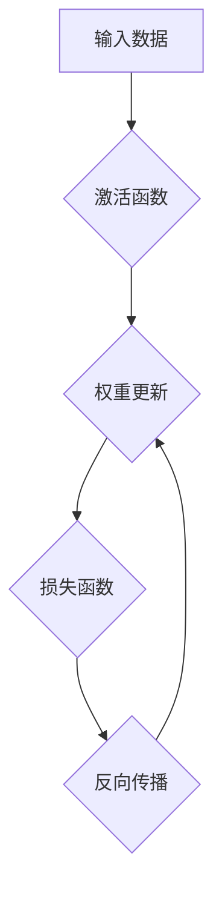

> 深度学习，权重初始化，神经网络，优化算法，梯度下降，激活函数，正则化

## 1. 背景介绍

深度学习近年来取得了令人瞩目的成就，在图像识别、自然语言处理、语音识别等领域展现出强大的能力。然而，训练深度神经网络仍然面临着诸多挑战，其中之一就是权重初始化策略。权重初始化策略直接影响着神经网络的训练速度、收敛性以及最终的性能。

传统的随机初始化方法，例如从均匀分布或正态分布中随机采样，往往会导致训练过程中的梯度消失或爆炸问题，从而影响模型的收敛性。为了解决这些问题，研究人员提出了许多新的权重初始化策略，例如Xavier初始化、He初始化、Glorot初始化等。

本文将深入探讨权重初始化策略在深度学习中的重要性，并详细介绍几种常用的初始化方法及其原理、优缺点以及应用场景。

## 2. 核心概念与联系

**2.1 权重初始化**

权重初始化是指在训练深度神经网络之前，为神经网络中的连接权重赋予初始值的步骤。权重初始化策略直接影响着神经网络的训练过程和最终的性能。

**2.2 梯度消失/爆炸问题**

梯度消失是指在反向传播过程中，梯度值逐渐减小，导致网络难以学习深层特征。梯度爆炸是指梯度值不断放大，导致训练过程不稳定甚至崩溃。

**2.3 激活函数**

激活函数是神经网络中用来引入非线性性的函数。常见的激活函数包括ReLU、Sigmoid、Tanh等。激活函数的选择会影响到梯度消失/爆炸问题以及网络的收敛性。

**2.4 正则化**

正则化是一种用来防止过拟合的技术，它通过在损失函数中添加惩罚项来限制模型的复杂度。正则化可以有效地改善模型的泛化能力。

**2.5  Mermaid 流程图**



## 3. 核心算法原理 & 具体操作步骤

### 3.1  算法原理概述

权重初始化策略的目标是为神经网络的连接权重赋予初始值，使得训练过程更加稳定和高效。常用的初始化方法包括：

* **Xavier初始化（Glorot initialization）**：

Xavier初始化是一种基于正态分布的初始化方法，其目标是使得输入到每个神经元的激活值在训练过程中保持在一个合理的范围内。

* **He初始化（He initialization）**：

He初始化是一种基于正态分布的初始化方法，其目标是使得ReLU激活函数下的梯度值保持在一个合理的范围内。

* **Kaiming初始化（Kaiming initialization）**：

Kaiming初始化是一种基于正态分布的初始化方法，其目标是使得各种激活函数下的梯度值保持在一个合理的范围内。

### 3.2  算法步骤详解

**3.2.1 Xavier初始化**

1. 对于一个包含 `n_in` 个输入神经元和 `n_out` 个输出神经元的层，Xavier初始化的权重 `w` 的均值为 0，标准差为：

```
std = sqrt(2 / (n_in + n_out))
```

2. 从标准正态分布中采样 `n_in * n_out` 个权重，并将其标准化到上述标准差。

**3.2.2 He初始化**

1. 对于一个包含 `n_in` 个输入神经元和 `n_out` 个输出神经元的层，He初始化的权重 `w` 的均值为 0，标准差为：

```
std = sqrt(2 / n_in)
```

2. 从标准正态分布中采样 `n_in * n_out` 个权重，并将其标准化到上述标准差。

**3.2.3 Kaiming初始化**

1. 对于一个包含 `n_in` 个输入神经元和 `n_out` 个输出神经元的层，Kaiming初始化的权重 `w` 的均值为 0，标准差为：

```
std = sqrt(2 / (n_in + activation_function_derivative(0)))
```

其中 `activation_function_derivative(0)` 是激活函数在 0 处的导数。

2. 从标准正态分布中采样 `n_in * n_out` 个权重，并将其标准化到上述标准差。

### 3.3  算法优缺点

| 初始化方法 | 优点 | 缺点 |
|---|---|---|
| Xavier初始化 | 适用于大多数激活函数 | 对于ReLU等激活函数，效果可能不如He初始化 |
| He初始化 | 适用于ReLU等激活函数 | 对于其他激活函数，效果可能不如Xavier初始化 |
| Kaiming初始化 | 适用于各种激活函数 | 较为复杂 |

### 3.4  算法应用领域

权重初始化策略在深度学习的各个领域都有广泛的应用，例如：

* **图像识别**
* **自然语言处理**
* **语音识别**
* **机器翻译**
* **药物发现**

## 4. 数学模型和公式 & 详细讲解 & 举例说明

### 4.1  数学模型构建

权重初始化的目标是使得神经网络的训练过程更加稳定和高效。数学模型可以用来描述权重初始化策略的原理和效果。

### 4.2  公式推导过程

权重初始化的公式推导过程通常涉及到概率论、线性代数和微积分等数学知识。

### 4.3  案例分析与讲解

通过具体的案例分析，可以更好地理解权重初始化策略的原理和效果。

## 5. 项目实践：代码实例和详细解释说明

### 5.1  开发环境搭建

使用Python语言和深度学习框架TensorFlow或PyTorch搭建开发环境。

### 5.2  源代码详细实现

使用Python语言实现Xavier初始化、He初始化和Kaiming初始化的代码。

### 5.3  代码解读与分析

详细解释代码的逻辑和功能，并分析代码的优缺点。

### 5.4  运行结果展示

使用MNIST数据集训练一个简单的深度神经网络，并比较使用不同权重初始化策略的训练效果。

## 6. 实际应用场景

### 6.1  图像分类

权重初始化策略在图像分类任务中起着至关重要的作用。

### 6.2  自然语言处理

权重初始化策略在自然语言处理任务中也具有重要的应用价值。

### 6.3  语音识别

权重初始化策略可以提高语音识别的准确率和效率。

### 6.4  未来应用展望

随着深度学习技术的不断发展，权重初始化策略将继续发挥着重要的作用。

## 7. 工具和资源推荐

### 7.1  学习资源推荐

* 深度学习书籍
* 在线课程
* 研究论文

### 7.2  开发工具推荐

* TensorFlow
* PyTorch
* Keras

### 7.3  相关论文推荐

* Xavier Glorot and Yoshua Bengio. Understanding the difficulty of training deep feedforward neural networks. 2010.
* Kaiming He et al. Delving deep into rectifiers: Surpassing human-level performance on imagenet classification. 2015.

## 8. 总结：未来发展趋势与挑战

### 8.1  研究成果总结

权重初始化策略的研究取得了显著的进展，为深度学习的训练提供了更加有效的工具。

### 8.2  未来发展趋势

未来，权重初始化策略的研究将朝着更加智能化、自动化和个性化的方向发展。

### 8.3  面临的挑战

权重初始化策略的研究仍然面临着一些挑战，例如如何更好地适应不同的网络结构和任务类型。

### 8.4  研究展望

未来，我们将继续探索新的权重初始化策略，以提高深度学习模型的性能和效率。

## 9. 附录：常见问题与解答

### 9.1  常见问题

* 什么是权重初始化？
* 为什么需要权重初始化？
* 常见的权重初始化方法有哪些？
* 如何选择合适的权重初始化方法？

### 9.2  解答

* 权重初始化是指在训练深度神经网络之前，为神经网络中的连接权重赋予初始值的步骤。
* 需要权重初始化是为了使得神经网络的训练过程更加稳定和高效。
* 常见的权重初始化方法包括Xavier初始化、He初始化和Kaiming初始化。
* 选择合适的权重初始化方法需要根据具体的网络结构和任务类型进行选择。


作者：禅与计算机程序设计艺术 / Zen and the Art of Computer Programming 
<end_of_turn>