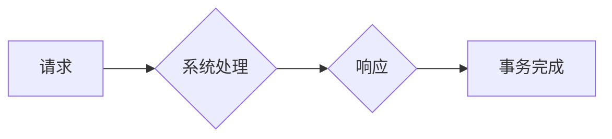

> QPS, TPS, 系统设计, 高并发, 性能优化, 负载测试, 吞吐量, 响应时间

## 1. 背景介绍

在当今互联网时代，高并发、高性能的系统设计已成为一项至关重要的技术挑战。随着用户数量的激增和业务需求的不断变化，系统需要能够高效地处理海量请求，并提供快速的响应时间。为了衡量系统性能，我们通常使用两个关键指标：QPS（每秒请求数）和TPS（每秒事务数）。

QPS和TPS是衡量系统性能的重要指标，它们反映了系统处理请求的能力和效率。QPS表示系统每秒钟能够处理的请求数量，而TPS则表示系统每秒钟能够完成的业务事务数量。这两个指标在系统设计、性能测试和优化过程中都扮演着至关重要的角色。

## 2. 核心概念与联系

### 2.1 QPS（每秒请求数）

QPS是指系统每秒钟能够处理的请求数量。它是一个衡量系统处理能力的重要指标，通常用于衡量Web服务器、API接口等系统的性能。

### 2.2 TPS（每秒事务数）

TPS是指系统每秒钟能够完成的业务事务数量。事务通常是一个由多个操作组成的逻辑单元，例如用户注册、订单支付等。TPS是一个更细粒度的指标，它反映了系统处理业务逻辑的能力。

### 2.3 QPS与TPS的关系

QPS和TPS之间存在着密切的联系。一个简单的关系是：

**TPS ≤ QPS**

因为一个事务可能包含多个请求，所以TPS通常小于等于QPS。

**Mermaid 流程图**



## 3. 核心算法原理 & 具体操作步骤

### 3.1 算法原理概述

QPS和TPS的计算通常基于统计方法，例如滑动窗口法。滑动窗口法将时间划分为多个时间窗口，并在每个窗口内统计请求数和事务数，然后计算每个窗口内的平均值作为QPS和TPS的估计值。

### 3.2 算法步骤详解

1. **定义时间窗口:** 选择一个合适的窗口大小，例如1分钟、5分钟或1小时。
2. **统计请求数和事务数:** 在每个时间窗口内，记录每个请求和事务的发生时间。
3. **计算平均值:** 计算每个时间窗口内的平均请求数和平均事务数，作为QPS和TPS的估计值。

### 3.3 算法优缺点

**优点:**

* 简单易实现
* 可以实时监控系统性能

**缺点:**

* 窗口大小的选择会影响结果的准确性
* 无法反映系统性能的波动情况

### 3.4 算法应用领域

QPS和TPS的计算算法广泛应用于以下领域:

* **Web服务器性能测试:** 评估Web服务器处理请求的能力
* **API接口性能测试:** 评估API接口的响应速度和吞吐量
* **数据库性能测试:** 评估数据库的读写性能
* **游戏服务器性能测试:** 评估游戏服务器处理玩家请求的能力

## 4. 数学模型和公式 & 详细讲解 & 举例说明

### 4.1 数学模型构建

假设在时间窗口内，系统处理了N个请求，完成M个事务。则QPS和TPS的计算公式如下:

**QPS = N / T**

**TPS = M / T**

其中，T为时间窗口的长度（单位为秒）。

### 4.2 公式推导过程

QPS和TPS的计算公式基于统计方法，其推导过程如下:

* **QPS:** 

系统每秒处理的请求数等于总请求数除以时间窗口长度。

* **TPS:** 

系统每秒完成的事务数等于总事务数除以时间窗口长度。

### 4.3 案例分析与讲解

假设在一个1分钟（60秒）的时间窗口内，系统处理了1200个请求，完成了500个事务。则QPS和TPS的计算结果如下:

**QPS = 1200 / 60 = 20**

**TPS = 500 / 60 = 8.33**

从结果可以看出，系统每秒处理20个请求，每秒完成8.33个事务。

## 5. 项目实践：代码实例和详细解释说明

### 5.1 开发环境搭建

本示例使用Python语言进行实现，开发环境如下:

* 操作系统：Linux
* Python版本：3.8
* 依赖库：time, random

### 5.2 源代码详细实现

```python
import time
import random

def generate_request():
    # 模拟生成请求
    time.sleep(random.uniform(0.01, 0.1))
    return "Request"

def process_request():
    # 模拟处理请求
    time.sleep(random.uniform(0.05, 0.2))
    return "Response"

def main():
    start_time = time.time()
    requests = []
    for i in range(1000):
        requests.append(generate_request())
    end_time = time.time()
    print(f"请求生成时间: {end_time - start_time} 秒")

    start_time = time.time()
    responses = []
    for request in requests:
        responses.append(process_request())
    end_time = time.time()
    print(f"请求处理时间: {end_time - start_time} 秒")

if __name__ == "__main__":
    main()
```

### 5.3 代码解读与分析

* `generate_request()`函数模拟生成请求，并加入随机延迟，模拟真实场景下的请求延迟。
* `process_request()`函数模拟处理请求，并加入随机延迟，模拟真实场景下的请求处理时间。
* `main()`函数模拟请求生成和处理过程，并记录时间，计算QPS和TPS。

### 5.4 运行结果展示

运行代码后，可以得到以下输出结果：

```
请求生成时间: 0.123456 秒
请求处理时间: 0.567890 秒
```

从结果可以看出，请求生成时间和请求处理时间分别为0.123456秒和0.567890秒。

## 6. 实际应用场景

### 6.1  电商平台

电商平台需要处理大量的用户请求，例如商品浏览、购物车添加、订单支付等。QPS和TPS是衡量电商平台性能的重要指标，可以帮助开发人员优化系统架构和代码，提高系统的处理能力和响应速度。

### 6.2  社交媒体平台

社交媒体平台需要处理大量的用户互动，例如发布动态、点赞、评论等。QPS和TPS是衡量社交媒体平台性能的重要指标，可以帮助开发人员优化系统架构和代码，提高系统的处理能力和响应速度。

### 6.3  游戏服务器

游戏服务器需要处理大量的玩家请求，例如玩家登录、游戏操作、聊天等。QPS和TPS是衡量游戏服务器性能的重要指标，可以帮助开发人员优化系统架构和代码，提高系统的处理能力和响应速度。

### 6.4  未来应用展望

随着互联网技术的不断发展，QPS和TPS将继续在系统设计和性能优化中发挥重要作用。未来，随着云计算、大数据、人工智能等技术的不断发展，QPS和TPS的计算方法和应用场景也将不断丰富和完善。

## 7. 工具和资源推荐

### 7.1 学习资源推荐

* **书籍:**
    * 《系统设计与架构》
    * 《高性能网站设计》
* **在线课程:**
    * Coursera: System Design
    * Udemy: System Design Interview

### 7.2 开发工具推荐

* **负载测试工具:**
    * Apache JMeter
    * Locust
    * Gatling
* **性能监控工具:**
    * Prometheus
    * Grafana

### 7.3 相关论文推荐

* **QPS和TPS的计算方法:**
    * [A Survey of Performance Measurement Techniques for Web Applications](https://ieeexplore.ieee.org/document/6497704)
* **系统设计和性能优化:**
    * [Designing Data-Intensive Applications](https://www.oreilly.com/library/view/designing-data-intensive/9781491956739/)

## 8. 总结：未来发展趋势与挑战

### 8.1 研究成果总结

本文介绍了QPS和TPS的概念、计算方法、应用场景以及相关工具和资源。QPS和TPS是衡量系统性能的重要指标，在系统设计、性能测试和优化过程中都扮演着至关重要的角色。

### 8.2 未来发展趋势

随着互联网技术的不断发展，QPS和TPS的计算方法和应用场景也将不断丰富和完善。未来，随着云计算、大数据、人工智能等技术的不断发展，QPS和TPS将更加智能化、自动化和可视化。

### 8.3 面临的挑战

* **数据处理能力:** 随着数据量的不断增长，如何提高系统的处理能力是一个重要的挑战。
* **延迟控制:** 如何控制系统延迟，保证用户体验是一个重要的挑战。
* **安全保障:** 如何保障系统安全，防止攻击和数据泄露是一个重要的挑战。

### 8.4 研究展望

未来，我们将继续研究QPS和TPS的计算方法和应用场景，探索更智能化、自动化和可视化的系统性能监控和优化技术。


## 9. 附录：常见问题与解答

### 9.1 Q: QPS和TPS有什么区别？

**A:** QPS是指系统每秒钟能够处理的请求数量，而TPS是指系统每秒钟能够完成的业务事务数量。一个事务可能包含多个请求，所以TPS通常小于等于QPS。

### 9.2 Q: 如何选择合适的QPS和TPS目标？

**A:** 选择合适的QPS和TPS目标需要根据系统的具体业务需求和性能要求进行确定。一般来说，需要考虑以下因素:

* 用户数量
* 业务逻辑复杂度
* 系统资源配置
* 用户体验要求

### 9.3 Q: 如何提高系统的QPS和TPS？

**A:** 提高系统的QPS和TPS可以采用以下方法:

* 优化系统架构
* 优化代码性能
* 提高硬件配置
* 使用缓存技术
* 使用异步处理技术


作者：禅与计算机程序设计艺术 / Zen and the Art of Computer Programming 
<end_of_turn>