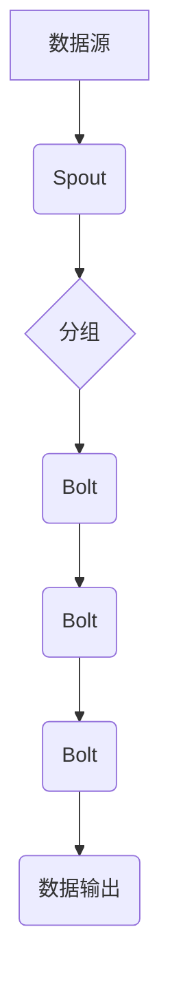

> Storm,分布式流处理,数据处理,实时计算,拓扑结构,Spout,Bolt,集群部署,代码实例

## 1. 背景介绍

在当今数据爆炸的时代，海量数据实时生成和处理已成为各行各业的关键挑战。传统的批处理方式难以满足对实时分析和决策的需求。为了应对这一挑战，分布式流处理框架应运而生，其中Storm作为一款开源、高性能、可扩展的流处理框架，凭借其强大的功能和灵活的架构，在实时数据处理领域占据着重要地位。

Storm的核心思想是将数据流进行分片处理，并将其分配到集群中的多个节点上进行并行计算。它采用一种基于拓扑结构的编程模型，开发者可以将数据处理逻辑定义为一系列的Spout和Bolt，并通过连接这些组件构建数据流处理流程。

## 2. 核心概念与联系

Storm的核心概念包括：

* **拓扑结构 (Topology):**  Storm程序的整体结构，由Spout和Bolt组成，并通过连接定义数据流的处理路径。
* **Spout:**  数据源组件，负责从外部系统获取数据并将其发送到Storm集群。
* **Bolt:**  数据处理组件，负责对数据进行加工、转换和分析。
* **流 (Stream):**  数据流的抽象表示，由Spout发送的数据组成，并通过Bolt进行处理。
* **分组 (Grouping):**  将流数据分组的机制，用于将数据发送到特定的Bolt。
* **窗口 (Windowing):**  对流数据进行时间窗口划分，用于处理滑动窗口和会话窗口等场景。

**Storm 拓扑结构流程图:**



## 3. 核心算法原理 & 具体操作步骤

### 3.1  算法原理概述

Storm的核心算法是基于**流式数据处理**和**并行计算**的。它将数据流划分为多个流片，并将其分配到集群中的多个节点上进行并行处理。每个节点负责处理一部分数据流，并将其结果发送到其他节点进行进一步处理。

Storm采用**异步处理模型**，数据流在各个节点之间通过消息队列进行传递。每个节点可以独立地处理数据，并根据需要将数据发送到其他节点。这种异步处理模型使得Storm能够处理高吞吐量的实时数据流。

### 3.2  算法步骤详解

1. **数据输入:**  数据源组件(Spout)从外部系统获取数据并将其发送到Storm集群。
2. **数据分组:**  数据流根据分组策略(Grouping)进行划分，将数据发送到特定的Bolt。
3. **数据处理:**  Bolt组件对数据进行加工、转换和分析。
4. **数据输出:**  Bolt组件将处理后的数据发送到下一个Bolt或数据输出组件。
5. **数据持久化:**  Storm支持数据持久化，可以将数据存储到本地文件系统或外部数据库。

### 3.3  算法优缺点

**优点:**

* **高吞吐量:**  Storm采用并行计算模型，能够处理高吞吐量的实时数据流。
* **高可用性:**  Storm集群可以自动容错，即使部分节点故障，也能保证数据流的正常处理。
* **灵活扩展性:**  Storm可以根据需要增加或减少集群节点，轻松扩展处理能力。
* **开源免费:**  Storm是一个开源项目，可以免费使用和修改。

**缺点:**

* **复杂性:**  Storm的拓扑结构和数据处理逻辑相对复杂，需要一定的学习成本。
* **资源消耗:**  Storm集群需要消耗大量的计算资源和内存。
* **调试难度:**  Storm的分布式架构使得调试难度相对较高。

### 3.4  算法应用领域

Storm广泛应用于以下领域:

* **实时数据分析:**  实时监控网站流量、用户行为、市场趋势等数据。
* **实时告警:**  实时监测系统状态，并发送告警信息。
* **实时推荐:**  根据用户行为实时推荐商品或内容。
* **实时交易:**  处理金融交易、股票交易等实时数据。

## 4. 数学模型和公式 & 详细讲解 & 举例说明

### 4.1  数学模型构建

Storm的处理能力可以根据以下数学模型进行评估:

* **吞吐量 (Throughput):**  单位时间内处理的数据量，通常以条/秒或兆字节/秒表示。
* **延迟 (Latency):**  数据从输入到输出的时间，通常以毫秒或秒表示。
* **资源利用率 (Resource Utilization):**  集群资源的利用率，例如CPU、内存和网络带宽的利用率。

### 4.2  公式推导过程

吞吐量、延迟和资源利用率之间的关系可以通过以下公式进行描述:

* **吞吐量 = 数据量 / 处理时间**
* **延迟 = 处理时间 - 输入时间**
* **资源利用率 = 资源使用量 / 资源总量**

### 4.3  案例分析与讲解

假设一个Storm集群处理1000条数据/秒，每个数据处理时间为1毫秒，则吞吐量为1000条/秒，延迟为1毫秒。如果集群的CPU资源利用率为80%，则表示集群的CPU资源被充分利用。

## 5. 项目实践：代码实例和详细解释说明

### 5.1  开发环境搭建

* Java Development Kit (JDK)
* Apache Maven
* Storm安装包

### 5.2  源代码详细实现

```java
import backtype.storm.spout.Spout;
import backtype.storm.task.TopologyContext;
import backtype.storm.topology.OutputFieldsDeclarer;
import backtype.storm.topology.base.BaseSpout;
import backtype.storm.tuple.Fields;
import backtype.storm.tuple.Values;

import java.util.Map;

public class WordCountSpout extends BaseSpout {

    @Override
    public void open(Map conf, TopologyContext context, Integer taskId) {

    }

    @Override
    public void nextTuple() {
        // 模拟从外部系统获取数据
        String sentence = "This is a test sentence.";
        String[] words = sentence.split(" ");
        for (String word : words) {
            emit(new Values(word));
        }
    }

    @Override
    public void declareOutputFields(OutputFieldsDeclarer declarer) {
        declarer.declare(new Fields("word"));
    }
}
```

### 5.3  代码解读与分析

* `WordCountSpout`类继承自`BaseSpout`，实现数据源组件。
* `open()`方法在Spout启动时调用，用于初始化资源。
* `nextTuple()`方法在Spout运行时不断调用，模拟从外部系统获取数据并发送到Storm集群。
* `declareOutputFields()`方法声明Spout输出的字段。

### 5.4  运行结果展示

运行Storm程序后，可以观察到数据流从Spout发送到Bolt，并进行相应的处理。

## 6. 实际应用场景

### 6.1  实时日志分析

Storm可以实时分析日志数据，识别异常行为、监控系统性能和进行故障诊断。

### 6.2  实时社交媒体监控

Storm可以实时监控社交媒体平台上的数据，分析用户情绪、识别热点话题和进行舆情监测。

### 6.3  实时欺诈检测

Storm可以实时分析金融交易数据，识别欺诈行为并进行预警。

### 6.4  未来应用展望

随着数据量的不断增长和实时计算需求的增加，Storm在未来将有更广泛的应用场景，例如：

* **物联网数据处理:**  实时处理来自物联网设备的数据，进行设备监控、故障诊断和智能控制。
* **工业互联网数据分析:**  实时分析工业生产数据，提高生产效率、降低成本和优化生产流程。
* **金融风控:**  实时分析金融交易数据，识别风险行为并进行风险控制。

## 7. 工具和资源推荐

### 7.1  学习资源推荐

* **Storm官方文档:** https://storm.apache.org/documentation.html
* **Storm中文社区:** https://github.com/storm-cn/storm-cn
* **Storm学习教程:** https://www.tutorialspoint.com/storm/index.htm

### 7.2  开发工具推荐

* **Eclipse:** https://www.eclipse.org/
* **IntelliJ IDEA:** https://www.jetbrains.com/idea/

### 7.3  相关论文推荐

* **Storm: A Distributed Real-Time Computation System:** https://www.usenix.org/system/files/conference/osdi10/osdi10-paper-ramachandran.pdf

## 8. 总结：未来发展趋势与挑战

### 8.1  研究成果总结

Storm作为一款成熟的分布式流处理框架，在实时数据处理领域取得了显著的成果。它提供了灵活的编程模型、高吞吐量和高可用性，并被广泛应用于各种场景。

### 8.2  未来发展趋势

* **更强大的并行计算能力:**  随着硬件技术的进步，Storm将支持更强大的并行计算能力，能够处理更大的数据量和更复杂的计算任务。
* **更智能的数据处理:**  Storm将集成更智能的数据处理算法，例如机器学习和深度学习，能够对数据进行更深入的分析和理解。
* **更易于使用的开发体验:**  Storm将提供更易于使用的开发工具和框架，降低开发门槛，方便开发者快速构建实时数据处理应用。

### 8.3  面临的挑战

* **数据安全和隐私保护:**  随着数据量的增长，数据安全和隐私保护成为越来越重要的挑战。Storm需要提供更完善的数据安全和隐私保护机制。
* **资源管理和调度:**  Storm集群需要高效地管理和调度资源，以保证系统性能和稳定性。
* **生态系统建设:**  Storm需要不断完善其生态系统，包括开发工具、第三方库和社区支持，以吸引更多开发者参与。

### 8.4  研究展望

未来，Storm将继续朝着更强大、更智能、更易用方向发展，并在更多领域发挥其作用。

## 9. 附录：常见问题与解答

* **Q: Storm集群如何部署?**
* **A:** Storm集群可以部署在本地机器或云平台上。

* **Q: Storm如何处理数据丢失?**
* **A:** Storm支持数据持久化，可以将数据存储到本地文件系统或外部数据库，避免数据丢失。

* **Q: Storm如何进行故障恢复?**
* **A:** Storm集群可以自动容错，即使部分节点故障，也能保证数据流的正常处理。


作者：禅与计算机程序设计艺术 / Zen and the Art of Computer Programming 
<end_of_turn>