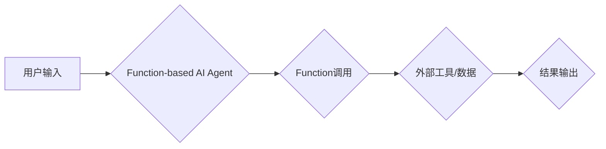

> 大模型、Function、AI Agent、应用开发、代码实例、实践案例

## 1. 背景介绍

近年来，大模型技术取得了飞速发展，其强大的语言理解和生成能力为人工智能的广泛应用提供了基础。然而，单纯的模型输出往往难以直接满足实际应用需求。为了更好地将大模型能力转化为实际价值，我们需要构建能够理解用户意图、执行特定任务的AI Agent。

Function作为一种将大模型与外部工具和数据连接的机制，为构建AI Agent提供了强大的支持。通过Function，AI Agent可以调用预先定义的函数，访问外部数据和服务，从而实现更复杂、更智能的应用场景。

本篇文章将深入探讨如何利用Function构建能使用Function的AI Agent，并通过代码实例和实践案例，帮助读者理解Function的原理和应用，并掌握构建AI Agent的实践技能。

## 2. 核心概念与联系

### 2.1 大模型

大模型是指参数量巨大的人工智能模型，通常拥有数十亿甚至数千亿个参数。通过训练海量数据，大模型能够学习到复杂的语言模式和知识，从而实现强大的语言理解和生成能力。

### 2.2 Function

Function是一种将大模型与外部工具和数据连接的机制。它允许AI Agent调用预先定义的函数，访问外部数据和服务，从而实现更复杂、更智能的应用场景。

### 2.3 AI Agent

AI Agent是一种能够感知环境、理解用户意图、执行特定任务的智能程序。它可以自主学习、决策和行动，并与用户进行交互。

### 2.4 Function-based AI Agent

Function-based AI Agent是指利用Function机制构建的AI Agent。它可以调用预定义的Function，访问外部数据和服务，从而实现更复杂、更智能的应用场景。

**Mermaid 流程图**



## 3. 核心算法原理 & 具体操作步骤

### 3.1 算法原理概述

Function-based AI Agent的核心算法原理是将用户输入转化为Function调用，并通过Function访问外部工具和数据，最终生成结果输出。

具体来说，该算法流程包括以下步骤：

1. **用户输入解析:** 将用户输入进行解析，识别用户意图和所需功能。
2. **Function匹配:** 根据用户意图，匹配相应的Function。
3. **Function调用:** 调用匹配的Function，并传递必要的参数。
4. **结果处理:** 处理Function返回的结果，并将其转化为用户可理解的格式。

### 3.2 算法步骤详解

1. **用户输入解析:**

   - 使用自然语言处理技术，对用户输入进行分词、词性标注、句法分析等处理，识别用户意图和所需功能。
   - 例如，用户输入“查询今天的天气”，可以解析出用户意图是查询天气，所需功能是获取今天的天气预报。

2. **Function匹配:**

   - 根据用户意图，从预定义的Function库中匹配相应的Function。
   - 例如，对于“查询今天的天气”的请求，可以匹配到“查询天气预报”的Function。

3. **Function调用:**

   - 调用匹配的Function，并传递必要的参数，例如日期、地点等。
   - Function会根据接收到的参数，调用相应的API或数据源，获取所需信息。

4. **结果处理:**

   - 处理Function返回的结果，并将其转化为用户可理解的格式，例如文本、图像等。
   - 例如，Function返回的天气预报数据，可以转化为“今天天气晴朗，最高气温25度”的文本信息。

### 3.3 算法优缺点

**优点:**

- **可扩展性强:** 可以通过定义新的Function，扩展AI Agent的功能。
- **可复用性高:** 不同的AI Agent可以共享相同的Function，提高代码复用率。
- **易于维护:** Function的独立性使得AI Agent的维护更加方便。

**缺点:**

- **Function设计需要专业知识:** 需要对目标领域和Function调用方式有深入的了解。
- **Function调用可能会带来安全风险:** 需要对Function的安全性进行评估和控制。

### 3.4 算法应用领域

Function-based AI Agent的应用领域非常广泛，例如:

- **客服机器人:** 可以利用Function调用知识库、API等，回答用户问题，提供服务。
- **智能助理:** 可以利用Function调用日程安排、天气预报等服务，帮助用户完成日常任务。
- **内容创作:** 可以利用Function调用写作工具、图片生成器等，辅助内容创作。

## 4. 数学模型和公式 & 详细讲解 & 举例说明

### 4.1 数学模型构建

Function-based AI Agent的数学模型可以抽象为一个状态转换模型，其中状态代表AI Agent的当前状态，动作代表AI Agent执行的Function调用，奖励代表AI Agent执行动作后的收益。

**状态空间:** S = {s1, s2, ..., sn}

**动作空间:** A = {a1, a2, ..., am}

**奖励函数:** R(s, a)

**状态转移函数:** P(s', a | s)

其中:

- s代表AI Agent的当前状态
- a代表AI Agent执行的动作
- s'代表AI Agent执行动作后的下一个状态
- R(s, a)代表AI Agent执行动作a在状态s时的奖励

### 4.2 公式推导过程

根据上述模型，可以推导出AI Agent的策略函数π(s)来决定在状态s下执行的动作a。

策略函数的优化目标是最大化累积奖励:

```
π(s) = argmax_a ∑_{t=0}^{∞} γ^t R(s_t, a_t)
```

其中:

- γ代表折扣因子，控制未来奖励的权重
- t代表时间步长

### 4.3 案例分析与讲解

假设一个AI Agent的任务是玩一个简单的游戏，游戏状态包括玩家的位置和游戏目标的位置。

- 状态空间: S = {玩家位置1, 玩家位置2, ..., 玩家位置N}
- 动作空间: A = {向上移动, 向下移动, 向左移动, 向右移动}
- 奖励函数: R(s, a) = 1 (如果玩家移动到目标位置), R(s, a) = -1 (如果玩家移动到障碍物位置), R(s, a) = 0 (其他情况)

通过强化学习算法，AI Agent可以学习到一个策略函数π(s)，来决定在每个状态下执行的动作，从而最大化累积奖励。

## 5. 项目实践：代码实例和详细解释说明

### 5.1 开发环境搭建

- Python 3.7+
- TensorFlow 2.0+
- PyTorch 1.0+
- 其他必要的库，例如NLTK、spaCy等

### 5.2 源代码详细实现

```python
# Function调用示例
import requests

def get_weather_forecast(city):
  """
  调用天气预报API获取城市的天气预报
  """
  api_url = f"https://api.example.com/weather?city={city}"
  response = requests.get(api_url)
  if response.status_code == 200:
    return response.json()
  else:
    return None

# AI Agent示例
class WeatherAssistant:
  def __init__(self):
    self.city = None

  def set_city(self, city):
    self.city = city

  def get_weather_forecast(self):
    forecast = get_weather_forecast(self.city)
    if forecast:
      print(f"今天{self.city}的天气预报为：{forecast['description']}")
    else:
      print("获取天气预报失败")

# 使用示例
assistant = WeatherAssistant()
assistant.set_city("北京")
assistant.get_weather_forecast()
```

### 5.3 代码解读与分析

- `get_weather_forecast`函数是一个Function，它调用天气预报API获取城市的天气预报。
- `WeatherAssistant`类是一个AI Agent，它包含一个`city`属性，用于存储用户指定的城市。
- `set_city`方法用于设置城市。
- `get_weather_forecast`方法调用`get_weather_forecast`Function获取天气预报，并将其打印出来。

### 5.4 运行结果展示

```
今天北京的天气预报为：晴朗
```

## 6. 实际应用场景

### 6.1 客服机器人

Function-based AI Agent可以用于构建客服机器人，通过调用知识库、API等，回答用户问题，提供服务。例如，可以调用天气预报API，回答用户关于天气的问题；可以调用物流API，查询用户的物流信息。

### 6.2 智能助理

Function-based AI Agent可以用于构建智能助理，帮助用户完成日常任务。例如，可以调用日程安排API，帮助用户安排会议；可以调用音乐播放API，播放用户的音乐；可以调用翻译API，翻译用户的文本。

### 6.3 内容创作

Function-based AI Agent可以用于辅助内容创作。例如，可以调用写作工具API，生成文章草稿；可以调用图片生成器API，生成图片素材；可以调用视频剪辑API，剪辑视频。

### 6.4 未来应用展望

Function-based AI Agent的应用场景非常广泛，未来将会在更多领域得到应用，例如:

- **教育:** 个性化学习辅导、智能答疑
- **医疗:** 辅助诊断、个性化治疗方案
- **金融:** 风险评估、投资建议
- **娱乐:** 个性化游戏体验、虚拟角色互动

## 7. 工具和资源推荐

### 7.1 学习资源推荐

- **书籍:**
    - 《深度学习》
    - 《人工智能：现代方法》
- **在线课程:**
    - Coursera: 深度学习
    - Udacity: AI Nanodegree
- **博客和论坛:**
    - TensorFlow Blog
    - PyTorch Blog
    - Reddit: r/MachineLearning

### 7.2 开发工具推荐

- **Python:** 
    - TensorFlow
    - PyTorch
    - Keras
- **云平台:**
    - Google Cloud AI Platform
    - Amazon SageMaker
    - Microsoft Azure AI

### 7.3 相关论文推荐

- **Attention Is All You Need**
- **BERT: Pre-training of Deep Bidirectional Transformers for Language Understanding**
- **GPT-3: Language Models are Few-Shot Learners**

## 8. 总结：未来发展趋势与挑战

### 8.1 研究成果总结

Function-based AI Agent是近年来人工智能领域的一个重要发展方向，它将大模型能力与外部工具和数据连接起来，使得AI Agent能够执行更复杂、更智能的任务。

### 8.2 未来发展趋势

- **更强大的Function库:** 未来将会出现更多功能强大的Function，覆盖更广泛的应用场景。
- **更智能的Function调用机制:** AI Agent将能够更智能地选择和调用Function，提高效率和准确性。
- **更安全的Function调用机制:** 为了保证Function的安全性，将会出现更完善的安全机制。

### 8.3 面临的挑战

- **Function设计和开发难度:** 设计和开发高质量的Function需要专业知识和经验。
- **Function调用效率:** Function调用可能会带来一定的延迟，需要优化Function调用机制提高效率。
- **Function安全性:** Function调用可能会带来安全风险，需要加强安全防护。

### 8.4 研究展望

未来，Function-based AI Agent将会在更多领域得到应用，并不断发展壮大。研究者将继续探索更强大的Function库、更智能的Function调用机制和更安全的Function调用机制，推动Function-based AI Agent技术的发展。

## 9. 附录：常见问题与解答

### 9.