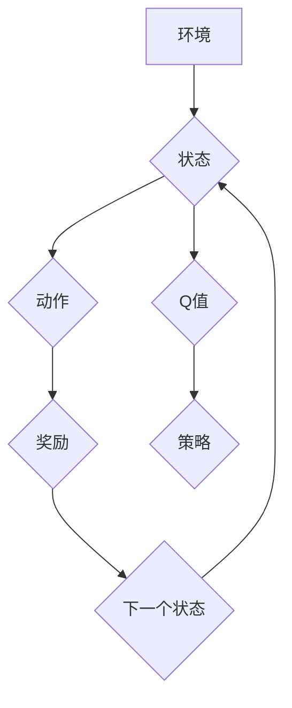

> Deep Q-Network (DQN), 强化学习, 实验设计, 结果分析, 算法优化, 

## 1. 背景介绍

在机器学习领域，强化学习 (Reinforcement Learning, RL) 作为一种学习方式，吸引了越来越多的研究者和实践者的关注。强化学习的核心思想是通过试错学习，在环境中采取行动，并根据环境反馈的奖励信号来调整策略，最终达到最大化累积奖励的目标。

Deep Q-Network (DQN) 算法作为强化学习领域的重要突破，将深度神经网络与 Q-learning 算法相结合，有效地解决了传统 Q-learning 算法在处理高维状态空间和复杂环境中的问题。DQN 算法的提出，为解决复杂决策问题提供了新的思路和方法，在游戏 AI、机器人控制、自动驾驶等领域展现出巨大的应用潜力。

然而，仅仅理解 DQN 算法的原理并不能保证其在实际应用中的成功。如何设计合理的实验方案，如何有效地分析实验结果，这些都是 DQN 算法应用中至关重要的环节。

本文将深入探讨 DQN 算法的实验设计与结果分析技巧，帮助读者更好地理解和应用 DQN 算法。

## 2. 核心概念与联系

DQN 算法的核心概念包括：

* **强化学习:**  一种机器学习方法，通过试错学习，在环境中采取行动，并根据环境反馈的奖励信号来调整策略，最终达到最大化累积奖励的目标。
* **Q-learning:**  一种经典的强化学习算法，通过学习 Q 值表来估计在特定状态下采取特定动作的期望回报。
* **深度神经网络:**  一种能够学习复杂非线性关系的机器学习模型，可以用于逼近 Q 值函数。

DQN 算法将这三个核心概念结合起来，通过深度神经网络来逼近 Q 值函数，并利用 Q-learning 算法进行训练。

**Mermaid 流程图:**



## 3. 核心算法原理 & 具体操作步骤

### 3.1  算法原理概述

DQN 算法的核心思想是利用深度神经网络来逼近 Q 值函数，并通过 Q-learning 算法进行训练。

Q 值函数表示在特定状态下采取特定动作的期望回报。DQN 算法的目标是学习一个能够最大化累积奖励的 Q 值函数。

DQN 算法的主要步骤如下：

1. 初始化深度神经网络，作为 Q 值函数的逼近器。
2. 在环境中进行交互，收集状态、动作、奖励和下一个状态的数据。
3. 使用收集到的数据，更新 Q 值网络的参数。
4. 根据更新后的 Q 值网络，选择最优动作。
5. 重复步骤 2-4，直到达到预设的训练目标。

### 3.2  算法步骤详解

1. **初始化:**

   * 初始化深度神经网络，其输入为状态，输出为各个动作对应的 Q 值。
   * 设置学习率、折扣因子等超参数。

2. **环境交互:**

   * 从环境中获取当前状态。
   * 根据当前状态和策略选择动作。
   * 执行动作，并观察环境反馈的奖励和下一个状态。

3. **经验回放:**

   * 将状态、动作、奖励和下一个状态存储到经验回放缓冲池中。
   * 从经验回放缓冲池中随机采样多个经验样本。

4. **目标 Q 值计算:**

   * 使用目标网络（与主网络结构相同，但参数固定）计算目标 Q 值。
   * 目标 Q 值表示在下一个状态下采取最优动作的期望回报。

5. **损失函数计算:**

   * 使用主网络计算预测 Q 值。
   * 计算预测 Q 值与目标 Q 值之间的损失。

6. **参数更新:**

   * 使用梯度下降算法更新主网络的参数，以最小化损失函数。

7. **目标网络更新:**

   * 定期更新目标网络的参数，使其与主网络的参数保持一致。

8. **策略更新:**

   * 根据主网络的 Q 值，更新策略，选择最优动作。

9. **重复步骤 2-8:**

   * 重复上述步骤，直到达到预设的训练目标。

### 3.3  算法优缺点

**优点:**

* 可以处理高维状态空间和复杂环境。
* 能够学习复杂的决策策略。
* 训练过程相对稳定。

**缺点:**

* 训练过程需要大量的数据和计算资源。
* 容易陷入局部最优解。
* 算法参数的选择对性能影响较大。

### 3.4  算法应用领域

DQN 算法在以下领域具有广泛的应用前景：

* **游戏 AI:**  DQN 算法可以用于训练游戏 AI，使其能够学习玩各种游戏。
* **机器人控制:**  DQN 算法可以用于训练机器人控制策略，使其能够在复杂环境中自主导航和执行任务。
* **自动驾驶:**  DQN 算法可以用于训练自动驾驶系统，使其能够做出安全和高效的驾驶决策。
* **推荐系统:**  DQN 算法可以用于训练推荐系统，使其能够根据用户的历史行为推荐更精准的商品或服务。

## 4. 数学模型和公式 & 详细讲解 & 举例说明

### 4.1  数学模型构建

DQN 算法的核心数学模型是 Q 值函数，它表示在特定状态下采取特定动作的期望回报。

数学公式：

$$Q(s, a) = E[\sum_{t=0}^{\infty} \gamma^t r_{t+1}|s_t = s, a_t = a]$$

其中：

* $s$ 表示状态。
* $a$ 表示动作。
* $r_{t+1}$ 表示在时间步 $t+1$ 获得的奖励。
* $\gamma$ 表示折扣因子，控制未来奖励的权重。
* $E$ 表示期望值。

### 4.2  公式推导过程

DQN 算法的目标是学习一个能够最大化累积奖励的 Q 值函数。

为了实现这个目标，DQN 算法使用 Q-learning 算法进行训练。

Q-learning 算法的核心思想是通过迭代更新 Q 值表，使得 Q 值表能够逼近真实 Q 值函数。

Q 值更新公式：

$$Q(s, a) \leftarrow Q(s, a) + \alpha [r_{t+1} + \gamma \max_{a'} Q(s', a') - Q(s, a)]$$

其中：

* $\alpha$ 表示学习率，控制更新幅度。
* $s'$ 表示下一个状态。
* $\max_{a'} Q(s', a')$ 表示在下一个状态下采取最优动作的期望回报。

### 4.3  案例分析与讲解

假设我们有一个简单的环境，其中一个机器人需要在两个位置之间移动。

* 状态空间：{位置 A, 位置 B}
* 动作空间：{向左移动, 向右移动}
* 奖励：

    * 从位置 A 移动到位置 B 获得奖励 1。
    * 从位置 B 移动到位置 A 获得奖励 -1。
    * 在其他情况下，奖励为 0。

我们可以使用 DQN 算法训练一个机器人，使其能够学会从位置 A 移动到位置 B。

在训练过程中，机器人会随机采取动作，并根据环境反馈的奖励更新 Q 值网络。

最终，机器人会学习到一个能够最大化累积奖励的 Q 值函数，从而能够从位置 A 移动到位置 B。

## 5. 项目实践：代码实例和详细解释说明

### 5.1  开发环境搭建

* Python 3.x
* TensorFlow 或 PyTorch
* OpenAI Gym

### 5.2  源代码详细实现

```python
import tensorflow as tf
import numpy as np
from tensorflow.keras.models import Sequential
from tensorflow.keras.layers import Dense

# 定义 DQN 网络
class DQN(tf.keras.Model):
    def __init__(self):
        super(DQN, self).__init__()
        self.dense1 = Dense(64, activation='relu')
        self.dense2 = Dense(64, activation='relu')
        self.dense3 = Dense(num_actions, activation='linear')

    def call(self, state):
        x = self.dense1(state)
        x = self.dense2(x)
        x = self.dense3(x)
        return x

# 定义经验回放缓冲池
class ReplayBuffer:
    def __init__(self, capacity):
        self.capacity = capacity
        self.buffer = []

    def add(self, state, action, reward, next_state, done):
        self.buffer.append((state, action, reward, next_state, done))
        if len(self.buffer) > self.capacity:
            self.buffer.pop(0)

    def sample(self, batch_size):
        return random.sample(self.buffer, batch_size)

# 定义训练函数
def train(dqn, target_dqn, replay_buffer, batch_size, gamma, epsilon):
    batch = replay_buffer.sample(batch_size)
    states = np.array([sample[0] for sample in batch])
    actions = np.array([sample[1] for sample in batch])
    rewards = np.array([sample[2] for sample in batch])
    next_states = np.array([sample[3] for sample in batch])
    dones = np.array([sample[4] for sample in batch])

    with tf.GradientTape() as tape:
        q_values = dqn(states)
        target_q_values = target_dqn(next_states)
        max_target_q_values = tf.reduce_max(target_q_values, axis=1)
        target_q_values = rewards + gamma * max_target_q_values * (1 - dones)
        loss = tf.keras.losses.mean_squared_error(target_q_values, q_values[tf.range(batch_size), actions])

    gradients = tape.gradient(loss, dqn.trainable_variables)
    optimizer.apply_gradients(zip(gradients, dqn.trainable_variables))

# ... 训练循环 ...
```

### 5.3  代码解读与分析

* **DQN 网络:**

   * 使用 TensorFlow 或 PyTorch 创建一个深度神经网络，用于逼近 Q 值函数。
   * 网络结构可以根据具体任务进行调整。

* **经验回放缓冲池:**

   * 使用一个列表或数组来存储状态、动作、奖励、下一个状态和是否结束的经验样本。
   * 经验回放缓冲池可以帮助稳定训练过程，并提高算法的效率。

* **训练函数:**

   * 从经验回放缓冲池中随机采样一个批次的经验样本。
   * 计算目标 Q 值。
   * 使用 Q-learning 算法更新 DQN 网络的参数。

* **训练循环:**

   * 循环训练 DQN 网络，直到达到预设的训练目标。

### 5.4  运行结果展示

* 使用 OpenAI Gym 的环境进行测试，并记录 DQN 算法的性能指标，例如奖励和成功率。
* 可视化训练过程中的奖励曲线和成功率曲线。

## 6. 实际应用场景

DQN 算法在以下实际应用场景中展现出巨大的潜力：

* **游戏 AI:**  DQN 算法可以用于训练游戏 AI，使其能够学习玩各种游戏，例如 Atari 游戏、Go、围棋等。
* **机器人控制:**  DQN 算法可以用于训练机器人控制策略，使其能够在复杂环境中自主导航和执行任务，例如移动机器人、工业机器人等。
* **自动驾驶:**  DQN 算法可以用于训练自动驾驶系统，使其能够做出安全和高效的驾驶决策，例如路径规划、车道保持、