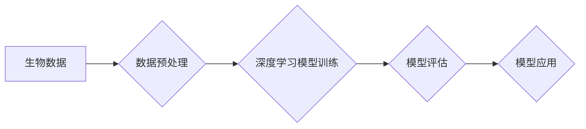

> 深度学习，生物信息学，基因组学，蛋白质结构预测，药物研发，机器学习，人工智能

## 1. 背景介绍

生物信息学作为生命科学与计算机科学的交叉学科，致力于利用计算方法分析和理解生物学数据。随着基因组测序技术的飞速发展，生物信息学面临着海量数据分析的挑战。深度学习作为机器学习领域的一项重要突破，凭借其强大的学习能力和泛化能力，为生物信息学带来了新的机遇。

传统生物信息学方法主要依赖于手工特征工程和统计模型，在面对复杂、高维的生物数据时，往往难以有效提取关键信息和发现隐藏的模式。而深度学习通过多层神经网络，能够自动学习数据中的复杂特征，并进行端到端的学习，从而突破了传统方法的局限性。

## 2. 核心概念与联系

深度学习的核心概念是多层神经网络，它由多个神经元组成的层级结构组成。每个神经元接收来自上一层的输入，并通过激活函数进行非线性变换，输出到下一层。通过多层神经网络的叠加，深度学习模型能够学习数据中的多层次特征，从低层次的像素、字母到高层次的语义、概念。

在生物信息学领域，深度学习可以应用于各种任务，例如基因组序列分析、蛋白质结构预测、药物研发等。

**深度学习在生物信息学中的应用流程:**



## 3. 核心算法原理 & 具体操作步骤

### 3.1  算法原理概述

深度学习算法主要包括卷积神经网络（CNN）、循环神经网络（RNN）和变分自编码器（VAE）。

* **卷积神经网络（CNN）**：擅长处理图像和序列数据，通过卷积核提取特征，并进行池化操作，降低数据维度。
* **循环神经网络（RNN）**：擅长处理序列数据，例如文本和语音，通过循环结构记忆历史信息，捕捉序列中的依赖关系。
* **变分自编码器（VAE）**：是一种生成模型，通过编码器将数据压缩到低维表示，然后通过解码器将其重建，从而学习数据的潜在结构。

### 3.2  算法步骤详解

**以CNN为例，其训练步骤如下：**

1. **数据预处理:** 将生物数据转换为深度学习模型可识别的格式，例如将基因序列转换为数字向量。
2. **模型构建:** 设计CNN模型结构，包括卷积层、池化层、全连接层等。
3. **模型训练:** 使用训练数据训练模型，通过反向传播算法更新模型参数，使模型预测结果与真实值尽可能接近。
4. **模型评估:** 使用测试数据评估模型性能，例如准确率、召回率、F1-score等。
5. **模型应用:** 将训练好的模型应用于实际任务，例如预测基因功能、识别疾病相关基因等。

### 3.3  算法优缺点

**深度学习算法的优点:**

* **自动特征提取:** 不需要人工设计特征，能够自动学习数据中的复杂特征。
* **高准确率:** 在许多生物信息学任务中，深度学习模型能够取得比传统方法更高的准确率。
* **端到端学习:** 从输入数据到输出结果，整个过程都是端到端的学习，简化了模型开发流程。

**深度学习算法的缺点:**

* **数据依赖:** 深度学习模型需要大量的训练数据，否则性能会下降。
* **计算资源消耗:** 训练深度学习模型需要大量的计算资源，例如GPU。
* **可解释性差:** 深度学习模型的决策过程比较复杂，难以解释模型的预测结果。

### 3.4  算法应用领域

深度学习在生物信息学领域有着广泛的应用，例如：

* **基因组学:** 基因组序列分析、基因功能预测、疾病基因识别等。
* **蛋白质结构预测:** 利用深度学习模型预测蛋白质的三维结构，为药物研发提供重要信息。
* **药物研发:** 药物靶点识别、药物分子设计、药物疗效预测等。
* **疾病诊断:** 基于生物数据，利用深度学习模型进行疾病诊断和预后预测。

## 4. 数学模型和公式 & 详细讲解 & 举例说明

### 4.1  数学模型构建

深度学习模型的数学基础是神经网络，其核心是激活函数和权重参数。

**激活函数:** 用于引入非线性，使神经网络能够学习复杂的数据模式。常见的激活函数包括ReLU、Sigmoid和tanh。

**权重参数:** 控制神经网络的输出，通过训练过程不断更新，使模型预测结果与真实值尽可能接近。

### 4.2  公式推导过程

**损失函数:** 用于衡量模型预测结果与真实值的差距，常用的损失函数包括均方误差（MSE）和交叉熵损失（Cross-Entropy Loss）。

**梯度下降算法:** 用于更新模型参数，使其朝着降低损失函数的方向进行调整。

### 4.3  案例分析与讲解

**以CNN为例，其损失函数为MSE，梯度下降算法为Adam，其训练过程如下：**

1. **初始化模型参数:** 随机初始化CNN模型的权重参数。
2. **前向传播:** 将输入数据通过CNN模型进行前向传播，得到预测结果。
3. **计算损失函数:** 计算预测结果与真实值的MSE。
4. **反向传播:** 计算损失函数对模型参数的梯度。
5. **更新模型参数:** 使用Adam算法更新模型参数，使其朝着降低损失函数的方向进行调整。
6. **重复步骤2-5:** 迭代训练模型，直到损失函数达到预设阈值。

## 5. 项目实践：代码实例和详细解释说明

### 5.1  开发环境搭建

* **操作系统:** Linux或macOS
* **编程语言:** Python
* **深度学习框架:** TensorFlow或PyTorch
* **其他工具:** Jupyter Notebook、Git

### 5.2  源代码详细实现

```python
import tensorflow as tf

# 定义CNN模型
model = tf.keras.models.Sequential([
    tf.keras.layers.Conv2D(32, (3, 3), activation='relu', input_shape=(28, 28, 1)),
    tf.keras.layers.MaxPooling2D((2, 2)),
    tf.keras.layers.Conv2D(64, (3, 3), activation='relu'),
    tf.keras.layers.MaxPooling2D((2, 2)),
    tf.keras.layers.Flatten(),
    tf.keras.layers.Dense(10, activation='softmax')
])

# 编译模型
model.compile(optimizer='adam',
              loss='sparse_categorical_crossentropy',
              metrics=['accuracy'])

# 训练模型
model.fit(x_train, y_train, epochs=10)

# 评估模型
loss, accuracy = model.evaluate(x_test, y_test)
print('Test loss:', loss)
print('Test accuracy:', accuracy)
```

### 5.3  代码解读与分析

* **模型定义:** 使用TensorFlow的Keras API定义了一个简单的CNN模型，包含卷积层、池化层和全连接层。
* **模型编译:** 使用Adam优化器、交叉熵损失函数和准确率作为评估指标编译模型。
* **模型训练:** 使用训练数据训练模型，设置训练轮数为10。
* **模型评估:** 使用测试数据评估模型性能，打印测试损失和准确率。

### 5.4  运行结果展示

训练完成后，可以查看模型的训练和测试损失以及准确率曲线，评估模型的性能。

## 6. 实际应用场景

### 6.1  基因组学

* **基因功能预测:** 利用深度学习模型分析基因序列特征，预测基因的功能。
* **疾病基因识别:** 从基因组数据中识别与疾病相关的基因，为疾病诊断和治疗提供线索。

### 6.2  蛋白质结构预测

* **蛋白质结构预测:** 利用深度学习模型预测蛋白质的三维结构，为药物研发提供重要信息。
* **蛋白质功能预测:** 基于蛋白质结构信息，预测蛋白质的功能。

### 6.3  药物研发

* **药物靶点识别:** 利用深度学习模型识别药物靶点，为药物研发提供方向。
* **药物分子设计:** 利用深度学习模型设计新的药物分子，提高药物研发效率。

### 6.4  未来应用展望

深度学习在生物信息学领域仍有巨大的发展潜力，未来将应用于更多领域，例如：

* **个性化医疗:** 基于个体基因组数据，提供个性化的医疗方案。
* **疾病预防:** 利用深度学习模型预测疾病风险，进行疾病预防。
* **新药研发:** 利用深度学习模型加速新药研发，开发更有效的药物。

## 7. 工具和资源推荐

### 7.1  学习资源推荐

* **书籍:**
    * Deep Learning by Ian Goodfellow, Yoshua Bengio, and Aaron Courville
    * Hands-On Machine Learning with Scikit-Learn, Keras & TensorFlow by Aurélien Géron
* **在线课程:**
    * Deep Learning Specialization by Andrew Ng (Coursera)
    * Fast.ai Deep Learning Course

### 7.2  开发工具推荐

* **深度学习框架:** TensorFlow, PyTorch, Keras
* **数据处理工具:** Pandas, NumPy
* **可视化工具:** Matplotlib, Seaborn

### 7.3  相关论文推荐

* **AlphaFold:** https://deepmind.com/blog/alphafold-a-solution-to-the-protein-folding-problem/
* **BERT for Biomedicine:** https://arxiv.org/abs/1903.08497

## 8. 总结：未来发展趋势与挑战

### 8.1  研究成果总结

深度学习在生物信息学领域取得了显著的成果，例如基因组序列分析、蛋白质结构预测、药物研发等方面取得了突破。

### 8.2  未来发展趋势

* **模型规模和复杂度提升:** 训练更大规模、更复杂的神经网络模型，提高模型的学习能力和泛化能力。
* **多模态数据融合:** 将基因组数据、蛋白质结构数据、临床数据等多模态数据融合，提高模型的预测精度。
* **可解释性增强:** 研究深度学习模型的决策过程，提高模型的可解释性。

### 8.3  面临的挑战

* **数据获取和质量:** 深度学习模型需要大量的训练数据，获取高质量的生物数据仍然是一个挑战。
* **计算资源消耗:** 训练深度学习模型需要大量的计算资源，降低计算成本是未来发展的重要方向。
* **模型可解释性:** 深度学习模型的决策过程比较复杂，难以解释模型的预测结果，提高模型的可解释性是未来研究的重要方向。

### 8.4  研究展望

未来，深度学习将在生物信息学领域发挥越来越重要的作用，为生命科学研究和医疗保健提供新的工具和方法。


## 9. 附录：常见问题与解答

**Q1: 深度学习模型需要多少数据才能训练？**

A1: 深度学习模型需要大量的训练数据，一般来说，需要至少几千到几百万个样本才能训练出一个有效的模型。

**Q2: 如何评估深度学习模型的性能？**

A2: 深度学习模型的性能可以通过准确率、召回率、F1-score等指标进行评估。

**Q3: 如何解释深度学习模型的决策过程？**

A3: 深度学习模型的决策过程比较复杂，目前还没有完全解决如何解释模型的预测结果的问题。一些研究方法包括：

* **可视化模型权重:** 通过可视化模型权重，了解模型对哪些特征更加敏感。
* **使用解释性模型:** 使用解释性模型，例如LIME和SHAP，解释模型对单个样本的预测结果。


作者：禅与计算机程序设计艺术 / Zen and the Art of Computer Programming 
<end_of_turn>